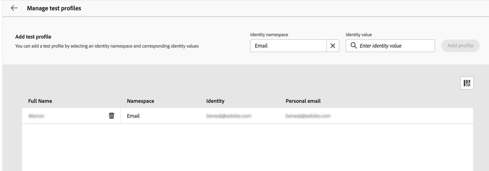

# Testar e enviar uma mensagem de correspondência direta {#direct-mail-test-send}

## Visualizar o arquivo de extração {#preview-dm}

Depois que o conteúdo do arquivo de extração for definido, você poderá usar perfis de teste para visualizá-lo. Se você inseriu conteúdo personalizado, é possível verificar como esse conteúdo é exibido na mensagem, usando os dados do perfil de teste.

1. Na tela de configuração de conteúdo do arquivo de extração, clique em **[!UICONTROL Simular conteúdo]**.

   {width="800" align="center"}

1. Clique em **[!UICONTROL Gerenciar perfis de teste]** para adicionar um perfil de teste.

1. Encontre seu perfil de teste com o **[!UICONTROL Namespace de identidade]** e **[!UICONTROL Valor de identidade]** campos. Em seguida, clique em **[!UICONTROL Adicionar perfil]**.

   {width="800" align="center"}

1. Depois de selecionar o perfil de teste, você pode fechar o **[!UICONTROL Adicionar perfil de teste]** janela.

1. No **Visualização e teste** , os dados do perfil de teste são adicionados ao conteúdo do arquivo de extração, permitindo visualizar como o arquivo será renderizado.

   {width="800" align="center"}

Quando o conteúdo do arquivo estiver pronto para ser enviado, feche a tela de simulação e clique no link **[!UICONTROL Revisar para ativar]** botão.

## Validar e ativar a campanha de correspondência direta {#dm-validate}

Antes de ativar a campanha de correspondência direta, verifique se a campanha e o arquivo de extração estão configurados corretamente. Para fazer isso, verifique os alertas na seção superior do editor. Alguns deles são avisos simples, mas outros podem impedir que você envie a mensagem. Dois tipos de alertas podem ocorrer: avisos e erros.

* **Avisos** consulte recomendações e práticas recomendadas. Por exemplo, uma mensagem de aviso será exibida se a mensagem SMS estiver vazia.

* **Erros** impedir a publicação da campanha, desde que não sejam resolvidos. Por exemplo, uma mensagem de erro avisa quando a linha de assunto está ausente.

{width="800" align="center"}

Quando a campanha de correspondência direta estiver pronta, clique no link **[!UICONTROL Ativar]** botão. Quando a campanha for iniciada, o arquivo de extração será gerado e exportado automaticamente para o servidor especificado na [configuração de roteamento de arquivos](../direct-mail/direct-mail-configuration.md).

Depois de enviado, você pode medir o impacto da campanha de correspondência direta nos relatórios do Campaign. Para obter mais informações sobre relatórios, consulte esta seção.
