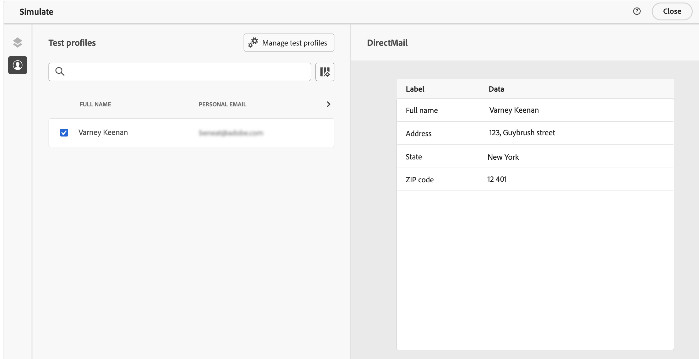

# Verificação e envio de uma mensagem de correspondência direta {#direct-mail-test-send}

Saiba como visualizar o arquivo de extração, validar e ativar a campanha ou jornada de correspondência direta e gerenciar o consentimento de correspondência postal no Journey Optimizer.

## Antes de começar {#before-you-start}

Antes de testar e enviar uma mensagem de correspondência direta, [crie a mensagem e configure o arquivo de extração](create-direct-mail.md). Verifique se você também concluiu a [configuração do canal de correspondência direta](direct-mail-configuration.md).

## Visualizar o arquivo de extração {#preview-dm}

Depois que o conteúdo do arquivo de extração for definido, você poderá usar perfis de teste para visualizá-lo. Se você inseriu conteúdo personalizado, é possível verificar como esse conteúdo é exibido na mensagem, usando os dados do perfil de teste.

Para fazer isso, clique em **[!UICONTROL Simular conteúdo]** e adicione um perfil de teste para verificar como é a renderização do arquivo de extração usando os dados do perfil de teste.

{width="800" align="center"}

Informações detalhadas sobre como selecionar perfis de teste e pré-visualizar seu conteúdo estão disponíveis na seção [Gerenciamento de conteúdo](../content-management/preview-test.md).

Depois que o conteúdo do arquivo estiver pronto para ser enviado, feche a tela de simulação e clique no botão **[!UICONTROL Revisar para ativar]**.

## Validar e ativar a campanha de correspondência direta {#dm-validate}

>[!IMPORTANT]
>
> Se a campanha estiver sujeita a uma política de aprovação, será necessário solicitar aprovação para enviar a campanha de correspondência direta. [Saiba mais](../test-approve/gs-approval.md)

Antes de ativar a campanha de correspondência direta, verifique se a campanha ou jornada e o arquivo de extração estão configurados corretamente. Para fazer isso, verifique os alertas na seção superior do editor. Alguns deles são avisos simples, mas outros podem impedir que você envie a mensagem. Dois tipos de alertas podem ocorrer: avisos e erros.

* **Os avisos** referem-se às recomendações e práticas recomendadas. Por exemplo, uma mensagem de aviso será exibida se a mensagem SMS estiver vazia.

* **Erros** impedem que você publique a campanha, desde que não sejam resolvidos. Por exemplo, uma mensagem de erro avisa quando a linha de assunto está ausente.

{width="800" align="center"}

Quando a campanha de correspondência direta estiver pronta, conclua a configuração da [jornada](../building-journeys/journey-gs.md) ou da [campanha](../campaigns/create-campaign.md) para enviá-la.

>[!NOTE]
>
>O arquivo exportado por padrão termina com uma nova linha. Isso garante a compatibilidade com as ferramentas padrão de processamento de dados.

Depois de enviado, você pode medir o impacto da campanha ou jornada de correspondência direta nos relatórios. Para obter mais informações sobre a geração de relatórios de correspondência direta, consulte estas seções:
* [Relatório de campanha de correspondência direta](../reports/campaign-global-report-cja-direct.md)
* [Relatório de jornada de correspondência direta](../reports/journey-global-report-cja-direct.md)

## Gerenciar o consentimento para correspondência direta {#dm-consent-management}

No [!DNL Journey Optimizer], o consentimento é gerenciado pelo [esquema de consentimento](https://experienceleague.adobe.com/docs/experience-platform/xdm/field-groups/profile/consents.html?lang=pt-BR){target="_blank"} da Experience Platform. Por padrão, o valor do campo de consentimento fica vazio e é tratado como consentimento para receber suas comunicações.

Se um perfil optou por não receber correspondência direta, nos atributos de perfil correspondentes do Experience Platform, o valor de `consents.marketing.postalMail.val` será `n` e o perfil correspondente será excluído das entregas subsequentes.

Para habilitá-lo novamente, o atributo de perfil deve ser alterado de volta para `consents.marketing.postalMail.val` : `y`.

Para gerenciar os atributos de um perfil, acesse o Experience Platform e o perfil selecionando um namespace de identidade e um valor de identidade correspondente. Saiba mais na [documentação da Experience Platform](https://experienceleague.adobe.com/docs/experience-platform/profile/ui/user-guide.html?lang=pt-BR#getting-started){target="_blank"}.

Saiba mais sobre como gerenciar a opção de não participação no Journey Optimizer em [esta seção](../privacy/opt-out.md).

## Tópicos relacionados {#related-topics}

* [Introdução à correspondência direta](get-started-direct-mail.md)
* [Criar uma mensagem de correspondência direta](create-direct-mail.md)
* [Configurar canal de correspondência direta](direct-mail-configuration.md)
* [Pré-visualizar e testar conteúdo](../content-management/preview-test.md)

Para perguntas comuns sobre correspondência direta, consulte [Introdução à correspondência direta](get-started-direct-mail.md).
