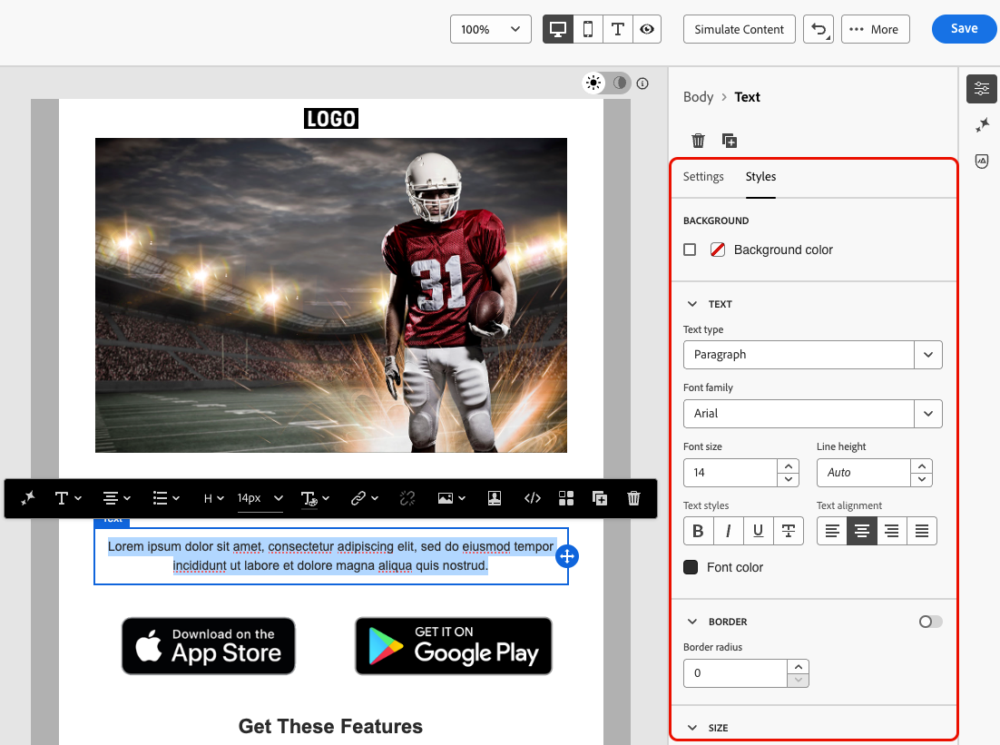

# Criar conteúdo acessível {#accessible-content}

A [Lei Europeia da Acessibilidade](https://eur-lex.europa.eu/legal-content/EN/TXT/?uri=CELEX%3A32019L0882){target="_blank"} é uma diretiva destinada a reforçar o mercado interno de produtos e serviços acessíveis, eliminando os obstáculos causados pelas diferentes regras nacionais entre os Estados-Membros.

Esse regulamento determina que todas as comunicações digitais, incluindo emails, boletins informativos, PDFs e conteúdo para download, devem estar acessíveis. Ao criar conteúdo para seus destinatários, você deve seguir diretrizes específicas, como o uso de fontes acessíveis, formatos legíveis e fornecer texto alternativo para imagens.

O [!DNL Journey Optimizer] [Designer de email](content-from-scratch.md), que permite que os profissionais de marketing criem conteúdo para **emails** e **páginas de aterrissagem**, permite que você esteja em conformidade com esta diretiva, com base nas Diretrizes de Acessibilidade de Conteúdo da Web (WCAG) 2.1, nível AA.

De acordo com isso, as práticas recomendadas para criar conteúdo acessível com o [!DNL Journey Optimizer] estão listadas abaixo.

>[!NOTE]
>
>Esta página trata de tornar o seu conteúdo acessível a todos os seus destinatários, para garantir que pessoas com deficiência possam ler, entender e interagir com seus emails e landing pages criadas com o [!DNL Journey Optimizer].
>
>Por outro lado, a acessibilidade da própria interface [!DNL Journey Optimizer] está detalhada em [esta seção](../start/accessibility.md).
> 
## Garantir a legibilidade do texto {#text-readability}

Use a guia **[!UICONTROL Estilos]** do componente **[!UICONTROL Texto]** para garantir que o texto seja legível, por exemplo, usando contraste de cores adequado e fontes simples. [Saiba mais](content-components.md#text)

{width="80%"}

Para fontes e texto, siga as diretrizes abaixo:

**Seleção de fonte**

* Use fontes sans-serif como Arial, Verdana, Tahoma, Helvetica ou Open Sans.
* Evite fontes serif, cursivas ou decorativas no conteúdo do corpo.
* Use um conjunto de fontes limitado para fins de consistência e fallback (por exemplo: `font-family: Arial, Helvetica, sans-serif;`).

**Dimensionamento de fonte**

* Verifique um tamanho de fonte mínimo de 16px para o corpo de texto.
* Use hierarquia adequada para cabeçalhos.

**Contraste de cores**

* Mantenha uma taxa de contraste de pelo menos 4,5:1 entre o texto e o plano de fundo.
* Para textos grandes (≥ 24px ou bold 18px), verifique se há pelo menos um contraste de 3:1.
* Evite texto cinza-claro ou pastel em planos de fundo brancos.
* Não confie apenas na cor para transmitir significado, mas em vez disso use sublinhados, ícones etc.

**Acessibilidade de texto**

* Evite texto em imagens.
* Não use todas as letras maiúsculas no corpo de texto.
* Garantir que o texto possa ser ampliado até 200% sem quebrar o layout.

## Garantir acessibilidade visual {#visual-accessibility}

Para garantir que seu conteúdo seja visualmente acessível, siga as práticas recomendadas abaixo:

* Evite usar indicadores somente de cores para informações importantes.
* Use rótulos de texto ou ícones para garantir clareza.
* Otimize seu design para layouts móveis e responsivos, garantindo que os botões sejam grandes e espaçados corretamente.
* Teste regularmente entre dispositivos e tamanhos de tela para manter a acessibilidade.

No [!DNL Journey Optimizer], o tamanho e o espaçamento dos diferentes elementos no seu conteúdo podem ser refinados usando os parâmetros de estilo e atributos do painel **[!UICONTROL Estilos]** do Email Designer. [Saiba mais](get-started-email-style.md)

Por exemplo, você pode atualizar o [plano de fundo](backgrounds.md) ou alterar as margens, o preenchimento e o alinhamento para melhorar a acessibilidade visual do seu conteúdo. [Saiba mais](alignment-and-padding.md)

{width="80%"}

Além disso, o Designer de email do [!DNL Journey Optimizer] permite que você visualize e otimize o design para diferentes dispositivos e tamanhos de tela. A qualquer momento, você pode **[!UICONTROL Alternar para o modo de exibição ativo]** para verificar como o conteúdo pode ser renderizado em vários tamanhos de dispositivo.

{width="80%"}

>[!CAUTION]
>
>A visualização em tempo real é uma visualização genérica criada para comparar a aparência da renderização em vários tamanhos de dispositivo. A renderização final pode variar de acordo com o cliente de email do recipient.

## Usar texto alternativo para imagens {#alt-text}

Use o componente **[!UICONTROL Imagem]** para fornecer texto alternativo para imagens. [Saiba mais](content-components.md#image)

{width="90%"}

Para obter um texto alternativo eficaz em produtos digitais, siga as diretrizes abaixo:

* Descreva a finalidade da imagem de forma concisa e contextual.
* Evite frases redundantes como &quot;Imagem de...&quot; e use texto alternativo vazio para imagens decorativas.
* Para ícones com significado, forneça rótulos significativos e para imagens complexas, use um breve texto alternativo mais uma descrição mais longa em outro lugar.

## Usar formato legível {#readable-format}

Use a estrutura relevante do Designer de Email e os [componentes do conteúdo](content-components.md), bem como as opções no painel **[!UICONTROL Estilos]**, para organizar o conteúdo de forma clara, lógica e concisa, acessível a todos.

{width="100%"}

* Use HTML estruturado e semântico com cabeçalhos, parágrafos, listas e tabelas adequados.
* Garantir que o conteúdo siga um fluxo lógico da esquerda para a direita, de cima para baixo.
* Use uma linguagem clara e concisa.
* Fornecer formatos alternativos para PDFs e infográficos.
* Permita o redimensionamento e o refluxo do texto e verifique se a tipografia é legível com contraste de cores adequado em todos os formatos.

## Garantir a legibilidade do conteúdo {#readability}

Para ser legível, seu conteúdo deve ser claro, bem estruturado e utilizável por todos, incluindo pessoas com dificuldades visuais, cognitivas ou de leitura e aquelas que usam tecnologias assistivas. Alguns pontos a serem considerados ao criar conteúdo acessível incluem:

* Mantendo frases com cerca de 20 palavras ou menos.
* Edite sua cópia para ser direta e direcionada ao ponto.
* Use a voz ativa para manter a estrutura da frase mais simples.
* Evite gírias, jargões ou palavras regionais com as quais algumas pessoas possam não estar familiarizadas.

Para avaliar sua legibilidade de email, você pode usar o popular [Teste de Facilidade de Leitura Flesch](https://support.microsoft.com/en-us/office/get-your-document-s-readability-and-level-statistics-85b4969e-e80a-4777-8dd3-f7fc3c8b3fd2){target="_blank"}, que pode ser encontrado no Microsoft Word e calcula como é fácil ler seu conteúdo em uma escala de 0 a 100.

## Testar seu conteúdo {#test}

Para verificar a acessibilidade do conteúdo, você pode usar os recursos de teste fornecidos pelo [!DNL Journey Optimizer]. Eles não foram projetados especificamente para verificar se o conteúdo está totalmente acessível, mas podem fornecer um primeiro nível de verificação.

* Pré-visualize o conteúdo usando perfis de teste. [Saiba como](../content-management/preview.md)

* Use a opção [Renderização de email](../content-management/rendering.md) que usa o Litmus para simular seus designs nos principais clientes de email (Apple Mail, Gmail, Outlook) e ver se o texto, as cores e as imagens tornam seu conteúdo acessível. <!--Litmus includes accessibility testing-->

* Envie provas para testar a renderização do seu conteúdo antes de enviá-lo para o seu público real. [Saiba como](../content-management/proofs.md)

{width="90%"}

Para verificar de maneira mais consistente se o conteúdo está acessível de maneira confiável, procure por ferramentas externas específicas, como:

* O [verificador de contraste do WebAim](https://webaim.org/resources/contrastchecker/){target="_blank"} e a [ferramenta de avaliação de acessibilidade da Web do WAVE](https://wave.webaim.org/){target="_blank"} para avaliar o contraste e a conformidade;

* Tecnologias assistivas, como leitores de tela (por exemplo: [NVDA](https://www.nvaccess.org/download/){target="_blank"} ou [VoiceOver](https://support.apple.com/en-ie/guide/iphone/iph3e2e415f/ios){target="_blank"} no iPhone), para experimentar emails da perspectiva de usuários com deficiências visuais.

## Usar modo escuro {#dark-mode}

<!--TO PUBLISH WHEN DARK MODE IS RELEASED-->

O modo escuro melhora a acessibilidade visual para usuários com sensibilidade à luz ou deficiências visuais, para melhorar a experiência de visualização.

{width="90%"}

Entre as práticas recomendadas para projetar conteúdo no modo escuro, use PNGs ou SVGs transparentes, defina metatags e CSS apropriados e forneça um estilo de fallback acessível se o modo escuro não for compatível. Por fim, verifique se os seus emails são renderizados corretamente no modo escuro, testando todo o conteúdo do email e os elementos da interface do usuário nos modos claro e escuro.

As práticas recomendadas detalhadas específicas para o modo escuro, incluindo diretrizes para garantir acessibilidade, estão listadas em [esta seção](dark-mode.md#best-practices). <!--KEEP dark mode accessibility best practices IN ONE SINGLE LOCATION - for now listed on the Dark mode page.-->

## Usar atributos específicos para acessibilidade {#attributes}

### Atributos de idioma {#language}

Ao criar designs, inclua os atributos `lang` (idioma) e `dir` (direção de texto) no corpo do conteúdo. Esses atributos ajudam as tecnologias assistivas, como leitores de tela, a interpretar e apresentar seu conteúdo de maneira apropriada.

* O atributo `lang` indica o idioma do email para tecnologias assistivas, garantindo que as palavras sejam pronunciadas corretamente.

  +++Exemplos

  Exemplo para inglês:

  ```
  <body lang="en">
  ```

  Exemplo para francês:

  ```
  <body lang="fr">
  ```

  +++

* O atributo `dir` especifica a direção do texto. A maioria dos idiomas, incluindo inglês e francês, são lidos da esquerda para a direita (ltr), enquanto idiomas como árabe e hebraico são lidos da direita para a esquerda (rtl).

  +++Exemplos

  Exemplo para inglês (da esquerda para a direita):

  ```
  <body lang="en" dir="ltr">
  ```

  Exemplo para árabe (da direita para a esquerda):

  ```
  <body lang="ar" dir="rtl">
  ```

  +++

Os leitores de tela dependem do atributo `lang` para aplicar as regras de pronúncia corretas, enquanto a direção do texto garante o fluxo do conteúdo naturalmente para idiomas da esquerda para a direita ou da direita para a esquerda. Sem esses atributos, os usuários podem enfrentar ordem de leitura confusa ou pronúncia incorreta. Consequentemente, sempre envolva seu corpo de email com os atributos `lang` e `dir` apropriados.

>[!TIP]
>
>Se o email contiver vários idiomas, atribua os atributos de idioma apropriados a seções específicas (como `<table>` ou `<td>` blocos) para garantir que cada parte seja lida corretamente.

### Tabela {#tables}

No conteúdo do HTML, as tabelas são geralmente usadas para layout. Por padrão, os leitores de tela tratam cada `<table>` como uma tabela de dados, anunciando linhas, colunas e estrutura. Isso pode ser confuso se a tabela for usada apenas para formatação.

Adicione `role="presentation"` (ou `role="none"`) às tabelas de layout para garantir que as tecnologias assistivas ignore sua estrutura e se concentre apenas no conteúdo real.

+++Exemplo - Tabela de layout (com `role="presentation"`)

```
<table role="presentation" border="0" cellpadding="0" cellspacing="0" width="100%"> 

  <tr> 

    <td align="center"> 

      <h1>Hello World</h1> 

      <p>Welcome to our newsletter</p> 

    </td> 

  </tr> 

</table>
```

Os leitores de tela leem:
&quot;Olá, Mundo. Bem-vindo ao nosso informativo.&quot; *(Nenhuma menção de linhas, colunas ou tabela)*

+++

+++Exemplo - Tabela de dados (sem `role="presentation"`)

```
<table border="1" cellpadding="5" cellspacing="0"> 

  <tr> 

    <th scope="col">Name</th> 

    <th scope="col">Score</th> 

  </tr> 

  <tr> 

    <td>Alice</td> 

    <td>95</td> 

  </tr> 

  <tr> 

    <td>Bob</td> 

    <td>88</td> 

  </tr> 

</table> 
```

Os leitores de tela leem:
&quot;Tabela com 2 colunas e 3 linhas.&quot;

&quot;Nome, Alice. Pontuação, 95.&quot;

&quot;Nome, Bob. Pontuação, 88.&quot;

+++

>[!TIP]
>
>Use `role="presentation"` exclusivamente para tabelas de layout. Para tabelas de dados, mantenha a estrutura semântica `<table>` para que os leitores de tela possam anunciar corretamente cabeçalhos e relações.

### Texto para links {#links}

Os leitores de tela leem os links usando o texto. Se um link for rotulado apenas como &quot;Clique aqui&quot; ou &quot;Leia mais&quot;, os usuários de tecnologias assistivas não saberão o destino. Para garantir a acessibilidade, eles precisam de um texto descritivo que indique claramente o target ou a ação.

Use o Designer de Email para [adicionar um link](message-tracking.md#insert-links) ao seu conteúdo e editar o rótulo para torná-lo discernível (visível) e descritivo (claro sobre o propósito). Evite rótulos vagos como &quot;aqui&quot; ou &quot;mais&quot;.

{width="70%"}

+++Exemplo - bom link (descritivo): 

```
<p>Learn more in the  

<a href="https://adobe.com/release-notes">August release notes</a>. 

</p>
```

Os leitores de tela leem:
&quot;Link, notas de versão de agosto.&quot;

+++

+++Exemplo - Link inválido (não descritivo)

```
<p>Learn more about our new features.  

  <a href="https://adobe.com/release-notes">Click here</a>. 

</p>
```

Os leitores de tela leem:
&quot;Link, clique aqui.&quot; *(Não fornece contexto fora da ordem de leitura)*

+++

<!--
>[!TIP]
>
>Always ensure link text is discernible (visible) and descriptive (clear about purpose). Avoid vague labels like 'here' or 'more'.-->

## Fornecer navegação pelo teclado e suporte de foco {#keyboard}

<!--for landing pages-->

Fornecer navegação pelo teclado e suporte de foco permite que as pessoas que não podem usar um mouse acessem e interajam totalmente com o conteúdo. Também melhora a usabilidade geral, oferecendo a todos os usuários uma maneira clara e consistente de percorrer as informações.

* Foco pelo teclado

   * Verifique se todos os elementos interativos (como botões, caixas de seleção, links) têm `tabindex="0"` para que sejam incluídos na ordem de tabulação natural.

   * Permitir a navegação usando as teclas Tab e setas (^ ↓ ← →), que deve destacar visivelmente o elemento focado.

* Estilo de foco personalizado

   * Aplique estilos claros e distinguíveis para focalizar elementos acionáveis:

     +++Exemplo (CSS)

     ```
     [tabindex="0"] : focus { 
     
     outline: 2px solid #00AEEF;  /* Cyan border */ 
     
     background-color: #20CEFF;   /* Optional background */ 
     
     }
     ```

     +++

   * Garantir que os indicadores de foco atendam aos padrões de aparência de foco da WCAG 2.2, incluindo:

      * Área mínima: 2 contornos de espessura de pixel CSS.

      * Taxa de contraste: ≥ 3:1 entre o estado focalizado e desfocado.

* Suporte para ativação de teclado

   * Verifique se as caixas de seleção e os botões respondem às teclas Enter e Space.

   * Validar a interação usando apenas o teclado:

      * Enter ou Space deve alternar as caixas de seleção.

      * Enter ou Space deve acionar botões.
