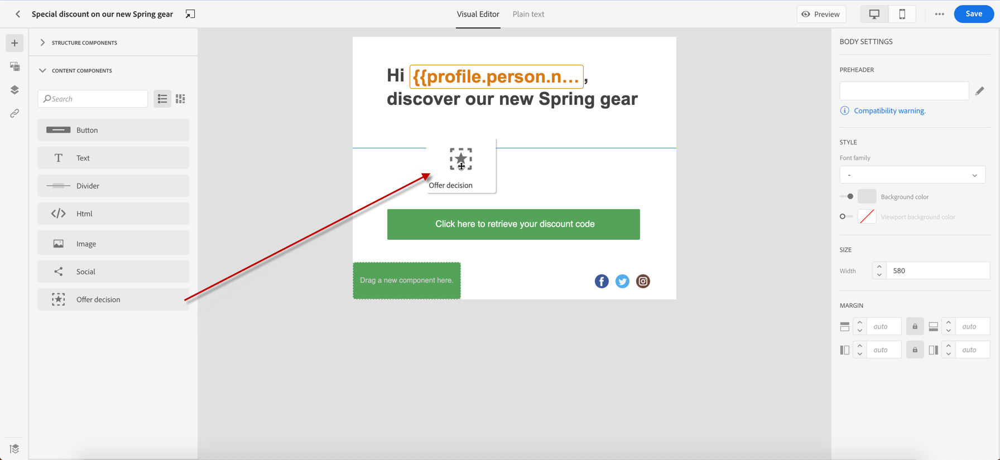

# Adicionar ofertas personalizadas {#deliver-personalized-offers}

Entrada [!DNL Journey Optimizer] e-mails, você pode inserir decisões que aproveitarão o mecanismo de Gestão de decisões para escolher a melhor oferta a ser entregue aos clientes.

Por exemplo, você pode adicionar uma decisão que exibirá no email uma oferta de desconto especial que varia de acordo com o nível de fidelidade do recipient.

>[!IMPORTANT]
>
>Se forem feitas alterações em uma decisão de oferta em uso na mensagem de uma jornada, será necessário desfazer a publicação da jornada e republicá-la.  Isso garantirá que as alterações sejam incorporadas à mensagem da jornada e que ela seja consistente com as atualizações mais recentes.

* Para obter mais informações sobre como criar e gerenciar ofertas, consulte [nesta seção](../offers/get-started/starting-offer-decisioning.md).
* Para um **exemplo completo** mostrando como configurar ofertas, usá-las em uma decisão e aproveitar esta decisão em um email, confira [nesta seção](../offers/offers-e2e.md#insert-decision-in-email).

➡️ [Saiba como adicionar ofertas como personalização neste vídeo](#video-offers)

## Inserir uma decisão em um email {#insert-offers}

>[!CAUTION]
>
>Antes de começar, você deve [definir uma decisão de oferta](../offers/offer-activities/create-offer-activities.md).

Para inserir uma decisão em uma mensagem de email, siga as etapas abaixo:

1. Crie seu email e abra o Designer de email para configurar seu conteúdo.

1. Adicionar um **[!UICONTROL Decisão de oferta]** componente de conteúdo.

   

   Saiba como usar componentes de conteúdo no [nesta seção](content-components.md).

1. A variável **[!UICONTROL Decisão de oferta]** é exibida na paleta direita. Clique em **[!UICONTROL Selecionar decisão de oferta]**:

   1. Na janela exibida, selecione o posicionamento correspondente às ofertas que deseja exibir.

      [Posicionamentos](../offers/offer-library/creating-placements.md) são contêineres usados para exibir suas ofertas. Neste exemplo, usaremos a inserção &quot;imagem superior do email&quot;. Esse posicionamento foi criado na Biblioteca de ofertas para exibir ofertas do tipo imagem situadas na parte superior das mensagens.

   1. As decisões correspondentes à disposição selecionada são exibidas. Selecione a decisão a ser usada no componente de conteúdo e clique em **[!UICONTROL Adicionar]**.

      >[!NOTE]
      >
      >Somente as decisões compatíveis com o posicionamento selecionado são exibidas na lista. Neste exemplo, apenas uma atividade de oferta corresponde à disposição da &quot;imagem superior do email&quot;.

      

A decisão foi adicionada ao componente. Depois de salvar as alterações, as ofertas estarão prontas para serem exibidas nos perfis relevantes ao enviar a mensagem como parte de uma jornada.

>[!NOTE]
>
>Ao atualizar uma oferta, oferta substituta, coleção de ofertas ou decisão de oferta que é mencionada direta ou indiretamente na mensagem, as atualizações são refletidas automaticamente na mensagem correspondente.

## Visualizar ofertas em um email {#preview-offers-in-email}

É possível visualizar as diferentes ofertas que fazem parte da decisão adicionada ao email usando o **[!UICONTROL Oferta]** ou as setas dos componentes de conteúdo.

Para exibir as diferentes ofertas que fazem parte da decisão com um perfil de cliente, siga as etapas abaixo.

1. Selecione os perfis de teste que serão usados para visualizar a oferta:

   1. Clique em **[!UICONTROL Botão Simular conteúdo]** escolha o namespace a ser usado para identificar perfis de teste do **[!UICONTROL Namespace de identidade]** campo.

      >[!NOTE]
      >
      >Neste exemplo, usamos o **E-mail** namespace. Saiba mais sobre os namespaces de identidade da Adobe Experience Platform [nesta seção](../audience/get-started-identity.md).

   1. No **[!UICONTROL Valor de identidade]** insira o valor para identificar o perfil de teste. Neste exemplo, insira o endereço de email de um perfil de teste.

   <!--For example enter smith@adobe.com and click the **[!UICONTROL Add profile]** button.-->

   1. Adicione outros perfis para testar diferentes variantes da mensagem, dependendo dos dados do perfil.

      

1. Clique em **[!UICONTROL Visualizar]** para testar a mensagem e selecionar um perfil de teste. A oferta correspondente ao perfil selecionado (uma mulher) é exibida.

   

   É possível selecionar outros perfis de teste para visualizar o conteúdo do email para cada variante da mensagem. No conteúdo da mensagem, a oferta correspondente ao perfil de teste selecionado (agora um manual) é exibida.

Saiba mais sobre as etapas detalhadas para verificar a pré-visualização da mensagem no [nesta seção](#preview-your-messages).

## Vídeo tutorial{#video-offers}

Saiba como adicionar um componente de gestão de decisões a mensagens no [!DNL Journey Optimizer].

>[!VIDEO](https://video.tv.adobe.com/v/334088?quality=12)
