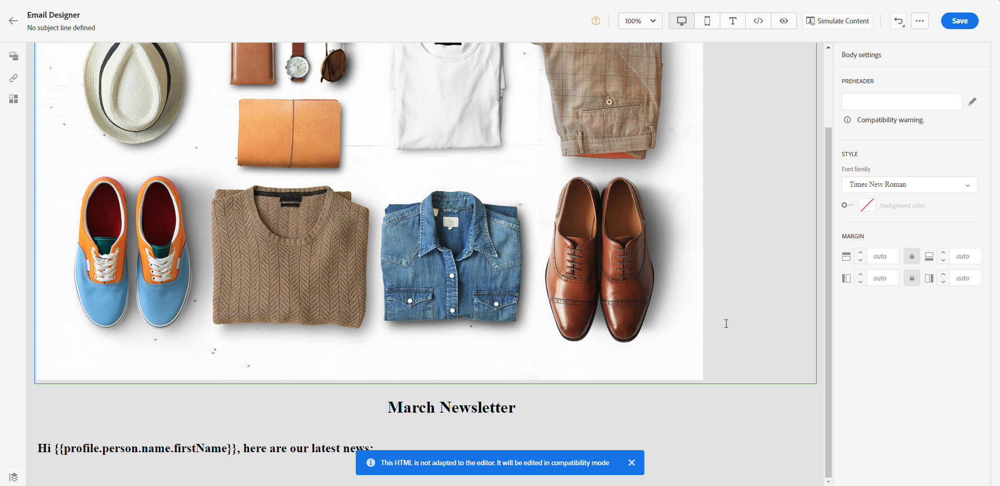
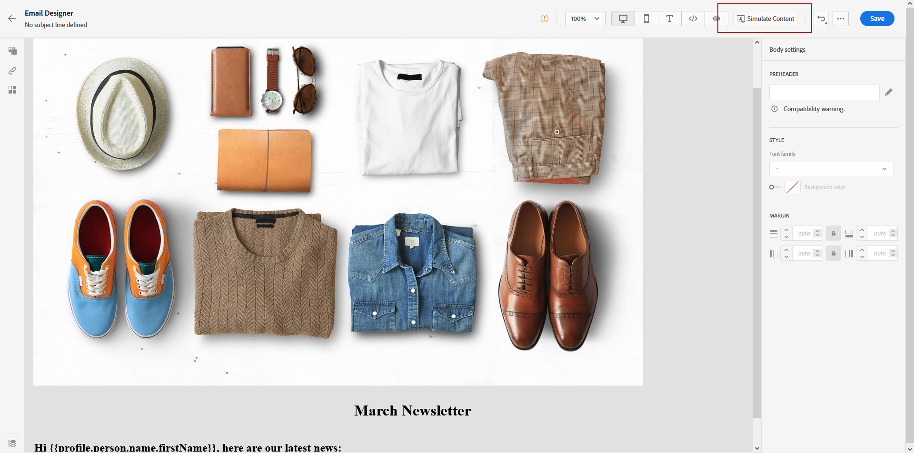

# Trabalhar com modelos do Adobe Experience Manager {#aem-templates}

>[!AVAILABILITY]
>
>A integração com o Adobe Experience Manager está disponível no momento como um beta apenas para usuários selecionados.
> Como usuário beta, use [este formulário](https://forms.office.com/pages/responsepage.aspx?id=Wht7-jR7h0OUrtLBeN7O4Wf0cbVTQ3tCpW_unE-w8-JUN1FaNlAzNkhPSUdaSkJXVFRCNTRJNVRFSy4u){target="_blank"} para compartilhar feedback.

Com o Adobe Journey Optimizer, você pode criar mensagens personalizadas por meio de sites do Adobe Experience Manager. Comece criando seus modelos com as fontes de conteúdo do Adobe Experience Manager e depois os envie para o Adobe Journey Optimizer. Depois de compartilhados, esses modelos podem ser acessados no designer de email do Adobe Journey Optimizer, simplificando o processo de criação e envio de mensagens para o público-alvo desejado.

## Pré-requisitos {#prerequisites}

Antes de começar a usar esse recurso, verifique se você está alinhado aos seguintes requisitos:

* **configurações de Experience Manager**

  Esse recurso está disponível com o [Adobe Experience Manager as a Cloud Service](https://experienceleague.adobe.com/docs/experience-manager-cloud-service/content/overview/introduction.html){target="_blank"}.

  Como parte do programa beta, a configuração do Cloud Service é executada pelo Adobe no Adobe Experience Manager para se conectar ao Adobe Journey Optimizer.

* **Permissões**

  Para criar, editar e excluir modelos de conteúdo no Adobe Journey Optimizer, você deve ter a **[!DNL Manage Library Items]** permissão incluída na **[!DNL Content Library Manager]** perfil do produto. [Saiba mais](../administration/ootb-product-profiles.md#content-library-manager)

## Medidas de proteção e limitações{#aem-templates-limitations}

Para otimizar ainda mais o uso do Adobe Experience Manager com Adobe Journey Optimizer, é importante estar ciente das seguintes medidas de proteção e limitações adicionais:

* A sintaxe adequada do Journey Optimizer é necessária para que a personalização no modelo de Experience Manager seja efetiva. [Saiba mais](../personalization/personalization-syntax.md)

* A exportação de modelos em massa não é suportada no momento. Os modelos devem ser exportados individualmente.

* A sincronização entre o Experience Manager e o Journey Optimizer não está disponível no momento. Se forem feitas alterações em um modelo de Experience Manager após ele ter sido enviado para o Journey Optimizer, o usuário precisará exportar novamente o modelo e reenviá-lo para o Journey Optimizer.

## Enviar um modelo para o Journey Optimizer{#aem-templates-send}

Para exportar um modelo do Adobe Experience Manager para o Adobe Journey Optimizer, siga as etapas abaixo:

1. Na página inicial do Adobe Experience Manager, selecione **[!UICONTROL Marketing de saída]**.

   

1. Na biblioteca de conteúdo, você pode usar modelos configurados anteriormente ou criar um do zero. [Saiba mais](https://experienceleague.adobe.com/docs/experience-manager-65/authoring/authoring/managing-pages.html#creating-a-new-page)

1. Ao incorporar a sintaxe de personalização do Journey Optimizer ao seu modelo, você pode aprimorar seus recursos de personalização. [Saiba mais](../personalization/personalization-syntax.md)

   

1. Selecione o template que deseja exportar para o Journey Optimizer e clique em **[!UICONTROL Enviar para]** no menu avançado.

   

1. Insira o **[!UICONTROL Nome]** do template Content e selecione o target **[!UICONTROL Sandbox]**.

   

1. Depois de clicar no botão **[!UICONTROL Enviar]** , o processo de exportação será iniciado. Quando a exportação for concluída, você verá a seguinte mensagem na interface do usuário: &quot;Modelo &quot;XX&quot; enviado com êxito para o AJO&quot;.

O modelo é adicionado aos modelos de conteúdo do Adobe Journey Optimizer da sandbox selecionada.

## Usar e personalizar um modelo do Adobe Experience Manager{#aem-templates-perso}

Quando o modelo de Experience Manager estiver disponível no Journey Optimizer como um modelo de conteúdo, você poderá identificar e incorporar o conteúdo necessário para o email, incluindo personalização.

1. No Journey Optimizer, no **[!UICONTROL Modelo de conteúdo]** , acesse o modelo importado.

   

1. Ao clicar no link **[!UICONTROL Alerta]** você pode verificar rapidamente se alguma configuração importante está ausente. Isso ajudará a garantir que suas mensagens estejam configuradas corretamente e evitará possíveis erros ou problemas.

   

1. No **[!UICONTROL Propriedades do modelo]** clique na guia **[!UICONTROL Gerenciar acesso]** botão para atribuir rótulos de uso de dados personalizados ou principais ao modelo. [Saiba mais sobre o OLAC (Object Level Access Control)](../administration/object-based-access.md)

1. Para personalizar ainda mais seu modelo de Experience Manager e adicionar personalização personalizada ao seu conteúdo, clique em **[!UICONTROL Editar conteúdo]**. Isso permitirá que você faça alterações facilmente e personalize o modelo de acordo com suas necessidades específicas. [Saiba mais](get-started-email-design.md)

   >[!WARNING]
   >
   > Se quiser editar e personalizar seu template, você só poderá usar o modo de compatibilidade.

1. Quando o modelo de conteúdo estiver pronto, [testar e validar](../content-management/content-templates.md#test-template).

1. Após definir o conteúdo, você pode usá-lo ao criar um novo email navegando pelo **[!UICONTROL Modelos salvos]** coleção. Em seguida, selecione **[!UICONTROL Usar este modelo]**.

   

1. Agora você pode editar e personalizar seu conteúdo. Para obter mais informações sobre como criar seu conteúdo de email, consulte esta [página](content-from-scratch.md).

   

1. Se você adicionou conteúdo personalizado ao seu modelo de Experience Manager, clique em **[!UICONTROL Simular conteúdo]** para visualizar como ele aparecerá na mensagem usando perfis de teste.

[Saiba mais sobre perfis de pré-visualização e teste](../content-management/preview-test.md)

   

1. Ao visualizar a pré-visualização da mensagem, todos os elementos personalizados são substituídos automaticamente pelos dados correspondentes do perfil de teste selecionado.

   Se necessário, perfis de teste adicionais podem ser adicionados por meio do **[!UICONTROL Gerenciar perfis de teste]** botão.

   

Quando o email estiver pronto, conclua a configuração de [jornada](../building-journeys/journey-gs.md) ou [campaign](../campaigns/create-campaign.md)e ativá-lo para enviar a mensagem.
