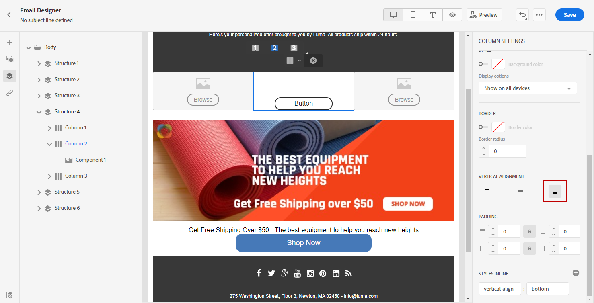

# Ajustar o alinhamento vertical e o preenchimento {#alignment-and-padding}

>[!BEGINSHADEBOX]

**Nesta página:** saiba como ajustar o alinhamento vertical e o preenchimento de colunas e estruturas no Designer de Email, incluindo como corrigir o preenchimento de fragmentos residuais para uma renderização móvel correta.

>[!ENDSHADEBOX]

Neste exemplo, ajustaremos o preenchimento e o alinhamento vertical dentro de um componente de estrutura composto por três colunas.

1. Selecione o componente de estrutura diretamente no email ou usando a **[!UICONTROL Árvore de navegação]** disponível no menu à esquerda.

1. Na barra de ferramentas, clique em **[!UICONTROL Selecionar uma coluna]** e escolha a que deseja editar. Também é possível selecioná-la na árvore de estrutura.

   Os parâmetros editáveis para essa coluna são exibidos na guia **[!UICONTROL Estilos]**.

   

1. Em **[!UICONTROL Alinhamento]**, selecione **[!UICONTROL Superior]**, **[!UICONTROL Meio]** ou **[!UICONTROL Inferior]**.

   

1. Em **[!UICONTROL Preenchimento]**, defina o preenchimento para todos os lados.

   Selecione **[!UICONTROL Preenchimento diferente para cada lado]** se desejar ajustar o preenchimento. Clique no ícone de bloqueio para interromper a sincronização.

   

1. Proceda de forma semelhante para ajustar o alinhamento e o preenchimento das outras colunas.

1. Salve as alterações.

>[!TIP]
>
>Ao projetar conteúdo de email para Gmail em dispositivos Android, certifique-se de que imagens e divisores usem preenchimento de coluna em vez de margens grandes e fixas. O Gmail no Android geralmente renderiza imagens e margens superdimensionadas incorretamente, causando excesso de layout ou linhas divisórias reduzidas. Use uma largura de imagem menor ou conte com o preenchimento baseado em colunas para uma exibição consistente.

## Gerenciar preenchimento do fragmento com navegação estrutural {#fragment-padding-breadcrumb}

Ao trabalhar com [fragmentos](../content-management/fragments.md) no Email Designer, você pode encontrar um preenchimento oculto ou residual que afeta a renderização móvel de forma diferente da área de trabalho. Isso é particularmente comum quando os fragmentos foram desbloqueados ou quando a [herança foi quebrada](use-visual-fragments.md#break-inheritance), pois o estilo restante pode permanecer na coluna subjacente ou nos componentes de texto.

Para identificar e editar o preenchimento restante nos fragmentos:

1. Use a **[!UICONTROL Árvore de navegação]** ou clique diretamente nos elementos no editor para selecionar cada estrutura ou coluna pai dentro do fragmento. Isso ajuda a localizar o preenchimento ou a margem ocultos que podem ser específicos de dispositivos móveis.

1. Depois de selecionar o elemento na navegação estrutural, navegue até a guia **[!UICONTROL Estilos]** à direita.

1. Revise as configurações de **[!UICONTROL Preenchimento]** e remova ou reajuste o preenchimento conforme necessário para obter o alinhamento móvel correto.

1. Se os problemas de alinhamento persistirem ao reutilizar fragmentos, repita esse processo para outras colunas ou componentes de texto no fragmento.

>[!NOTE]
>
>Esse comportamento é esperado quando os fragmentos são inseridos e removidos repetidamente, pois as regras de estilo podem se acumular. Sempre verifique os valores de preenchimento usando a navegação estrutural, especialmente ao direcionar dispositivos móveis.