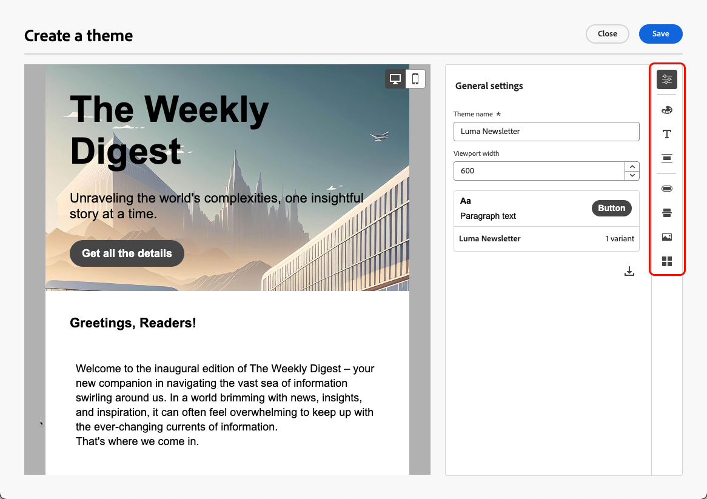
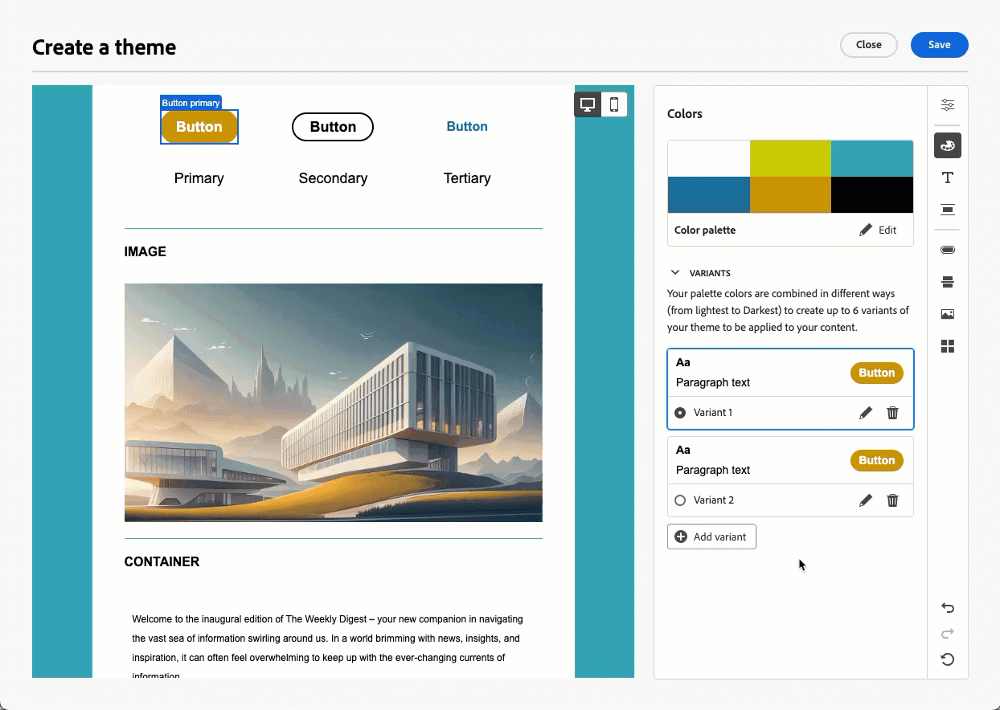

# Aplicar temas ao seu conteúdo de email {#apply-email-themes}

>[!CONTEXTUALHELP]
>id="ajo_use_theme"
>title="Aplicar um tema ao email"
>abstract="Selecione um tema para o email para aplicar rapidamente um estilo específico que se ajuste à sua marca e design."

<!--This documentation provides a comprehensive guide to using themes to streamline your email creation process. With the ability to define reusable themes and leverage pre-designed modules, marketers can create professional, brand-aligned emails faster and with less effort.-->

>[!AVAILABILITY]
>
>No momento, esse recurso está na versão beta, disponível apenas para clientes beta. Para participar do programa beta, entre em contato com seu representante da Adobe.

Com temas, os usuários não técnicos têm a capacidade de criar conteúdo reutilizável que se adapta a uma marca e idioma de design específicos, adicionando estilo personalizado sobre os modelos padrão<!-- to achieve brand specific results-->.

Esse recurso permite que os profissionais de marketing aproveitem emails visualmente atraentes e consistentes com a marca de forma mais rápida e com menos esforço, ao mesmo tempo em que fornece opções avançadas de personalização para necessidades de design exclusivas.

<!--What is the Enhanced Email Authoring Experience?

This feature introduces two key components to simplify and enhance email creation:

* **Theme Management System**: A centralized system for creating, customizing, and applying reusable themes to emails. Themes ensure consistent styling across campaigns and eliminate the need for repetitive manual styling.

* **Modules**: Pre-designed, reusable content blocks that abstract common email elements (e.g., titles, descriptions, images, and links). Modules are built using customizable low-level components, offering flexibility while maintaining design standards.

Key Benefits:

- **Consistency**: Ensure all emails align with your brand's design guidelines.
- **Efficiency**: Save time by reusing themes and modules across campaigns.
- **Customization**: Add custom CSS and mobile-specific styles for advanced designs.
- **Scalability**: Eliminate repetitive styling tasks, enabling faster email creation.-->

## Medidas de proteção e limitações {#themes-guardrails}

* Ao criar um email do zero, você pode optar por começar a criar o conteúdo usando um tema para aplicar rapidamente um estilo específico que se ajuste à sua marca e design.

  Se você escolher o modo Clássico, não será possível aplicar temas, a menos que redefina seu email.

* [Fragmentos](../content-management/fragments.md) não são compatíveis entre os modos Tema e Clássico.

  Para poder usar um fragmento em um conteúdo no qual um tema é aplicado, esse fragmento deve ser criado no modo Tema.

* Se estiver usando um conteúdo criado no HTML, você estará no [modo de compatibilidade](existing-content.md) e não poderá aplicar temas a esse conteúdo.

  Para aproveitar totalmente todos os recursos do Designer de email, incluindo temas, você deve criar um novo conteúdo no modo Tema ou converter o conteúdo do HTML importado. [Saiba mais](existing-content.md)

<!--If using a content created in Classic mode or HTML, you cannot apply themes to this content. You must create a new content in Theme mode.

If you apply a theme to a content using a [fragment](../content-management/fragments.md) created in Classic mode, the rendering may not be optimal.-->

## Criar um tema {#create-and-edit-themes}

Para definir um tema que você pode aproveitar em seu conteúdo de email futuro, siga as etapas abaixo.

1. Para começar, crie um novo [modelo de conteúdo](../content-management/create-content-templates.md).

1. Selecione a opção **[!UICONTROL Criar ou editar temas]**.

   

1. Você pode selecionar o tema padrão ou usar uma Adobe ou um modelo personalizado. Neste exemplo, selecione o tema padrão e clique em **[!UICONTROL Criar]**.

   

1. Na guia **[!UICONTROL Configurações gerais]**, comece a definir seu tema dando a ele um nome específico para sua marca. Você pode ajustar a largura padrão de seus emails e também exportar o tema atual para [compartilhá-lo em sandboxes](../configuration/copy-objects-to-sandbox.md).

   <!---->

1. Use o painel à direita para navegar pelas diferentes guias e atualizar as configurações de design.

   

1. Na guia **[!UICONTROL Cores]**:

   * Use o botão **[!UICONTROL Editar]** para configurar uma **[!UICONTROL paleta de cores]** com cores padrão para sua marca. Selecione uma **[!UICONTROL Predefinição]** para criar rapidamente um esquema de cores ou ajustar cada cor do seu tema individualmente. Você também pode usar uma combinação de ambos.

     

   * Clique em **[!UICONTROL Adicionar variante]** para criar várias variantes de cores, como o modo claro e escuro, em que cada variante tem sua própria paleta de cores e controles de nuance.

     

   * Para cada variante, clique no ícone Editar para editar qualquer elemento individual. É possível usar a paleta padrão criada ou qualquer cor personalizada.

     

1. Nas **[!UICONTROL Configurações de texto]**, é possível definir a fonte global que deseja usar para todo o tema. Para um controle mais granular, também é possível editar cada texto de cabeçalho e parágrafo para ajustar a fonte, o tamanho, o estilo e assim por diante.

   

1. Na guia **[!UICONTROL Espaçamento]**, selecione um elemento individual na lista para espaçá-lo corretamente entre os diferentes componentes.

   <!---->

1. Usando as outras guias à direita, você pode gerenciar separadamente cada elemento de botão, divisor, formatação de imagem adicional e espaçamento do layout de grade para esse tema.

   <!---->

1. Clique em **[!UICONTROL Salvar]** para armazenar este tema para uso futuro.

## Aplicar temas a um email {#apply-themes}

Para aplicar temas de estilo padrão ou personalizados a um email, siga as etapas abaixo.

1. Em [!DNL Journey Optimizer], [adicione uma ação de email](create-email.md) a uma jornada ou campanha e [edite seu corpo de email](get-started-email-design.md#key-steps).

1. Você pode selecionar uma das seguintes ações:

   * Selecione um [modelo de email](use-email-templates.md) interno para abrir o Designer de email. Um tema padrão específico para cada modelo é aplicado automaticamente.

   * Crie um [novo conteúdo do zero](content-from-scratch.md) e selecione **[!UICONTROL Tema]** para começar com um tema de estilo predefinido.

     

     >[!CAUTION]
     >
     >Se você escolher o modo Clássico, não será possível aplicar temas, a menos que redefina seu email.
     >
     >Para usar um [fragmento](../content-management/fragments.md) no modo Tema, este fragmento deve ter sido criado sozinho usando o modo Tema.

1. No Designer de Email, clique no botão **[!UICONTROL Temas]** no painel direito. O tema padrão ou o tema do modelo é exibido. Você pode alternar entre as duas variantes de cor para esse tema.

   

1. Clique na seta ao lado do tema usado no momento. A lista de temas personalizados e do Adobe disponíveis é exibida.

   

1. Clique em **[!UICONTROL Temas personalizados]** e selecione o tema criado.

   

1. Clique fora da lista suspensa. O tema personalizado recém-selecionado aplica automaticamente seus estilos a todos os componentes de email. É possível alternar entre as duas variantes de cores.

1. Quando um componente é selecionado, ainda é possível desbloquear seu estilo usando o ícone dedicado.

   

Você pode alternar temas a qualquer momento. O conteúdo do email permanece inalterado, mas os estilos são atualizados para refletir o novo tema.

<!--
>[!NOTE]
> - Themes apply styles globally. Ensure your theme is finalized before applying it to multiple emails.
> - Switching themes may override custom styles applied to individual components.

>[!CAUTION]
> - When using fragments, the email's theme will override the fragment's styles. A warning will be displayed in the editor if there is a conflict.

## Example Use Cases {#example-use-cases}

### 1. Creating a New Theme
- A marketer creates a theme with their brand's colors, fonts, and button styles.
- The theme is saved and reused across multiple email campaigns.

### 2. Switching Themes
- A marketer applies a holiday-themed design to an existing email by switching to a pre-designed holiday theme.-->
