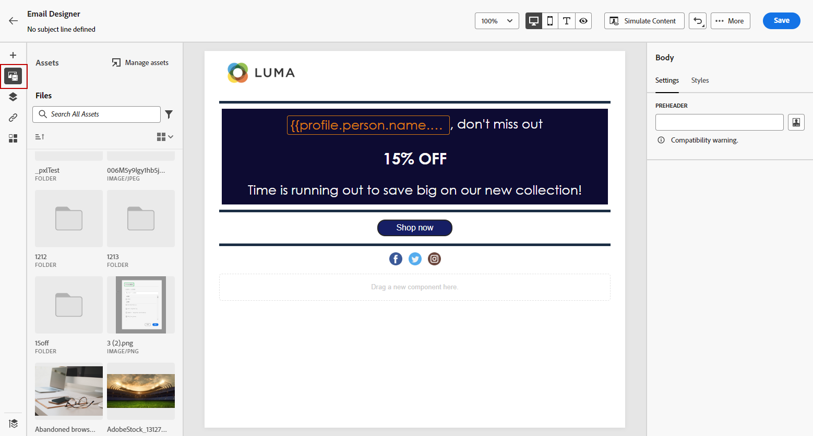

# Crie e gerencie ativos com [!DNL Assets Essentials]{#experience-manager-assets}

## Introdução ao [!DNL Assets Essentials] {#get-started-assets-essentials}

Junte os fluxos de trabalho de marketing e de criação usando o [!DNL Adobe Experience Manager Assets Essentials]. Integrado nativamente no [!DNL Adobe Journey Optimizer], acesse o [!DNL Assets Essentials] para armazenar, gerenciar, descobrir e distribuir ativos digitais. Ele fornece um repositório único e centralizado de ativos que você pode usar para preencher suas mensagens.

[!DNL Adobe Experience Manager Assets Essentials] O é um espaço de trabalho colaborativo e centralizado de ativos que estende seu sistema criativo e unifica os ativos digitais para entrega de experiência. É possível organizar, marcar e encontrar facilmente ativos de produção aprovados para garantir a consistência da marca em todas as equipes. Com sua intuitiva experiência de usuário, o acesso [!DNL Assets Essentials] instantaneamente para compartilhar ativos nos aplicativos Adobe Creative e Experience Cloud.

Saiba mais em [Documentação do Adobe Experience Manager Assets Essentials](https://experienceleague.adobe.com/docs/experience-manager-assets-essentials/help/introduction.html){target="_blank"}.

O [!DNL Adobe Experience Manager Assets Essentials] pode ser acessado diretamente a partir do [!DNL Adobe Journey Optimizer], através da seção **[!UICONTROL Ativos]** no menu esquerdo. Também é possível acessar ativos e pastas ao [design de conteúdo de email](get-started-email-design.md).

## Pré-requisitos{#assets-prerequisites}

Antes de usar [!DNL Adobe Experience Manager Assets Essentials], você deve adicionar usuários ao **Usuários do cliente do Assets Essentials** ou/e **Usuários do Assets Essentials** Perfis de produto. Leia mais em [Documentação do Assets Essentials](https://experienceleague.adobe.com/docs/experience-manager-assets-essentials/help/deploy-administer.html?lang=pt-BR){target="_blank"}.

>[!NOTE]
>Para produtos do Journey Optimizer obtidos antes de 6 de janeiro de 2022, é necessário implantar o [!DNL Adobe Experience Manager Assets Essentials] para sua organização. Saiba mais na seção [Implantar o Assets Essentials](https://experienceleague.adobe.com/docs/experience-manager-assets-essentials/help/deploy-administer.html?lang=pt-BR){target="_blank"}.

## Fazer upload e inserir ativos{#add-asset}

Para importar arquivos para [!DNL Assets Essentials], primeiro é necessário procurar ou criar a pasta na qual ele será armazenado. Você poderá inseri-los no seu conteúdo de email.

Para obter mais informações sobre como fazer upload de ativos, consulte [Documentação do Adobe Experience Manager Assets Essentials](https://experienceleague.adobe.com/docs/experience-manager-assets-essentials/help/add-delete.html){target="_blank"}.

1. De [!DNL Adobe Journey Optimizer] página inicial, selecione o **[!UICONTROL Ativos]** na guia **[!UICONTROL Gestão de conteúdo]** para acessar o menu [!DNL Assets Essentials].

   

1. Clique duas vezes em uma pasta na seção central ou na visualização em árvore para abri-la.

   Você também pode clicar em **[!UICONTROL Criar pasta]** para criar uma nova pasta.

   

1. Uma vez na pasta selecionada ou criada, clique em **[!UICONTROL Adicionar ativos]** para fazer upload do novo ativo para a sua pasta.

   

1. No **[!UICONTROL Upload de arquivos]**, clique em **[!UICONTROL Procurar]** e escolha se deseja **[!UICONTROL Procurar arquivos]** ou **[!UICONTROL Procurar pastas]**.

1. Selecione o arquivo que deseja fazer upload. Quando terminar, clique em **[!UICONTROL Upload]**. Para saber mais sobre como gerenciar os ativos, consulte esta seção [página](https://experienceleague.adobe.com/docs/experience-manager-assets-essentials/help/manage-organize.html).

1. Para editar seus ativos com a Adobe Photoshop Express, clique duas vezes nos ativos. Em seguida, no menu à direita, selecione a opção **[!UICONTROL Modo de Edição]** ícone . [Saiba mais](https://experienceleague.adobe.com/docs/experience-manager-assets-essentials/help/edit-images.html){target="_blank"}.

   

1. De [!DNL Adobe Journey Optimizer], selecione o **[!UICONTROL Seletor de ativos]** no painel esquerdo do designer de email.

   

1. Selecione o que foi criado anteriormente **[!UICONTROL Ativos]** pasta. Você também pode pesquisar seu ativo ou sua pasta na barra de pesquisa.

1. Arraste e solte o ativo no seu conteúdo de email.

   

1. Você pode personalizar ainda mais seus ativos, como adicionar um link externo ou um texto usando a variável **[!UICONTROL Configurações]** e **[!UICONTROL Estilos]** guias. [Saiba mais sobre configurações de componentes](content-components.md)

   

   <!--
    After adding your asset to your email, use the **[!UICONTROL Find similar Stock photos]** option to locate Stock photos that match the content, color, and composition of your image. [Learn more about Adobe Stock](stock.md).

    Note that this option is available for licensed/unlicensed Stock images and images from your Assets folder. 

    
    -->