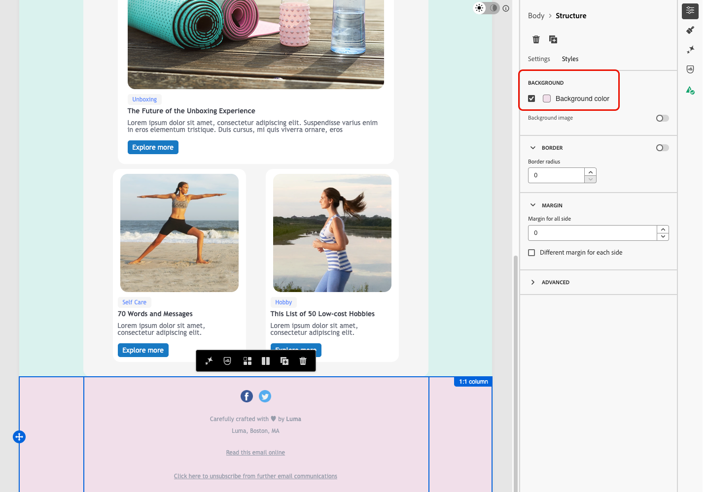

# Personalizar o plano de fundo do email {#backgrounds}

>[!BEGINSHADEBOX]

**Nesta página:** saiba como definir cores e imagens de plano de fundo nos níveis de corpo, visor, estrutura e coluna do seu email no Designer de email.

>[!ENDSHADEBOX]

>[!CONTEXTUALHELP]
>id="ac_edition_backgroundimage"
>title="Configurações de fundo"
>abstract="Você pode personalizar a cor ou a imagem do fundo para o seu conteúdo. Observe que a imagem do fundo não é aceita por todos os clientes de email."

Os planos de fundo ajudam a reforçar a identidade da marca e chamar atenção para as principais áreas do email. No Designer de email, é possível definir uma cor ou imagem de fundo nos diferentes níveis do conteúdo — do corpo geral às estruturas e colunas individuais — fornecendo controle preciso sobre como os planos de fundo são renderizados no email.

Lembre-se das seguintes práticas recomendadas ao definir planos de fundo no Designer de email:

* Aplique uma cor de fundo ao corpo somente se o design exigir.
* Prefira definir as cores de fundo no nível da coluna sempre que possível.
* Evite usar cores de fundo em componentes de imagem ou texto, pois são mais difíceis de gerenciar.
* Teste as imagens de fundo em clientes de email reais antes do envio, pois a renderização pode ser diferente da visualização do Designer de email.

As configurações a seguir permitem aplicar uma cor ou imagem de fundo em qualquer nível do conteúdo do email, desde o corpo até estruturas e colunas individuais.

>[!TIP]
>
>Se um tema for aplicado ao email, não será possível substituir diretamente a cor de fundo definida pelo tema para um determinado componente. É necessário primeiro desbloquear esse estilo usando o ícone dedicado na guia **[!UICONTROL Estilos]**. [Saiba como](apply-email-themes.md#unlocking-styles)

## Definir uma cor de fundo {#background-color}

1. **Cor de fundo do corpo** – define uma **[!UICONTROL cor de fundo]** para todo o email. Certifique-se de selecionar **[!UICONTROL Corpo]** na **[!UICONTROL Árvore de navegação]**, acessível na paleta esquerda, e usar a opção dedicada na guia **[!UICONTROL Estilos]** à direita.

   

1. **Cor de fundo do visor** - defina uma **[!UICONTROL cor do visor]** para aplicar a mesma cor de fundo a todos os componentes de estrutura, independente da cor de fundo do corpo.

   

1. **Cor de fundo da estrutura** – para aplicar uma cor de fundo a um único componente de estrutura, selecione-o diretamente na tela ou na paleta esquerda e defina uma cor específica para ele.

   

   >[!TIP]
   >
   >Nesse caso, certifique-se de não definir uma cor de fundo do visor, pois isso pode ocultar as cores de fundo da estrutura.

1. **Cor de fundo da coluna** – defina uma cor de fundo no nível da coluna. Novamente, certifique-se de selecionar a coluna desejada na paleta esquerda e defina uma cor específica para essa coluna.

   

   >[!TIP]
   >
   >Esse é o caso de uso mais comum e uma prática recomendada, pois oferece mais flexibilidade ao editar o restante do conteúdo de email.

## Definir uma imagem de fundo {#background-image}

Também é possível definir uma **[!UICONTROL Imagem de fundo]** para o conteúdo de uma estrutura ou componente de coluna. Isso é usado com mais frequência no nível da estrutura; é possível definir um no nível da coluna, mas isso raramente é feito.

>[!NOTE]
>
>Alguns programas de email não são compatíveis com imagens de fundo. Quando não houver compatibilidade, a cor de fundo da linha será usada. Certifique-se de selecionar uma cor de fundo sobressalente apropriada caso a imagem não possa ser exibida.

>[!TIP]
>
>Visualize a imagem de fundo em clientes de email reais antes de enviar, não apenas na visualização do Designer de email. A mesma imagem e posicionamento podem ser renderizados corretamente no editor, mas são exibidos esticados ou cortados de forma diferente em alguns clientes, como o Outlook no iOS.

Depois de definir uma imagem de fundo, use a lista suspensa **[!UICONTROL Posicionamento da imagem]** para controlar como a imagem preenche a estrutura ou a coluna. As opções abaixo estão disponíveis para seleção:

{width=80%}

**Dimensionar para preencher, centralizado:**

* **[!UICONTROL Ajustar]** - estica a imagem para preencher o container em ambos os eixos, sem preservar a proporção.
* **[!UICONTROL Largura total]** - dimensiona a imagem proporcionalmente à largura do container e a centraliza verticalmente.
* **[!UICONTROL Altura total]** - dimensiona a imagem proporcionalmente à altura do container e a centraliza horizontalmente.

**Dimensionar para preencher, ancorado a uma borda:**

* **[!UICONTROL Largura total - superior]** - igual à **[!UICONTROL Largura total]**, ancorada na parte superior do container. O excesso é cortado na parte inferior.
* **[!UICONTROL Largura total - inferior]** - igual à **[!UICONTROL Largura total]**, ancorada na parte inferior do container. O excesso é cortado na parte superior.
* **[!UICONTROL Altura total - esquerda]** - igual à **[!UICONTROL Altura total]**, ancorada à esquerda do container. O excesso é cortado à direita.
* **[!UICONTROL Altura total - direita]** - igual à **[!UICONTROL Altura total]**, ancorada à direita do container. O excesso é cortado à esquerda.

**Bloco:**

* **[!UICONTROL Repetir]** - repete a imagem lado a lado em seu tamanho original para preencher o contêiner.

**Posição sem dimensionamento:**

* **[!UICONTROL Esquerda]**, **[!UICONTROL Direita]**, **[!UICONTROL Centro]**, **[!UICONTROL Superior]**, **[!UICONTROL Inferior]** - posiciona a imagem no tamanho original, ancorada à borda ou ao centro correspondente do container.

>[!NOTE]
>
>As opções de ancoragem em borda oferecem mais controle sobre qual parte da imagem permanece em exibição quando ela não corresponde às proporções da estrutura, em comparação às opções centralizadas acima.

{{$include /help/_includes/do-not-localize/email/ai-augmented-backgrounds.md}}
