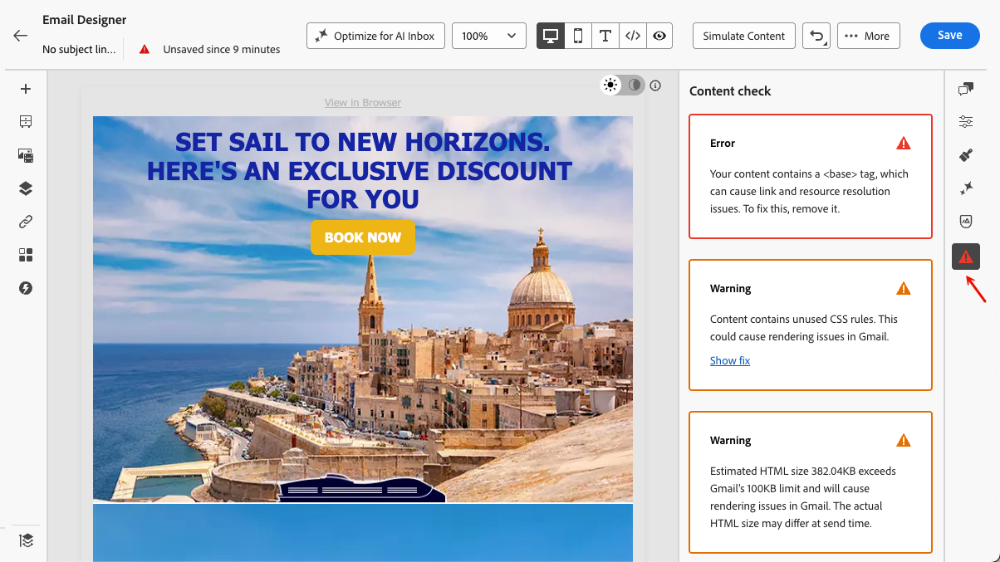

# Verificação de conteúdo no Designer de email {#content-check}

>[!CONTEXTUALHELP]
>id="ajo_email_content_check"
>title="Validar seu conteúdo de email"
>abstract="As verificações de conteúdo detectam automaticamente problemas de HTML e CSS no email antes do envio. Eles sinalizam tags incompatíveis, divs em branco e limites de tamanho que podem interromper a renderização no Gmail ou no Microsoft Outlook. Os problemas são exibidos como erros, avisos ou notificações informativas, com detalhes contextuais e correções com um clique, quando disponíveis."

O [!DNL Journey Optimizer] inclui validação técnica automatizada diretamente no Designer de email, ajudando você a identificar problemas de HTML e CSS antes do envio.

Os resultados são exibidos como erros, avisos ou avisos informativos no painel de criação, com detalhes contextuais e correções com um clique, quando disponíveis, para que os problemas possam ser resolvidos sem sair do Designer de email.

## Acessar verificações de conteúdo {#access-content-checks}

As verificações de conteúdo estão sempre disponíveis no Designer de email. Para exibi-los, clique no ícone Problemas no painel direito para abrir o painel **[!UICONTROL Verificação de conteúdo]** — todos os problemas detectados são listados lá.

>[!NOTE]
>
>As verificações são executadas automaticamente em relação ao estado atual do email e após cada edição. [Saiba mais](#recalculation)

As verificações são exibidas com três níveis de severidade:

| Severidade | Cor | Descrição |
|---|---|---|
| **Erro** | Vermelho | Um problema crítico que causará falhas de entrega ou renderização. Resolva antes de enviar. |
| **Aviso** | Laranja | Um problema em potencial que pode afetar a renderização em clientes de email específicos. Recomendado para analisar e resolver. |
| **Informações** | Azul | Aviso informativo sobre uma condição que não bloqueia o envio, mas pode afetar a capacidade de manutenção de longo prazo do seu conteúdo. |

Quando nenhum problema for detectado, o painel exibirá **Nenhum problema detectado** e o ícone correspondente estará verde.

Dependendo do problema, você pode exibir mais contexto, aplicar uma correção de um clique ou salvar seu email para atualizar um resultado de verificação.

* Para alguns problemas detectados, você pode clicar no botão **[!UICONTROL Mostrar detalhes]** para ver mais contexto. Clique em **[!UICONTROL Ocultar detalhes]** para recolher.
  {width="80%"}
* Da mesma forma, você pode clicar no botão **[!UICONTROL Mostrar correção]** e aplicar uma correção de um clique onde estiver disponível. Se a correção não puder ser aplicada automaticamente, uma mensagem será exibida e você deverá resolver o problema manualmente.
  {width="80%"}

### Recálculo de cheques {#recalculation}

A maioria das verificações — como elementos HTML não compatíveis, divs vazios e tamanho do HTML — é recalculada cada vez que você edita seu email, para que sempre reflitam seu conteúdo atual.

Outras verificações, como o tamanho de CSS, são calculadas a partir do conteúdo serializado — a versão do seu email quando ele é carregado ou salvo — não a partir do estado de edição em tempo real no Designer de email. Nesse caso, o conteúdo salvo pode ser um pouco diferente do que você vê ao editar. Se você fizer edições sem salvar, um rótulo de **[!UICONTROL Verificação obsoleta]** aparecerá indicando que o resultado pode não ser mais preciso. Salve seu email para atualizar o cálculo.

{width="100%"}

## Correção de problemas detectados {#fix-issues}

As tabelas abaixo listam todas as mensagens possíveis e a ação recomendada para cada uma. Expanda a categoria correspondente à mensagem que você vê no painel **[!UICONTROL Verificação de conteúdo]**.

+++ Elementos do HTML não compatíveis

| Mensagem | Severidade | O que fazer |
|---|---|---|
| Seu conteúdo contém uma marca `<script>`, que não tem suporte em nenhum sistema de email. Remova-o para evitar problemas de entrega e renderização. | Erro | Localize e remova todas as `<script>` tags do seu conteúdo do HTML. |
| Seu conteúdo contém uma marca `<base>`, que pode causar problemas de resolução de links e recursos no Designer de email. Para corrigir, é necessário removê-lo. | Erro | Remova a tag `<base>` da sua HTML. |
| Seu conteúdo contém uma meta tag do HTML com atualização, que não é compatível com o Designer de email. Remova-o para evitar um comportamento inesperado. | Aviso | Remova a tag de meta-atualização da HTML. |
| Seu conteúdo contém divs vazios, o que pode causar problemas de layout no Microsoft Outlook (MSO). Para corrigir isso, remova os divs vazios e use o espaçamento de elementos semelhantes. | Aviso | Exclua os elementos `
` vazios e ajuste o preenchimento ou a margem nos elementos ao redor para manter o espaçamento. |

+++

+++ Problemas de CSS

| Mensagem | Severidade | O que fazer |
|---|---|---|
| O tamanho total do CSS excede o limite de 16 KB do Gmail e causará problemas de renderização no Gmail. | Erro | Use **[!UICONTROL Aplicar correção]** para remover automaticamente regras CSS não usadas ou simplificar manualmente seus estilos. |
| O tamanho total do CSS está próximo do limite de 16 KB do Gmail e pode causar problemas de renderização se mais CSS for adicionado. | Aviso | Use **[!UICONTROL Aplicar correção]** para remover regras CSS não usadas ou reduzir estilos antes de adicionar mais conteúdo. |
| O tamanho total de CSS para este fragmento excede 3 KB. Combinar isso com outros fragmentos poderia fazer com que o CSS total de email excedesse o limite de 16 KB do Gmail e causasse problemas de renderização. | Aviso | Simplifique o CSS neste fragmento para manter o CSS de email combinado abaixo de 16 KB. |
| O conteúdo contém regras CSS não usadas. Isso pode causar problemas de renderização no Gmail. | Aviso | Use **[!UICONTROL Aplicar correção]** para remover automaticamente regras CSS que referenciam elementos que não estão mais presentes no email. |

<!--
| Message | Severity | What to do |
|---|---|---|
| Your content has modifications to the system-generated default CSS. These changes may be overridden by future Email Designer updates. To preserve your styles, add them using the Custom CSS feature instead. | Info | Move your custom styles to [Custom CSS](custom-css.md) to ensure they are preserved across Email Designer updates. |
-->

+++

+++ Tamanho do HTML

| Mensagem | Severidade | O que fazer |
|---|---|---|
| O tamanho estimado do HTML excede o limite de 100 KB do Gmail e causará problemas de renderização no Gmail. O tamanho real do HTML pode ser diferente no momento do envio. | Erro | Reduza o conteúdo de e-mail — remova elementos desnecessários, simplifique a estrutura ou divida o conteúdo em vários envios. |
| O tamanho estimado do HTML está próximo do limite de 100 KB do Gmail e pode causar problemas de renderização se mais HTML forem adicionados. O tamanho real do HTML pode ser diferente no momento do envio. | Aviso | Simplifique o conteúdo antes de adicionar mais. Emails que excedem o limite do Gmail serão recortados para destinatários. |
| O tamanho estimado do HTML para este fragmento excede 20 KB. Combinar isso com outros fragmentos poderia fazer com que o total de emails do HTML excedesse o limite de 100 KB do Gmail e causasse problemas de renderização. O tamanho real do HTML pode ser diferente no momento do envio. | Aviso | Reduza o HTML neste fragmento para manter o tamanho do email combinado abaixo do limite de 100 KB do Gmail. |

+++

## Sobre o HTML e o tamanho de CSS {#size-estimation}

Os valores de tamanho de HTML e CSS mostrados no Designer de email são **estimativas computadas no momento da criação**. Eles refletem a carga útil renderizada completa como ela existe no editor naquele momento e incluem:

* **Estrutura do HTML** - todas as marcas, invólucros de layout e estilos embutidos
* **CSS incorporado** - O Designer de email insere estilos antes de calcular o tamanho, que é padrão para clientes de email, mas aumenta o número bruto em comparação a uma folha de estilos externa
* **Conteúdo do texto** - todos os tokens de cópia e personalização, contados em seu comprimento de espaço reservado (não seu valor resolvido)
* **Fragmentos** - todos os fragmentos referenciados são expandidos em linha, de modo que cada fragmento contribui com seu peso completo de HTML/CSS para o total
* **Blocos condicionais (if-else)** - **todas as ramificações** são incluídos na estimativa de tamanho no momento da criação, pois as condições não são avaliadas até o momento do envio
* **Imagens** - somente a referência da imagem (src URL) é contada, não os dados da imagem binária propriamente dita

### Por que a estimativa pode diferir do tamanho entregue {#size-estimate-difference}

O tamanho mostrado é uma estimativa de pior caso no limite superior, não o email exato que um recipient receberá. Pode diferir pelos seguintes motivos:

* **Conteúdo condicional**: no momento do envio, somente a ramificação correspondente ao perfil do destinatário é renderizada. Um modelo mostrando 120 KB no editor pode produzir um email de 60 KB para a maioria dos recipients.
* **Tokens do Personalization**: os tokens de espaço reservado são contados em seu comprimento de token bruto. Os valores resolvidos geralmente são mais curtos.
* **Otimização de tamanho do HTML**: se a opção **[!UICONTROL Otimizar tamanho do HTML]** estiver habilitada, os espaços em branco, os comentários e os caracteres redundantes serão removidos no momento do envio, reduzindo a carga final. [Saiba mais](create-email.md#optimize-html-size)

### O que significam avisos de tamanho para os autores {#size-warnings}

Os avisos de tamanho (por exemplo, HTML excedendo 100 KB) são **sinais proativos** para ajudá-lo a otimizar seu email antes do envio — eles não são blocos rígidos e não refletem o tamanho exato que os destinatários verão. Eles existem para ajudar a evitar:

* Emails sendo cortados pelo Gmail, que corta mensagens em aproximadamente 102 KB do HTML
* Renderização lenta em dispositivos móveis ou em conexões de baixa largura de banda
