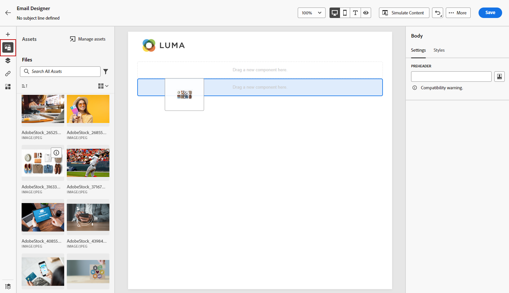
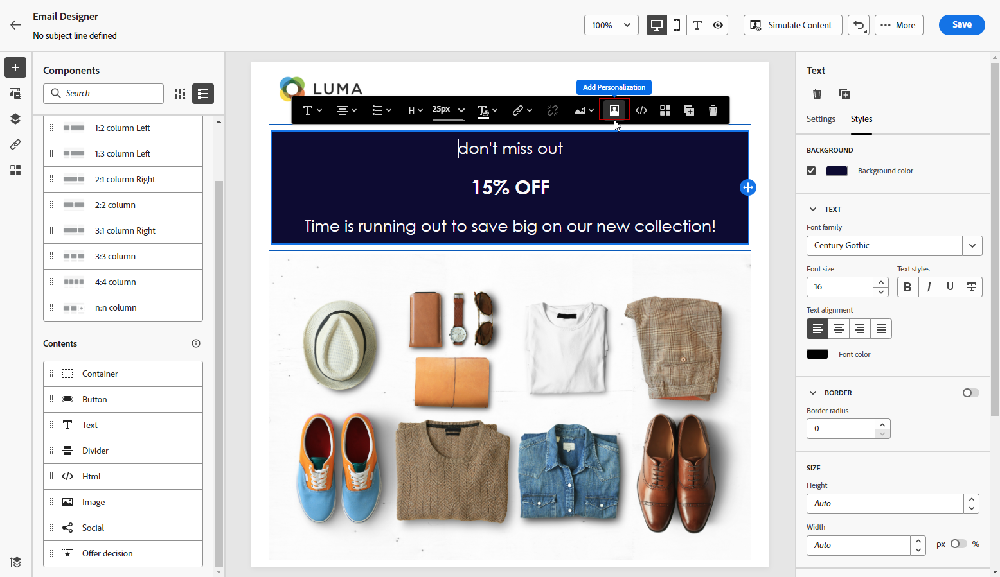
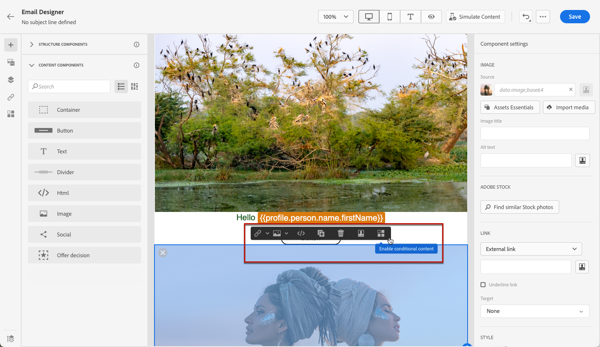

# Criar conteúdo do zero com o Designer de email {#content-from-scratch}

>[!BEGINSHADEBOX]

**Nesta página:** saiba como criar conteúdo de email do zero no Adobe Journey Optimizer Email Designer adicionando estruturas e componentes de conteúdo e, em seguida, personalizando e visualizando seu email.

>[!ENDSHADEBOX]

>[!CONTEXTUALHELP]
>id="ac_structure_components_email"
>title="Adicionar componentes da estrutura"
>abstract="Os componentes de estrutura definem o layout do email. Arraste e solte um componente de **Estrutura** na tela para iniciar a criação do conteúdo de email."

>[!CONTEXTUALHELP]
>id="ac_structure_components_landing_page"
>title="Adicionar componentes da estrutura"
>abstract="Os componentes de estrutura definem o layout da página de destino. Arraste e solte um componente de **Estrutura** na tela para começar a criação do conteúdo da página de destino."

>[!CONTEXTUALHELP]
>id="ac_structure_components_fragment"
>title="Adicionar componentes da estrutura"
>abstract="Os componentes de estrutura definem o layout do fragmento. Arraste e solte um componente de **Estrutura** na tela para começar a criação do conteúdo do fragmento."

>[!CONTEXTUALHELP]
>id="ac_structure_components_template"
>title="Adicionar componentes da estrutura"
>abstract="Os componentes de estrutura definem o layout do modelo. Arraste e solte um componente de **Estrutura** na tela para começar a criação do conteúdo do modelo."

>[!CONTEXTUALHELP]
>id="ac_edition_columns_email"
>title="Definir colunas de email"
>abstract="O Designer de email permite definir facilmente o layout do email selecionando a estrutura da coluna."

>[!CONTEXTUALHELP]
>id="ac_edition_columns_landing_page"
>title="Definir as colunas da página de destino"
>abstract="O Designer permite definir facilmente o layout da página de destino selecionando a estrutura da coluna."

>[!CONTEXTUALHELP]
>id="ac_edition_columns_fragment"
>title="Definir colunas de fragmento"
>abstract="O Designer permite definir facilmente o layout do fragmento selecionando a estrutura da coluna."

>[!CONTEXTUALHELP]
>id="ac_edition_columns_template"
>title="Definir colunas de modelo"
>abstract="O Designer permite definir facilmente o layout do modelo selecionando a estrutura da coluna."

Use o Designer de email do [!DNL Adobe Journey Optimizer] para definir facilmente a estrutura do seu conteúdo. Ao adicionar e mover elementos estruturais com ações simples de arrastar e soltar, você pode projetar a forma do conteúdo em segundos.

>[!NOTE]
>
>A [Lei Europeia de Acessibilidade](https://eur-lex.europa.eu/legal-content/EN/TXT/?uri=CELEX%3A32019L0882){target="_blank"} declara que todas as comunicações digitais devem ser acessíveis. Siga as diretrizes específicas listadas em [esta página](accessible-content.md) ao criar o conteúdo em [!DNL Journey Optimizer].

Para começar a criar o conteúdo, siga as etapas abaixo:

1. Na página inicial do Designer, selecione a opção **[!UICONTROL Design do zero]**.

   

1. Para começar rapidamente, use os **[!UICONTROL Módulos]** — blocos de conteúdo pré-projetados e prontos para uso, como cabeçalhos, seções herói e rodapés — para acelerar a criação de emails e manter suas campanhas visualmente consistentes. [Saiba mais sobre os módulos](email-modules.md)

   

1. Caso contrário, crie seu conteúdo arrastando e soltando **[!UICONTROL Estruturas]** na tela para definir o layout do seu email.

   >[!TIP]
   >
   >Como alternativa, acelere a criação de emails com Gerar conteúdo para gerar conteúdo de email completo, incluindo texto e imagens, usando o [Gerar conteúdo completo com IA](../content-management/generative-full-content.md). Em seguida, você pode pular para a pré-visualização e validação do conteúdo.

1. Adicione quantas **[!UICONTROL Estruturas]** forem necessárias e edite suas configurações no painel dedicado à direita.

   

   >[!NOTE]
   >
   >Em telas estreitas (por exemplo, dispositivos móveis), as colunas são empilhadas verticalmente por padrão para facilitar a leitura. Alguns clientes de email não são compatíveis com esse comportamento, nesse caso, as colunas permanecem lado a lado. Você também pode desativar esta opção usando a opção **[!UICONTROL Não empilhar colunas em dispositivos móveis]** na guia **[!UICONTROL Configurações]**.

1. A maioria das estruturas (**[!UICONTROL 1:1 coluna]**, **[!UICONTROL 2:2 coluna]**, **[!UICONTROL 1:2 coluna Left]** e assim por diante) são predefinições fixas. Selecione o componente **[!UICONTROL n:n coluna]** para definir qualquer número de colunas de sua escolha (entre 3 e 10).

   

   Você pode aumentar o **[!UICONTROL Número de colunas]** de uma estrutura existente a qualquer momento a partir da guia **[!UICONTROL Configurações]**, mesmo depois de adicionar conteúdo a ela — o conteúdo existente será preservado em vez de ser perdido.

   Você também pode ajustar a largura de cada coluna diretamente na tela ou editando as porcentagens na guia **[!UICONTROL Configurações]**.

   >[!NOTE]
   >
   >O tamanho de cada coluna não pode ser inferior a 10% da largura total do componente de estrutura. Não é possível remover uma coluna que não esteja vazia.

1. Na seção **[!UICONTROL Conteúdo]**, adicione quantos elementos forem necessários em um ou mais componentes da estrutura. [Saiba mais sobre componentes de conteúdo](content-components.md)

1. Cada componente pode ser personalizado ainda mais com as guias **[!UICONTROL Configurações]** ou **[!UICONTROL Estilo]** do menu direito. Por exemplo, é possível alterar o estilo do texto, o preenchimento ou a margem de cada componente. [Saiba mais sobre alinhamento e preenchimento](alignment-and-padding.md)

   

1. No **[!UICONTROL Seletor de ativos]**, você pode selecionar diretamente os ativos armazenados na **[!UICONTROL biblioteca do Assets]**. [Saiba mais sobre o gerenciamento de ativos](../integrations/assets.md)

   Clique duas vezes na pasta que contém seus ativos. Arraste e solte-os em um componente de estrutura.

   

1. Insira campos de personalização para personalizar seu conteúdo de atributos de perfis, associações de público-alvo, atributos contextuais e muito mais. [Saiba mais sobre a personalização de conteúdo](../personalization/personalize.md)

   

1. Clique em **[!UICONTROL Habilitar conteúdo de condição]** para adicionar conteúdo dinâmico e adaptar o conteúdo aos perfis direcionados com base em regras condicionais. [Introdução ao conteúdo dinâmico](../personalization/get-started-dynamic-content.md)

   

1. Clique na guia **[!UICONTROL Links]** no painel esquerdo para exibir todas as URLs do seu conteúdo que serão rastreadas. Você pode modificar o **[!UICONTROL Tipo de Rastreamento]** ou o **[!UICONTROL Rótulo]** e adicionar **[!UICONTROL Marcas]**, se necessário. [Saiba mais sobre links e rastreamento](message-tracking.md)

   

1. Se necessário, é possível personalizar ainda mais o email clicando em **[!UICONTROL Alternar para o editor de código]** no menu avançado. Isso permite editar o código-fonte do email, por exemplo, para adicionar rastreamento ou tags de HTML personalizadas. [Saiba mais sobre o editor de código](code-content.md)

   >[!CAUTION]
   >
   >Não é possível reverter para o designer visual desse email após alternar para o editor de código.

1. Quando o conteúdo estiver pronto, use qualquer método de simulação para verificar a renderização. Você pode escolher exibir no desktop ou em um dispositivo móvel. Informações detalhadas estão disponíveis na seção [Gerenciamento de conteúdo](../content-management/preview-test.md).

   

1. Você também pode validar a qualidade do seu conteúdo para avaliar a legibilidade, a eficácia e a coesão do conteúdo. [Saiba mais sobre validação da qualidade do conteúdo](../content-management/brands-score.md#validate-quality)

1. Quando o conteúdo estiver pronto, clique em **[!UICONTROL Salvar]**.

{{$include /help/_includes/do-not-localize/email/ai-augmented-content-from-scratch.md}}
