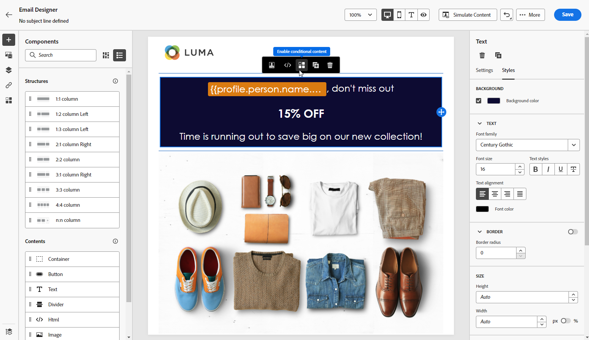

# Crie um conteúdo do zero {#content-from-scratch}

>[!CONTEXTUALHELP]
>id="ac_structure_components_email"
>title="Adicionar componentes da estrutura"
>abstract="Os componentes de estrutura definem o layout do email. Arraste e solte um componente de **Estrutura** na tela para iniciar a criação do conteúdo de email."

>[!CONTEXTUALHELP]
>id="ac_structure_components_landing_page"
>title="Adicionar componentes da estrutura"
>abstract="Os componentes de estrutura definem o layout da página de destino. Arraste e solte um componente de **Estrutura** na tela para começar a criação do conteúdo da página de destino."

>[!CONTEXTUALHELP]
>id="ac_structure_components_fragment"
>title="Adicionar componentes da estrutura"
>abstract="Os componentes de estrutura definem o layout do fragmento. Arraste e solte um componente de **Estrutura** na tela para começar a criação do conteúdo do fragmento."

>[!CONTEXTUALHELP]
>id="ac_structure_components_template"
>title="Adicionar componentes da estrutura"
>abstract="Os componentes de estrutura definem o layout do modelo. Arraste e solte um componente de **Estrutura** na tela para começar a criação do conteúdo do modelo."

>[!CONTEXTUALHELP]
>id="ac_edition_columns_email"
>title="Definir colunas de email"
>abstract="O Designer de email permite definir facilmente o layout do email selecionando a estrutura da coluna."

>[!CONTEXTUALHELP]
>id="ac_edition_columns_landing_page"
>title="Definir as colunas da página de destino"
>abstract="O Designer permite definir facilmente o layout da página de destino selecionando a estrutura da coluna."

>[!CONTEXTUALHELP]
>id="ac_edition_columns_fragment"
>title="Definir colunas de fragmento"
>abstract="O Designer permite definir facilmente o layout do fragmento selecionando a estrutura da coluna."

>[!CONTEXTUALHELP]
>id="ac_edition_columns_template"
>title="Definir colunas de modelo"
>abstract="O Designer permite definir facilmente o layout do modelo selecionando a estrutura da coluna."

Use o Adobe Journey Optimizer Designer para definir facilmente a estrutura do seu conteúdo. Ao adicionar e mover elementos estruturais com ações simples de arrastar e soltar, você pode projetar a forma do conteúdo em segundos.

Para começar a criar o conteúdo, siga as etapas abaixo:

1. Na página inicial do Designer, selecione o **[!UICONTROL Criar do zero]** opção.

   

1. Comece a projetar seu conteúdo arrastando e soltando **[!UICONTROL Estruturas]** na tela para definir o layout do email.

   >[!NOTE]
   >
   >O empilhamento de colunas não é compatível com todos os programas de email. Quando não houver suporte, as colunas não serão empilhadas.

   <!--Once placed in the email, you cannot move nor remove your components unless there is already a content component or a fragment placed inside. This is not true in AJO - TBC?-->

1. Adicionar quantos **[!UICONTROL Estruturas]** conforme necessário e edite suas configurações no painel dedicado à direita.

   

   Selecione o **[!UICONTROL coluna n:n]** para definir o número de colunas de sua escolha (entre 3 e 10). Você também pode definir a largura de cada coluna movendo as setas na parte inferior de cada coluna.

   >[!NOTE]
   >
   >Cada tamanho de coluna não pode estar abaixo de 10% da largura total do componente de estrutura. Não é possível remover uma coluna que não esteja vazia.

1. Expanda a **[!UICONTROL Conteúdo]** e adicione quantos elementos forem necessários em um ou mais componentes da estrutura. [Saiba mais sobre componentes de conteúdo](content-components.md)

1. Cada componente pode ser personalizado ainda mais usando o **[!UICONTROL Configurações]** ou **[!UICONTROL Estilo]** no menu direito. Por exemplo, é possível alterar o estilo do texto, o preenchimento ou a margem de cada componente. [Saiba mais sobre alinhamento e preenchimento](alignment-and-padding.md)

   

1. No **[!UICONTROL Seletor de ativos]**, é possível selecionar diretamente os ativos armazenados no **[!UICONTROL Biblioteca de ativos]**. [Saiba mais sobre o gerenciamento de ativos](../content-management/assets.md)

   Clique duas vezes na pasta que contém seus ativos. Arraste e solte-os em um componente de estrutura.

   

1. Insira campos de personalização para personalizar seu conteúdo de atributos de perfis, associações de público-alvo, atributos contextuais e muito mais. [Saiba mais sobre a personalização de conteúdo](../personalization/personalize.md)

   

1. Clique em **[!UICONTROL Ativar conteúdo de condição]** para adicionar conteúdo dinâmico e adaptar o conteúdo aos perfis direcionados com base em regras condicionais. [Introdução ao conteúdo dinâmico](../personalization/get-started-dynamic-content.md)

   

1. Clique em **[!UICONTROL Links]** do painel esquerdo para exibir todos os URLs do seu conteúdo que serão rastreados. Você pode modificar seus **[!UICONTROL Tipo de rastreamento]** ou **[!UICONTROL Rótulo]** e adicionar **[!UICONTROL Tags]** se necessário. [Saiba mais sobre links e rastreamento](message-tracking.md)

   

1. Se necessário, é possível personalizar ainda mais o email clicando em **[!UICONTROL Alternar para o editor de código]** no menu avançado. Isso permite editar o código fonte do email, por exemplo, para adicionar tags de rastreamento ou HTML personalizadas. [Saiba mais sobre o editor de código](code-content.md)

   >[!CAUTION]
   >
   >Você não pode reverter para o designer visual neste email depois de alternar para o editor de código.

1. Quando o conteúdo estiver pronto, clique no link **[!UICONTROL Simular conteúdo]** botão para verificar a renderização. Você pode escolher a visualização de desktop ou móvel. Informações detalhadas sobre como selecionar perfis de teste e pré-visualizar seu conteúdo estão disponíveis na [Gestão de conteúdo](../content-management/preview-test.md) seção.

   

1. Quando o conteúdo estiver pronto, clique em **[!UICONTROL Salvar]**.
