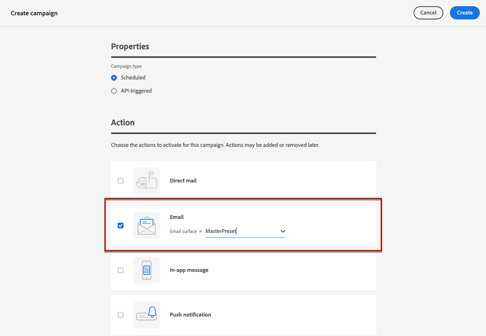
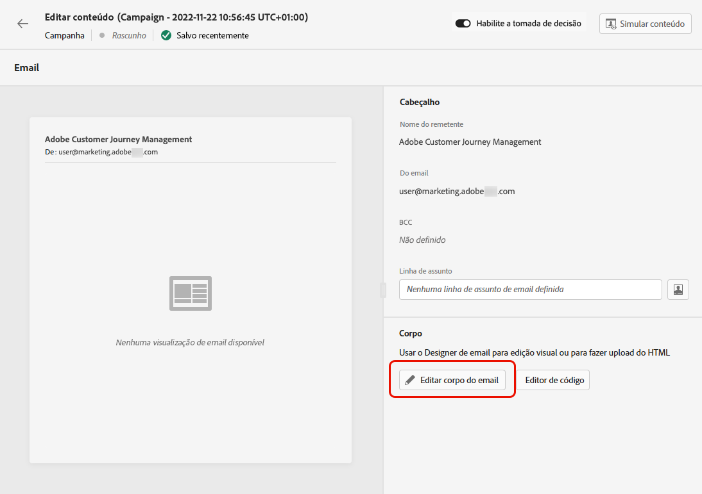
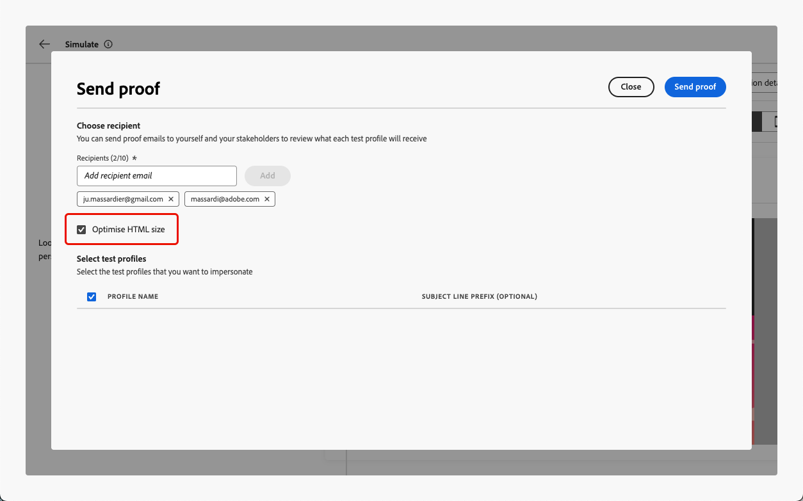
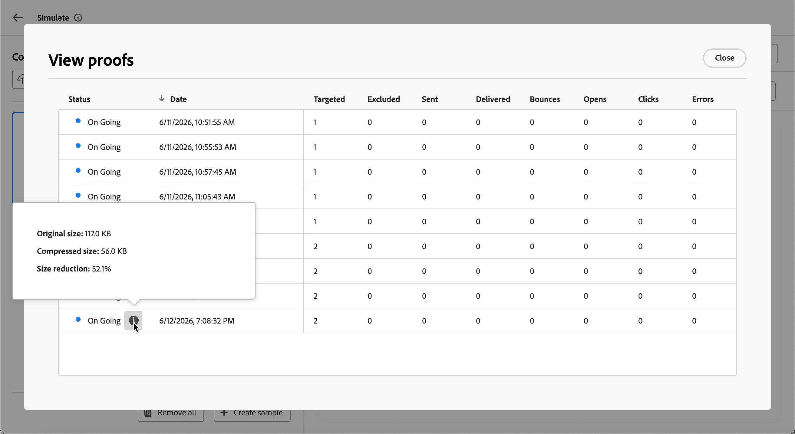
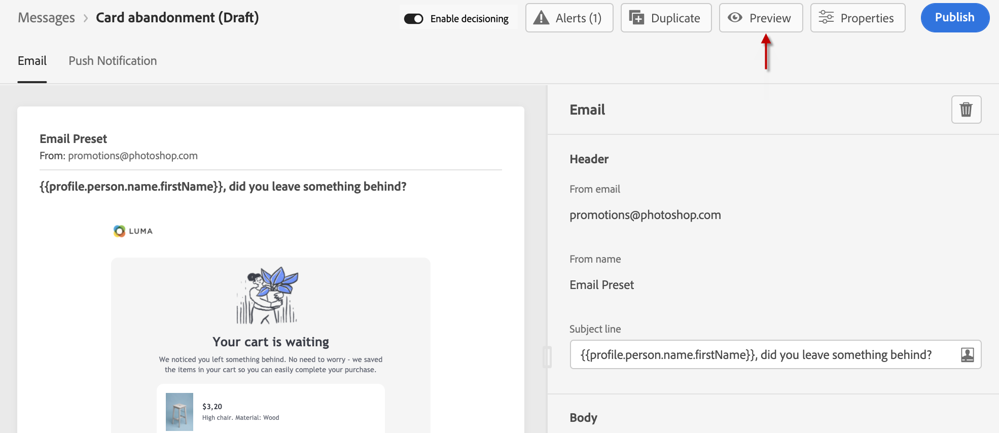

# Criar um email {#create-email}

>[!BEGINSHADEBOX]

**Nesta página:** saiba como adicionar uma ação de email a uma jornada ou campanha no Adobe Journey Optimizer, definir seu assunto e conteúdo, verificar alertas e pré-visualizar antes de enviar.

>[!ENDSHADEBOX]

>[!CONTEXTUALHELP]
>id="ajo_message_email"
>title="Criação de email"
>abstract="Defina o assunto do email e abra o Designer de email para criar seu conteúdo."
>additional-url="https://experienceleague.adobe.com/en/courses/ajo-ai-powered-on-brand-content-creation-for-marketers" text="Faça o curso: Criação de conteúdo on-brand alimentado por IA"

## Adicionar uma ação de email {#email-action}

>[!CONTEXTUALHELP]
>id="ajo_journey_action_email"
>title="Ação de email"
>abstract="Uma ação de canal de email envia um email para perfis quando eles atingem essa etapa da jornada. O rótulo identifica a atividade na tela da jornada e a ação faz referência a uma configuração de email que define o conteúdo fornecido. A seção **Otimização** pode incluir experimentos de conteúdo ou regras de direcionamento. A seção **Multilíngue** pode fornecer conteúdo em vários idiomas. A seção **Tempo-limite ou erro** pode definir um caminho alternativo se a ação falha."
>additional-url="https://experienceleague.adobe.com/pt-br/docs/journey-optimizer/using/orchestrate-journeys/about-journey-building/journey-action#add-action" text="Introdução a ações de canal"

Para criar um email em [!DNL Journey Optimizer], adicione uma ação de **[!UICONTROL Email]** a uma jornada ou campanha. Siga as etapas abaixo, de acordo com seu caso.

>[!BEGINTABS]

>[!TAB Adicionar um email a uma jornada]

1. Abra a jornada e arraste e solte uma atividade **[!UICONTROL Ação]** da seção **[!UICONTROL Ações]** da paleta. Saiba mais sobre a [Atividade de ação](../building-journeys/journey-action.md).

   >[!IMPORTANT]
   >
   >As atividades de canal nativas herdadas (Email, Push, SMS, No aplicativo, Web, Experiência baseada em código e Cartão de conteúdo) serão descontinuadas a partir da versão de março de 2026. As jornadas existentes que usam essas atividades continuam a funcionar sem alterações — nenhuma migração é necessária.

1. Selecione **[!UICONTROL Email]** como o tipo de ação.

   

1. Insira um **[!UICONTROL Rótulo]** para identificar sua ação na tela de jornada.

1. Clique no botão **[!UICONTROL Configurar ação]**.

1. Você é direcionado para a guia **[!UICONTROL Ações]**. Nesse local, selecione ou crie a configuração de email que será usada. [Saiba mais](email-settings.md)

   

1. Além disso:

   * Você pode aplicar regras de limitação à sua ação de email selecionando um conjunto de regras na lista suspensa **[!UICONTROL Regras de negócio]**. [Saiba mais](../conflict-prioritization/channel-capping.md)

   * Você pode usar a opção **[!DNL Send time optimization]** para prever o melhor momento para enviar a mensagem para maximizar o engajamento com base no histórico das taxas de abertura e de clique. [Saiba como](../building-journeys/send-time-optimization.md)

1. Selecione o botão **[!UICONTROL Editar conteúdo]** e crie o conteúdo conforme desejado usando o Designer de email. [Saiba mais](#define-email-content)

1. Volte para a tela de jornada. Se necessário, conclua o fluxo de jornada arrastando e soltando ações ou eventos adicionais. [Saiba mais](../building-journeys/about-journey-activities.md)

Para obter mais informações sobre como criar, configurar e publicar uma jornada, consulte [esta página](../building-journeys/journey-gs.md).

>[!TAB Adicionar um email a uma campanha]

1. [Crie uma campanha](../campaigns/create-campaign.md) e selecione **[!UICONTROL Email]** como sua ação.

1. Conclua as etapas para criar uma campanha de email, como as propriedades da campanha, [público](../audience/about-audiences.md) e [agendamento](../campaigns/campaign-schedule.md).

   

1. Selecione a ação **[!UICONTROL Email]**.

1. Selecione ou crie a configuração de email. [Saiba mais](email-settings.md)

   

<!--
From the **[!UICONTROL Action]** section, specify if you want to track how your recipients react to your delivery: you can track email opens, and/or clicks on links and buttons in your email.

-->
Para obter mais informações sobre como criar, configurar e ativar uma campanha, consulte [esta página](../campaigns/get-started-with-campaigns.md).

>[!ENDTABS]

## Definir o conteúdo do email {#define-email-content}

<!-- update the quarry component with right ID value-->

>[!CONTEXTUALHELP]
>id="test_id"
>title="Configurar conteúdo de email"
>abstract="Crie o conteúdo do seu email. Defina o assunto e aproveite o Designer de email para criar e personalizar o corpo do email."

Depois de adicionar a ação de email à sua jornada ou campanha, é necessário definir o conteúdo do email, incluindo a linha de assunto, as informações do remetente e o corpo do email usando o Designer de email. Siga estas etapas:

1. Na tela de configuração da jornada ou campanha, clique no botão **[!UICONTROL Editar conteúdo]** para configurar o conteúdo do email. [Saiba mais](get-started-email-design.md)

   

1. Ative a opção **[!UICONTROL Habilitar a decisão]** se desejar adicionar políticas de decisão em seu email.

   As políticas de decisão são containers para suas ofertas que utilizam o mecanismo de decisão para retornar dinamicamente o melhor conteúdo a ser entregue a cada membro do público-alvo. [Saiba como adicionar uma política de decisão em um email](../experience-decisioning/create-decision.md#create-decision)

   

   >[!AVAILABILITY]
   >
   >Por enquanto, a criação de políticas de decisão por e-mail está disponível em Disponibilidade limitada. Entre em contato com o representante da Adobe para obter acesso.

1. Na seção **[!UICONTROL Cabeçalho]**, verifique os campos **[!UICONTROL Do nome]**, **[!UICONTROL Do email]** e **[!UICONTROL Cco]**. Eles são configurados na configuração de email selecionada. [Saiba mais](email-settings.md) <!--check if same for journey-->

   

1. Adicione uma linha de assunto para a mensagem. Para configurar e personalizar a linha de assunto com o editor de personalização, clique no ícone **[!UICONTROL Abrir caixa de diálogo de personalização]**. [Saiba mais](../personalization/personalization-build-expressions.md)

   >[!NOTE]
   >
   >A linha de assunto é obrigatória. Não deve incluir quebras de linha.

1. Clique no botão **[!UICONTROL Editar corpo do email]** para acessar o Designer de email e começar a criar seu conteúdo. [Saiba mais](get-started-email-design.md)

   

1. Se você estiver em uma campanha, também poderá clicar no botão **[!UICONTROL Editor de códigos]** para codificar seu próprio conteúdo no HTML simples usando a janela pop-up exibida.

   

   >[!NOTE]
   >
   >Se você já tiver criado ou importado conteúdo por meio do Designer de email, esse conteúdo será exibido no HTML.

1. Se necessário, habilite a opção **[!UICONTROL Otimizar o tamanho do HTML]** para reduzir o tamanho do HTML de email durante o processo de publicação. [Saiba mais](#optimize-html-size)

## Verificar alertas {#check-email-alerts}

À medida que você projeta suas mensagens, os alertas são exibidos na interface (na parte superior direita da tela) quando as principais configurações estão ausentes.

>[!NOTE]
>
>Se você não vir esse botão, nenhum alerta foi detectado.

As configurações e os elementos verificados pelo sistema estão listados abaixo. Você também encontrará informações sobre como adaptar sua configuração para resolver os problemas correspondentes.

Dois tipos de alertas podem ocorrer:

* **Os avisos** referem-se às recomendações e práticas recomendadas, como:

  * **[!UICONTROL O link para opção de não participação não está presente no corpo do email]**: a adição de um link para cancelamento de inscrição no corpo do email é uma prática recomendada. Saiba como configurá-lo em [esta seção](../privacy/opt-out.md#opt-out-decision-management).

    >[!NOTE]
    >
    >As mensagens de email do tipo Marketing devem incluir um link para opção de não participação, que não é necessário para mensagens transacionais. A categoria da mensagem (**[!UICONTROL Marketing]** ou **[!UICONTROL Transacional]**) é definida no nível [configuração de canal](email-settings.md#email-type) e ao [criar a mensagem](#create-email-journey-campaign) a partir de uma jornada ou campanha.

  * **[!UICONTROL A versão de texto do HTML está vazia]**: não se esqueça de definir uma versão de texto do seu corpo de email, pois ela será usada quando o conteúdo do HTML não puder ser exibido. Saiba como criar a versão de texto em [esta seção](text-version-email.md).

  * **[!UICONTROL Um link vazio está presente no corpo do email]**: verifique se todos os links no seu email estão corretos. Saiba como gerenciar conteúdo e links em [esta seção](content-from-scratch.md).

  * **[!UICONTROL O tamanho do email excedeu o limite de 100KB]**: para uma entrega ideal, verifique se o tamanho do seu email não excede 100KB. Para reduzir o tamanho do HTML, use a opção **[!UICONTROL Otimizar tamanho do HTML]**. [Saiba mais](#optimize-html-size)

* **Erros** impedem que você teste ou ative a jornada/campanha enquanto não forem resolvidos, como:

  * **[!UICONTROL A linha de assunto está ausente]**: a linha de assunto do email é obrigatória. Saiba como defini-la e personalizá-la em [esta seção](create-email.md).

  <!--HTML is empty when Amp HTML is present-->

  * **[!UICONTROL A versão do email da mensagem está vazia]**: esse erro é exibido quando o conteúdo do email não foi configurado. Saiba como criar conteúdo de email em [esta seção](get-started-email-design.md).

  * **[!UICONTROL a configuração não existe]**: você não poderá usar sua mensagem se a configuração selecionada for excluída após a criação da mensagem. Se este erro ocorrer, selecione outra configuração na mensagem **[!UICONTROL Propriedades]**. Saiba mais sobre configurações de canal em [esta seção](../configuration/channel-surfaces.md).

>[!CAUTION]
>
>Para testar ou ativar a jornada/campanha usando o email, você deve resolver todos os alertas de **erro**.

## Otimizar o tamanho do HTML de email {#optimize-html-size}

>[!CONTEXTUALHELP]
>id="ajo_email_minification"
>title="Reduzir tamanho do HTML"
>abstract="Ative essa opção para compactar seu HTML de email durante a publicação removendo espaços em branco e recuos desnecessários. Isso ajuda a evitar o corte de emails em clientes como o Gmail, que truncam mensagens com mais de 100 KB. Observe que, ao trabalhar com emails multilíngues, essa opção é ativada por padrão para todas as localidades."

O [!DNL Journey Optimizer] permite compactar a versão do HTML de email durante o processo de publicação removendo espaços em branco e recuos desnecessários. Manter o tamanho pequeno do HTML ajuda a:

>[!NOTE]
>
>A remoção de comentários não essenciais do HTML também faz parte da otimização, mas esse recurso foi temporariamente desativado em 10 de julho de 2026.

* Evite **recorte de email** — alguns clientes, como o Gmail, truncam mensagens com mais de ~100 KB, impedindo que os destinatários visualizem o conteúdo completo.
* Melhore o **tempo de carregamento do email** na caixa de entrada do destinatário.
* Melhore a **deliverability** e reduza o uso da largura de banda.

Esta otimização não é aplicada automaticamente. Você deve habilitá-la manualmente na tela [Editar conteúdo](#define-email-content).

>[!IMPORTANT]
>
> A redução de tamanho do HTML é aplicada somente no momento da publicação.

A otimização é segura para o cliente de email:

* Preserva comentários condicionais do MSO/Outlook.
* Isso não altera seu conteúdo, imagens ou vídeos reais.

>[!NOTE]
>
>A redução no tamanho do email depende da estrutura original do HTML do email. Se o conteúdo já estiver compacto ou a carga do email for muito grande, a redução pode ser mínima e talvez não impeça totalmente o recorte em todos os casos.

Você pode testar o impacto da otimização de tamanho do HTML antes de publicar ao enviar provas. [Saiba mais](#optimize-html-proof)

### Otimizar o tamanho do HTML em emails multilíngues {#optimize-html-multilingual}

Ao trabalhar com [variantes de email multilíngues](../content-management/multilingual-gs.md), a configuração **[!UICONTROL Otimizar tamanho do HTML]** é rastreada no nível do email, não por localidade.

Portanto, ativar essa configuração em qualquer local a aplica a todos os locais desse email no momento da publicação, mesmo locais em que a caixa de seleção ainda aparece desmarcada na interface do usuário. Não é necessário repetir a ação para cada local.

Para desabilitar a otimização de tamanho do HTML, você deve desmarcar **[!UICONTROL Otimizar tamanho do HTML]** em cada localidade. Deixá-la ativada até mesmo em um local é suficiente para que a otimização seja aplicada em todos os locais.

>[!NOTE]
>
>Se você estiver executando um [experimento de conteúdo](../content-management/content-experiment.md), a configuração **[!UICONTROL Otimizar tamanho do HTML]** será gerenciada de forma independente para cada tratamento, pois cada tratamento é considerado uma mensagem separada.

## Verifique e envie seu email

Depois que o conteúdo da mensagem for definido, é possível pré-visualizar seu conteúdo usando qualquer método de simulação:

* Clique em **[!UICONTROL Simular conteúdo]** para testar as variações de conteúdo com dados de entrada de exemplo ou geração automática de IA. [Saiba como simular variações de conteúdo](../test-approve/simulate-sample-input.md)
* Clique em **[!UICONTROL Simular conteúdo]** e selecione **[!UICONTROL Simular conteúdo (perfis do AEP)]** na lista suspensa para visualizar com perfis de teste, enviar provas e verificar a renderização de email.

Você também pode validar a qualidade do seu conteúdo para avaliar a legibilidade, a eficácia e a coesão do conteúdo. [Saiba mais sobre validação da qualidade do conteúdo](../content-management/brands-score.md#validate-quality)

Informações detalhadas sobre como selecionar perfis de teste e pré-visualizar seu conteúdo estão disponíveis na seção [Gerenciamento de conteúdo](../content-management/preview-test.md).

Quando o email estiver pronto, conclua a configuração da [jornada](../building-journeys/journey-gs.md) ou da [campanha](../campaigns/create-campaign.md) e ative-a para enviar a mensagem.

>[!NOTE]
>
>Para acompanhar o comportamento de seus destinatários por meio de aberturas e/ou interações de email, verifique se as opções dedicadas na seção **[!UICONTROL Rastreamento]** estão habilitadas na [atividade de email](../building-journeys/journey-action.md) da jornada ou no email [campanha](../campaigns/create-campaign.md).<!--to move?-->

### Testar otimização de tamanho do HTML {#optimize-html-proof}

Se você habilitou a opção [Otimização de tamanho do HTML](#optimize-html-size), é possível avaliar seu impacto antes de publicar ao enviar provas. Siga as etapas abaixo.

1. No Designer de email, clique no ícone Problemas no painel direito. Se o tamanho do email renderizado exceder 100 KB, uma mensagem será exibida avisando que isso pode causar truncamento em alguns clientes de email. <!--Learn more about content checks in [this section](#check-email-alerts).-->

   

1. Clique em **[!UICONTROL Simular conteúdo]**.

   <!---->

1. Para testar a versão otimizada, clique no botão **[!UICONTROL Enviar prova]** e selecione a opção **[!UICONTROL Otimizar tamanho do HTML]**. Isso enviará uma prova com o tamanho reduzido do HTML aos recipients de teste.

   

   >[!NOTE]
   >
   >Essa configuração é independente do editor de email — a prova reflete o que você selecionar na prova, independentemente de a opção estar ativada ou desativada no próprio email.

1. Selecione os destinatários do teste e clique no botão **[!UICONTROL Enviar prova]**. Saiba mais sobre o envio de provas em [esta seção](../content-management/proofs.md).
1. Depois de enviado, de volta à tela **[!UICONTROL Simular]**, clique no botão **[!UICONTROL Exibir Prova]**.
1. Clique no ícone Informações ao lado do status da prova. Os detalhes da otimização são exibidos em uma janela pop-up, incluindo o tamanho original do HTML, o tamanho otimizado do HTML e a porcentagem de redução de tamanho.

   

   Use essas informações para validar a saída otimizada e confirmar se o email permanece dentro do limite recomendado de 100 KB antes da publicação.

<!--
## Define your email content {#email-content}

Use [!DNL Journey Optimizer] Email Designer to [design your email from scratch](../email/content-from-scratch.md). If you have an existing content, you can [import it in the Email Designer](../email/existing-content.md), or [code your own content](../email/code-content.md) in [!DNL Journey Optimizer]. 

[!DNL Journey Optimizer] comes with a set of [built-in templates](email-templates.md) to help you start. Any email can also be saved as a template.

Use [!DNL Journey Optimizer] personalization editor to personalize your messages with profiles' data. For more on personalization, refer to [this section](../personalization/personalize.md).

Adapt the content of your messages to the targeted profiles by using [!DNL Journey Optimizer] dynamic content capabilities. [Get started with dynamic content](../personalization/get-started-dynamic-content.md)

## Email tracking {#email-tracking}

If you want to track the behavior of your recipients through openings and/or clicks on links, enable the following options: **[!UICONTROL Email opens]** and **[!UICONTROL Click on email]**. 

Learn more about tracking in [this section](message-tracking.md).

## Validate your email content {#email-content-validate}

Control the rendering of your email, and check personalization settings with test profiles, using the preview section on the left-hand side. For more on this, refer to [this section](preview.md).

You must also check alerts in the upper section of the editor.  Some of them are simple warnings, but others can prevent you from using the message. 
-->
