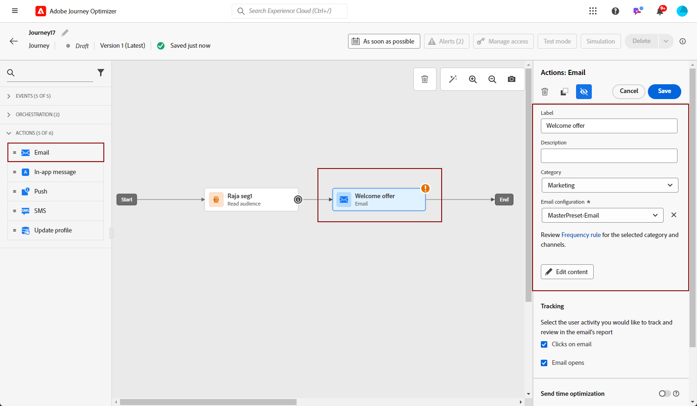

# Criar um email {#create-email}

>[!CONTEXTUALHELP]
>id="ajo_message_email"
>title="Criação de email"
>abstract="Defina o assunto do email e abra o Designer de email para criar seu conteúdo."

## Adicionar uma ação de email {#email-action}

Para criar um email em [!DNL Journey Optimizer], adicione uma ação de **[!UICONTROL Email]** a uma jornada ou campanha. Siga as etapas abaixo, de acordo com seu caso.

>[!BEGINTABS]

>[!TAB Adicionar um email a uma jornada]

1. Abra a jornada e arraste e solte uma atividade de **[!UICONTROL Email]** da seção **[!UICONTROL Ações]** da paleta.

1. Forneça informações básicas sobre a mensagem (rótulo, descrição, categoria).

1. Escolha ou crie a [configuração de email](email-settings.md).

   

   O campo é pré-preenchido, por padrão, com a última configuração usada para esse canal pelo usuário.

>[!NOTE]
>
>Você pode usar a opção Otimização de tempo de envio para prever o melhor momento para enviar a mensagem e maximizar o engajamento com base no histórico das taxas de abertura e de clique. [Saiba como trabalhar com a Otimização de Tempo de Envio](../building-journeys/send-time-optimization.md)

Para obter mais informações sobre como configurar uma jornada, consulte [esta página](../building-journeys/journey-gs.md).

>[!TAB Adicionar um email a uma campanha]

1. Crie uma nova campanha agendada ou acionada por API e selecione **[!UICONTROL Email]** como ação.

1. Conclua as etapas para criar uma campanha de email, como as propriedades da campanha, [público](../audience/about-audiences.md) e [agendamento](../campaigns/create-campaign.md#schedule).

   

1. Selecione a ação **[!UICONTROL Email]**.

1. Selecione ou crie a configuração de email. [Saiba mais](email-settings.md)

   

<!--
From the **[!UICONTROL Action]** section, specify if you want to track how your recipients react to your delivery: you can track email opens, and/or clicks on links and buttons in your email.

-->

Para obter mais informações sobre como configurar uma campanha, consulte [esta página](../campaigns/get-started-with-campaigns.md).

>[!ENDTABS]

## Definir o conteúdo do email {#define-email-content}

<!-- update the quarry component with right ID value-->

>[!CONTEXTUALHELP]
>id="test_id"
>title="Configurar conteúdo de email"
>abstract="Crie o conteúdo do seu email. Defina o assunto e aproveite o Designer de email para criar e personalizar o corpo do email."

1. Na tela de configuração da jornada ou campanha, clique no botão **[!UICONTROL Editar conteúdo]** para configurar o conteúdo do email. [Saiba mais](get-started-email-design.md)

   

   Na seção **[!UICONTROL Cabeçalho]** da tela **[!UICONTROL Editar conteúdo]**, os campos **[!UICONTROL De nome]**, **[!UICONTROL De email]** e **[!UICONTROL Cco]** estão configurados na configuração de email selecionada. [Saiba mais](email-settings.md) <!--check if same for journey-->

   

1. Adicione uma linha de assunto para a mensagem. Para configurar e personalizar a linha de assunto com o editor de personalização, clique no ícone **[!UICONTROL Abrir caixa de diálogo de personalização]**. [Saiba mais](../personalization/personalization-build-expressions.md)

   >[!NOTE]
   >
   >* A linha de assunto é obrigatória.
   >
   >* A linha de assunto não deve incluir quebras de linha.

1. Clique no botão **[!UICONTROL Editar corpo do email]** para acessar o Designer de email e começar a criar seu conteúdo. [Saiba mais](get-started-email-design.md)

   

1. Se você estiver em uma campanha, também poderá clicar no botão **[!UICONTROL Editor de códigos]** para codificar seu próprio conteúdo no HTML simples usando a janela pop-up exibida.

   

   >[!NOTE]
   >
   >Se você já tiver criado ou importado conteúdo por meio do Designer de email, esse conteúdo será exibido no HTML.

## Verificar alertas {#check-email-alerts}

À medida que você projeta suas mensagens, os alertas são exibidos na interface (na parte superior direita da tela) quando as principais configurações estão ausentes.

>[!NOTE]
>
>Se você não vir esse botão, nenhum alerta foi detectado.

As configurações e os elementos verificados pelo sistema estão listados abaixo. Você também encontrará informações sobre como adaptar sua configuração para resolver os problemas correspondentes.

Dois tipos de alertas podem ocorrer:

* **Os avisos** referem-se às recomendações e práticas recomendadas, como:

   * **[!UICONTROL O link para opção de não participação não está presente no corpo do email]**: a adição de um link para cancelamento de inscrição no corpo do email é uma prática recomendada. Saiba como configurá-lo em [esta seção](../privacy/opt-out.md#opt-out-management).

     >[!NOTE]
     >
     >As mensagens de email do tipo Marketing devem incluir um link para opção de não participação, que não é necessário para mensagens transacionais. A categoria da mensagem (**[!UICONTROL Marketing]** ou **[!UICONTROL Transacional]**) é definida no nível [configuração de canal](email-settings.md#email-type) e ao [criar a mensagem](#create-email-journey-campaign) a partir de uma jornada ou campanha.

   * **[!UICONTROL A versão de texto do HTML está vazia]**: não se esqueça de definir uma versão de texto do seu corpo de email, pois ela será usada quando o conteúdo do HTML não puder ser exibido. Saiba como criar a versão de texto em [esta seção](text-version-email.md).

   * **[!UICONTROL Um link vazio está presente no corpo do email]**: verifique se todos os links no seu email estão corretos. Saiba como gerenciar conteúdo e links em [esta seção](content-from-scratch.md).

   * **[!UICONTROL O tamanho do email excedeu o limite de 100KB]**: para uma entrega ideal, verifique se o tamanho do seu email não excede 100KB. Saiba como editar conteúdo de email [nesta seção](content-from-scratch.md).

* **Erros** impedem que você teste ou ative a jornada/campanha enquanto não forem resolvidos, como:

   * **[!UICONTROL A linha de assunto está ausente]**: a linha de assunto do email é obrigatória. Saiba como defini-la e personalizá-la em [esta seção](create-email.md).

  <!--HTML is empty when Amp HTML is present-->

   * **[!UICONTROL A versão do email da mensagem está vazia]**: esse erro é exibido quando o conteúdo do email não foi configurado. Saiba como criar conteúdo de email em [esta seção](get-started-email-design.md).

   * **[!UICONTROL a configuração não existe]**: você não poderá usar sua mensagem se a configuração selecionada for excluída após a criação da mensagem. Se este erro ocorrer, selecione outra configuração na mensagem **[!UICONTROL Propriedades]**. Saiba mais sobre configurações de canal em [esta seção](../configuration/channel-surfaces.md).

>[!CAUTION]
>
>Para testar ou ativar a jornada/campanha usando o email, você deve resolver todos os alertas de **erro**.

## Verifique e envie seu email

Depois que o conteúdo da mensagem for definido, você poderá usar perfis de teste para pré-visualizá-la, enviar provas e controlar sua renderização em clientes populares de desktop, dispositivos móveis e baseados na Web. Se você inseriu conteúdo personalizado, é possível verificar como esse conteúdo é exibido na mensagem, usando os dados do perfil de teste.

>[!NOTE]
>
>Além dos perfis de teste, o [!DNL Journey optimizer] também permite que você teste diferentes variantes do seu conteúdo visualizando-o e enviando provas usando dados de entrada de exemplo carregados de um arquivo CSV/JSON ou adicionados manualmente. [Saiba como testar seu conteúdo usando dados de entrada de exemplo](../test-approve/simulate-sample-input.md)

Para fazer isso, clique em **[!UICONTROL Simular conteúdo]** e adicione um perfil de teste para verificar sua mensagem usando os dados do perfil de teste.

Informações detalhadas sobre como selecionar perfis de teste e pré-visualizar seu conteúdo estão disponíveis na seção [Gerenciamento de conteúdo](../content-management/preview-test.md).

Quando o email estiver pronto, conclua a configuração da [jornada](../building-journeys/journey-gs.md) ou da [campanha](../campaigns/create-campaign.md) e ative-a para enviar a mensagem.

>[!NOTE]
>
>Para acompanhar o comportamento de seus destinatários por meio de aberturas e/ou interações de email, verifique se as opções dedicadas na seção **[!UICONTROL Rastreamento]** estão habilitadas na [atividade de email](../building-journeys/journeys-message.md) da jornada ou no email [campanha](../campaigns/create-campaign.md).<!--to move?-->

<!--

## Define your email content {#email-content}

Use [!DNL Journey Optimizer] Email Designer to [design your email from scratch](../email/content-from-scratch.md). If you have an existing content, you can [import it in the Email Designer](../email/existing-content.md), or [code your own content](../email/code-content.md) in [!DNL Journey Optimizer]. 

[!DNL Journey Optimizer] comes with a set of [built-in templates](email-templates.md) to help you start. Any email can also be saved as a template.

Use [!DNL Journey Optimizer] personalization editor to personalize your messages with profiles' data. For more on personalization, refer to [this section](../personalization/personalize.md).

Adapt the content of your messages to the targeted profiles by using [!DNL Journey Optimizer] dynamic content capabilities. [Get started with dynamic content](../personalization/get-started-dynamic-content.md)

## Email tracking {#email-tracking}

If you want to track the behavior of your recipients through openings and/or clicks on links, enable the following options: **[!UICONTROL Email opens]** and **[!UICONTROL Click on email]**. 

Learn more about tracking in [this section](message-tracking.md).

## Validate your email content {#email-content-validate}

Control the rendering of your email, and check personalization settings with test profiles, using the preview section on the left-hand side. For more on this, refer to [this section](preview.md).

You must also check alerts in the upper section of the editor.  Some of them are simple warnings, but others can prevent you from using the message. 

-->

