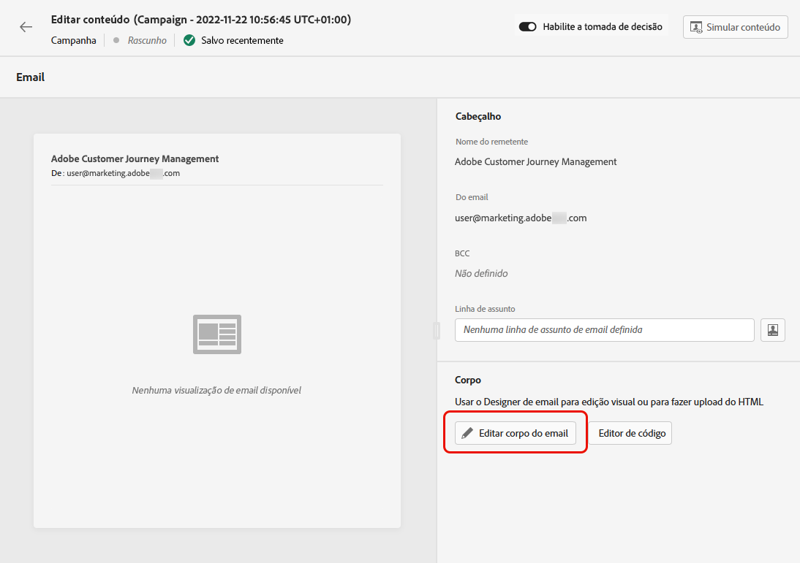

# Criar um email {#create-email}

>[!CONTEXTUALHELP]
>id="ajo_message_email"
>title="Criação de email"
>abstract="Defina seus parâmetros de email em apenas três etapas simples."

Para criar um email em [!DNL Journey Optimizer]siga as etapas abaixo.

## Criar um email em uma jornada ou campanha {#create-email-journey-campaign}

Adicione um **[!UICONTROL Email]** para uma jornada ou campanha e siga as etapas abaixo de acordo com seu caso.

>[!BEGINTABS]

>[!TAB Adicionar um email a uma jornada]

1. Abra a jornada e arraste e solte uma **[!UICONTROL Email]** da **[!UICONTROL Ações]** da paleta.

1. Forneça informações básicas sobre sua mensagem (rótulo, descrição, categoria).

1. Escolha a [superfície do email](email-settings.md) para usar.

   

>[!NOTE]
>
>Se estiver enviando um email de uma jornada, você pode aproveitar o recurso de Otimização de tempo de envio da Adobe Journey Optimizer para prever o melhor momento para enviar a mensagem para maximizar o envolvimento com base nas taxas de abertura e clique do histórico. [Saiba como trabalhar com a Otimização de tempo de envio](../building-journeys/journeys-message.md#send-time-optimization)

Para obter mais informações sobre como configurar uma jornada, consulte [esta página](../building-journeys/journey-gs.md).

>[!TAB Adicionar um email a uma campanha]

1. Crie uma nova campanha agendada ou acionada por API e selecione **[!UICONTROL Email]** como sua ação.

1. Escolha a [superfície do email](email-settings.md) para usar.

   

1. Clique em **[!UICONTROL Criar]**.

1. Complete as etapas para criar uma campanha de email, como as propriedades da campanha, [público](../segment/about-segments.md)e [programação](../campaigns/create-campaign.md#schedule).

   

<!--
From the **[!UICONTROL Action]** section, specify if you want to track how your recipients react to your delivery: you can track email opens, and/or clicks on links and buttons in your email.

-->

Para obter mais informações sobre como configurar uma campanha, consulte [esta página](../campaigns/get-started-with-campaigns.md).

>[!ENDTABS]

## Definir o conteúdo do email {#define-email-content}

1. Na tela de configuração da jornada ou campanha, clique no botão **[!UICONTROL Editar conteúdo]** para configurar o conteúdo do email. [Saiba mais](get-started-email-design.md)

   

1. No **[!UICONTROL Cabeçalho]** da seção **[!UICONTROL Editar conteúdo]** , a **[!UICONTROL Nome de origem]**, **[!UICONTROL Do email]** e **[!UICONTROL CCO]** O campo vem da superfície de email selecionada. [Saiba mais](email-settings.md) <!--check if same for journey-->

   

1. Você pode adicionar uma linha de assunto. Digite o texto simples diretamente no campo correspondente ou use o [Editor de expressão](../personalization/personalization-build-expressions.md) para personalizar a linha de assunto.

1. Clique no botão **[!UICONTROL Editar corpo do email]** botão para começar a criar o conteúdo usando o [!DNL Journey Optimizer] Email Designer. [Saiba mais](get-started-email-design.md)

   

1. Se você estiver em uma campanha, também poderá clicar no link **[!UICONTROL Editor de códigos]** botão para codificar seu próprio conteúdo no plain HTML usando a janela pop-up exibida.

   

   >[!NOTE]
   >
   >Se você já criou ou importou conteúdo por meio do Designer de email, esse conteúdo será exibido no HTML.

## Verificar alertas {#check-email-alerts}

Ao projetar suas mensagens, os alertas são exibidos na interface (na parte superior direita da tela) quando as configurações principais estiverem ausentes.

>[!NOTE]
>
>Se você não vir este botão, nenhum alerta foi detectado.

As configurações e elementos verificados pelo sistema estão listados abaixo. Você também encontrará informações sobre como adaptar sua configuração para resolver os problemas correspondentes.

Dois tipos de alertas podem acontecer:

* **Avisos** consulte recomendações e práticas recomendadas, como:

   * **[!UICONTROL O link para opção de não participação não está presente no corpo do email]**: adicionar um link de unsubscription ao corpo do email é uma prática recomendada. Saiba como configurá-lo em [esta seção](../privacy/opt-out.md#opt-out-management).

      >[!NOTE]
      >
      >As mensagens de email do tipo Marketing devem incluir um link para opção de não participação, que não é necessário para mensagens transacionais. A categoria da mensagem (**[!UICONTROL Marketing]** ou **[!UICONTROL Transacional]**) é definido na variável [superfície do canal](email-settings.md#email-type) nível e quando [criação da mensagem](#create-email-journey-campaign) de uma jornada ou campanha.

   * **[!UICONTROL A versão de texto do HTML está vazia]**: não se esqueça de definir uma versão de texto do corpo do email, pois ela será usada quando o conteúdo do HTML não puder ser exibido. Saiba como criar a versão de texto em [esta seção](text-version-email.md).

   * **[!UICONTROL Link vazio está presente no corpo do email]**: verifique se todos os links no seu email estão corretos. Saiba como gerenciar conteúdo e links no [esta seção](content-from-scratch.md).

   * **[!UICONTROL O tamanho do email excedeu o limite de 100 KB]**: para obter o delivery ideal, verifique se o tamanho do seu email não excede 100 KB. Saiba como editar conteúdo de email no [esta seção](content-from-scratch.md).

* **Erros** impedir que você teste ou ative a jornada/campanha, desde que elas não sejam resolvidas, como:

   * **[!UICONTROL A linha de assunto está ausente]**: a linha de assunto do email é obrigatória. Saiba como defini-lo e personalizá-lo em [esta seção](create-email.md).

   <!--HTML is empty when Amp HTML is present-->

   * **[!UICONTROL A versão de email da mensagem está vazia]**: esse erro é exibido quando o conteúdo do email não foi configurado. Saiba como criar conteúdo de email no [esta seção](get-started-email-design.md).

   * **[!UICONTROL Superfície não existe]**: não será possível usar a mensagem se a superfície selecionada for excluída após a criação da mensagem. Se este erro ocorrer, selecione outra superfície na mensagem **[!UICONTROL Propriedades]**. Saiba mais sobre as superfícies dos canais em [esta seção](../configuration/channel-surfaces.md).

>[!CAUTION]
>
>Para testar ou ativar a jornada/campanha usando o email, você deve resolver todos os **erro** alertas.

## Pré-visualizar e enviar seu email

Após definir o conteúdo da mensagem, é possível pré-visualizá-lo para controlar a renderização do email e verificar as configurações de personalização com perfis de teste. [Saiba mais](preview.md)

Quando o email estiver pronto, conclua a configuração do [jornada](../building-journeys/journey-gs.md) ou [campanha](../campaigns/create-campaign.md)e ativá-la para enviar a mensagem.

>[!NOTE]
>
>Para rastrear o comportamento dos recipients por meio de aberturas e/ou interações de email, verifique se as opções dedicadas na variável **[!UICONTROL Rastreamento]** estão ativadas na jornada [atividade de email](../building-journeys/journeys-message.md) ou no email [campanha](../campaigns/create-campaign.md).<!--to move?-->

<!--

## Define your email content {#email-content}

Use [!DNL Journey Optimizer] Email Designer to [design your email from scratch](../email/content-from-scratch.md). If you have an existing content, you can [import it in the Email Designer](../email/existing-content.md), or [code your own content](../email/code-content.md) in [!DNL Journey Optimizer]. 

[!DNL Journey Optimizer] comes with a set of [built-in templates](email-templates.md) to help you start. Any email can also be saved as a template.

Use [!DNL Journey Optimizer] Expression editor to personalize your messages with profiles' data. For more on personalization, refer to [this section](../personalization/personalize.md).

Adapt the content of your messages to the targeted profiles by using [!DNL Journey Optimizer] dynamic content capabilities. [Get started with dynamic content](../personalization/get-started-dynamic-content.md)

## Email tracking {#email-tracking}

If you want to track the behavior of your recipients through openings and/or clicks on links, enable the following options: **[!UICONTROL Email opens]** and **[!UICONTROL Click on email]**. 

Learn more about tracking in [this section](message-tracking.md).

## Validate your email content {#email-content-validate}

Control the rendering of your email, and check personalization settings with test profiles, using the preview section on the left-hand side. For more on this, refer to [this section](preview.md).

You must also check alerts in the upper section of the editor.  Some of them are simple warnings, but others can prevent you from using the message. 

-->

