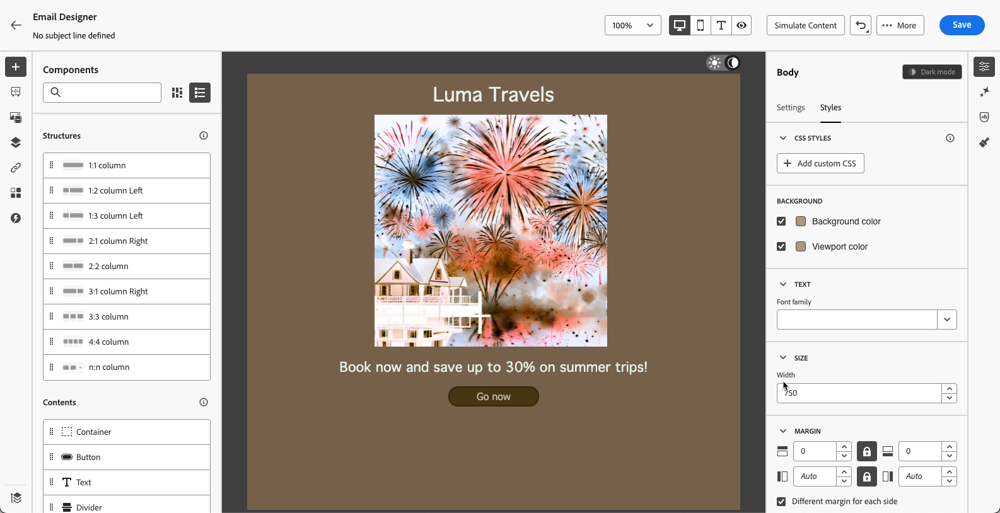

# Definir conteúdo no modo escuro {#dark-mode}

>[!CONTEXTUALHELP]
>id="ac_edition_darkmode"
>title="Alternar para o modo escuro"
>abstract="Alterne para o modo escuro, onde é possível visualizar como ele pode ser renderizado e definir configurações personalizadas específicas.  Cuidado: a renderização final depende do cliente de email do destinatário. Nem todos os clientes de email oferecem suporte ao modo escuro personalizado."

>[!CONTEXTUALHELP]
>id="ac_edition_darkmode_image"
>title="Usar uma imagem específica para o modo escuro"
>abstract="Você pode selecionar outra imagem que será exibida quando o modo escuro estiver ativado.  Cuidado: a adição de uma imagem específica para o modo escuro não garante que ela seja renderizada corretamente em todos os clientes de email. Nem todos os clientes de email oferecem suporte ao modo escuro personalizado."

>[!CONTEXTUALHELP]
>id="ac_edition_darkmode_preview"
>title="Alternar para o modo escuro"
>abstract="Alterne para o modo escuro para visualizar como ele pode ser renderizado no suporte a clientes de email.  Cuidado: a renderização final depende do cliente de email do destinatário. Nem todos os clientes de email oferecem suporte ao modo escuro personalizado."

Ao criar seus emails, o [!DNL Journey Optimizer] [Designer de email](get-started-email-design.md) permite que você alterne para o **[!UICONTROL Modo escuro]**, no qual é possível definir configurações personalizadas específicas. Quando o modo escuro estiver ativado, os clientes de email de suporte exibirão as configurações definidas para esse modo.

>[!WARNING]
>
>A renderização final no modo escuro depende do cliente de email do recipient.
>
>Nem todos os clientes de email oferecem suporte ao modo escuro personalizado. <!--[See the list](#non-supporting-email-clients)-->Além disso, alguns clientes de email aplicam somente seu próprio modo escuro padrão para todos os emails recebidos. Nesse caso, as configurações personalizadas definidas no Designer de email não podem ser renderizadas.

Uma lista de clientes de email que dão suporte ao modo escuro é apresentada em [esta seção](#supporting-email-clients).

## O que é o modo escuro? {#what-is-dark-mode}

O modo escuro permite que clientes e aplicativos de email compatíveis exibam emails com planos de fundo mais escuros e cores mais claras para texto, botões e outros elementos da interface do usuário. Ele permite reduzir a tensão ocular, economizar bateria e melhorar a legibilidade em ambientes com pouca luminosidade, proporcionando uma experiência de visualização mais confortável.

<!--Dark Mode uses a dark color palette with light text and UI elements to reduce eye strain, save battery life, and improve readability in low-light environments.-->

Como uma tendência crescente nos principais sistemas operacionais e aplicativos (Apple Mail, Gmail, Outlook, Twitter, Slack), ela se tornou uma consideração importante no design moderno de email para garantir que o conteúdo permaneça legível e visualmente atraente para todos os usuários.

No entanto, não é possível garantir que seu email terá a mesma aparência no modo escuro em todos os dispositivos. Algumas alterações visuais também podem ser causadas pelo aplicativo de email ou dispositivo que substitui o design original.

Na verdade, a forma como o modo escuro é aplicado pelos clientes de email pode variar da seguinte maneira<!--between different devices and apps-->:

* Nem todos os clientes de email oferecem suporte a esse recurso.

  >[!NOTE]
  >
  >Uma lista de clientes de email que não oferecem suporte ao modo escuro é apresentada em [esta seção](#non-supporting-email-clients).

* Alguns clientes de email ajustam automaticamente cores, planos de fundo e imagens. Nesse caso, se você definir configurações personalizadas no Designer de email, essas configurações provavelmente não serão renderizadas.

* Outros clientes de email oferecem a opção de renderizar o modo escuro personalizado (como com o método `@media (prefers-color-scheme: dark)`). Nesse caso, as configurações específicas definidas no Designer de email devem ser exibidas. Saiba como definir configurações personalizadas do modo escuro no Email Designer em [esta seção](#define-custom-dark-mode).

## Modo escuro no Designer de email {#dark-mode-email-designer}

Quando se trata do modo escuro no Designer de email, há dois aspectos a serem considerados:

* Você pode obter uma visualização de como o modo escuro padrão será renderizado na maioria dos clientes de email de suporte. [Saiba mais](#preview-dark-mode)

<!--
    >[!CAUTION]
    >
    >The final rendering may vary according to the recipient's email client. To see the exact rendering for each email client, use the [Email rendering](../content-management/rendering.md) option.-->

* Se quiser substituir as configurações padrão de clientes de email de suporte, você poderá definir configurações personalizadas no modo escuro aplicáveis ao email que está editando. [Saiba mais](#define-custom-dark-mode)

<!--
    >[!WARNING]
    >
    >Not all email clients support custom dark mode. Some email clients only apply their own default dark mode for all emails that are received. In this case, the custom settings that you defined in the Email Designer cannot be rendered. [Learn more](#guardrails)-->

### Visualizar modo escuro padrão {#preview-dark-mode}

Para acessar o modo escuro no Designer de email e pré-visualizar as configurações padrão do modo escuro, siga as etapas abaixo.

1. Na página inicial do Designer de Email, selecione a opção **[!UICONTROL Design do zero]**. [Saiba mais](content-from-scratch.md)

   >[!NOTE]
   >
   >Atualmente você não pode mudar para o modo escuro se selecionar um [modelo de email](use-email-templates.md) ou se aplicar um [tema](apply-email-themes.md).

1. Adicione [estruturas](content-from-scratch.md) e [componentes de conteúdo](content-components.md) ao seu conteúdo.

1. Na parte superior direita da tela central, alterne para **[!UICONTROL Modo escuro]**.

   

1. A visualização padrão do modo escuro é exibida.

   
<!--
    >[!NOTE]
    >
    >Dark mode applies to all elements, except images and icons.-->

Por padrão, a pré-visualização do modo escuro do Email Designer aplica o esquema de cor &quot;inversão de cor completa&quot; a todos os elementos, exceto imagens e ícones. <!--It fully inverts all colors for all the elements (texts, buttons, etc.)-->

Isso significa que ele detecta áreas com elementos claros e escuros e os inverte, de modo que os planos de fundo claros se tornam escuros e o texto escuro se torna claro, enquanto os planos de fundo escuros se tornam claros e o texto claro se torna escuro.

>[!CAUTION]
>
>A renderização final pode variar de acordo com o cliente de email do recipient. Para ver uma simulação que se aproxime o máximo possível do resultado final de cada cliente de email, use a opção [Renderização de email](../content-management/rendering.md).

<!--This is custom dark mode:

  

Here you can see that we have applied a different background, defined another image and change the color of the text and button.-->

### Definir modo escuro personalizado {#define-custom-dark-mode}

Depois de alternar para o **[!UICONTROL modo escuro]**, você pode optar por editar elementos de estilo específicos do seu conteúdo, que será exibido somente quando o modo escuro estiver habilitado no cliente de email do destinatário, desde que ele seja compatível com esse recurso.

>[!WARNING]
>
>Nem todos os clientes de email oferecem suporte ao modo escuro. Além disso, alguns clientes de email aplicam apenas seu próprio modo escuro padrão para todos os emails recebidos. Em ambos os casos, as configurações personalizadas definidas no Designer de email não podem ser renderizadas.

Para utilizar o estilo de modo escuro personalizado do Designer de email, o Journey Optimizer usa o <!-- `@media (prefers-color-scheme: dark)` method--> Consulta CSS `@media (prefers-color-scheme: dark)`, que detecta se o cliente de email do usuário está definido para o modo escuro e aplica o design de tema escuro definido no seu email.

Para definir configurações personalizadas do modo escuro, siga as etapas abaixo.

1. Verifique se o **[!UICONTROL Modo escuro]** está habilitado no Designer de Email. [Saiba como](#preview-dark-mode)

1. Edite quaisquer atributos de cor de estilo, como texto, planos de fundo, botão etc.

1. Não é possível alterar as cores das imagens e dos ícones, mas você pode definir ativos específicos somente para o modo escuro. Para fazer isso, selecione qualquer imagem. Alterne para o **[!UICONTROL modo escuro]** usando a opção dedicada no painel **[!UICONTROL Configurações]** e selecione um ativo diferente.

   

   <!---->

1. Depois que todas as alterações do modo escuro forem feitas, clique em **[!UICONTROL Simular conteúdo]**.

   

1. Selecione **[!UICONTROL Renderizar email]** e conecte-se à sua conta Litmus. Você pode ver a renderização final do modo escuro para vários clientes de email.

   {width="80%"}

   >[!WARNING]
   >
   >Embora a simulação se aproxime da forma como os emails aparecerão no modo escuro, a renderização real pode ser diferente devido a variações nos provedores de serviços de email ou nas configurações no nível do dispositivo.

## Práticas recomendadas {#best-practices}

À medida que a adoção do modo escuro aumenta nos principais clientes de email, é essencial considerar como seus emails são renderizados em ambientes claros e escuros, esteja você usando o [modo escuro personalizado](#define-custom-dark-mode) ou não.

O modo escuro pode alterar cores, planos de fundo e imagens — às vezes substituindo as opções de design. Para garantir a consistência visual, a acessibilidade e a integridade da marca, siga as práticas recomendadas listadas abaixo.

**Otimize suas imagens e logotipos**

* Evite imagens com fundos brancos ou claros codificados.

* Salve logotipos e ícones como PNGs com fundo transparente para evitar caixas brancas visíveis no modo escuro.

* Se a transparência não for uma opção, coloque as imagens em um plano de fundo sólido no design para evitar inversões de cores estranhas.

**Veja seus planos de fundo**

* Verifique se há contraste suficiente entre o texto e as cores do plano de fundo para facilitar a leitura nos modos claro e escuro.

* Evite depender apenas das cores do plano de fundo para o conteúdo crítico. Alguns clientes substituem as cores do plano de fundo no modo escuro, portanto, verifique se as informações principais ainda estão visíveis.

**Criar conteúdo acessível no modo escuro**

* Use combinações de cores fáceis de distinguir para pessoas com daltonismo.

* Use uma paleta de tons médios para garantir o contraste em planos de fundo claros e escuros.

* Use combinações de cores acessíveis com alto contraste para melhorar a legibilidade e atender aos padrões das Diretrizes de acessibilidade de conteúdo da Web (WCAG). Use ferramentas como o Verificador de contraste do WebAIM para verificar o contraste de cores.

* Evite fontes finas, pois isso pode afetar a legibilidade. Se sua marca requer uma fonte fina, coloque-a em negrito no modo escuro.

* Ignorar branco puro em preto puro, pois pode causar tensão nos olhos e ser automaticamente invertido por alguns clientes de email.

* Fornecer estilo de fallback acessível se o modo escuro não for compatível.

**Testar seus emails no ambiente no modo escuro**

* Use a [visualização de modo escuro](#preview-dark-mode) do Email Designer, que usa esquemas de cores invertidas para detectar problemas antecipadamente.

* Use a opção [Renderização de email](../content-management/rendering.md) que usa o Litmus para simular seus designs nos principais clientes de email (Apple Mail, Gmail, Outlook) e ver como as cores e as imagens se comportam no modo escuro.

<!--**Inline critical styles**

Inline CSS helps maintain more control over styling, as some clients strip external styles in dark mode.-->

## Clientes de email que oferecem suporte ao modo escuro {#supporting-email-clients}

Abaixo está uma lista dos principais clientes de email que oferecem suporte ao modo escuro. No entanto, algumas versões dos clientes de email listados não são compatíveis com o modo escuro, portanto, também são apresentadas nesta tabela para fins de clareza e precisão.

>[!WARNING]
>
>A renderização final no modo escuro depende de cada cliente de email, portanto, os resultados podem variar de um para o outro. Para ver uma simulação que se aproxime o máximo possível do resultado final de cada cliente de email, use a opção [Renderização de email](../content-management/rendering.md).

| Clientes de email que oferecem suporte ao modo escuro | Versões compatíveis | Versões incompatíveis |
|---------|----------|---------|
| Apple Mail macOS | 12.4, 16.0 | *10.3* |
| Apple Mail iOS | 13.0, 16.1 | *12.2* |
| Outlook macOS | 2019, 16.70, 16.80 | N/D |
| Outlook.com | 2019-07, 2022-12 | N/D |
| Outlook iOS | 2020-01, 2022-12 | N/D |
| Outlook Android | 2023-03 | *2020-01, 2022-12* |
| Email da Samsung (Android) | 6,1 | *6.0* |
| Mozilla Thunderbird (macOS) | 68,4 | *60.8, 78.5, 91.13* |
| Fastmail (Webmail Para Desktop) | 2022-2012 | *2021-07* |
| EI (Webmail para desktop) | 2020-06 | *2022-12* |
| Webmail para desktop laranja | 2019-08, 2021-03, 2022-12, 2024-04 | N/D |
| IOS Laranja | 2022-12, 2024-04 | *1* de 2020 |
| Android Laranja | 2024-04 | *2020-01, 2022-12* |
| LaPoste.net | 2021-08, 2022-12 | N/D |
| Webmail para desktop SFR | 2019-08, 2022-12 | N/D |
| GMX (iOs e Android) | 2022-06 | N/D |
| 1&amp;1 (Webmail da área de trabalho e Android) | 2022-06 | N/D |
| WEB.DE (iOs e Android) | 2022-06 | N/D |
| Free.fr | 2022-2012 | N/D |

<!--
* Check out the list of [email clients supporting dark mode](https://www.caniemail.com/search/?s=dark){target="_blank"}

* Learn more on Dark mode in this [Litmus blog post](https://www.litmus.com/blog/the-ultimate-guide-to-dark-mode-for-email-marketers){target="_blank"}
-->

## Os clientes de e-mail NÃO suportam o modo escuro {#non-supporting-email-clients}

Alguns clientes de email permitem que os usuários alternem sua interface para o modo escuro, mas essa configuração não afeta a forma como os emails do HTML são exibidos. Independentemente de a interface estar no modo claro ou escuro, seu email será renderizado da mesma forma. Esta é uma lista desses clientes:

| Clientes de email que não oferecem suporte ao modo escuro |
|---------|
| Gmail (Webmail Para Desktop, iOS, Android, Webmail Para Dispositivos Móveis) |
| Windows do Outlook |
| Outlook Windows Mail |
| Yahoo!Mail |
| AOL |
| ProtonMail |
| IOS SFR |
| ANDROID SFR |
| Webmail para desktop GMX |
| Mail.ru |
| Webmail da área de trabalho do WEB.DE |
| T-online.de |