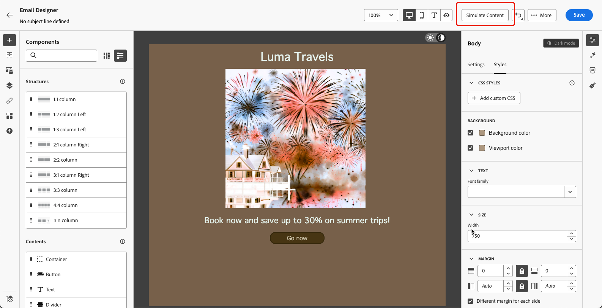

# Gerenciar conteúdo no modo escuro {#dark-mode}

>[!CONTEXTUALHELP]
>id="ac_edition_darkmode"
>title="Alternar para o modo escuro"
>abstract="Alterne para o modo escuro, onde é possível visualizar como ele pode ser renderizado e definir configurações personalizadas específicas.  A renderização final depende do cliente de email do destinatário. Observe que todos os clientes de email não são compatíveis com o modo escuro personalizado."

>[!CONTEXTUALHELP]
>id="ac_edition_darkmode_preview"
>title="Alternar para o modo escuro"
>abstract="Alterne para o modo escuro para visualizar a renderização nos clientes de email compatíveis.  A renderização final depende do cliente de email do destinatário. Observe que todos os clientes de email não são compatíveis com o modo escuro."

Ao criar seus emails, o [!DNL Journey Optimizer] [Designer de Email](get-started-email-design.md) permite que você alterne para a exibição **[!UICONTROL Modo escuro]**.

Nesta exibição de modo escuro do <!--Email Designer -->você também pode definir configurações personalizadas específicas que serão exibidas pelos clientes de email de suporte quando o modo escuro estiver ativado.

<!--When designing your emails, the Journey Optimizer Email Designer allows you to switch to Dark mode where you can define specific custom settings. When dark mode is on, the supporting email clients will display the settings that you defined for this mode.-->

## O que é o modo escuro? {#what-is-dark-mode}

A forma como o modo escuro é renderizado nos vários clientes de email é complexa. Primeiro, vamos definir o modo escuro.

O modo escuro permite que os clientes e aplicativos de email de suporte exibam emails com planos de fundo mais escuros e cores mais claras para texto, botões e outros elementos da interface do usuário. Ele permite reduzir a tensão ocular, economizar bateria e melhorar a legibilidade em ambientes com pouca luminosidade, proporcionando uma experiência de visualização mais confortável.

<!--Dark Mode uses a dark color palette with light text and UI elements to reduce eye strain, save battery life, and improve readability in low-light environments.-->

Como uma tendência crescente nos principais sistemas operacionais e aplicativos<!-- (Apple Mail, Gmail, Outlook, Twitter, Slack)-->, ela se tornou uma consideração importante no design de email moderno para garantir que o conteúdo permaneça legível e visualmente atraente para todos os usuários.

## Medidas de proteção {#guardrails}

As expectativas em termos de renderização no modo escuro devem ser consideradas com cautela, pois a forma como ela é aplicada pelos diferentes clientes de email pode variar bastante.

<!--The dark mode final rendering depends on the recipient's email client. It is not possible to guarantee that your email will look the same in dark mode across all devices.-->

Antes de usar o modo escuro no Designer de email do [!DNL Journey Optimizer], é fundamental entender como os principais clientes de email lidam com ele. Há três casos a distinguir:

<!--
* Check out the list of [email clients supporting dark mode](https://www.caniemail.com/search/?s=dark){target="_blank"}

* Learn more on Dark mode in this [Litmus blog post](https://www.litmus.com/blog/the-ultimate-guide-to-dark-mode-for-email-marketers){target="_blank"}
-->

### Clientes sem suporte para o modo escuro {#not-supporting}

Alguns clientes de email não oferecem suporte a esse recurso, como:

* Yahoo!Mail
* AOL

Se você definir configurações personalizadas de modo escuro ou não no Email Designer, esses clientes de email nunca exibirão renderização de modo escuro. <!--Regardless of whether the interface is in light or dark mode, your email will render the same.-->

### Clientes que aplicam seu próprio modo escuro {#default-support}

Alguns clientes de email aplicam sistematicamente seu próprio modo escuro padrão para todos os emails recebidos. Cores, planos de fundo, imagens etc. são automaticamente ajustadas com as configurações do modo escuro específicas do cliente de email, o que significa que nenhuma modificação externa é possível.

<!--It is important to note that less than 25% of email clients offer customization options for dark mode. Clients such as Gmail implement their own dark mode rendering, which is not subject to external modification.-->

Esses clientes são, por exemplo:

* Gmail (Webmail Para Desktop, iOS, Android, Webmail Para Dispositivos Móveis)
* Windows do Outlook
* Outlook Windows Mail

Nesse caso, se você definir configurações personalizadas do modo escuro no Designer de email, essas configurações serão substituídas pelas configurações do cliente de email.

É importante entender que esses clientes de email lidam com o modo escuro, mas o design específico do modo escuro não será renderizado.

<!--In this case, the custom settings that you defined in the Email Designer cannot be rendered.-->

<!--Some visual changes may also be caused by the email app or device overriding the original design.-->

### Clientes que oferecem suporte ao modo escuro personalizado {#custom-support}

Outros clientes de email oferecem a opção de renderizar o modo escuro personalizado com a consulta `@media (prefers-color-scheme: dark)`, que é o método usado pelo Designer de Email [!DNL Journey Optimizer].

Esta é uma lista dos principais clientes que lidam com essa opção:

* Apple Mail macOS
* Apple Mail iOS
* Outlook macOS
* Outlook.com
* Outlook iOS
* Outlook Android

Nesse caso, as configurações específicas definidas no Designer de email devem ser exibidas.

>[!NOTE]
>
>Saiba como definir configurações personalizadas do modo escuro com o Email Designer em [esta seção](#define-custom-dark-mode).

No entanto, algumas restrições podem se aplicar de acordo com cada cliente de email. Por exemplo, alguns clientes, como o Apple Mail 16 (macOs 13), não gerarão o modo escuro se as imagens estiverem presentes no conteúdo de email.

Para obter os melhores resultados, teste seu conteúdo com os clientes de email que você está direcionando. Para ver uma simulação que se aproxime o máximo possível do resultado final para cada cliente, use a opção [Renderização de email](../content-management/rendering.md) no Designer de email.

## Modo escuro no designer de email {#dark-mode-email-designer}

Quando se trata do modo escuro no Designer de email, há dois aspectos a serem considerados:

* Você pode obter uma visualização de como o modo escuro padrão será renderizado na maioria dos clientes de email de suporte. [Saiba mais](#preview-dark-mode)

<!--
    >[!CAUTION]
    >
    >The final rendering may vary according to the recipient's email client. To see the exact rendering for each email client, use the [Email rendering](../content-management/rendering.md) option.-->

* Se quiser substituir as configurações padrão de clientes de email de suporte, você poderá definir configurações personalizadas no modo escuro aplicáveis ao email que está editando. [Saiba mais](#define-custom-dark-mode)

<!--
    >[!WARNING]
    >
    >Not all email clients support custom dark mode. Some email clients only apply their own default dark mode for all emails that are received. In this case, the custom settings that you defined in the Email Designer cannot be rendered. [Learn more](#guardrails)-->

### Visualizar modo escuro padrão {#preview-dark-mode}

Para acessar o modo escuro no Designer de email e pré-visualizar as configurações padrão do modo escuro, siga as etapas abaixo.

1. Na página inicial do Designer de Email, selecione a opção **[!UICONTROL Design do zero]**. [Saiba mais](content-from-scratch.md)

<!--Should work with templates and themes, NOT for LP and fragments - but TBC with eng.
    >[!NOTE]
    >
    >Currently you may not be able to switch to dark mode if you select an [email template](use-email-templates.md) or if you apply a [theme](apply-email-themes.md).-->

1. Adicione [estruturas](content-from-scratch.md) e [componentes de conteúdo](content-components.md) ao seu conteúdo.

1. Na parte superior direita da tela central, alterne para **[!UICONTROL Modo escuro]**.

   

1. A visualização padrão do modo escuro é exibida.

   

Por padrão, a pré-visualização do modo escuro do Email Designer aplica o esquema de cor &quot;inversão de cor completa&quot; a todos os elementos, exceto imagens e ícones.

Isso significa que ele detecta áreas com elementos claros e escuros e os inverte, de modo que os planos de fundo claros se tornam escuros e o texto escuro se torna claro, enquanto os planos de fundo escuros se tornam claros e o texto claro se torna escuro.

>[!CAUTION]
>
>A renderização final pode variar de acordo com o cliente de email do recipient. Para ver uma simulação que se aproxime o máximo possível do resultado final de cada cliente de email, use a opção [Renderização de email](../content-management/rendering.md).

<!--This is custom dark mode:

  

Here you can see that we have applied a different background, defined another image and change the color of the text and button.-->

### Definir modo escuro personalizado {#define-custom-dark-mode}

>[!CONTEXTUALHELP]
>id="ac_edition_darkmode_image"
>title="Usar uma imagem específica para o modo escuro"
>abstract="Você pode selecionar outra imagem a ser exibida quando o modo escuro estiver ativado.  A adição de uma imagem específica para o modo escuro não garante sua renderização correta em todos os clientes de email. Observe que todos os clientes de email não são compatíveis com o modo escuro personalizado."

Depois de alternar para o **[!UICONTROL modo escuro]**, você pode optar por editar elementos de estilo específicos do seu conteúdo, que será exibido somente quando o modo escuro estiver habilitado no cliente de email do destinatário, desde que ele seja compatível com esse recurso.

>[!WARNING]
>
>A renderização final no modo escuro depende de cada cliente de email, portanto, os resultados podem variar de um para o outro. [Saiba mais](#guardrails)

<!--
>[!WARNING]
>
>Not all email clients support dark mode. Moreover, some email clients only apply their own default dark mode for all emails that are received. In both cases, the custom settings that you defined in the Email Designer cannot be rendered.-->

Para utilizar o estilo de modo escuro personalizado do Designer de email, o Journey Optimizer usa o <!-- `@media (prefers-color-scheme: dark)` method--> Consulta CSS `@media (prefers-color-scheme: dark)`, que detecta se o cliente de email do usuário está definido para o modo escuro e aplica o design de tema escuro definido no seu email.

Para definir configurações personalizadas do modo escuro, siga as etapas abaixo.

1. Alterne para a visualização do **[!UICONTROL Modo escuro]** no Designer de email. [Saiba como](#preview-dark-mode)

1. Edite quaisquer atributos de cor de estilo, como texto, planos de fundo, botão etc.

1. Não é possível alterar as cores das imagens e dos ícones, mas você pode definir ativos específicos somente para o modo escuro. Para fazer isso, selecione qualquer imagem. Alterne para o **[!UICONTROL modo escuro]** usando a opção dedicada no painel **[!UICONTROL Configurações]** e selecione um ativo diferente.

   

   <!---->

1. A qualquer momento, você pode **[!UICONTROL Alternar para o modo de exibição ativo]** para verificar como o conteúdo pode ser renderizado em vários tamanhos de dispositivo. Nesta exibição, selecione o botão Modo escuro na parte superior da tela para visualizar a versão em modo escuro do seu conteúdo em diferentes dispositivos.

   {width="80%" align="center"}

   >[!CAUTION]
   >
   >A visualização em tempo real é uma visualização genérica criada para comparar a aparência da renderização em vários tamanhos de dispositivo. A renderização final pode variar de acordo com o cliente de email do recipient.

1. Quando estiver satisfeito com as alterações do modo escuro, clique em **[!UICONTROL Simular Conteúdo]**.

   

1. Selecione **[!UICONTROL Renderizar email]** e conecte-se à sua conta Litmus. Você pode ver a renderização final do modo escuro para vários clientes de email. Saiba mais sobre [Renderização de email](../content-management/rendering.md).

   >[!WARNING]
   >
   >Embora a simulação se aproxime da forma como os emails aparecerão no modo escuro, a renderização real pode ser diferente devido a variações nos provedores de serviços de email ou nas configurações no nível do dispositivo.

## Práticas recomendadas {#best-practices}

À medida que a adoção do modo escuro aumenta nos principais clientes de email, é essencial considerar como seus emails são renderizados em ambientes claros e escuros, esteja você usando o [modo escuro personalizado](#define-custom-dark-mode) ou não.

O modo escuro pode alterar cores, planos de fundo e imagens — às vezes substituindo as opções de design. Para garantir a consistência visual, a acessibilidade e a integridade da marca, siga as práticas recomendadas listadas abaixo.

**Otimize suas imagens e logotipos**

* Salve logotipos e ícones como PNGs com fundo transparente para evitar caixas brancas visíveis no modo escuro.

* Evite imagens com fundos brancos ou claros codificados.

* Se a transparência não for uma opção, coloque as imagens em um plano de fundo sólido no design para evitar inversões de cores estranhas.

**Veja seus planos de fundo**

* Verifique se há contraste suficiente entre o texto e as cores do plano de fundo para facilitar a leitura nos modos claro e escuro.

* Evite depender apenas das cores do plano de fundo para o conteúdo crítico. Alguns clientes substituem as cores do plano de fundo no modo escuro, portanto, verifique se as informações principais ainda estão visíveis.

<!--**Inline critical styles**

Inline CSS helps maintain more control over styling, as some clients strip external styles in dark mode.-->

**Criar conteúdo acessível no modo escuro**

<!--KEEP dark mode accessibility best practices IN ONE SINGLE LOCATION - for now listed on this page.
If needed, it can be moved to the Design accessible content page:
The best practices for designing accesible content in dark mode are listed in [this section](accessible-content.md#dark-mode).-->

* Use combinações de cores fáceis de distinguir para pessoas com daltonismo.

* Use uma paleta de tons médios para garantir o contraste em planos de fundo claros e escuros.

* Use combinações de cores acessíveis com alto contraste para melhorar a legibilidade e atender aos padrões das Diretrizes de acessibilidade de conteúdo da Web (WCAG). Use ferramentas como o Verificador de contraste do WebAIM para verificar o contraste de cores.

* Evite fontes finas, pois isso pode afetar a legibilidade. Se sua marca requer uma fonte fina, coloque-a em negrito no modo escuro.

* Ignorar branco puro em preto puro, pois pode causar tensão nos olhos e ser automaticamente invertido por alguns clientes de email.

* Fornecer estilo de fallback acessível se o modo escuro não for compatível.

**Testar seus emails no ambiente no modo escuro**

* Use a [visualização de modo escuro](#preview-dark-mode) do Email Designer, que usa esquemas de cores invertidas para detectar problemas antecipadamente.

* Use a opção [Renderização de email](../content-management/rendering.md) que usa o Litmus para simular seus designs nos principais clientes de email (Apple Mail, Gmail, Outlook) e ver como as cores e as imagens se comportam no modo escuro.

<!--

## Email clients supporting dark mode {#supporting-email-clients}

Below is a list of the main email clients supporting dark mode using the with the `@media (prefers-color-scheme: dark)` query.

>[!NOTE]
>
>Some versions of these email clients do not support dark mode, so they are also presented in this table for the sake of clarity.

| Email clients supporting custom dark mode| Compatible versions | *Unsupported versions* |
|---------|----------|---------|
| Apple Mail macOS| 12.4, 16.0 | *10.3* |
| Apple Mail iOS | 13.0, 16.1 | *12.2* |
| Outloook macOS | 2019, 16.70, 16.80 | NA |
| Outlook.com | 2019-07, 2022-12 | NA |
| Outloook iOS | 2020-01, 2022-12 | NA |
| Outloook Android | 2023-03 | *2020-01, 2022-12* |

| Other email clients supporting custom dark mode| Compatible versions | *Unsupported versions* |
|---------|----------|---------|
| Samsung Email (Android) | 6.1 | *6.0* |
| Mozilla Thunderbird (macOS) | 68.4 | *60.8, 78.5, 91.13* |
| Fastmail (Desktop Webmail)| 2022-12 | *2021-07* |
| HEY (Desktop Webmail)| 2020-06 | *2022-12* |
| Orange Desktop Webmail| 2019-08, 2021-03, 2022-12, 2024-04 | NA |
| Orange iOS | 2022-12, 2024-04 | *2020-01* |
| Orange Android | 2024-04 | *2020-01, 2022-12* |
| LaPoste.net | 2021-08, 2022-12 | NA |
| SFR  Desktop Webmail | 2019-08, 2022-12 | NA |
| GMX (iOs and Android) | 2022-06 | NA |
| 1&1 (Desktop Webmail and Android) | 2022-06 | NA |
| WEB.DE (iOs and Android) | 2022-06 | NA |
| Free.fr | 2022-12 | NA |

>[!WARNING]
>
>The dark mode final rendering depends on each email client, so results can vary from one to another.

## Email clients not supporting dark mode {#non-supporting-email-clients}

Some email clients allow users to switch their interface to dark mode, but this setting does not affect how HTML emails are displayed.  Here is a list of those clients:

| Main email clients with their own dark mode| 
|---------|
| Gmail (Desktop Webmail, iOS, Android, Mobile Webmail) | 
| Outloook Windows |
| Outlook Windows Mail |

Other email clients do not support dark mode at all:

| Main email clients not supporting dark mode| 
|---------|
| Yahoo!Mail | 
| AOL | 

| Other mail clients not supporting dark mode| 
|---------|
| ProtonMail |
| SFR iOS |
| SFR Android | 
| GMX Desktop Webmail | 
| Mail.ru | 
| WEB.DE Desktop Webmail | 
| T-online.de |

-->