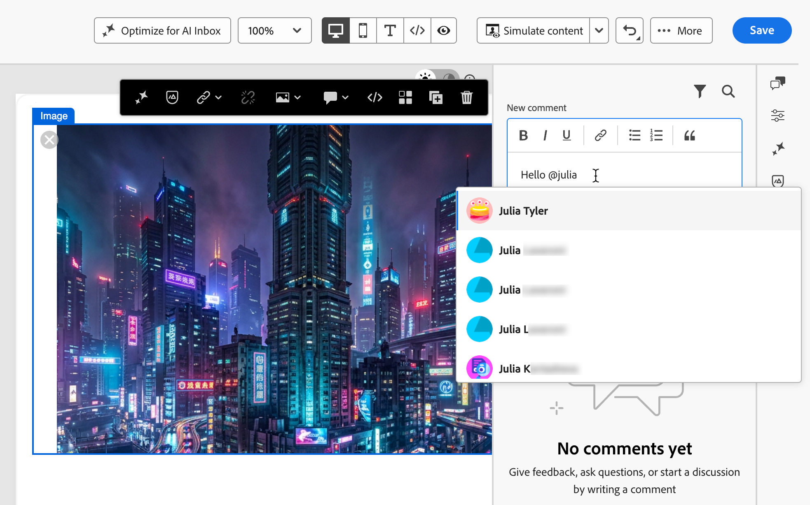
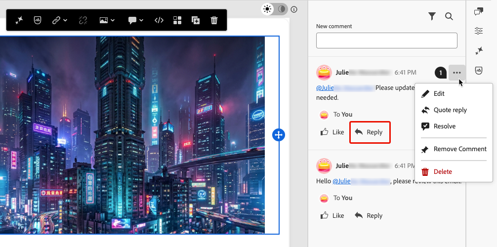
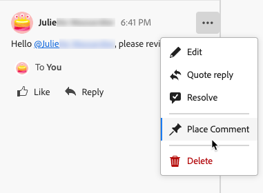
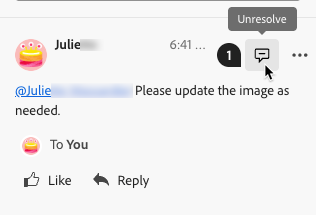

# Colaborar em conteúdo de email no Designer de email {#email-collaboration}

>[!CONTEXTUALHELP]
>id="ajo_email_collaboration"
>title="Colaborar em seus emails"
>abstract="Adicione comentários, revisores de tags e rastreie comentários diretamente no Designer de email, sem sair da experiência de criação."

O Designer de Email inclui ferramentas de colaboração para comentários e resolução, para que as equipes de marketing possam revisar, discutir e finalizar conteúdo de email diretamente no [!DNL Journey Optimizer]. Em vez de compartilhar rascunhos por meio de ferramentas externas (como bate-papo, threads de email ou planilhas), os usuários podem comentar, sugerir edições e resolver comentários no Designer de email. Use essas ferramentas para simplificar seu fluxo de trabalho, reduzir erros e garantir que as partes interessadas estejam alinhadas antes de iniciar seu email.

* **Feedback centralizado** - Colete e acompanhe todos os comentários em um único local.
* **Resenhas mais rápidas** - Os colaboradores podem revisar a cópia do email e os ativos dentro do ambiente de criação.
* **Precisão aprimorada** - Reduz o risco de má comunicação ao manter todas as edições vinculadas ao próprio email.
* **Transparência** - Todos os comentários e resoluções permanecem registrados, deixando claro quais alterações foram sugeridas e implementadas.
* **Collaboration no contexto** - Revise a cópia do corpo do email, as imagens e os elementos do call-to-action (CTA) no layout.

<!--Check if like some other collaboration workflows, specific permission is required to use the collaboration tools in the Email Designer.-->

## Exibir comentários e ferramentas de colaboração {#access-collaboration}

Ao criar, editar ou revisar conteúdo no Designer de email, você pode acessar o painel **[!UICONTROL Collaboration]** para adicionar ou gerenciar comentários para o conteúdo do email.

Clique no ícone **[!UICONTROL Collaboration]** na navegação à direita.

{width="90%"}

## Fluxo de trabalho do Collaboration {#collaboration-workflow}

Você pode usar as ferramentas de colaboração para seguir um fluxo de trabalho de conteúdo padrão:

1. **Convide** seus colaboradores e revisores.
1. **Revisores** adicionam comentários.
1. Leia comentários, **adicione respostas** para discutir comentários e fazer as edições necessárias.
1. **Revisores ou autores** resolvem comentários.

### Práticas recomendadas para usar as ferramentas de colaboração {#best-practices}

* Use a marcação **@** para que o feedback chegue rapidamente ao membro certo da equipe.
* Agrupe o feedback relacionado em uma única thread de comentário em vez de várias notas dispersas.
* Sempre resolva os comentários assim que forem endereçados, para manter um fluxo de trabalho limpo.
* Salvar uma versão final aprovada para fins de conformidade/auditoria.

## Convidar colaboradores e revisores {#invite-collaborators}

Você pode convidar colaboradores e revisores para fornecer feedback sobre o seu conteúdo de email ou adicionar qualquer comentário que possa ser relevante para o fluxo de trabalho de design de email. Siga as etapas abaixo.

1. Selecione o corpo do email para inserir um comentário geral sobre o conteúdo do email.
1. Clique no ícone **[!UICONTROL Collaboration]** na navegação à direita.
1. Na parte superior do painel direito, digite o texto do convite para que os usuários colaborem e forneçam feedback.
1. Use o símbolo **@** para endereçar e notificar os usuários. Esses usuários recebem notificações por email e no produto [!DNL Pulse].

   Ao inserir as primeiras letras do nome após o símbolo, uma lista pop-up exibe os nomes de usuário correspondentes. Você pode inserir mais letras no nome para melhorar os resultados.

   {width="90%"}

1. Selecione o nome a ser adicionado para notificação. Adicione quantos colaboradores ou revisores desejar incluir no convite.

   {width="90%"}

1. Clique em **[!UICONTROL Enviar]**.

Cada novo comentário inicia um thread em que os colaboradores podem usar **[!UICONTROL Responder]** para continuar a discussão. Cada comentário/thread associado a um elemento de design é numerado para que você possa identificar facilmente o elemento no qual se aplica.

### Comentários do componente {#component-comments}

1. Selecione uma estrutura ou um componente de conteúdo.
1. Na barra de ferramentas, clique na ferramenta **[!UICONTROL Collaboration]**.

   {width="80%"}

1. Insira seu comentário no campo de texto.
1. Clique em **[!UICONTROL Enviar]**.

Os colaboradores podem clicar no ícone de pino numerado na tela de email para exibir o comentário.

## Responder a um comentário {#reply-to-comment}

Para cada comentário, você pode usar a função **[!UICONTROL Responder]** para continuar uma discussão ou responder a uma pergunta.

Clique em **[!UICONTROL Responder]** na parte inferior do comentário e digite o texto da sua resposta. Para incluir uma citação do comentário atual em sua resposta, clique no ícone **[!UICONTROL Mais menu]** (...) e escolha **[!UICONTROL Citar resposta]**.

{width="100%"}

## Resolver comentários {#resolve-comments}

Como autor ou designer, avalie o feedback dos revisores e determine quais alterações você deseja fazer. Quando as alterações forem concluídas e a solicitação for atendida, clique no ícone **[!UICONTROL Mais menu]** (...) e escolha **[!UICONTROL Resolver]**.

{width="100%"}

Depois de resolvido, o comentário/thread fica oculto na exibição principal, mas pode ser acessado por meio das opções de filtro.

## Gerenciar comentários {#manage-comments}

Gerencie os comentários e threads para avaliar o status do seu esforço de colaboração.

### Inserir um comentário {#place-comment}

Se um comentário não estiver associado a um elemento na tela de email, você poderá fixá-lo a um elemento, conforme necessário. Clique no ícone **[!UICONTROL Mais menu]** (...) e escolha **[!UICONTROL Inserir comentário]**. Em seguida, selecione o componente de design na tela.

{width="60%"}

### Remover ou excluir comentários {#remove-delete-comments}

Você pode limpar o registro de comentários removendo e excluindo-os. Clique no ícone **[!UICONTROL Mais menu]** (...) e escolha **[!UICONTROL Remover Comentário]** ou **[!UICONTROL Excluir]**.

* Quando você remove um comentário, a ação desvincula esse comentário do elemento de design (selecionado quando o comentário foi criado). O comentário ainda faz parte do registro de comentário do email.
* Quando você exclui um comentário, a ação o exclui permanentemente do registro.

### Comentários resolvidos {#resolved-comments}

Por padrão, comentários resolvidos ficam ocultos no painel **[!UICONTROL Collaboration]**. É possível exibir comentários resolvidos a qualquer momento, limpando o filtro. Clique no ícone **[!UICONTROL Filtro]** e desmarque a caixa de seleção **[!UICONTROL Ocultar comentários resolvidos]**.

{width="60%"}

Os comentários resolvidos incluem um ícone **[!UICONTROL Não resolver]**. Se você determinar que um comentário/thread não foi resolvido e outras alterações forem necessárias, clique no ícone para remover a designação **[!UICONTROL Resolvido]**.

{width="60%"}
