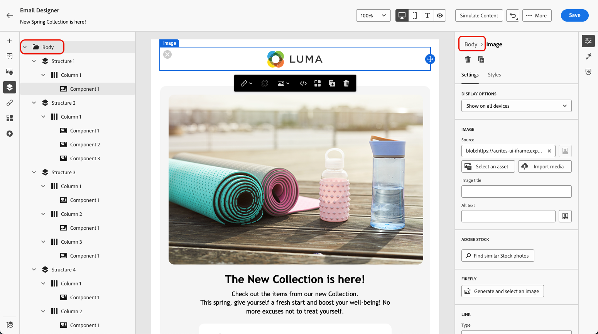

# Adicionar metadados ao conteúdo do email {#email-metadata}

>[!CONTEXTUALHELP]
>id="ac_edition_preheader"
>title="Definir um pré-cabeçalho"
>abstract="Pré-cabeçalho é um texto resumido e curto que sucede ao assunto quando visualizamos o email no cliente de email. Em muitos casos, fornece um breve resumo do email e, normalmente, tem apenas uma frase."

Ao criar seus emails, para melhorar a legibilidade e a acessibilidade, você pode definir metaatributos adicionais para o seu conteúdo. O [!DNL Journey Optimizer] [Designer de email](get-started-email-design.md) permite que você especifique os seguintes elementos:

* **[!UICONTROL Pré-cabeçalho]**: um pré-cabeçalho é um texto curto de resumo que segue a linha de assunto ao visualizar um email do seu cliente de email. Em muitos casos, fornece um breve resumo do email e, normalmente, tem apenas uma frase.

  >[!NOTE]
  >
  >Os pré-cabeçalhos não são compatíveis com todos os clientes de email. Quando não é compatível, o pré-cabeçalho não é exibido.

* **[!UICONTROL Título do documento]**: este campo, que corresponde ao elemento `<title>`, fornece informações descritivas sobre o seu conteúdo de email, geralmente exibido como uma dica de ferramenta ao passar o mouse. Ele pode ajudar os usuários com deficiência fornecendo contexto adicional e pode contribuir para uma melhor compreensão do seu conteúdo por mecanismos de pesquisa.

* **[!UICONTROL Idioma do documento]**: para garantir a acessibilidade, você pode especificar o idioma que os leitores de tela usarão para converter texto e imagens em fala ou braille - para pessoas com deficiências visuais ou dificuldades de aprendizagem. Esta configuração corresponde ao atributo `lang` no elemento `<html>`.

Para definir essas configurações, siga as etapas abaixo.

1. No [Designer de email](content-from-scratch.md), adicione pelo menos um **[!UICONTROL componente de Estrutura]** para começar a criar seu email.

1. Clique em **[!UICONTROL Corpo]**, na **[!UICONTROL Árvore de navegação]** à esquerda ou na parte superior do painel direito.

   

1. Na guia **[!UICONTROL Configurações]**, digite algum texto dentro dos campos **[!UICONTROL Pré-cabeçalho]**, **[!UICONTROL Título do documento]** e/ou **[!UICONTROL Idioma do documento]**.

1. Você também pode clicar no ícone de personalização ao lado de cada campo para personalizar o conteúdo de atributos de perfil, públicos, atributos contextuais e muito mais. [Saiba mais sobre a personalização](../personalization/personalization-build-expressions.md)

   

1. Clique em **[!UICONTROL Salvar]** para confirmar as alterações.