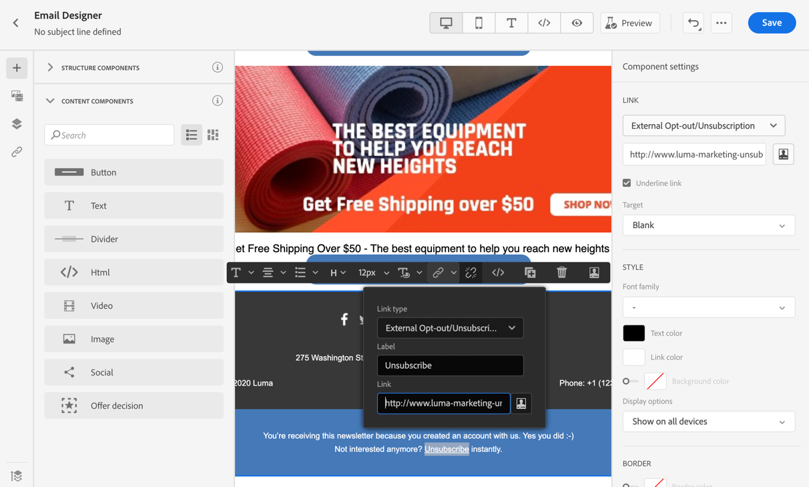

# Gerenciamento de opção de não participação de email {#email-opt-out}

Ao enviar mensagens de jornadas ou campanhas, você deve sempre garantir que os clientes possam cancelar a inscrição de comunicações futuras. Após o cancelamento da assinatura, os perfis serão removidos automaticamente do público-alvo de futuras mensagens de marketing.  [Saiba mais sobre privacidade e gerenciamento de recusa](../privacy/opt-out.md)

>[!NOTE]
>
>Todas as suas mensagens de marketing devem incluir um link para opção de não participação. Isso não é necessário para mensagens transacionais. A categoria da mensagem - **[!UICONTROL Marketing]** ou **[!UICONTROL Transacional]** - está definido no [superfície de canal](../configuration/channel-surfaces.md#email-type) e ao criar a mensagem.

Para inserir um link de cancelamento de subscrição no seu conteúdo de email, você pode:

* Adicione um URL de cancelamento de inscrição com um clique no cabeçalho do email. Habilitando o **[!UICONTROL Cabeçalho de lista-cancelamento de inscrição]** no nível da superfície de canal adiciona um link para opção de não participação no cabeçalho do email. [Saiba mais sobre a opção de não participação no cabeçalho do email](#unsubscribe-header)

* Ativar o **link para opção de não participação com um clique** para seu email.  [Saiba como adicionar um link para opção de não participação com um clique](#one-click-opt-out)

* Inserir um **link para uma landing page**. [Saiba como adicionar uma página de aterrissagem de recusa](#opt-out-external-lp)


## Recusa em uma etapa {#opt-out-one-step}

### URL para cancelar inscrição com um clique no cabeçalho do email {#unsubscribe-header}

<!--Do not modify - Legal Review Done -->

>[!CONTEXTUALHELP]
>id="ajo_admin_preset_unsubscribe"
>title="Adicionar URL de cancelamento de inscrição no cabeçalho do email"
>abstract="Ative o cabeçalho Lista-Cancelar inscrição para adicionar um URL de cancelamento de inscrição no cabeçalho do email. Para definir um URL para cancelar a inscrição, insira um link para opção de não participação de um clique no conteúdo da mensagem de email."
>additional-url="https://experienceleague.adobe.com/docs/journey-optimizer/using/privacy/consent/opt-out.html?lang=pt-BR#one-click-opt-out" text="Recusar com um clique"

O URL para cancelar a inscrição da lista com um clique é um link ou botão para cancelar a inscrição exibido ao lado das informações do remetente do email e permite que os destinatários excluam instantaneamente suas listas de endereçamento com um único clique. No Adobe Journey Optimizer, quando a variável **Ativar lista-Cancelar inscrição** estiver ativada, o cabeçalho do e-mail incluirá um mailto e/ou um URL por padrão que os recipients podem usar para cancelar a inscrição da sua lista de mala direta.

A variável [Ativar lista-Cancelar inscrição](email-settings.md#list-unsubscribe) o botão deve ser ativado no nível da superfície de canal para que os emails que usam essa superfície incluam o URL de cancelamento de inscrição de um clique no cabeçalho do email.

>[!NOTE]
>
>Para exibir o URL de cancelamento de inscrição com um clique no cabeçalho do email, o cliente de email dos destinatários deve ser compatível com esse recurso.


Por exemplo, o URL de cancelamento de inscrição com um clique exibe um link de cancelamento de inscrição como este no Gmail:


Com o Adobe Journey Optimizer, você pode definir as configurações de superfície de email com um URL de cancelamento de inscrição de um clique e um endereço mailto gerados automaticamente no cabeçalho do email, ou incluir um URL de recusa de um clique no corpo do email: quando um recipient clica no link de recusa de um clique, a solicitação de cancelamento de inscrição do recipient é processada adequadamente.

>[!AVAILABILITY]
>
>O cabeçalho de URL para cancelamento de inscrição com um clique estará disponível no Adobe Journey Optimizer a partir de 3 de junho de 2024.
>

Dependendo do cliente de e-mail e da [configurações de cancelamento de inscrição da superfície de email](email-settings.md#list-unsubscribe), clicar no link de cancelamento de inscrição no cabeçalho do email terá um dos seguintes resultados:

* Quando a variável **Mailto (cancelar inscrição)** for ativado por você, a solicitação de cancelamento de inscrição será enviada para o endereço de cancelamento de inscrição padrão com base no subdomínio criado por você.
* Quando a variável **URL para cancelar inscrição com um clique** O recurso é ativado por você - ou se você inseriu um URL de cancelamento de subscrição no conteúdo do corpo do email -, o recipient recebe recusa diretamente, no nível do canal ou no nível de ID (dependendo de como o consentimento é configurado), quando clica no URL de cancelamento de subscrição de um clique, que se baseia no subdomínio criado por você.

Em ambos os casos, o perfil correspondente do recipient é cancelado imediatamente e essa escolha é atualizada no Experience Platform. Saiba mais na [Documentação do Experience Platform](https://experienceleague.adobe.com/docs/experience-platform/profile/ui/user-guide.html?lang=pt-BR#getting-started){target="_blank"}.

Se você ativou Ativar no que diz respeito ao cabeçalho Cancelar inscrição da lista, recomendamos que ative a inclusão de ambos os métodos de recursos - Mailto e URL de um clique e de cancelamento de inscrição. Nem todos os clientes de email oferecem suporte ao método HTTP. Com o recurso Mailto list-unsubscribe fornecido como funcionalidade disponibilizada para você selecionar uma alternativa, sua reputação de remetente pode ser mais bem protegida e todos os seus destinatários provavelmente poderão ter acesso para usar a funcionalidade de cancelamento de inscrição. [Saiba mais](email-settings.md#list-unsubscribe)


### Recusa de um clique no conteúdo do email {#one-click-opt-out}

Para definir um URL personalizado para cancelar a inscrição, insira um link de recusa de um clique no conteúdo da mensagem de email e insira o URL de sua escolha, conforme descrito abaixo:

1. Acessar o conteúdo de email e [inserir um link](../email/message-tracking.md#insert-links).
1. Selecionar **[!UICONTROL Opção de não participação em um clique]** como o tipo de link.

   

1. Insira o URL da página de aterrissagem para onde o usuário é redirecionado após cancelar a inscrição. Esta página está aqui para confirmar que a recusa foi bem-sucedida.

   >[!NOTE]
   >
   >Se você ativou o **[!UICONTROL List-Unsubscribe]** opção no [nível da superfície de canal](email-settings.md#list-unsubscribe) e tiver a opção de URL de recusa de um clique desmarcada, esse URL será usado quando os usuários clicarem no link de cancelamento de inscrição no cabeçalho do email. [Saiba mais](#unsubscribe-header)

   

   Você pode personalizar seus links. Saiba mais sobre URLs personalizados [nesta seção](../personalization/personalization-syntax.md).

1. Selecione como deseja aplicar a opção de não participação: no nível de canal, identidade ou inscrição.

   

   * **[!UICONTROL Canal]**: a opção de não participação se aplica a mensagens futuras enviadas ao público-alvo do perfil (ou seja, endereço de email) do canal atual. Se vários destinos estiverem associados a um perfil, a opção de não participação se aplica a todos os destinos (ou seja, endereços de email) no perfil desse canal.
   * **[!UICONTROL Identidade]**: a opção de não participação se aplica a mensagens futuras enviadas ao público-alvo específico (ou seja, endereço de email) que está sendo usado para a mensagem atual.
   * **[!UICONTROL Assinatura]**: a opção de não participação se aplica a mensagens futuras associadas a uma lista de assinaturas específica. Essa opção só poderá ser selecionada se a mensagem atual estiver associada a uma lista de inscrições.

1. Salve as alterações.


## Recusa em duas etapas {#opt-out-external-lp}

O mecanismo de recusa padrão depende de duas etapas: o assinante clica no link de opção de não participação em um email e, em seguida, é redirecionado para uma página de aterrissagem de opção de não participação para confirmar o cancelamento da inscrição.

Para implementar esse modo de cancelamento de subscrição, você deve criar e publicar uma landing page de opt out e adicionar um link de unsubscription em suas mensagens de email, com um link para a landing page. Essas etapas são descritas abaixo.


### Pré-requisitos {#prereq-lp}

Para configurar um mecanismo de recusa em duas etapas, você deve criar suas próprias páginas de aterrissagem de unsubscription. A primeira landing page será vinculada da sua mensagem e deverá conter um botão de chamada para ação. Uma mensagem de confirmação deve ser exibida quando o usuário clicar no botão.

Saiba como criar uma landing page no Adobe Journey Optimizer para gerenciar cancelamentos de assinatura no [esta página](../landing-pages/lp-use-cases.md#opt-out).

Também é possível usar uma landing page externa. Nesse caso, configure a API para enviar as informações ao Adobe Journey Optimizer quando um recipient cancelar a inscrição.

+++ Saiba como implementar uma chamada de API de recusa

Para efetivar a opção de não participação dos seus recipients ao enviarem suas escolhas a partir da landing page, é necessário implementar uma **Chamada de API de assinatura** até [Adobe Developer](https://developer.adobe.com){target="_blank"} para atualizar as preferências dos perfis correspondentes.

Essa chamada POST é a seguinte:

Endpoint: https://platform.adobe.io/journey/imp/consent/preferences

Parâmetros de consulta:

* **params**: contém o conteúdo criptografado
* **pid**: ID de perfil criptografada

Esses três parâmetros serão incluídos no URL da página de destino de terceiros enviado ao seu destinatário:


Requisitos do cabeçalho:

* x-api-key
* x-gw-ims-org-id
* x-sandbox-name
* autorização (token de usuário da conta técnica)

Corpo da solicitação:

```
{
   "marketing": [
       {
            "type": "email",           
            "choice": "no",          
            "scope": "channel"       
        }
    ],
 
}
```

[!DNL Journey Optimizer] O usa esses parâmetros para atualizar a escolha do perfil correspondente por meio da [Adobe Developer](https://developer.adobe.com){target="_blank"} chamada à API.

+++


### Adicionar link para cancelar inscrição {#add-unsubscribe-link}

Primeiro, é necessário adicionar um link para cancelar inscrição em uma mensagem. Para fazer isso, siga as etapas abaixo:

1. Criar uma mensagem e [inserir um link](../email/message-tracking.md#insert-links) usando a barra de ferramentas contextual.

   

1. Selecione o **[!UICONTROL Landing page]** do **[!UICONTROL Tipo]** e selecione sua página de aterrissagem de recusa na caixa de diálogo **[!UICONTROL Landing page]** campo.

   Se estiver usando uma landing page externa, selecione **[!UICONTROL Opção de não participação/Cancelamento de assinatura externo]** do **[!UICONTROL Tipo]** lista suspensa.

   

   No campo **[!UICONTROL Link]**, cole o link para a sua página de destino de terceiros.

   

1. Clique em **[!UICONTROL Salvar]**.


### Enviar a mensagem com link para cancelar inscrição {#send-message-unsubscribe-link}

Depois de configurar o link de cancelamento de inscrição para a página de aterrissagem, você poderá criar e enviar a mensagem.

1. Configure sua mensagem com um link de unsubscription e envie-a aos seus assinantes.

1. Depois que a mensagem for recebida, se o destinatário clicar no link de cancelamento de inscrição, a página de destino será exibida.

   

1. Se o recipient enviar o formulário - aqui, pressionando o **[!UICONTROL Cancelar inscrição]** na página de aterrissagem - os dados do perfil são atualizados por meio da chamada de API.

1. O destinatário que recusou a inscrição é então redirecionado para uma tela de mensagem de confirmação indicando que a recusa foi bem-sucedida.

   

   Como resultado, esse usuário não receberá a comunicação da sua marca, a menos que faça a assinatura novamente.

1. Para verificar se a escolha do perfil correspondente foi atualizada, acesse a Experience Platform e o perfil selecionando um namespace de identidade e um valor de identidade correspondente. Saiba mais na [Documentação do Experience Platform](https://experienceleague.adobe.com/docs/experience-platform/profile/ui/user-guide.html?lang=pt-BR#getting-started){target="_blank"}.

   

   Na guia **[!UICONTROL Atributos]**, é possível ver que o valor de **[!UICONTROL escolha]** foi alterado para **[!UICONTROL não]**.

