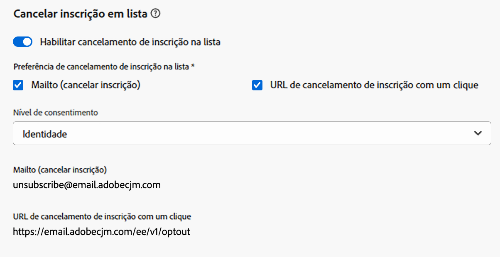
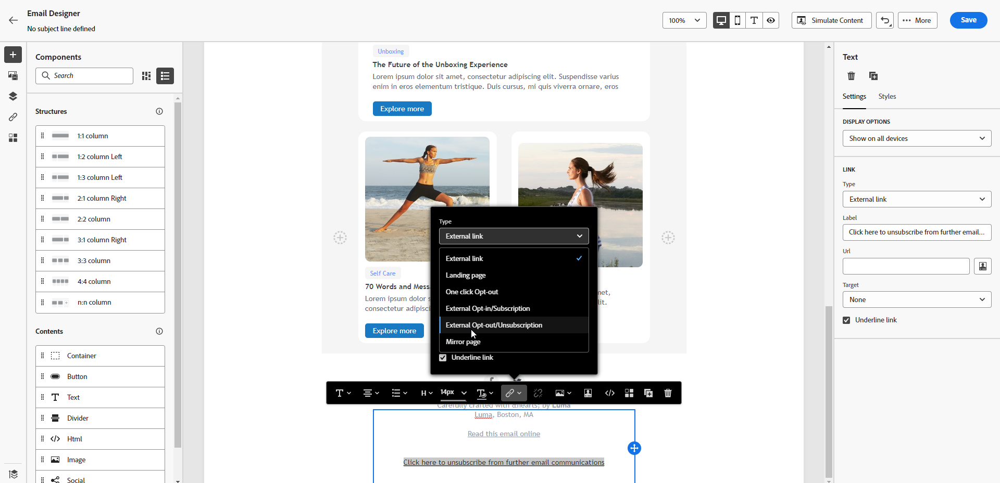

# Gerenciamento de opção de não participação de email {#email-opt-out}

Ao enviar mensagens de jornadas ou campanhas, você deve sempre garantir que os clientes possam cancelar a inscrição de comunicações futuras. Após o cancelamento da assinatura, os perfis serão removidos automaticamente do público-alvo de futuras mensagens de marketing.  [Saiba mais sobre privacidade e gerenciamento de recusa](../privacy/opt-out.md)

>[!NOTE]
>
>Todas as suas mensagens de marketing devem incluir um link para opção de não participação. Isso não é necessário para mensagens transacionais. A categoria da mensagem - **[!UICONTROL Marketing]** ou **[!UICONTROL Transacional]** - é definida no nível [configuração de canal](../configuration/channel-surfaces.md#email-type) e ao criar a mensagem.

Para inserir um link de cancelamento de subscrição no seu conteúdo de email, você pode:

* Adicione um URL de cancelamento de inscrição com um clique no cabeçalho do email. A opção **[!UICONTROL Habilitar List-Unsubscribe]** no nível de configuração de canal adiciona um link para opção de não participação ao cabeçalho do email. [Saiba mais sobre a opção de não participação no cabeçalho do email](#unsubscribe-header)

* Habilite o **link para opção de não participação com um clique** para seu email.  [Saiba como adicionar um link para opção de não participação com um clique](#one-click-opt-out)

* Inserir um **link para uma página de aterrissagem**. [Saiba como adicionar uma página de aterrissagem de recusa](#opt-out-external-lp)


## Recusa em uma etapa {#opt-out-one-step}

Com o [!DNL Adobe Journey Optimizer], você pode definir suas [configurações de email](email-settings.md#list-unsubscribe) com uma URL de cancelamento de inscrição e um endereço mailto de um clique gerados automaticamente no cabeçalho do email, ou incluir uma URL de recusa de um clique no corpo do email.

Quando um recipient clica no link de recusa de um clique, a solicitação de cancelamento de inscrição desse recipient é processada adequadamente.

### URL para cancelar a assinatura com um clique no cabeçalho do email {#unsubscribe-header}

<!--Do not modify - Legal Review Done -->

>[!CONTEXTUALHELP]
>id="ajo_admin_preset_unsubscribe"
>title="Adicionar um URL de cancelamento de assinatura aos emails"
>abstract="Habilite Cancelar assinatura em lista para adicionar automaticamente ao cabeçalho do email um URL de cancelamento de assinatura. É possível também definir um URL de cancelamento de assinatura em uma mensagem ao inserir um link para opção de não participação com um clique no conteúdo do email."
>additional-url="https://experienceleague.adobe.com/pt-br/docs/journey-optimizer/using/channels/email/email-opt-out#one-click-opt-out" text="Opção de recusa de um clique no conteúdo do email"
>additional-url="https://experienceleague.adobe.com/pt-br/docs/journey-optimizer/using/channels/email/email-opt-out#one-click-opt-out" text="Habilitar o cancelamento de assinatura em lista na configuração de email"

O URL para cancelar a inscrição na lista com um clique é um link ou botão para cancelar inscrição exibido ao lado das informações do remetente do email e permite que os destinatários excluam instantaneamente suas listas de endereçamento com um único clique.

No [!DNL Adobe Journey Optimizer], quando a opção **Habilitar List-Unsubscribe** está ativada, o cabeçalho do email inclui um mailto e/ou uma URL por padrão que os destinatários podem usar para cancelar a inscrição da sua lista de endereçamento.

A opção de alternância [Habilitar Lista-Cancelar Inscrição](email-settings.md#list-unsubscribe) deve ser ativada no nível de configuração de canal para que os emails que usam essa configuração incluam a URL de cancelamento de inscrição com um clique no cabeçalho do email.

>[!NOTE]
>
>Para exibir o URL de cancelamento de inscrição com um clique no cabeçalho do email, o cliente de email dos destinatários deve ser compatível com esse recurso.


Por exemplo, o URL de cancelamento de inscrição com um clique exibe um link de cancelamento de inscrição, conforme abaixo, no Gmail:


<!--With Adobe Journey Optimizer, you can configure your email configuration settings with an auto-generated one-click unsubscribe URL and mailto address in the email header, or include a one-click opt-out URL in your email body: when a recipient clicks the one-click opt-out link, recipient's unsubscribe request is processed accordingly.-->

<!--
>[!AVAILABILITY]
>
>One-click Unsubscribe URL Header will be available in Adobe Journey Optimizer starting June 3, 2024.
>
-->

Dependendo do cliente de email e das [configurações de cancelamento de inscrição](email-settings.md#list-unsubscribe), clicar no link de cancelamento de inscrição no cabeçalho do email terá um dos seguintes resultados:

* Quando o recurso **Mailto (cancelar assinatura)** está habilitado, a solicitação de cancelamento de assinatura é enviada para o endereço de cancelamento de assinatura padrão com base no subdomínio que você configurou.
* Quando o recurso **Cancelar inscrição da URL** com um clique está habilitado - ou se você inseriu uma URL de cancelamento de inscrição no conteúdo do corpo do email -, o destinatário é recusado diretamente, no nível do canal ou no nível da ID (dependendo de como o consentimento está configurado), quando o destinatário clica na URL de cancelamento de inscrição com um clique (com base no subdomínio que você configurou).

{width="80%"}

Em ambos os casos, o perfil correspondente do recipient é cancelado imediatamente e essa escolha é atualizada no Experience Platform. Saiba mais na [documentação do Experience Platform](https://experienceleague.adobe.com/docs/experience-platform/profile/ui/user-guide.html?lang=pt-BR#getting-started){target="_blank"}.

Se você ativou a opção **[!UICONTROL Habilitar List-Unsubscribe]** nas [configurações de email](email-settings.md#list-unsubscribe), recomendamos que você ative ambos os métodos - **Mailto (cancelar assinatura)** e **URL de Cancelamento de Assinatura com Um Clique**. Nem todos os clientes de email oferecem suporte ao método HTTP. Com o recurso Mailto list-unsubscribe fornecido para que você selecione uma alternativa, a reputação do remetente pode ser mais bem protegida e todos os recipients podem ter acesso para usar a funcionalidade de cancelamento de inscrição. [Saiba mais](email-settings.md#list-unsubscribe)


### Opção de recusa de um clique no conteúdo do email {#one-click-opt-out}

Para definir um URL personalizado para cancelar a inscrição, insira um link de recusa de um clique no conteúdo da mensagem de email e insira o URL de sua escolha, conforme descrito abaixo:

1. Acesse seu conteúdo de email e [insira um link](../email/message-tracking.md#insert-links).
1. Selecione **[!UICONTROL Opção de não participação em um clique]** como o tipo de link.

   

1. Insira o URL da página de aterrissagem para onde o usuário é redirecionado após cancelar a inscrição. Esta página está aqui para confirmar que a recusa foi bem-sucedida.

   >[!NOTE]
   >
   >Se você habilitou a opção **[!UICONTROL List-Unsubscribe]** no [nível de configuração do canal](email-settings.md#list-unsubscribe) e desmarcou a opção padrão **[!UICONTROL URL de cancelamento de inscrição]** com um clique, essa URL da página de aterrissagem também será usada quando os usuários clicarem no link de cancelamento de inscrição no cabeçalho do email. [Saiba mais](#unsubscribe-header)

   

   Você pode personalizar seus links. Saiba mais sobre URLs personalizados [nesta seção](../personalization/personalization-syntax.md).

1. Selecione como deseja aplicar a opção de não participação: no nível de canal ou identidade.

   

   * **[!UICONTROL Canal]**: a opção de não participação se aplica a mensagens futuras enviadas ao público-alvo do perfil (ou seja, endereço de email) do canal atual. Se vários destinos estiverem associados a um perfil, a opção de não participação se aplica a todos os destinos (ou seja, endereços de email) no perfil desse canal.
   * **[!UICONTROL Identidade]**: a opção de não participação se aplica a mensagens futuras enviadas ao público-alvo específico (ou seja, endereço de email) que está sendo usado para a mensagem atual.
     <!--* **[!UICONTROL Subscription]**: The opt-out applies to future messages associated with a specific subscription list. This option can only be selected if the current message is associated with a subscription list.-->

1. Salve as alterações.


## Recusa em duas etapas {#opt-out-external-lp}

O mecanismo de recusa padrão depende de duas etapas: o assinante clica no link de opção de não participação em um email e, em seguida, é redirecionado para uma página de aterrissagem de opção de não participação para confirmar o cancelamento da inscrição.

Para implementar esse modo de cancelamento de subscrição, você deve criar e publicar uma landing page de opt out e adicionar um link de unsubscription em suas mensagens de email, com um link para a landing page. Essas etapas são descritas abaixo.


### Pré-requisitos {#prereq-lp}

Para configurar um mecanismo de recusa em duas etapas, você deve criar suas próprias páginas de aterrissagem de unsubscription. A primeira landing page será vinculada da sua mensagem e deverá conter um botão de chamada para ação. Uma mensagem de confirmação deve ser exibida quando o usuário clicar no botão.

Saiba como criar uma página de aterrissagem no Adobe Journey Optimizer para gerenciar cancelamentos de assinatura em [esta página](../landing-pages/lp-use-cases.md#opt-out).

Também é possível usar uma landing page externa. Nesse caso, configure a API para enviar as informações ao Adobe Journey Optimizer quando um recipient cancelar a inscrição.

+++ Saiba como implementar uma chamada de API de recusa

Para efetivar a opção de não participação dos seus recipients ao enviarem suas escolhas a partir da página de aterrissagem, é preciso implementar uma **chamada de API de inscrição** por meio do [Adobe Developer](https://developer.adobe.com){target="_blank"} para atualizar as preferências dos perfis correspondentes.

Essa chamada POST é a seguinte:

Endpoint: https://platform.adobe.io/journey/imp/consent/preferences

Parâmetros de consulta:

* **params**: contém o conteúdo criptografado
* **pid**: ID de perfil criptografada

Esses dois parâmetros serão incluídos no URL da página de destino de terceiros enviado ao seu recipient:


Requisitos do cabeçalho:

* x-api-key
* x-gw-ims-org-id
* x-sandbox-name
* autorização (token de usuário da conta técnica)

Corpo da solicitação:

```
{
   "marketing": [
       {
            "type": "email",           
            "choice": "no",          
            "scope": "channel"       
        }
    ],
 
}
```

[!DNL Journey Optimizer] usa esses parâmetros para atualizar a escolha do perfil correspondente por meio da chamada de API [Adobe Developer](https://developer.adobe.com){target="_blank"}.

+++


### Adicionar link para cancelar inscrição {#add-unsubscribe-link}

Primeiro, é necessário adicionar um link para cancelar inscrição em uma mensagem. Para fazer isso, siga as etapas abaixo:

1. Criar uma mensagem e [inserir um link](../email/message-tracking.md#insert-links) usando a barra de ferramentas contextual.

   

1. Selecione a **[!UICONTROL Página de aterrissagem]** na lista suspensa **[!UICONTROL Tipo]** e selecione sua página de aterrissagem de recusa no campo **[!UICONTROL Página de aterrissagem]**.

   Se você estiver usando uma página de aterrissagem externa, selecione **[!UICONTROL Opção de não participação/Cancelar assinatura]** na lista suspensa **[!UICONTROL Tipo]**.

   

   No campo **[!UICONTROL Link]**, cole o link para a sua página de destino de terceiros.

   

1. Clique em **[!UICONTROL Salvar]**.


### Enviar a mensagem com link para cancelar inscrição {#send-message-unsubscribe-link}

Depois de configurar o link de cancelamento de inscrição para a página de aterrissagem, você poderá criar e enviar a mensagem.

1. Configure sua mensagem com um link de unsubscription e envie-a aos seus assinantes.

1. Depois que a mensagem for recebida, se o destinatário clicar no link de cancelamento de inscrição, a página de destino será exibida.

   

1. Se o recipient enviar o formulário - aqui, pressionando o botão **[!UICONTROL Cancelar inscrição]** na página de aterrissagem - os dados do perfil serão atualizados por meio da chamada de API.

1. O destinatário que recusou a inscrição é então redirecionado para uma tela de mensagem de confirmação indicando que a recusa foi bem-sucedida.

   

   Como resultado, esse usuário não receberá a comunicação da sua marca, a menos que faça a assinatura novamente.

1. Para verificar se a escolha do perfil correspondente foi atualizada, acesse a Experience Platform e o perfil selecionando um namespace de identidade e um valor de identidade correspondente. Saiba mais na [documentação do Experience Platform](https://experienceleague.adobe.com/docs/experience-platform/profile/ui/user-guide.html?lang=pt-BR#getting-started){target="_blank"}.

   

   Na guia **[!UICONTROL Atributos]**, é possível ver que o valor de **[!UICONTROL escolha]** foi alterado para **[!UICONTROL não]**.

