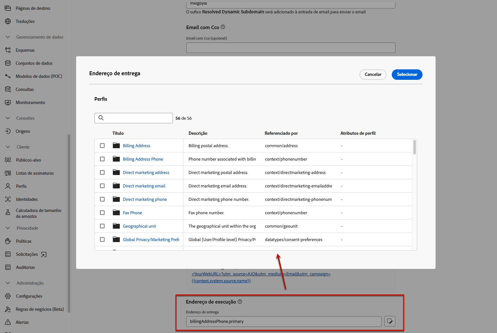

# Definir configurações de email {#email-settings}

Para começar a criar um email, é preciso configurar o canal de email e definir todos os parâmetros técnicos necessários para suas mensagens. [Saiba como criar configurações](../configuration/channel-surfaces.md)

>[!NOTE]
>
>Para preservar sua reputação e melhorar a capacidade de entrega, configure os subdomínios que serão usados para enviar emails antes de criar uma configuração de email. [Saiba mais](../configuration/about-subdomain-delegation.md)

Defina as configurações de email na seção dedicada da configuração de canal, conforme detalhado abaixo.

{width="50%" align="left"}

A configuração de email é selecionada para o envio de comunicações seguindo a lógica abaixo:

* Isso não se aplica a execuções de jornadas em lote que foram iniciadas antes de configurar a superfície de email. As alterações são aplicadas na próxima recorrência ou na nova execução.

* No caso de mensagens transacionais, a alteração é aplicada imediatamente na próxima comunicação (com um atraso de até cinco minutos).

>[!NOTE]
>
>As configurações de email atualizadas são aplicadas automaticamente nas jornadas ou campanhas em que são usadas.

## Tipo de email {#email-type}

>[!CONTEXTUALHELP]
>id="ajo_admin_presets_emailtype"
>title="Definir o tipo de email"
>abstract="Selecione o tipo de email que será enviado ao usar essa configuração: “Marketing” para emails promocionais que exigem consentimento do usuário ou “Transacional” para emails não comerciais que também podem ser enviados para perfis sem assinatura em contextos específicos."

Na seção **Tipo de email**, selecione o tipo de mensagem para a configuração: **[!UICONTROL Marketing]** ou **[!UICONTROL Transacional]**.

* Selecione **Marketing** para emails promocionais, como promoções semanais para uma loja de varejo. Essas mensagens exigem o consentimento do usuário.

* Selecione **Transacional** para emails não comerciais, como confirmações de pedidos, notificações de redefinição de senha ou informações de entrega, por exemplo. Esses emails podem ser enviados para perfis que **cancelaram a assinatura** de comunicações de marketing. Essas mensagens só podem ser enviadas em contextos específicos.

Ao criar uma mensagem, é necessário escolher uma configuração de canal válida que corresponda à categoria selecionada para o email.

## Subdomínio {#subdomains}

Selecione o subdomínio que será usado para enviar os emails.

>[!NOTE]
>
>Para ter maior controle sobre as configurações de email, é possível definir subdomínios dinâmicos. [Saiba mais](../email/surface-personalization.md#dynamic-subdomains)

Para preservar a reputação do domínio, acelerar o processo de aquecimento de IP e aprimorar a capacidade de entrega, delegue os subdomínios de envio à Adobe. [Saiba mais](../configuration/about-subdomain-delegation.md)

## Detalhes do pool de IP {#ip-pools}

Selecione o pool de IP para associar à configuração. [Saiba mais](../configuration/ip-pools.md)

{width="50%" align="left"}

Não é possível continuar a criar a configuração enquanto o pool de IP selecionado estiver em [edição](../configuration/ip-pools.md#edit-ip-pool) (status **[!UICONTROL Processando]**) e não tiver sido associado ao subdomínio selecionado. Caso contrário, a versão mais antiga da associação de pool/subdomínio de IP ainda será usada. Se esse for o caso, salve a configuração como rascunho e tente novamente depois que o pool de IP atingir o status **[!UICONTROL Sucesso]**.

>[!NOTE]
>
>Para ambientes de não produção, a Adobe não cria subdomínios de teste prontos para uso nem concede acesso a um pool de IP de envio compartilhado. Nesses casos, é necessário [delegar seus próprios subdomínios](../configuration/delegate-subdomain.md) e usar os IPs do pool atribuído à sua organização.

Após selecionar um pool de IP, as informações de PTR ficam visíveis ao passar o mouse sobre os endereços IP exibidos abaixo da lista suspensa do pool de IP. [Saiba mais sobre registros PTR](../configuration/ptr-records.md)

>[!NOTE]
>
>Se não houver um registro PTR configurado, entre em contato com o(a) representante da Adobe.

## Cancelar assinatura de lista {#list-unsubscribe}

Ao selecionar um subdomínio na lista, a opção **[!UICONTROL Habilitar List-Unsubscribe]** é exibida. Ela é ativada por padrão.

Ele permite incluir um URL de cancelamento de inscrição de um clique no cabeçalho do email. [Saiba mais](list-unsubscribe.md)

## Parâmetros de cabeçalho {#email-header}

Na seção **[!UICONTROL Parâmetros de cabeçalho]**, digite os nomes e endereços de email do remetente associados ao tipo de email enviado usando essa configuração. [Saiba mais](header-parameters.md)

## Email de cópia (CCO) {#bcc-email}

É possível enviar uma cópia idêntica (ou cópia oculta) de emails enviados pelo [!DNL Journey Optimizer] a uma caixa de entrada em cópia (CCO), onde serão armazenados para fins de conformidade ou arquivamento.

Para fazer isso, habilite o recurso opcional **[!UICONTROL Email de cópia (CCO)]** no nível de configuração do canal. [Saiba mais](../configuration/archiving-support.md#bcc-email)

Além disso, ao definir o endereço de **[!UICONTROL Email de cópia (CCO)]**, certifique-se de usar um subdomínio que tenha uma configuração de registro MX válida, caso contrário, o processamento da configuração de email falhará.

Se você receber um erro ao enviar a configuração de email, isto significa que o registro MX não está configurado para o subdomínio do endereço inserido. Entre em contato com o(a) admin para configurar o registro MX correspondente ou use outro endereço com uma configuração de registro MX válida.

## Envio para endereços de email suprimidos {#send-to-suppressed-email-addresses}

>[!CONTEXTUALHELP]
>id="ajo_surface_suppressed_addresses"
>title="Substituir precedência da lista de supressão"
>abstract="Você pode decidir enviar mensagens transacionais a perfis mesmo que seus endereços de email estejam na lista de supressão do Adobe Journey Optimizer devido a uma reclamação de spam. Essa opção está desabilitada por padrão."
>additional-url="https://experienceleague.adobe.com/docs/journey-optimizer/using/configuration/monitor-reputation/manage-suppression-list.html?lang=pt-BR" text="Gerenciar a lista de supressão"

>[!IMPORTANT]
>
>Esta opção só estará disponível se você tiver selecionado o tipo de email **[!UICONTROL Transacional]**. [Saiba mais](#email-type)

No [!DNL Journey Optimizer], todos os endereços de email marcados como rejeições permanentes, rejeições temporárias e spam são automaticamente coletados na [lista de supressão](../configuration/manage-suppression-list.md) e excluídos da lista de envio de uma jornada ou campanha.

No entanto, é possível continuar enviando mensagens do tipo **transacional** aos perfis, mesmo que seus endereços de email estejam na lista de supressão devido a reclamações de spam do usuário.

Na verdade, as mensagens transacionais geralmente contêm informações úteis e esperadas, como uma confirmação de pedido ou uma notificação de redefinição de senha. Portanto, mesmo que tenham relatado uma de suas mensagens de marketing como spam, na maioria das vezes, é desejável que seus clientes recebam esse tipo de email não comercial.

Para incluir endereços de email suprimidos devido a reclamações de spam no público-alvo da mensagem transacional, selecione a opção correspondente na seção **[!UICONTROL Enviar para endereços de email suprimidos]**.

>[!NOTE]
>
>Essa opção está desabilitada por padrão.

Como prática recomendada de capacidade de entrega, essa opção é desabilitada por padrão para garantir que clientes que optaram por rejeitar mensagens não sejam contatados. No entanto, é possível alterar essa opção padrão, o que permite enviar mensagens transacionais a clientes.

Após habilitar essa opção, mesmo se um(a) cliente marcar o email de marketing como spam, ele(a) poderá receber as mensagens transacionais usando a configuração atual. Certifique-se sempre de gerenciar as preferências de recusa de acordo com as práticas recomendadas de capacidade de entrega.

## Lista de sementes {#seed-list}

>[!CONTEXTUALHELP]
>id="ajo_surface_seed_list"
>title="Adicionar uma lista de seeds"
>abstract="Selecione uma lista de seeds de sua escolha para adicionar automaticamente endereços internos específicos aos seus públicos-alvo. Esses seed addresses serão incluídos na hora da execução da tarefa e receberão uma cópia exata da mensagem para fins de garantia."
>additional-url="https://experienceleague.adobe.com/docs/journey-optimizer/using/configuration/seed-lists.html?lang=pt-BR#use-seed-list" text="O que são listas de seeds?"

Uma lista de seeds no [!DNL Journey Optimizer] permite incluir seed addresses de emails específicos automaticamente em suas entregas. [Saiba mais](../configuration/seed-lists.md)

>[!CAUTION]
>
>Atualmente, esse recurso se aplica somente ao canal de email.

Selecione a lista relevante na seção **[!UICONTROL Lista de seeds]**. Saiba como criar uma lista de seeds [nesta seção](../configuration/seed-lists.md#create-seed-list).

{width="80%"}

>[!NOTE]
>
>Só é possível selecionar uma lista de seeds por vez.

Ao usar a configuração atual em uma campanha ou jornada, os endereços de email na lista de seeds selecionada são incluídos no tempo de execução da entrega, o que significa que receberão uma cópia da entrega para fins de garantia.

Saiba como usar listas de seeds em uma campanha ou jornada [nesta seção](../configuration/seed-lists.md#use-seed-list).

## Parâmetros de nova tentativa do email {#email-retry}

>[!CONTEXTUALHELP]
>id="ajo_admin_presets_retryperiod"
>title="Ajustar o período de nova tentativa"
>abstract="As tentativas são executadas por 3,5 dias (84 horas) quando uma entrega de email falha devido a um erro de rejeição temporária. Você pode ajustar esse período de tentativas padrão para atender melhor às suas necessidades."
>additional-url="https://experienceleague.adobe.com/docs/journey-optimizer/using/configuration/monitor-reputation/retries.html?lang=pt-BR" text="Sobre tentativas"

É possível configurar os **parâmetros de nova tentativa do email**.

Por padrão, o [período de nova tentativa](../configuration/retries.md#retry-duration) está definido como 84 horas, mas é possível ajustar essa configuração para melhor atender às suas necessidades.

Você deve inserir um valor inteiro (em horas ou minutos) dentro do seguinte intervalo:

* Para emails de marketing, o período mínimo para novas tentativas é de 6 horas.
* Para emails transacionais, o período mínimo para novas tentativas é de 10 minutos.
* Para ambos os tipos de email, o período máximo de novas tentativas é de 84 horas (ou 5040 minutos).

Saiba mais sobre novas tentativas [nesta seção](../configuration/retries.md).

## Rastreamento de URL {#url-tracking}

Use os **[!UICONTROL parâmetros de rastreamento de URL]** para medir a eficácia de suas ações de marketing em todos os canais. [Saiba mais](url-tracking.md)

## Endereço de execução {#execution-address}

>[!CONTEXTUALHELP]
>id="ajo_email_config_execution_address"
>title="Substituir o endereço de execução padrão a ser usado"
>abstract="Quando vários endereços de email estão disponíveis no banco de dados (pessoal, profissional etc.), você pode escolher qual deles priorizar para envio. O endereço principal é definido no nível da sandbox, mas aqui você pode substituir a configuração padrão para essa configuração de email específica."

Ao direcionar um perfil, pode haver vários endereços de email disponíveis no banco de dados (endereço de email profissional, endereço de email pessoal etc.).

Nesse caso, o [!DNL Journey Optimizer] usa o endereço especificado nos **[!UICONTROL Campos de execução]** no nível da sandbox para determinar qual endereço de email do serviço de perfil usar com prioridade. [Saiba mais](../configuration/primary-email-addresses.md)

>[!NOTE]
>
>Para verificar os campos que são usados por padrão no momento, acesse o menu **[!UICONTROL Administração]** > **[!UICONTROL Canais]** > **[!UICONTROL Configurações gerais]** > **[!UICONTROL Campos de execuções]**.

No entanto, é possível alterar esse campo de execução padrão no nível de configuração do canal de email. É possível aplicar essa configuração a campanhas ou jornadas específicas.

Para fazer isso, edite o campo **[!UICONTROL Endereço de entrega]** e selecione um item na lista de campos XDM do tipo email disponíveis.

O campo de execução é atualizado e usado como o endereço principal. Isso substitui a configuração geral no nível da sandbox.
