# Definir configurações de email {#email-settings}

Para começar a criar um email, você precisa configurar superfícies de canal de email que definam todos os parâmetros técnicos necessários para suas mensagens. [Saiba como criar superfícies](../configuration/channel-surfaces.md)

>[!NOTE]
>
>Para preservar sua reputação e melhorar sua capacidade de delivery, configure os subdomínios que serão usados para enviar emails antes de criar uma superfície de email. [Saiba mais](../configuration/about-subdomain-delegation.md)

Defina as configurações de email na seção dedicada da configuração da superfície de canal, conforme detalhado abaixo.

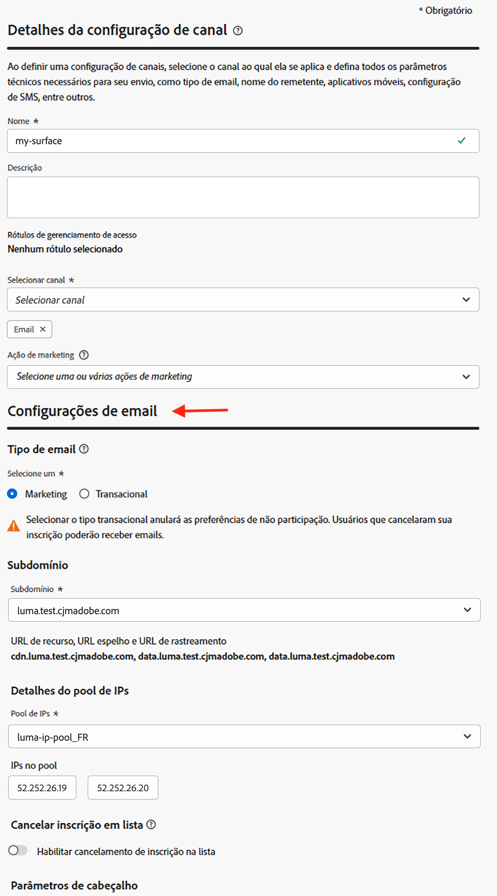{width="50%" align="left"}

A configuração da superfície de email é selecionada para envio de comunicações seguindo a lógica abaixo:

* Para jornadas em lote, isso não se aplica à execução em lote que já foi iniciada antes da configuração da superfície de email ser feita. As alterações são selecionadas na próxima recorrência ou nova execução.

* Para mensagens transacionais, a alteração é recebida imediatamente para a próxima comunicação (atraso de até cinco minutos).

>[!NOTE]
>
>As configurações atualizadas da superfície de email são selecionadas automaticamente nas jornadas ou campanhas nas quais a superfície é usada.

## Tipo de email {#email-type}

>[!CONTEXTUALHELP]
>id="ajo_admin_presets_emailtype"
>title="Definir o tipo de email"
>abstract="Selecione o tipo de email que será enviado ao usar essa superfície: Marketing para emails promocionais, que exigem consentimento do usuário, ou Transacional para emails não comerciais, que também podem ser enviados para perfis sem assinatura em contextos específicos."

No **Tipo de email** selecione o tipo de mensagem para a superfície: **[!UICONTROL Marketing]** ou **[!UICONTROL Transacional]**.

* Selecionar **Marketing** para email promocional, como promoções semanais para uma loja de varejo. Essas mensagens exigem o consentimento do usuário.

* Selecionar **Transacional** para emails não comerciais, como confirmações de pedidos, notificações de redefinição de senha ou informações de entrega, por exemplo. Esses emails podem ser enviados a perfis que **cancelado** de comunicações de marketing. Essas mensagens só podem ser enviadas em contextos específicos.

Ao criar uma mensagem, você deve escolher uma superfície de canal válida que corresponda à categoria selecionada para o seu email.

## Subdomain {#subdomains}

Selecione o subdomínio que será usado para enviar os emails.

Para preservar a reputação do seu domínio, acelere o processo de aquecimento de IP e melhore a capacidade de entrega, delegue os subdomínios de envio ao Adobe. [Saiba mais](../configuration/about-subdomain-delegation.md)

<!--If needed, you can define dynamic subdomains. [Learn more](../email/surface-personalization.md#dynamic-subdomains)-->

## Detalhes do pool de IP {#ip-pools}

Selecione o pool de IP para associar à superfície. [Saiba mais](../configuration/ip-pools.md)

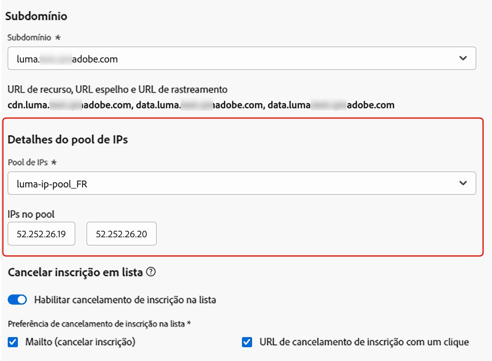{width="50%" align="left"}

Você não pode continuar com a criação da superfície enquanto o pool de IP selecionado estiver em [edição](../configuration/ip-pools.md#edit-ip-pool) (**[!UICONTROL Processando]** e nunca foi associado ao subdomínio selecionado. Caso contrário, a versão mais antiga da associação de pool/subdomínio de IP ainda será usada. Se esse for o caso, salve a superfície como rascunho e tente novamente depois que o pool de IP tiver o **[!UICONTROL Sucesso]** status.

>[!NOTE]
>
>Para ambientes não relacionados à produção, o Adobe não cria subdomínios de teste prontos para uso nem concede acesso a um pool de IPs de envio compartilhados. Você precisa [delegar seus próprios subdomínios](../configuration/delegate-subdomain.md) e use os IPs do pool atribuído à sua organização.

Após selecionar um pool de IP, as informações de PTR ficam visíveis ao passar o mouse sobre os endereços IP exibidos abaixo da lista suspensa Pool de IPs. [Saiba mais sobre registros PTR](../configuration/ptr-records.md)

>[!NOTE]
>
>Se um registro PTR não estiver configurado, entre em contato com o representante da Adobe.

## Cabeçalho de cancelamento de inscrição de lista{#list-unsubscribe}

<!--Do not modify - Legal Review Done -->

Em [selecionar um subdomínio](#subdomains-and-ip-pools) na lista, o **[!UICONTROL Ativar lista-Cancelar inscrição]** é exibida.

Essa opção é habilitada por padrão para incluir um URL de cancelamento de inscrição de um clique no cabeçalho do email, como:

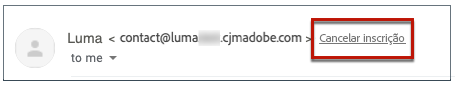

Se você desativar essa opção, nenhum URL de cancelamento de inscrição com um clique será exibido no cabeçalho do email.

Você pode selecionar o nível de consentimento nas **[!UICONTROL Nível de consentimento]** lista suspensa. Pode ser específico do canal ou da identidade do perfil. Com base nessa configuração, quando um usuário cancela a assinatura usando o URL de cancelamento de inscrição da lista no cabeçalho de um email, o consentimento é atualizado no Adobe Journey Optimizer, no nível do canal ou no nível de ID.

O Cabeçalho de cancelamento de inscrição da lista oferece dois recursos (Mailto e URL de cancelamento de inscrição com um clique, conforme explicado abaixo) que são ativados por padrão, a menos que você desmarque um ou ambos os recursos:

* A **Mailto (cancelar inscrição)** endereço, que é o endereço de destino para o qual as solicitações de cancelamento de inscrição são roteadas para processamento automático.

  No Journey Optimizer, o endereço de email de cancelamento de inscrição é o padrão **Mailto (cancelar inscrição)** exibido na superfície de canal, com base no seu [subdomínio selecionado](#subdomains-and-ip-pools).

  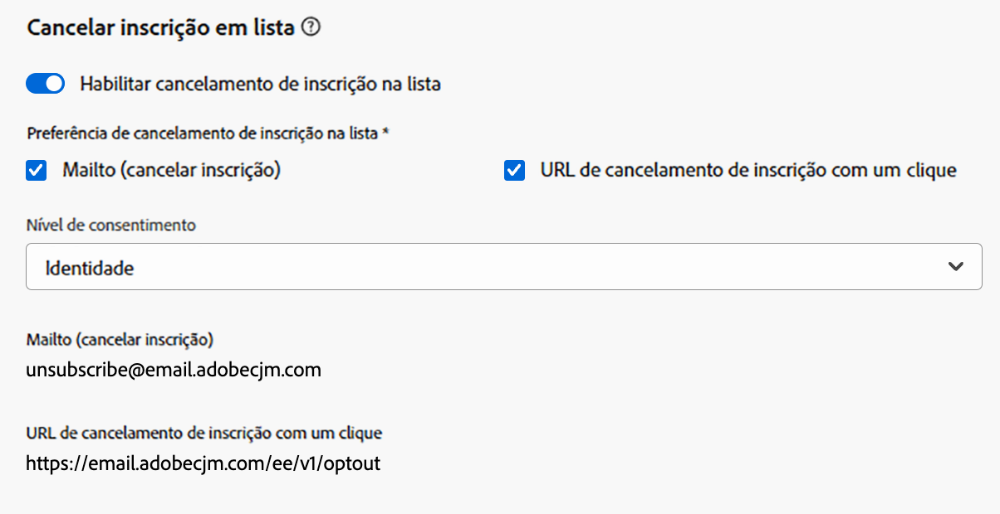{width="50%" align="left"}

* A variável **URL de cancelamento de inscrição com um clique**, que, por padrão, é o cabeçalho de cancelamento de inscrição de lista gerado por URL com um clique, com base no subdomínio definido e configurado nas Configurações de superfície de canal.

<!--
    >[!AVAILABILITY]
    >
    >One-click Unsubscribe URL Header will be available in Adobe Journey Optimizer starting June 3, 2024.
    >
-->

A variável **[!UICONTROL Mailto (cancelar inscrição)]** e o **[!UICONTROL URL para cancelar inscrição com um clique]** são opcionais. Se você não quiser usar o URL de cancelamento de inscrição de um clique gerado padrão, é possível desmarcar o recurso. No cenário em que a variável **[!UICONTROL Configuração de recusa]** estiver ativada e a variável **[!UICONTROL URL para cancelar inscrição com um clique]** recurso estiver desmarcado, se você adicionar um [link para opção de não participação com um clique](../privacy/opt-out.md#one-click-opt-out) para criar uma mensagem usando essa superfície, o cabeçalho cancelar inscrição da lista selecionará o link de recusa de um clique inserido no corpo do email e o usará como o valor do URL de cancelamento de inscrição de um clique.

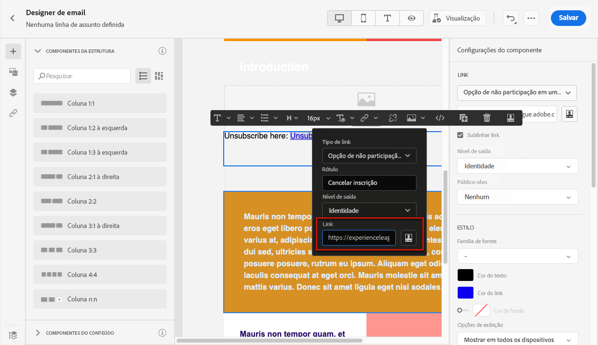

>[!NOTE]
>
>Se você não adicionar um link de recusa de um clique no conteúdo da mensagem e o URL padrão de cancelamento de inscrição com um clique estiver desmarcado nas Configurações da superfície de canal, nenhum URL será passado para o cabeçalho do email como parte do cabeçalho Cancelamento de inscrição da lista.

Saiba mais sobre como gerenciar recursos de cancelamento de inscrição em suas mensagens no [nesta seção](../email/email-opt-out.md#unsubscribe-header).

## Parâmetros de cabeçalho {#email-header}

No **[!UICONTROL Parâmetros de cabeçalho]** insira os nomes dos remetentes e os endereços de email associados ao tipo de email enviado usando essa superfície.

* **[!UICONTROL Nome do remetente]**: o nome do remetente, como o nome da sua marca.
* **[!UICONTROL Email do remetente]**: o endereço de email que você deseja usar para suas comunicações.
* **[!UICONTROL Responder para (nome)]**: O nome que será usado quando o recipient clicar no **Responder** no software cliente de email.
* **[!UICONTROL Responder para (email)]**: O endereço de email que será usado quando o recipient clicar no **Responder** no software cliente de email. [Saiba mais](#reply-to-email)
* **[!UICONTROL Email de erro]**: todos os erros gerados pelos ISPs após alguns dias da entrega de emails (rejeições assíncronas) são recebidos neste endereço. As notificações de ausência do escritório e as respostas a desafios também são recebidas neste endereço.

  Se quiser receber as notificações de ausência do escritório e as respostas de desafio em um endereço de email específico que não esteja delegado ao Adobe, é necessário configurar um [processo de encaminhamento](#forward-email). Nesse caso, verifique se você tem uma solução manual ou automatizada para processar os emails que chegam a essa caixa de entrada.

>[!CAUTION]
>
>A variável **[!UICONTROL Email do remetente]** e **[!UICONTROL Email de erro]** os endereços devem usar o endereço selecionado [subdomínio delegado](../configuration/about-subdomain-delegation.md). Por exemplo, se o subdomínio delegado for *marketing.luma.com*, você pode usar *contact@marketing.luma.com* e *error@marketing.luma.com*.

>[!NOTE]
>
>Os endereços devem começar com uma letra (A-Z) e só podem conter caracteres alfanuméricos. Também é possível usar sublinhado `_`, ponto`.` e hífen `-` caracteres.

### Responder ao email {#reply-to-email}

Ao definir a variável **[!UICONTROL Responder para (email)]** endereço, você poderá especificar qualquer endereço de email, desde que seja um endereço válido, no formato correto e sem qualquer erro de digitação.

A caixa de entrada usada para respostas receberá todos os emails de resposta, exceto notificações de ausência temporária e respostas de desafio, que são recebidos no **[!UICONTROL Email de erro]** endereço.

Para garantir o gerenciamento de respostas adequado, siga as recomendações abaixo:

* Verifique se a caixa de entrada dedicada tem capacidade de recepção suficiente para receber todos os emails de resposta enviados usando a superfície de email. Se a caixa de entrada retornar devoluções, algumas respostas dos clientes podem não ser recebidas.

* As respostas devem ser processadas tendo em mente obrigações de privacidade e conformidade, pois podem conter informações de identificação pessoal (PII).

* Não marque mensagens como spam na caixa de entrada de resposta, pois isso afetará todas as outras respostas enviadas para esse endereço.

Além disso, ao definir a variável **[!UICONTROL Responder para (email)]** , certifique-se de usar um subdomínio que tenha uma configuração de registro MX válida, caso contrário, o processamento da superfície de email falhará.

Se você receber um erro ao enviar a superfície de email, significa que o registro MX não está configurado para o subdomínio do endereço inserido. Entre em contato com o administrador para configurar o registro MX correspondente ou use outro endereço com uma configuração de registro MX válida.

>[!NOTE]
>
>Se o subdomínio do endereço inserido for um domínio que foi [totalmente delegado](../configuration/delegate-subdomain.md#full-subdomain-delegation) para Adobe, entre em contato com o executivo da sua conta Adobe.

### Encaminhar email {#forward-email}

Para encaminhar para um endereço de email específico todos os emails recebidos por [!DNL Journey Optimizer] para o subdomínio delegado, entre em contato com o Atendimento ao cliente da Adobe.

>[!NOTE]
>
>Se o subdomínio usado para o **[!UICONTROL Responder para (email)]** endereço não for delegado ao Adobe, o encaminhamento não poderá funcionar para esse endereço.

Você precisa fornecer:

* O endereço de email de encaminhamento de sua escolha. Observe que o domínio de endereço de email de encaminhamento não pode corresponder a nenhum subdomínio delegado ao Adobe.
* O nome da sua sandbox.
* O nome da superfície ou do subdomínio para o qual o endereço de email de encaminhamento será usado.
  <!--* The current **[!UICONTROL Reply to (email)]** address or **[!UICONTROL Error email]** address set at the channel surface level.-->

>[!NOTE]
>
>Só pode haver um endereço de email de encaminhamento por subdomínio. Consequentemente, se várias superfícies usarem o mesmo subdomínio, o mesmo endereço de email de encaminhamento deverá ser usado para todas elas.

O endereço de email de encaminhamento é configurado pelo Adobe. Isso pode levar de 3 a 4 dias.

Depois de concluído, todas as mensagens recebidas no **[!UICONTROL Responder para (email)]** e **[!UICONTROL Email de erro]** Os endereços são encaminhados para o endereço de email específico fornecido.

## Email com CCO {#bcc-email}

Você pode enviar uma cópia idêntica (ou cópia oculta) dos emails enviados pelo [!DNL Journey Optimizer] para uma caixa de entrada com CCO, onde serão armazenados para fins de conformidade ou arquivamento.

Para fazer isso, ative a variável **[!UICONTROL Email com CCO]** recurso opcional no nível da superfície de canal. [Saiba mais](../configuration/archiving-support.md#bcc-email)

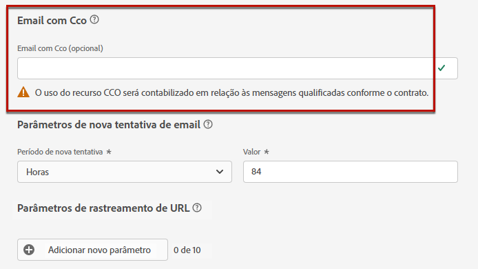

Além disso, ao definir a variável **[!UICONTROL Email com Cco]** , certifique-se de usar um subdomínio que tenha uma configuração de registro MX válida, caso contrário, o processamento da superfície de email falhará.

Se você receber um erro ao enviar a superfície de email, significa que o registro MX não está configurado para o subdomínio do endereço inserido. Entre em contato com o administrador para configurar o registro MX correspondente ou use outro endereço com uma configuração de registro MX válida.

## Envio para endereços de email suprimidos {#send-to-suppressed-email-addresses}

>[!CONTEXTUALHELP]
>id="ajo_surface_suppressed_addresses"
>title="Substituir precedência da lista de supressão"
>abstract="Você pode decidir enviar mensagens transacionais a perfis mesmo que seus endereços de email estejam na lista de supressão do Adobe Journey Optimizer devido a uma reclamação de spam. Essa opção está desabilitada por padrão."
>additional-url="https://experienceleague.adobe.com/docs/journey-optimizer/using/configuration/monitor-reputation/manage-suppression-list.html?lang=pt-BR" text="Gerenciar a lista de supressão"

>[!IMPORTANT]
>
>Essa opção só estará disponível se você tiver selecionado a opção **[!UICONTROL Transacional]** tipo de email. [Saiba mais](#email-type)

Entrada [!DNL Journey Optimizer], todos os endereços de email marcados como rejeições permanentes, rejeições temporárias e reclamações de spam são automaticamente coletados na [lista de supressão](../configuration/manage-suppression-list.md) e excluído do envio de uma jornada ou campanha.

No entanto, você pode decidir continuar enviando mensagens do **transacional** digite para perfis mesmo se os endereços de email estiverem na lista de supressão devido à reclamação de spam do usuário.

Na verdade, as mensagens transacionais geralmente contêm informações úteis e esperadas, como uma confirmação de pedido ou uma notificação de redefinição de senha. Portanto, mesmo que eles tenham relatado uma de suas mensagens de marketing como spam, na maioria das vezes você deseja que seus clientes recebam esse tipo de email não comercial.

Para incluir endereços de email suprimidos devido a reclamação de spam no público-alvo da mensagem transacional, selecione a opção correspondente nas **[!UICONTROL Enviar para endereços de email suprimidos]** seção.

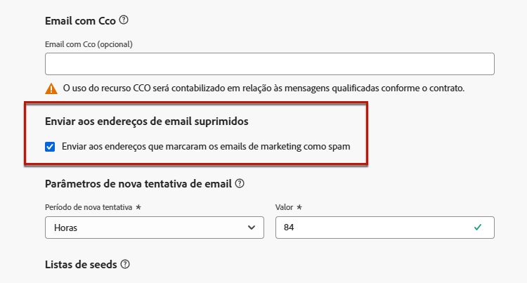

>[!NOTE]
>
>Essa opção está desabilitada por padrão.

Como prática recomendada de delivery, essa opção é desabilitada por padrão para garantir que os clientes que optaram por não ser contatados. No entanto, você pode alterar essa opção padrão, que permite enviar mensagens transacionais para seus clientes.

Quando essa opção estiver habilitada, embora um cliente tenha marcado seu email de marketing como spam, ele poderá receber suas mensagens transacionais usando a superfície atual. Sempre gerencie as preferências de recusa de acordo com as práticas recomendadas de capacidade de delivery.

## Lista de sementes {#seed-list}

>[!CONTEXTUALHELP]
>id="ajo_surface_seed_list"
>title="Adicionar uma lista de sementes"
>abstract="Selecione uma lista de sementes de sua escolha para adicionar automaticamente endereços internos específicos aos seus públicos-alvo. Esses seed addresses serão incluídos na hora da execução da tarefa e receberão uma cópia exata da mensagem para fins de garantia."
>additional-url="https://experienceleague.adobe.com/docs/journey-optimizer/using/configuration/seed-lists.html?lang=pt-BR#use-seed-list" text="O que são listas de sementes?"

Uma lista de propagação em [!DNL Journey Optimizer] permite incluir automaticamente seed addresses de email específicos em seus deliveries. [Saiba mais](../configuration/seed-lists.md)

>[!CAUTION]
>
>Atualmente, esse recurso se aplica somente ao canal de email.

Selecione a lista que é relevante para você no **[!UICONTROL Seed list]** seção. Saiba como criar uma lista de propagação no [nesta seção](../configuration/seed-lists.md#create-seed-list).

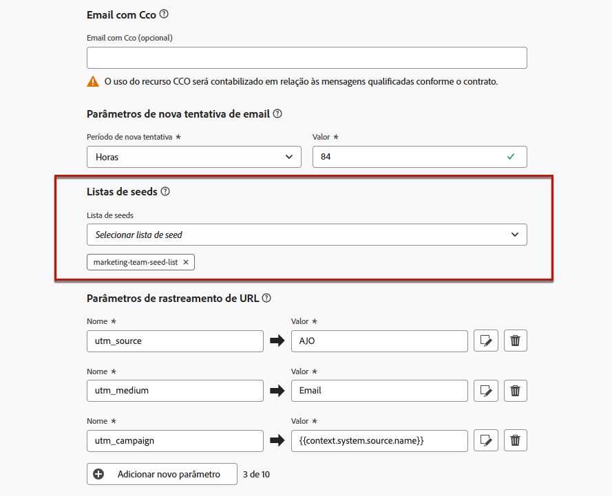

>[!NOTE]
>
>Somente uma lista de propagação pode ser selecionada de cada vez.

Quando a superfície atual é usada em uma campanha ou jornada, os endereços de email na lista de seeds selecionada são incluídos no tempo de execução do delivery, o que significa que eles receberão uma cópia do delivery para fins de garantia.

Saiba como usar a lista de propagação em uma campanha ou jornada no [nesta seção](../configuration/seed-lists.md#use-seed-list).

## Parâmetros de nova tentativa do email {#email-retry}

>[!CONTEXTUALHELP]
>id="ajo_admin_presets_retryperiod"
>title="Ajustar o período de nova tentativa"
>abstract="As tentativas são executadas por 3,5 dias (84 horas) quando uma entrega de email falha devido a um erro de rejeição temporária. Você pode ajustar esse período de tentativas padrão para atender melhor às suas necessidades."
>additional-url="https://experienceleague.adobe.com/docs/journey-optimizer/using/configuration/monitor-reputation/retries.html?lang=pt-BR" text="Sobre tentativas"

Você pode configurar o **Parâmetros de nova tentativa de email**.

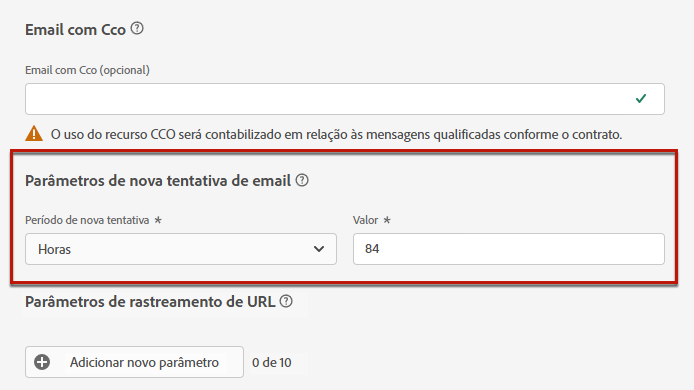

Por padrão, a variável [período de nova tentativa](../configuration/retries.md#retry-duration) O está definido como 84 horas, mas você pode ajustar essa configuração para melhor atender às suas necessidades.

Você deve inserir um valor inteiro (em horas ou minutos) dentro do seguinte intervalo:

* Para emails de marketing, o período mínimo de nova tentativa é de 6 horas.
* Para emails transacionais, o período mínimo de nova tentativa é de 10 minutos.
* Para ambos os tipos de email, o período máximo de nova tentativa é de 84 horas (ou 5040 minutos).

Saiba mais sobre tentativas no [nesta seção](../configuration/retries.md).

## Rastreamento de URL {#url-tracking}

>[!CONTEXTUALHELP]
>id="ajo_admin_preset_utm"
>title="Definir parâmetros de rastreamento de URL"
>abstract="Use essa seção para anexar automaticamente parâmetros de rastreamento aos URLs presentes no seu conteúdo de email. Esse recurso é opcional."

>[!CONTEXTUALHELP]
>id="ajo_admin_preset_url_preview"
>title="Visualizar parâmetros de rastreamento do URL"
>abstract="Analise como os parâmetros de rastreamento serão anexados aos URLs presentes no seu conteúdo de email."

Você pode usar **[!UICONTROL Parâmetros de rastreamento de URL]** para medir a eficiência de seus esforços de marketing em canais. Esse recurso é opcional.

Os parâmetros definidos nesta seção serão anexados ao final dos URLs incluídos no conteúdo da sua mensagem de email. É possível capturar esses parâmetros em ferramentas de análise da Web, como Adobe Analytics ou Google Analytics, e criar vários relatórios de desempenho.

Você pode adicionar até 10 parâmetros de rastreamento usando o **[!UICONTROL Adicionar novo parâmetro]** botão.

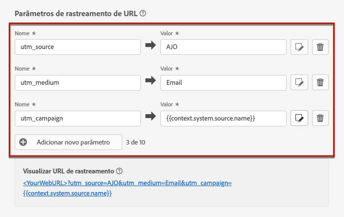

Para configurar um parâmetro de rastreamento de URL, você pode inserir os valores desejados diretamente na **[!UICONTROL Nome]** e **[!UICONTROL Valor]** campos.

Também é possível editar cada **[!UICONTROL Valor]** campo usando o [editor de personalização](../personalization/personalization-build-expressions.md). Clique no ícone de edição para abrir o editor. Ali, é possível selecionar os atributos contextuais disponíveis e/ou editar diretamente o texto.

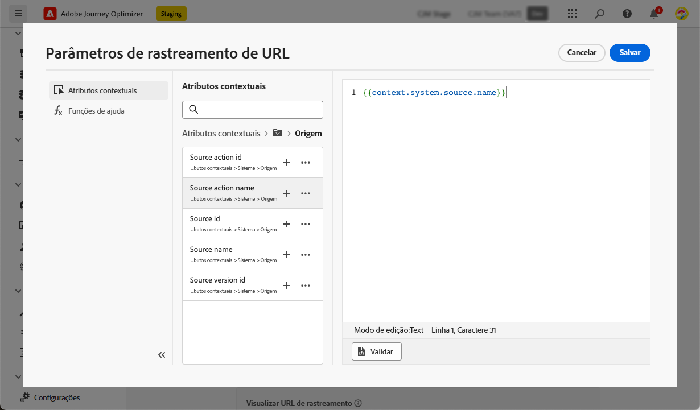

Os seguintes valores predefinidos estão disponíveis por meio do editor de personalização:

* **Id da ação de origem**: ID da ação Email adicionada à jornada ou campanha.

* **Nome da ação de origem**: nome da ação Email adicionada à jornada ou campanha.

* **Id de origem**: ID da jornada ou campanha com a qual o email foi enviado.

* **Nome de origem**: nome da jornada ou campanha para a qual o email foi enviado.

* **ID da versão de origem**: ID da versão do jornada ou da campanha com a qual o email foi enviado.

* **ID da oferta**: ID da oferta usada no email.

>[!NOTE]
>
>Você pode combinar a digitação de valores de texto e o uso de atributos contextuais do editor de personalização. Each **[!UICONTROL Valor]** O campo pode conter um número de caracteres até o limite de 5 KB.

<!--You can drag and drop the parameters to reorder them.-->

Abaixo estão exemplos de URLs compatíveis com Adobe Analytics e Google Analytics.

* URL compatível com Adobe Analytics: `www.YourLandingURL.com?cid=email_AJO_{{context.system.source.id}}_image_{{context.system.source.name}}`

* URL compatível com Google Analytics: `www.YourLandingURL.com?utm_medium=email&utm_source=AJO&utm_campaign={{context.system.source.id}}&utm_content=image`

Você pode visualizar dinamicamente o URL de rastreamento resultante. Cada vez que você adiciona, edita ou remove um parâmetro, a visualização é atualizada automaticamente.

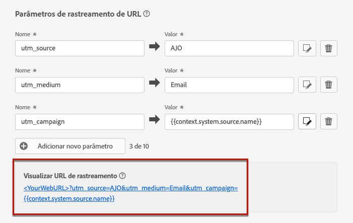

>[!NOTE]
>
>Você também pode adicionar parâmetros de rastreamento personalizados dinâmicos aos links presentes no seu conteúdo de email, mas isso não é possível no nível da superfície. Você precisa fazer isso ao criar sua mensagem usando o designer de email. [Saiba mais](message-tracking.md#url-tracking)
