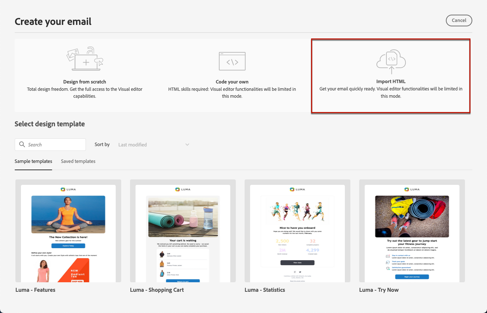

# Importar o conteúdo do email {#existing-content}

[!DNL Journey Optimizer] O permite importar conteúdo de HTML existente para criar seus emails. Esse conteúdo pode ser:

* Um **arquivo HTML** com uma folha de estilos incorporada;
* A **pasta .zip** incluindo um arquivo HTML, a folha de estilos (.css) e as imagens.

  >[!NOTE]
  >
  >Não há restrições na estrutura do arquivo .zip. No entanto, as referências devem ser relativas e se encaixar na estrutura de árvore da pasta .zip.

Para importar um arquivo contendo conteúdo HTML, siga as etapas abaixo:

1. Na página inicial do Designer de email, selecione **[!UICONTROL Importar HTML]**.

   

1. Arraste e solte o HTML ou arquivo .zip contendo seu conteúdo HTML e clique em **[!UICONTROL Importar]**.

   

1. Depois que o conteúdo do HTML for carregado, seu conteúdo estará em **[!UICONTROL Modo de compatibilidade]**.

   Nesse modo, você só pode personalizar seu texto, adicionar links ou incluir ativos ao seu conteúdo.

1. Para aproveitar os componentes de conteúdo do Designer de email, acesse o **[!UICONTROL conversor de HTML]** e clique em **[!UICONTROL Converter]**.

   

   >[!NOTE]
   >
   > Uso de um `<table>` marcar como a primeira camada em um arquivo HTML pode causar perda de estilo, incluindo configurações de plano de fundo e largura na tag da camada superior.

1. Agora você pode personalizar o arquivo importado conforme necessário com as funcionalidades do Designer de email [Saiba mais](content-from-scratch.md).

## Vídeo explicativo {#video}

Saiba como importar conteúdo HTML existente, ajustar o design, adicionar mirror page e links para cancelar a inscrição e como codificar seu conteúdo.

>[!VIDEO](https://video.tv.adobe.com/v/334102?quality=12)
