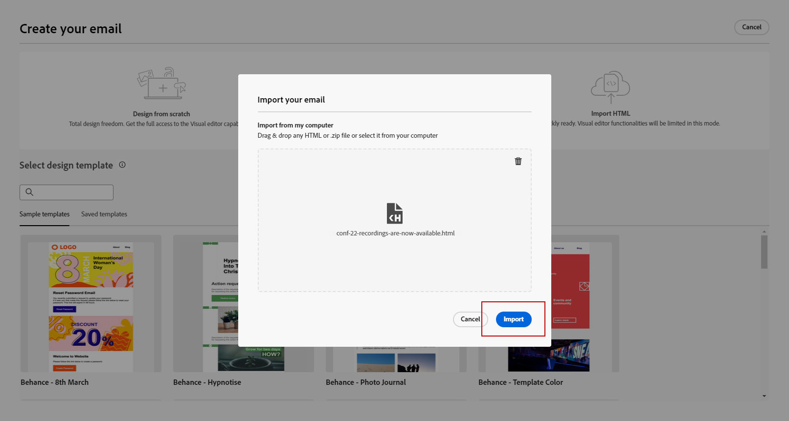

# Importar o conteúdo do email {#existing-content}

O [!DNL Journey Optimizer] permite importar conteúdo existente do HTML para criar seus emails. Esse conteúdo pode ser:

* Um **arquivo HTML** com uma folha de estilos incorporada;
* Uma pasta **.zip** incluindo um arquivo HTML, a folha de estilos (.css) e as imagens.

  >[!NOTE]
  >
  >Não há restrições na estrutura do arquivo .zip. No entanto, as referências devem ser relativas e se encaixar na estrutura de árvore da pasta .zip.

>[!TIP]
>
>Se você tiver designs de imagem (JPEG ou PNG) em vez de arquivos HTML, poderá usar o [conversor de imagem para HTML](../content-management/image-to-html.md) para convertê-los automaticamente em modelos de email editáveis do HTML usando IA.

Para importar um arquivo contendo conteúdo HTML, siga as etapas abaixo:

1. Na página inicial do Designer de Email, selecione **[!UICONTROL Importar HTML]**.

   

1. Arraste e solte o HTML ou arquivo .zip contendo seu conteúdo HTML e clique em **[!UICONTROL Importar]**.

   

1. Depois que o conteúdo do HTML for carregado, ele estará no **[!UICONTROL Modo de compatibilidade]**.

   Nesse modo, você só pode personalizar seu texto, adicionar links ou incluir ativos ao seu conteúdo.

1. Para aproveitar os componentes de conteúdo do Email Designer, acesse a guia **[!UICONTROL Conversor de HTML]** e clique em **[!UICONTROL Converter]**.

   

   >[!NOTE]
   >
   > Usar uma marca `<table>` como a primeira camada em um arquivo do HTML pode causar perda de estilo, incluindo configurações de plano de fundo e largura na marca de camada superior.

1. Agora você pode personalizar o arquivo importado, conforme necessário, com as funcionalidades de Designer de email. [Saiba mais](content-from-scratch.md)

## Vídeo tutorial {#video}

Saiba como importar conteúdo HTML existente, ajustar o design, adicionar mirror page e links para cancelar a inscrição e como codificar seu conteúdo.

>[!VIDEO](https://video.tv.adobe.com/v/334102?quality=12)
