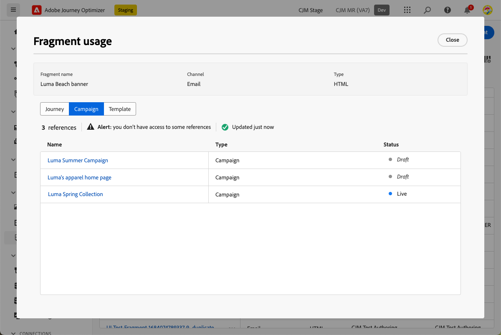

# Trabalhar com fragmentos {#fragments}

Um fragmento é um componente reutilizável que pode ser referenciado em um ou mais emails [!DNL Journey Optimizer] campanhas e jornadas.

Essa funcionalidade permite pré-criar vários blocos de conteúdo personalizados que podem ser usados por usuários de marketing não técnicos para reunir rapidamente o conteúdo de email em um processo de design aprimorado.

➡️ [Saiba como gerenciar, criar e usar fragmentos neste vídeo](#video-fragments)

>[!CAUTION]
>
>Para criar, editar e arquivar fragmentos, você deve ter a **[!DNL Manage Library Items]** permissão incluída na **[!DNL Content Library Manager]** perfil do produto. [Saiba mais](../administration/ootb-product-profiles.md#content-library-manager)

Para aproveitar ao máximo os fragmentos:

* Crie seus próprios fragmentos. Consulte [Criar fragmentos](#create-fragments)
* Use-os quantas vezes forem necessárias em seus emails. Consulte [Usar fragmentos](#use-fragments)

>[!NOTE]
>
>Atualmente, esse recurso está disponível somente para emails.

## Acessar e gerenciar fragmentos {#access-manage-fragments}

Para acessar a lista de fragmentos, selecione **[!UICONTROL Gestão de conteúdo]** > **[!UICONTROL Fragmentos]** no menu esquerdo.

Todos os fragmentos criados na sandbox atual - no **[!UICONTROL Fragmentos]** menu, usando o [Salvar como fragmento](#save-as-fragment) opção - são exibidas.

Você pode filtrar fragmentos na data de criação ou modificação. Você pode optar por mostrar todos os fragmentos ou somente os itens que o usuário atual criou ou modificou. Também é possível exibir a variável **[!UICONTROL Arquivado]** fragmentos. [Saiba mais](#archive-fragments)

No **[!UICONTROL Mais ações]** ícone ao lado de cada fragmento, é possível:

* Duplique um fragmento.

* Use o **[!UICONTROL Explorar referências]** opção para ver as jornadas, campanhas ou templates onde são usados. [Saiba mais](#explore-references)

* Arquivar um fragmento. [Saiba mais](#archive-fragments)

### Editar fragmentos {#edit-fragments}

Para editar um fragmento, siga as etapas abaixo.

1. Clique no item desejado na guia **[!UICONTROL Fragmento]** lista.
1. Nas propriedades do fragmento, é possível [explorar referências](#explore-references), [gerenciar seu acesso](../administration/object-based-access.md)e atualize os detalhes do fragmento, incluindo [tags](../start/search-filter-categorize.md#tags).

   

1. Selecione o botão correspondente para editar o conteúdo da mesma forma que faria ao criar um fragmento do zero. [Saiba mais](#create-from-scratch)

>[!NOTE]
>
>Ao editar um fragmento, as alterações são propagadas automaticamente para todos os emails ou modelos que contêm esse fragmento, exceto emails usados no **[!UICONTROL Ao vivo]** jornadas ou campanhas. Também é possível quebrar a herança do fragmento original. [Saiba mais](#break-inheritance)

<!--Changes made to a fragment are not propagated to live journeys or campaigns where it is used.-->

<!--When added to an email, if you want to modify a fragment for a specific email, you can break the synchronization with the original fragment. The fragment becomes part of the email content and the changes will not be synchronized anymore. [Learn more](#break-inheritance)-->

### Explorar referências {#explore-references}

Você pode exibir a lista de jornadas, campanhas e modelos de conteúdo que estão usando um fragmento no momento.

Para fazer isso, selecione **[!UICONTROL Explorar referências]** na caixa **[!UICONTROL Mais ações]** na lista de fragmentos ou na tela propriedades do fragmento.

Selecione uma guia para alternar entre jornadas, campanhas e modelos. Você pode ver o status e clicar em um nome a ser redirecionado para o item correspondente onde o fragmento é referenciado.

>[!NOTE]
>
>Se o fragmento for usado em uma jornada, campanha ou modelo que tenha um rótulo que o impeça de acessá-lo, você verá uma mensagem de alerta na parte superior da guia selecionada. [Saiba mais sobre o OLAC (Object Level Access Control)](../administration/object-based-access.md)

### Arquivar fragmentos {#archive-fragments}

Você pode limpar a lista de fragmentos dos itens que não são mais relevantes para sua marca.

Para fazer isso, clique no link **[!UICONTROL Mais ações]** ícone ao lado do fragmento desejado e selecione **[!UICONTROL Arquivar]**. Ele desaparecerá da lista de fragmentos, o que impede que os usuários o usem em emails ou modelos futuros.

>[!NOTE]
>
>Se você arquivar um fragmento usado em um email ou em um template de conteúdo, <!--it will remain in the email or template, but you won't be able to select it from the fragment list to edit it-->o email ou o template não será afetado.

Para desarquivar um fragmento, filtre na variável **[!UICONTROL Arquivado]** itens e selecione **[!UICONTROL Desarquivar]** do **[!UICONTROL Mais ações]** menu. Agora ele pode ser acessado novamente na lista de fragmentos e pode ser usado em qualquer email ou modelo.

## Criar fragmentos {#create-fragments}

Há duas maneiras de criar fragmentos:

* Criar um fragmento do zero, usando o **[!UICONTROL Fragmentos]** menu dedicado. [Saiba como](#create-template-from-scratch)

* Ao criar um email ou um modelo de conteúdo, salve uma parte do conteúdo como fragmento. [Saiba como](#save-as-template)

Depois de salvo, o fragmento fica disponível para uso em uma jornada, campanha ou template. Seja criado do zero ou de um conteúdo existente, agora é possível usar esse fragmento ao criar qualquer [email](get-started-email-design.md) ou [template de conteúdo](content-templates.md) no prazo de [!DNL Journey Optimizer]. [Saiba mais](#use-fragments)

### Criar do zero {#create-from-scratch}

>[!CONTEXTUALHELP]
>id="ajo_create_fragment"
>title="Defina seu próprio fragmento"
>abstract="Crie um fragmento independente do zero para tornar seu conteúdo reutilizável em várias jornadas e campanhas."

Para criar um fragmento do zero, siga as etapas abaixo.

1. Acesse a lista de fragmentos por meio da **[!UICONTROL Gestão de conteúdo]** > **[!UICONTROL Fragmentos]** menu esquerdo.

1. Selecionar **[!UICONTROL Criar fragmento]**.

1. Preencha os detalhes do fragmento, ou seja, nome e descrição (se necessário).

   

   >[!NOTE]
   >
   >Atualmente, somente o **[!UICONTROL Fragmento visual]** e o **E-mail** canal são compatíveis.

1. Para atribuir rótulos de uso de dados personalizados ou principais ao fragmento, selecione **[!UICONTROL Gerenciar acesso]**. [Saiba mais sobre o OLAC (Object Level Access Control)](../administration/object-based-access.md).

1. Selecione ou crie tags do Adobe Experience Platform na **[!UICONTROL Tags]** para categorizar seu fragmento para pesquisa aprimorada. [Saiba mais](../start/search-filter-categorize.md#tags)

1. Clique em **[!UICONTROL Criar]**.

1. A variável [Email Designer](get-started-email-design.md) é exibido. Edite seu conteúdo conforme necessário, da mesma forma que faria para qualquer email dentro de uma jornada ou campanha.

   >[!NOTE]
   >
   >Você pode adicionar campos de personalização e conteúdo dinâmico, mas os atributos contextuais não são compatíveis com fragmentos.

   

1. Quando o fragmento estiver pronto, clique em **[!UICONTROL Salvar]**.

1. Se necessário, clique na seta ao lado do nome do fragmento para voltar para a **[!UICONTROL Detalhes]** tela e editá-la.

   

Este fragmento agora está pronto para ser usado ao criar qualquer [email](get-started-email-design.md) ou [template de conteúdo](content-templates.md) no prazo de [!DNL Journey Optimizer]. [Saiba como](#use-fragments)

### Salvar como fragmento {#save-as-fragment}

Ao projetar um [template de conteúdo](content-templates.md) ou um [email](get-started-email-design.md) em uma campanha ou jornada, você pode salvar uma parte do conteúdo como fragmento para reutilização futura. Para fazer isso, siga as etapas abaixo.

1. No [Email Designer](get-started-email-design.md), clique nas reticências na parte superior direita da tela.

1. Selecionar **[!UICONTROL Salvar como fragmento]** no menu suspenso.

   

1. A variável **[!UICONTROL Salvar como fragmento]** é exibida. Lá, selecione os elementos que deseja incluir no fragmento, incluindo campos de personalização e conteúdo dinâmico. Observe que os atributos contextuais não são suportados em fragmentos.

   >[!CAUTION]
   >
   >Você só pode selecionar seções adjacentes entre si. Não é possível selecionar uma estrutura vazia ou outro fragmento.

   

1. Clique em **[!UICONTROL Criar]**. Preencha os detalhes do fragmento, ou seja, nome e descrição (se necessário).

   

   >[!NOTE]
   >
   >Atualmente, somente o **[!UICONTROL Fragmento visual]** e o **E-mail** canal são compatíveis.

1. Para atribuir rótulos de uso de dados personalizados ou principais ao fragmento, selecione **[!UICONTROL Gerenciar acesso]**. [Saiba mais sobre o OLAC (Object Level Access Control)](../administration/object-based-access.md).

1. Selecione ou crie tags do Adobe Experience Platform na **Tags** para categorizar seu modelo para pesquisa aprimorada. [Saiba mais](../start/search-filter-categorize.md#tags)

1. Clique em **[!UICONTROL Criar]** novamente. O fragmento é salvo na variável **[!UICONTROL Fragmentos]** , acessível na [!DNL Journey Optimizer] menu dedicado.

   Ele se torna um fragmento independente que pode ser [acessado](#access-manage-fragments), [editado](#edit-fragments) e [arquivado](#archive-fragments) como qualquer outro item dessa lista.

Agora você pode usar esse fragmento ao criar qualquer [email](get-started-email-design.md) ou [template de conteúdo](content-templates.md) no prazo de [!DNL Journey Optimizer]. [Saiba como](#use-fragments)

>[!NOTE]
>
>Qualquer alteração nesse novo fragmento não é propagada para o email ou modelo de onde vem. Da mesma forma, quando o conteúdo original é editado nesse email ou modelo, o novo fragmento não é modificado.

## Usar fragmentos {#use-fragments}

É possível usar um fragmento em uma [email](get-started-email-design.md) em uma jornada ou campanha, ou em uma [template de conteúdo](content-templates.md).

1. Abra qualquer conteúdo de email ou modelo usando o [Email Designer](get-started-email-design.md).

1. Selecione o **[!UICONTROL Fragmentos]** no painel esquerdo.

   

1. A lista de todos os fragmentos criados na sandbox atual é exibida. É possível:

   * Procure um fragmento específico começando digitando seu rótulo.
   * Classifique os fragmentos em ordem crescente ou decrescente.
   * Altere a forma como os fragmentos são exibidos (cartões ou exibição em lista).

1. Você também pode atualizar a lista.

   >[!NOTE]
   >
   >Se alguns fragmentos foram modificados ou adicionados enquanto você está editando o conteúdo, a lista será atualizada com as alterações mais recentes.

1. Arraste e solte qualquer fragmento da lista na área em que deseja inseri-lo.

   

1. Como qualquer outro componente, é possível mover o fragmento no conteúdo.

1. Selecione o fragmento para exibir o painel correspondente à direita. Nesse local, você pode excluir o fragmento do seu conteúdo ou duplicá-lo. Também é possível executar essas ações diretamente no menu contextual exibido na parte superior do fragmento.

   

1. No **[!UICONTROL Configurações]** é possível:

   * Escolha os dispositivos nos quais deseja que o fragmento seja exibido.
   * Abra o fragmento em uma nova guia para editá-lo, se necessário. [Saiba mais](#edit-fragments)
   * Explorar referências. [Saiba mais](#explore-references)

1. É possível personalizar ainda mais o fragmento usando o **[!UICONTROL Estilos]** guia.

1. Se necessário, é possível quebrar a herança com o fragmento original. [Saiba mais](#break-inheritance)

1. Adicione quantos fragmentos desejar e **[!UICONTROL Salvar]** suas alterações.

### Interromper herança {#break-inheritance}

Ao editar um fragmento, as alterações são sincronizadas. Eles são propagados automaticamente para todos **[!UICONTROL Rascunho]** jornadas/campanhas e modelos de conteúdo que contêm esse fragmento.

>[!NOTE]
>
>As alterações não são propagadas para emails usados no **[!UICONTROL Ao vivo]** jornadas ou campanhas.

Quando adicionados a um email ou modelo de conteúdo, os fragmentos são sincronizados por padrão.

No entanto, é possível quebrar a herança do fragmento original. Nesse caso, o conteúdo do fragmento é copiado para o design atual e as alterações não serão mais sincronizadas.

Para interromper a herança, siga as etapas abaixo:

1. Selecione o fragmento.

1. Clique no ícone de desbloqueio na barra de ferramentas contextual.

   

1. Esse fragmento se torna um elemento independente que não está mais vinculado ao fragmento original. Edite-o como qualquer outro componente de conteúdo em seu conteúdo. [Saiba mais](content-components.md)

## Vídeo explicativo {#video-fragments}

Saiba como gerenciar, criar e usar fragmentos no [!DNL Journey Optimizer].

>[!VIDEO](https://video.tv.adobe.com/v/3419932/?quality=12)

