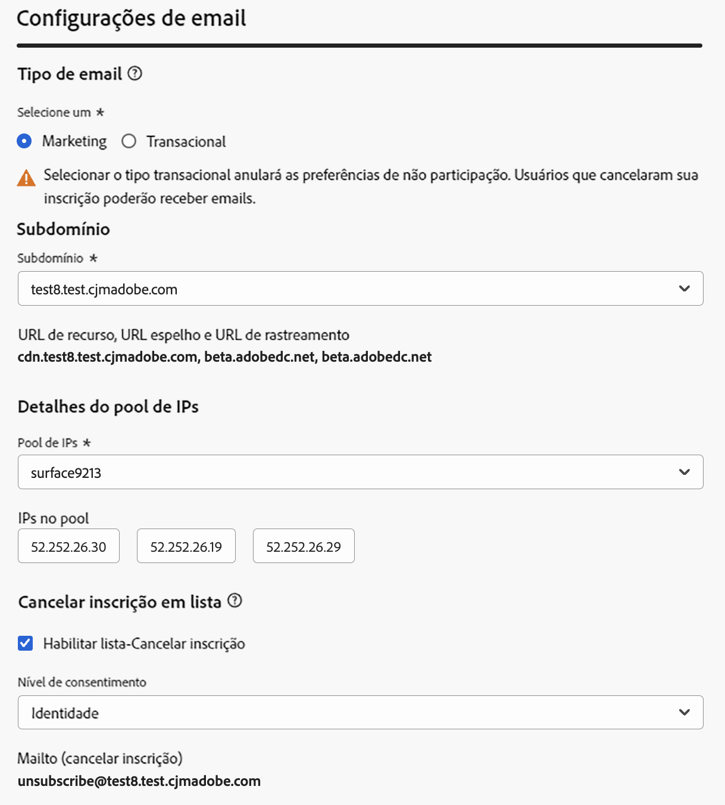

# Introdução à configuração de email {#get-starte-email-config}

Para enviar emails por meio de jornadas e campanhas no [!DNL Journey Optimizer], é necessário executar várias etapas de configuração.

1. Para garantir o deliverability ideal e proteger sua reputação, comece delegando ao Adobe os subdomínios que você usará para enviar seus emails com a [!DNL Journey Optimizer]. Esses subdomínios determinarão elementos, como as páginas da Web a serem rastreadas e os URLs da mirror page. [Saiba mais](../configuration/about-subdomain-delegation.md)

   

1. Melhore a capacidade de delivery de email e a reputação ao agrupar os endereços IP provisionados com sua instância. [Saiba mais](../configuration/ip-pools.md)

   

1. Crie as superfícies do canal e selecione o **[!UICONTROL Email]** canal. [Saiba mais](../configuration/channel-surfaces.md)

   

1. Em cada superfície de canal de email, configure todos os parâmetros técnicos necessários para enviar emails. [Saiba mais](email-settings.md)

   * É aqui que você seleciona o subdomínio a ser usado para enviar os emails e os pools de IP para associar à superfície. [Saiba mais](email-settings.md#subdomains-and-ip-pools)

   

   * O **[!UICONTROL Email do remetente]** e **[!UICONTROL Email de erro]** os endereços devem usar o subdomínio delegado selecionado atual. [Saiba mais](email-settings.md#email-header)

   

1. Determine qual endereço de email deve ser usado com prioridade para seus recipients quando vários endereços estiverem disponíveis no Adobe Experience Platform. [Saiba mais](../configuration/primary-email-addresses.md)

   

1. Gerencie o número de dias durante os quais são executadas tentativas antes do envio de endereços de email para a lista de supressão. [Saiba mais](../configuration/manage-suppression-list.md)

   
