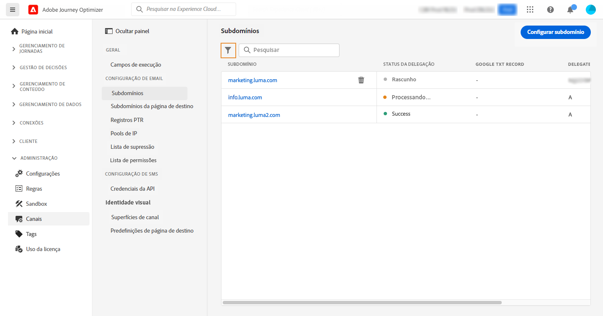
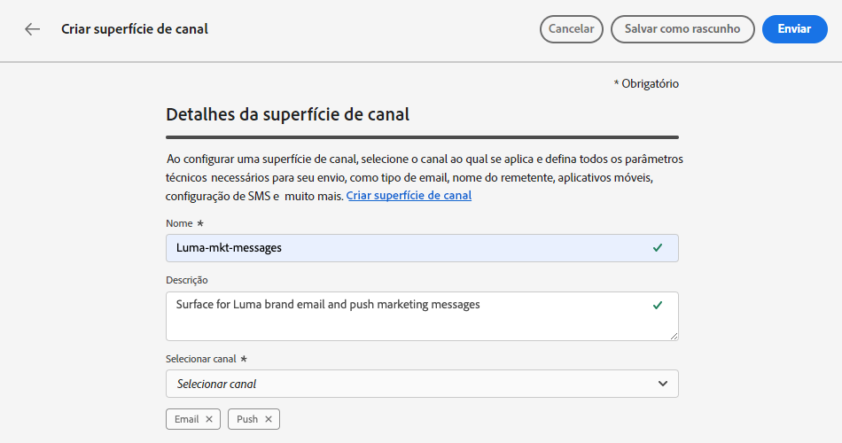
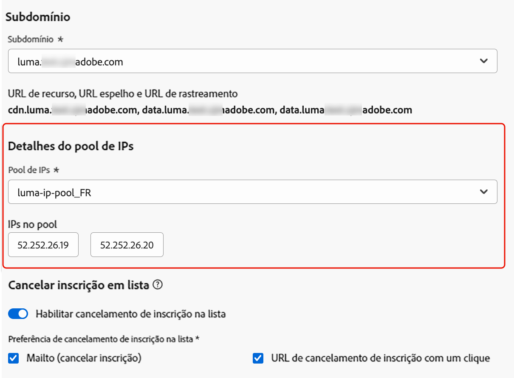
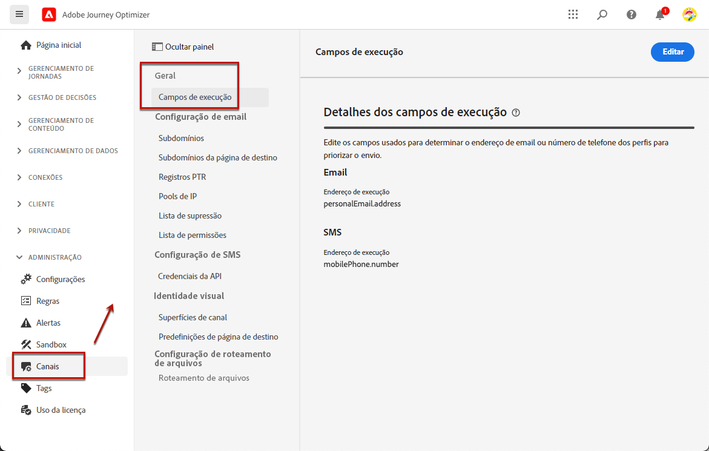
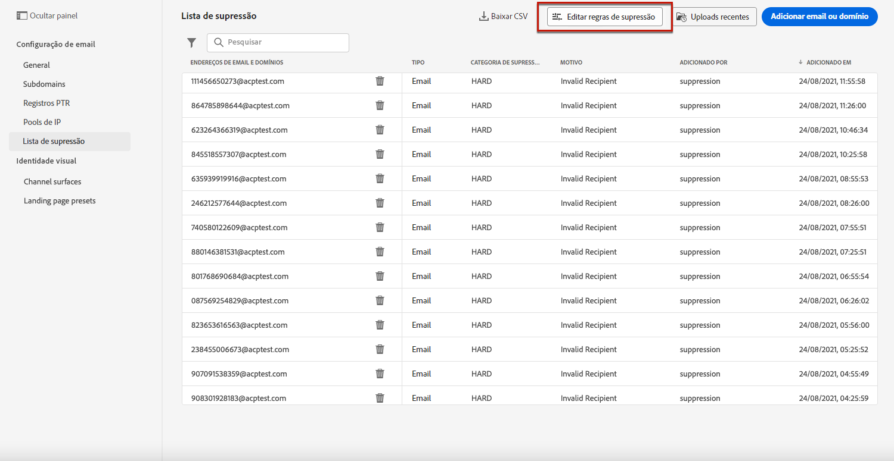

# Introdução à configuração de email {#get-starte-email-config}

>[!BEGINSHADEBOX]

**Nesta página:** saiba mais sobre as etapas essenciais para configurar o canal de email no Adobe Journey Optimizer, desde a delegação de subdomínios e a criação de pools de IP até a definição de configurações de canal, campos de execução e tentativas.

>[!ENDSHADEBOX]

A configuração do canal de email do Adobe Journey Optimizer é a porta de entrada para criar experiências de email impactantes e personalizadas que envolvem efetivamente o seu público-alvo.

Esta seção apresenta as etapas de configuração essenciais que devem ser seguidas para enviar emails pelo [!DNL Journey Optimizer]. Você também verá como configurar cabeçalhos de email, personalizar configurações para várias marcas, habilitar o rastreamento de URL para análise e até adicionar links de cancelamento de assinatura com um clique para a comodidade do usuário. Cada tópico baseia-se no anterior, fornecendo as ferramentas para ajustar a estratégia de email e, ao mesmo tempo, manter o controle e a precisão.

Para poder enviar emails por meio de jornadas e campanhas no [!DNL Journey Optimizer] é necessário executar várias etapas de configuração. Essas etapas estão listadas abaixo:

1. Para garantir a capacidade de entrega ideal e proteger sua reputação, comece **delegando à Adobe os subdomínios** que você usará para enviar emails com o [!DNL Journey Optimizer]. Esses subdomínios determinarão elementos como as páginas da Web a serem rastreadas e os URLs da mirror page. [Saiba mais](../configuration/about-subdomain-delegation.md)

   

1. Crie pools de IP para **agrupar endereços IP** provisionados na instância. [Saiba mais](../configuration/ip-pools.md)

   

1. Crie as **configurações de canal** e selecione o canal de **[!UICONTROL email]**. [Saiba mais](../configuration/channel-surfaces.md)

   

1. Em cada configuração do canal de email, defina todos os **parâmetros técnicos** necessários para entregar os emails. [Saiba mais](email-settings.md)

   * É aqui que você seleciona o subdomínio a ser usado para enviar os emails e os pools de IP para associar à configuração. [Saiba mais](email-settings.md#ip-pools)

   

   * O **[!UICONTROL Prefixo do email do remetente]** e o **[!UICONTROL Prefixo do email de erro]** usam o [subdomínio delegado](../configuration/about-subdomain-delegation.md) selecionado no momento. Opcionalmente, o **[!UICONTROL Nome do remetente]** e o **[!UICONTROL Email do remetente]** podem identificar uma parte transmissora diferente (endereço **Remetente** completo, não vinculado a esse sufixo de subdomínio). [Saiba mais](header-parameters.md#sender-header)

   

1. Conclua a configuração do seu canal de email definindo outros parâmetros avançados, como habilitar o CCO, definir o rastreamento de URL para análise ou adicionar links de cancelamento de assinatura com um clique para a comodidade do usuário. [Saiba mais](email-settings.md)

1. Determine quais **campos de execução** devem ser usados com prioridade para os destinatários quando vários endereços estiverem disponíveis na Adobe Experience Platform. [Saiba mais](../configuration/primary-email-addresses.md)

   

1. Gerencie o número de dias durante os quais são executadas **tentativas** antes do envio de endereços de email para a lista de supressão. [Saiba mais](../configuration/manage-suppression-list.md)

   

:::: landing-cards-container
:::

Introdução à configuração de email

Saiba mais sobre as etapas essenciais para configurar os recursos de email, incluindo delegação de subdomínio, pools de IPs e gerenciamento de listas de supressão.

[Iniciar configuração de email](get-started-email-config.md)
:::

:::

Definir as configurações de email

Defina configurações de email para capacidade de entrega, conformidade e personalização com recursos avançados, como CCO, substituições de supressão e rastreamento de URL.

[Ajustar configurações](email-settings.md)
:::

:::

Habilitar e configurar o cancelamento de assinatura da lista

Saiba como habilitar o recurso de “Cancelar assinatura da lista” para incluir URLs de cancelamento de assinatura com um clique em cabeçalhos de email para recusas de destinatários.

[Configurar o cancelamento de assinatura da lista](list-unsubscribe.md)
:::

:::

Configurar parâmetros de cabeçalho do email

Personalize endereços de email de remetentes e para resposta, lide com erros e encaminhe emails para uma comunicação eficiente.

[Configurar parâmetros de cabeçalho](header-parameters.md)
:::

:::

Configurar rastreamento de URL para o canal de email

Configure parâmetros de rastreamento de URL para medir a eficiência das campanhas de email e integrar as ferramentas de análise.

[Configurar rastreamento de URL](url-tracking.md)
:::

:::

Configurações de email personalizadas

Configure subdomínios dinâmicos, cabeçalhos personalizados e rastreamento de URL para fornecer experiências de email personalizadas.

[Configurar email personalizado](surface-personalization.md)
:::

::::
