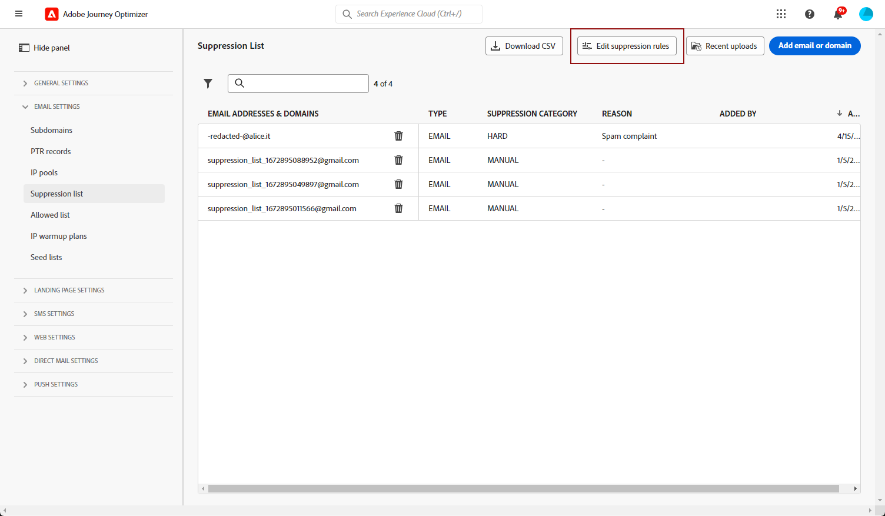

# Introdução à configuração de email {#get-starte-email-config}

Para poder enviar emails por meio de jornadas e campanhas no [!DNL Journey Optimizer] é necessário executar várias etapas de configuração.

1. Para garantir a capacidade de entrega ideal e proteger sua reputação, comece **delegando à Adobe os subdomínios** que você usará para enviar emails com o [!DNL Journey Optimizer]. Esses subdomínios determinarão elementos como as páginas da Web a serem rastreadas e os URLs da mirror page. [Saiba mais](../configuration/about-subdomain-delegation.md)

   

1. Crie pools de IP para **agrupar endereços IP** provisionados na instância. [Saiba mais](../configuration/ip-pools.md)

   

1. Crie as **configurações de canal** e selecione o canal de **[!UICONTROL email]**. [Saiba mais](../configuration/channel-surfaces.md)

   

1. Em cada configuração do canal de email, defina todos os **parâmetros técnicos** necessários para entregar os emails. [Saiba mais](email-settings.md)

   * É aqui que você seleciona o subdomínio a ser usado para enviar os emails e os pools de IP para associar à configuração. [Saiba mais](email-settings.md#ip-pools)

   

   * Os endereços do **[!UICONTROL Email do remetente]** e do **[!UICONTROL Email de erro]** devem usar o subdomínio delegado selecionado atual. [Saiba mais](email-settings.md#email-header)

   

1. Determine quais **campos de execução** devem ser usados com prioridade para os destinatários quando vários endereços estiverem disponíveis na Adobe Experience Platform. [Saiba mais](../configuration/primary-email-addresses.md)

   

1. Gerencie o número de dias durante os quais são executadas **tentativas** antes do envio de endereços de email para a lista de supressão. [Saiba mais](../configuration/manage-suppression-list.md)

   
