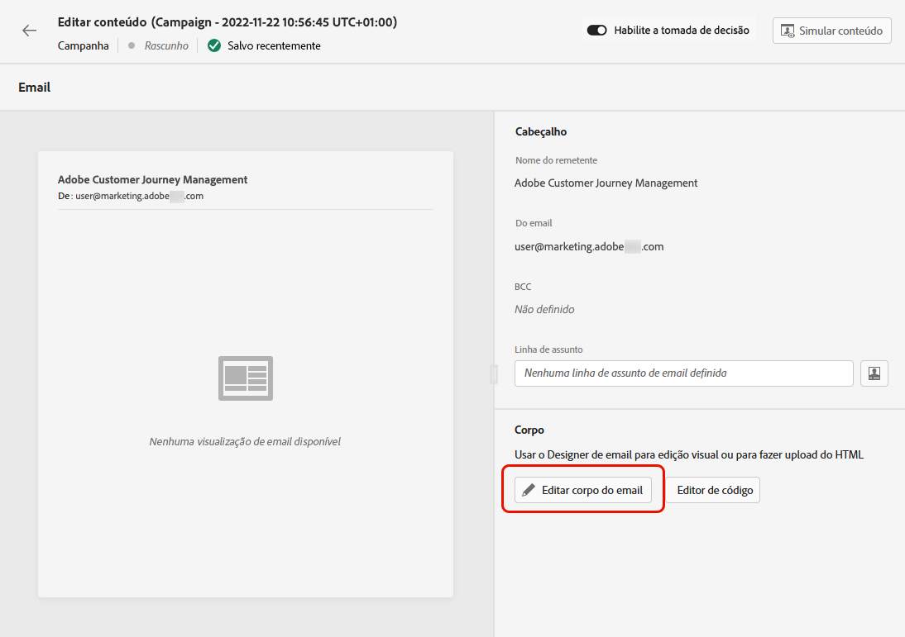
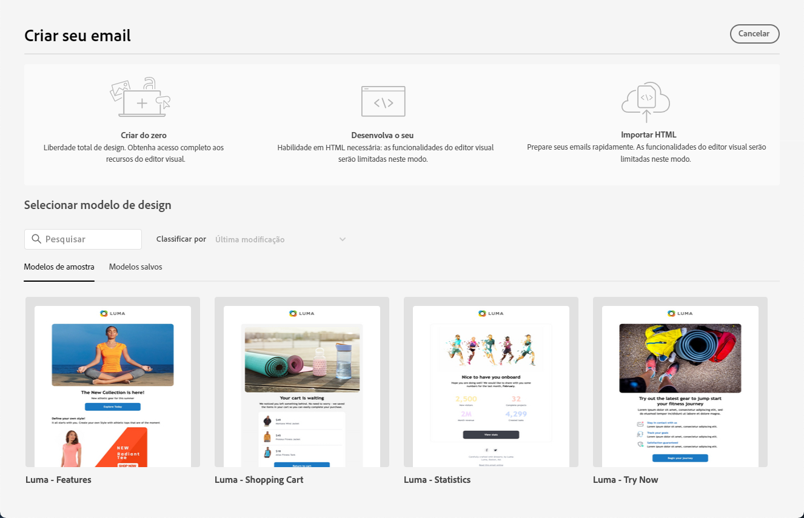
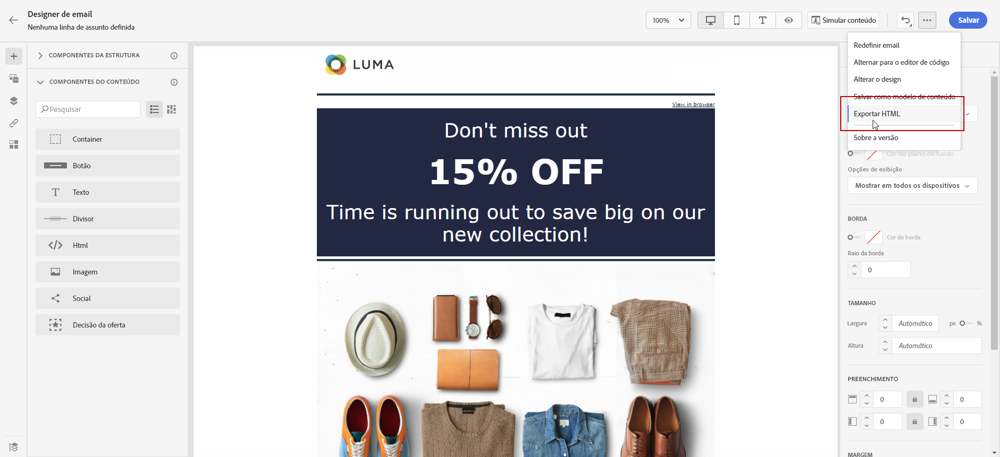

# Introdução ao design de email {#get-started-content-design}

É possível importar um conteúdo existente para o [!DNL Journey Optimizer] ou aproveitar os recursos de design de conteúdo:

* Usar os **recursos de design de email** do [!DNL Journey Optimizer] para criar ou importar emails responsivos. [Saiba mais](content-from-scratch.md)

* Aproveitar o **Adobe Experience Manager Assets Essentials** para enriquecer seus emails e criar e gerenciar seu próprio banco de dados de ativos. [Saiba mais](assets-essentials.md)

* Encontrar **fotos do Adobe Stock** para criar seu conteúdo e melhorar o design de emails. [Saiba mais](stock.md)

* Melhore a experiência dos clientes criando mensagens personalizadas e dinâmicas com base em seus atributos de perfil. Saiba mais sobre [personalização](../personalization/personalize.md) e [conteúdo dinâmico](../personalization/get-started-dynamic-content.md).

➡️ [Descubra este recurso no vídeo](#video)

## Práticas recomendadas de design de email {#best-practices}

Ao enviar emails, é importante considerar que os destinatários podem encaminhá-los, o que pode às vezes causar problemas com a renderização do email. Isso acontece particularmente ao usar classes CSS que podem não ser compatíveis com o provedor de email usado para encaminhamento, por exemplo, se estiver usando a classe CSS “is-desktop-hidden” para ocultar uma imagem em dispositivos móveis.

Para minimizar esses problemas de renderização, é recomendado manter a estrutura do design de emails o mais simples possível. Tente usar um único design que funcione bem tanto para desktops quanto para dispositivos móveis e evite usar classes CSS complexas ou outros elementos de design que possam não ser totalmente compatíveis com todos os clientes de email. Ao seguir essas práticas recomendadas, você ajuda a garantir que seus emails sejam renderizados corretamente de forma consistente, independentemente de como sejam visualizados ou encaminhados pelos destinatários.

## Etapas principais para criar conteúdo de email {#key-steps}

Depois de [adicionar um email](create-email.md) em uma jornada ou campanha, você pode começar a criar o conteúdo do email.

1. Na tela de configuração da jornada ou campanha, vá até a tela **[!UICONTROL Editar conteúdo]** para acessar o Designer de email. [Saiba mais](create-email.md#define-email-content)

   

1. Na página inicial do Designer de email, escolha uma das seguintes opções para criar o design do email:

   * **Crie o design do email do zero** por meio da interface do Designer de email e aproveite imagens do [Adobe Experience Manager Assets Essentials](assets-essentials.md). Saiba como criar o design do conteúdo de email [nesta seção](content-from-scratch.md).

   * **Codifique ou cole um HTML bruto** diretamente no Designer de email. Saiba como codificar seu próprio conteúdo [nesta seção](code-content.md).

      >[!NOTE]
      >
      >Em uma campanha, você também pode selecionar o botão **[!UICONTROL Editor de código]** da tela **[!UICONTROL Editar conteúdo]**. [Saiba mais](create-email.md#define-email-content)

   * **Importar conteúdo HTML existente** de um arquivo ou uma pasta .zip. Saiba como importar um conteúdo de email [nesta seção](existing-content.md).

   * **Selecionar um conteúdo existente** de uma lista de modelos incorporados ou personalizados. Saiba como trabalhar com modelos de email [nesta seção](email-templates.md).

   

1. Depois que o conteúdo do email tiver sido definido e personalizado, você poderá exportar o conteúdo para validação ou para uso posterior. Clique em **[!UICONTROL Exportar HTML]** para salvar em seu computador um arquivo zip que contém o HTML e os ativos.

   

## Vídeos tutoriais {#video}

Saiba como criar conteúdo de email com o editor de mensagens.

>[!VIDEO](https://video.tv.adobe.com/v/334150?quality=12)

Saiba como configurar experimentos de conteúdo para testes A/B e explorar o conteúdo de email que melhor impulsiona seus objetivos de negócios.

>[!VIDEO](https://video.tv.adobe.com/v/3419893)
