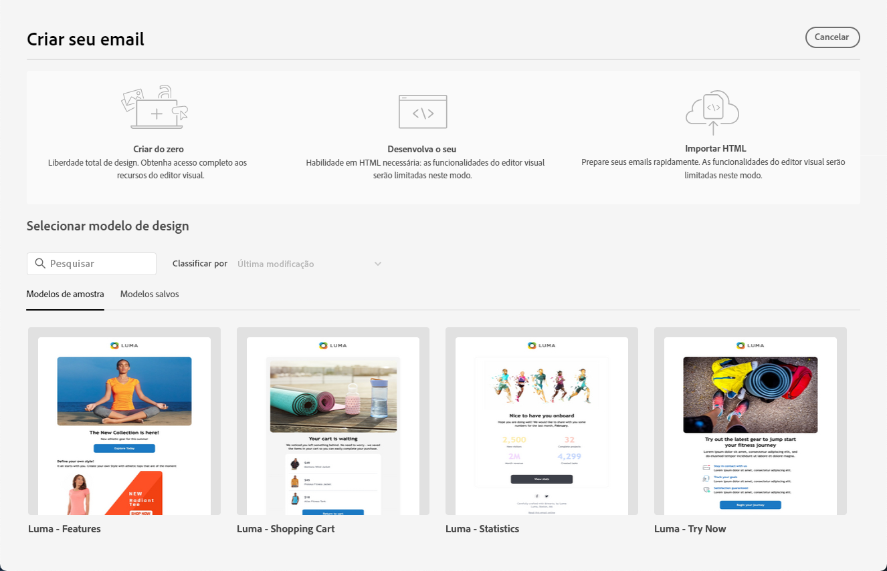
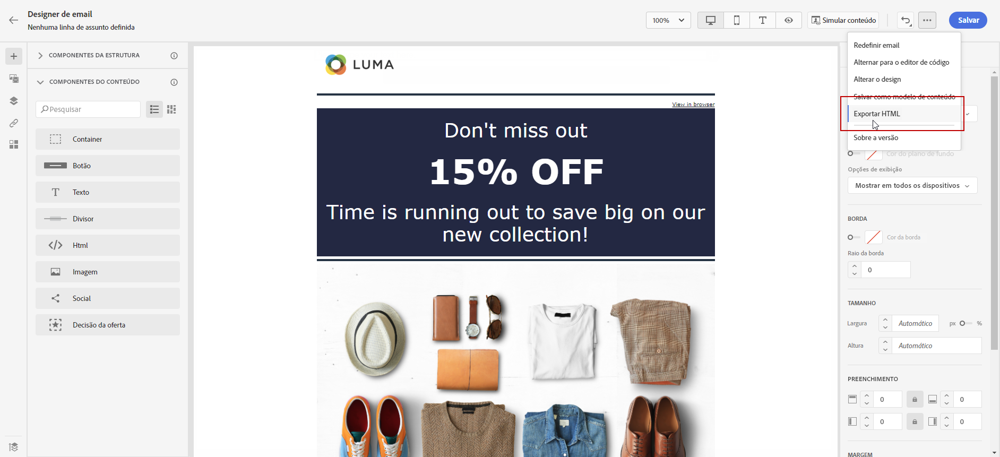

# Introdução ao design de email {#get-started-content-design}

>[!BEGINSHADEBOX]

**Nesta página:** saiba como projetar seu conteúdo de email no Designer de email, as principais etapas para criá-lo do zero, codificar ou importar o HTML e as práticas recomendadas que mantêm seus emails renderizados entre clientes.

>[!ENDSHADEBOX]

Para acessar o Designer de email e começar a criar o conteúdo do email, primeiro [crie um email](create-email.md) em uma jornada ou campanha.

É possível então usar os **recursos de design de email** do [!DNL Journey Optimizer] para importar conteúdo existente ou começar a criar emails responsivos do zero. [Saiba mais](content-from-scratch.md)

O Designer de email também permite:

* Aproveitar o **Adobe Experience Manager Assets Essentials** para enriquecer seus emails e criar e gerenciar seu próprio banco de dados de ativos. [Saiba mais](../integrations/assets.md)

* Encontrar **fotos do Adobe Stock** para criar seu conteúdo e melhorar o design de emails. [Saiba mais](../integrations/stock.md)

* Melhore a experiência dos clientes criando mensagens personalizadas e dinâmicas com base em seus atributos de perfil. Saiba mais sobre [personalização](../personalization/personalize.md) e [conteúdo dinâmico](../personalization/get-started-dynamic-content.md).

➡️ [Conheça este recurso no vídeo](#video)

## Etapas principais para criar conteúdo de email {#key-steps}

Após criar um email, é possível começar a projetar o conteúdo de email.

1. Na tela de configuração da jornada ou campanha, vá até a tela **[!UICONTROL Editar conteúdo]** para acessar o Designer de email. [Saiba mais](create-email.md#define-email-content)

   

1. Na página inicial do Designer de email, escolha uma das seguintes opções para criar o design do email:

   * **Projete seu email do zero** através da interface do Designer de email e aproveite as imagens do [Adobe Experience Manager Assets](../integrations/assets.md). Saiba como criar o design do conteúdo de email [nesta seção](content-from-scratch.md).

   * **Codifique ou cole um HTML bruto** diretamente no Designer de email. Saiba como codificar seu próprio conteúdo [nesta seção](code-content.md).

     >[!NOTE]
     >
     >Em uma campanha, você também pode selecionar o botão **[!UICONTROL Editor de código]** da tela **[!UICONTROL Editar conteúdo]**. [Saiba mais](create-email.md#define-email-content)

   * **Importar conteúdo HTML existente** de um arquivo ou uma pasta .zip. Saiba como importar um conteúdo de email [nesta seção](existing-content.md).

   * **Converter designs de imagem em modelos HTML** usando o conversor de imagem para HTML viabilizado por IA. Saiba como transformar imagens estáticas em modelos de email editáveis [nesta seção](../content-management/image-to-html.md).

   * **Selecionar um conteúdo existente** de uma lista de modelos integrados ou personalizados. Saiba como trabalhar com modelos de email [nesta seção](../email/use-email-templates.md).

   

1. Depois que o conteúdo de email for definido e personalizado, você poderá verificar seu conteúdo de email com as **verificações automatizadas de conteúdo** para capturar problemas de HTML e CSS — como tags não compatíveis, divs vazias e violações de limite de tamanho — diretamente no painel de criação, antes de enviar. [Saiba mais](content-check.md)

   

1. Você também pode validar a qualidade do conteúdo para identificar possíveis problemas de legibilidade, coesão do conteúdo e eficácia. [Saiba mais sobre validação da qualidade do conteúdo](../content-management/brands-score.md#validate-quality)

   

1. Por fim, você pode exportar seu conteúdo para validação ou para uso posterior. Clique em **[!UICONTROL Exportar HTML]** para salvar em seu computador um arquivo zip que contém o HTML e os ativos.

   

## Práticas recomendadas de design de email {#best-practices}

Ao enviar emails, é importante levar em consideração que os destinatários podem encaminhá-los, o que às vezes pode causar problemas na renderização do email. Isso acontece especialmente ao usar classes CSS que podem não ser compatíveis com o provedor de email usado para encaminhamento. Por exemplo, se estiver usando a classe CSS “is-desktop-hidden” para ocultar uma imagem em dispositivos móveis.

Para minimizar esses problemas de renderização, é recomendado manter a estrutura do design de emails o mais simples possível. Tente usar um único design que funcione bem tanto para desktops quanto para dispositivos móveis e evite usar classes CSS complexas ou outros elementos de design que possam não ser totalmente compatíveis com todos os clientes de email.

Ao seguir essas práticas recomendadas, você ajuda a garantir que seus emails sejam renderizados corretamente de forma consistente, independentemente de como sejam visualizados ou encaminhados pelos destinatários.

Consulte na tabela abaixo as práticas recomendadas de design de emails:

| Recomendado | Use com cuidado | Não recomendado |
|-|-|-|
| <ul><li><b>Layouts estáticos baseados em tabela</b> para a estrutura</li> <li><b>Tabelas em HTML e tabelas aninhadas</b> para consistência do layout</li> <li><b>Larguras do modelo</b> entre 600 px e 800 px </li> <li><b>CSS simples e em linha</b> para o estilo </li> <li><b>Fontes seguras para a web</b> para compatibilidade universal</li> | <ul><li><b>Imagens de fundo</b> podem não aparecer em certas plataformas de email.</li><li><b>Fontes da web personalizadas</b> não têm compatibilidade universal.</li><li><b>Layouts largos</b> podem ser exibidos incorretamente em telas menores.</li><li>Os <b>mapas de imagem</b> oferecem funcionalidade limitada.</li><li>O <b>CSS incorporado</b> às vezes é removido durante a entrega do email.</li> | <ul><li>Geralmente, o <b>JavaScript</b> não é compatível com ambientes de email.</li> <li> Tags <b>`<iframe>`</b> estão bloqueadas na maioria das plataformas. </li> <li>O <b>Flash</b> está obsoleto e não é mais compatível.</li> <li><b>Áudios integrados</b> muitas vezes não podem ser reproduzidos.</li> <li><b>Vídeos integrados</b> são incompatíveis com várias plataformas de email.</li> <li> <b>Formulários</b> não funcionam nos emails.</li> <li> A disposição em camadas de `
` pode causar problemas de renderização.</li> |

>[!NOTE]
>
>A [Lei Europeia de Acessibilidade](https://eur-lex.europa.eu/legal-content/EN/TXT/?uri=CELEX%3A32019L0882){target="_blank"} declara que todas as comunicações digitais devem ser acessíveis. Além das práticas recomendadas de design de email listadas nesta seção, certifique-se de seguir também as diretrizes listadas [nesta página](accessible-content.md) que são específicas para criar conteúdo acessível com o Designer de email.

## Vídeos tutoriais {#video}

Saiba como criar conteúdo de email com o editor de mensagens.

>[!VIDEO](https://video.tv.adobe.com/v/334150?quality=12)

Saiba como configurar experimentos de conteúdo para testes A/B e explorar o conteúdo de email que melhor impulsiona seus objetivos de negócios.

>[!VIDEO](https://video.tv.adobe.com/v/3419893)
