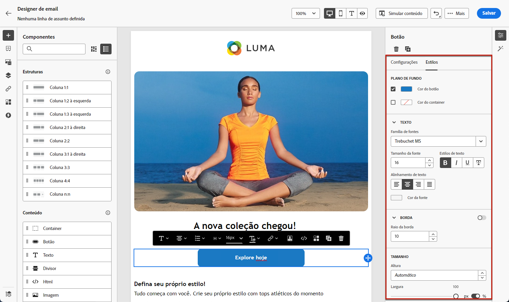

# Introdução ao estilo de email {#get-started-email-style}

Após começar a criar o conteúdo de email no [!DNL Journey Optimizer], é possível ajustar diversos parâmetros e atributos de estilo no painel **[!UICONTROL Estilos]** do Designer de email.

Você pode aplicar as alterações ao corpo do email, a um componente de estrutura ou a um componente de conteúdo.

Siga os links abaixo para descobrir como ajustar algumas das configurações de estilo no seu email.

* Saiba como [personalizar o plano de fundo do email](backgrounds.md)
* Saiba como [gerenciar o alinhamento vertical e o preenchimento](alignment-and-padding.md)
* Saiba como [personalizar atributos de estilo incorporado](inline-styling.md)
* Saiba como [adicionar CSS personalizado ao conteúdo de emails](custom-css.md)
* Saiba como [gerenciar conteúdo no modo escuro](dark-mode.md)

>[!NOTE]
>
>A [Lei Europeia de Acessibilidade](https://eur-lex.europa.eu/legal-content/EN/TXT/?uri=CELEX%3A32019L0882){target="_blank"} declara que todas as comunicações digitais devem ser acessíveis. Certifique-se de seguir as diretrizes específicas de estilo listadas [nesta página](../email/accessible-content.md) ao criar conteúdo no [!DNL Journey Optimizer] como o ajuste de cores, rótulos e ícones para garantir clareza e a otimização do design para layouts móveis e responsivos.