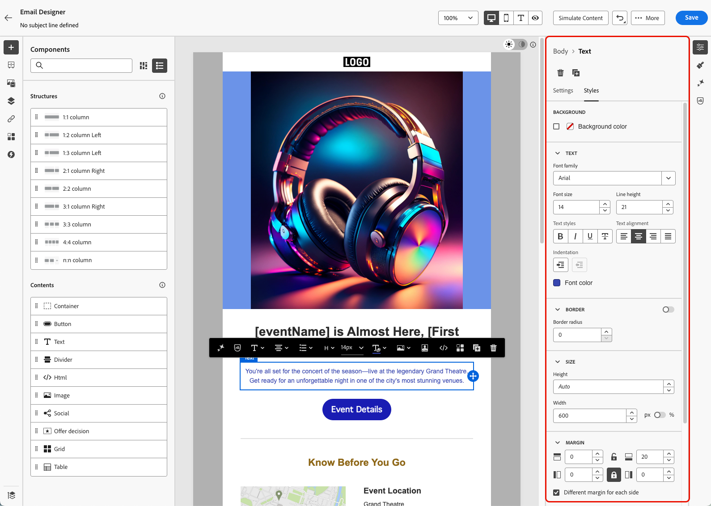

# Introdução ao estilo de email {#get-started-email-style}

>[!BEGINSHADEBOX]

**Nesta página:** Saiba como ajustar o estilo do seu conteúdo de email no painel Estilos de Email do Designer, aplicando configurações como cores, fontes, bordas, margens e preenchimento aos componentes de corpo, estrutura ou conteúdo.

>[!ENDSHADEBOX]

Após começar a criar o conteúdo de email no [!DNL Journey Optimizer], é possível ajustar diversos parâmetros e atributos de estilo no painel **[!UICONTROL Estilos]** do Designer de email.

Você pode aplicar as alterações ao corpo do email, a um componente de estrutura ou a um componente de conteúdo.

Selecione qualquer elemento no email e clique na guia **[!UICONTROL Estilos]**. Todas as opções de estilo do elemento selecionado são exibidas no painel direito.

Por exemplo, se você selecionar um componente de texto:

* É possível ajustar a **[!UICONTROL cor do fundo]** e a **[!UICONTROL cor da fonte]** desse parágrafo;
* É possível atualizar os parâmetros de **[!UICONTROL Texto]**, como família de fontes, tamanho, altura, alinhamento etc., e gerenciar o espaçamento antes do primeiro caractere em uma linha usando a configuração **[!UICONTROL Recuo]**;
* Também é possível ajustar opções como **[!UICONTROL Borda]**, **[!UICONTROL Margem]** e **[!UICONTROL Preenchimento]** do componente de texto.

Se você está usando um [modelo de conteúdo](use-email-templates.md) padrão ou se tiver aplicado um tema ao email, somente é possível ajustar algumas configurações de estilo para corresponder ao tema selecionado. [Saiba mais sobre temas](apply-email-themes.md)

Siga os links abaixo para descobrir como ajustar algumas das configurações de estilo no email.

* Saiba como [personalizar o plano de fundo do email](backgrounds.md)
* Saiba como [gerenciar o alinhamento vertical e o preenchimento](alignment-and-padding.md)
* Saiba como [personalizar atributos de estilo incorporado](inline-styling.md)
* Saiba como [adicionar CSS personalizado ao conteúdo de emails](custom-css.md)
* Saiba como [gerenciar conteúdo no modo escuro](dark-mode.md)

>[!NOTE]
>
>A [Lei Europeia de Acessibilidade](https://eur-lex.europa.eu/legal-content/EN/TXT/?uri=CELEX%3A32019L0882){target="_blank"} declara que todas as comunicações digitais devem ser acessíveis. Certifique-se de seguir as diretrizes específicas de estilo listadas [nesta página](../email/accessible-content.md) ao criar conteúdo no [!DNL Journey Optimizer] como o ajuste de cores, rótulos e ícones para garantir clareza e a otimização do design para layouts móveis e responsivos.