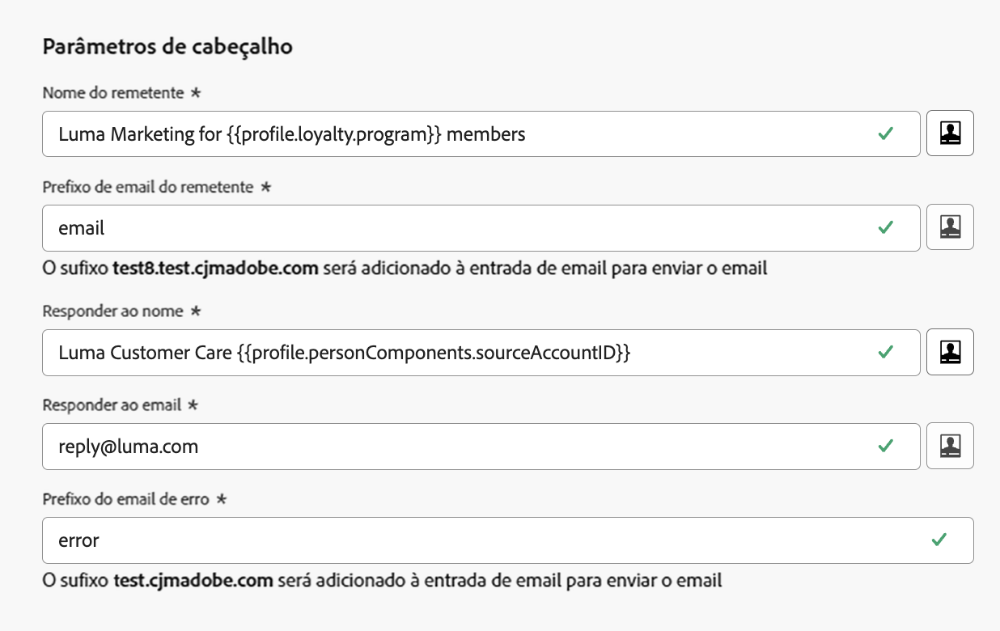

# Parâmetros de cabeçalho {#email-header}

Ao configurar uma nova [configuração de canal de email](email-settings.md), na seção **[!UICONTROL Parâmetros de cabeçalho]**, insira os nomes e endereços de email do remetente associados ao tipo de email enviado usando essa configuração.

>[!NOTE]
>
>Para ter maior controle sobre as configurações de email, é possível personalizar os parâmetros do cabeçalho. [Saiba mais](../email/surface-personalization.md#personalize-header)
>
>Ao [editar uma configuração de email](../configuration/channel-surfaces.md#edit-channel-surface), não é possível adicionar novos [atributos de perfil](../personalization/personalization-build-expressions.md#sources) aos parâmetros de cabeçalho. Você deve criar uma nova configuração de canal.

* **[!UICONTROL Nome do remetente]**: o nome do remetente, como o nome da sua marca.

* **[!UICONTROL Prefixo do email do remetente]**: o endereço de email que você deseja usar para suas comunicações.

* **[!UICONTROL Responder a (nome)]**: o nome que será usado quando o destinatário clicar no botão **Responder** do software do cliente de email.

* **[!UICONTROL Email de resposta]**: o endereço de email que será usado quando o destinatário clicar no botão **Responder** do software do cliente de email. [Saiba mais](#reply-to-email)

* **[!UICONTROL Prefixo do email de erro]**: todos os erros gerados pelos ISPs após alguns dias de entrega de emails (rejeições assíncronas) são recebidos neste endereço. As notificações de ausência e as respostas de desafio também são recebidas neste endereço.

  Se quiser receber notificações de ausência e respostas de desafio em um endereço de email específico que não esteja delegado à Adobe, será necessário configurar um [processo de encaminhamento](#forward-email). Nesse caso, verifique se você tem uma solução manual ou automatizada para processar os emails que chegam a essa caixa de entrada.

>[!NOTE]
>
>Os endereços de **[!UICONTROL Prefixo do email do remetente]** e **[!UICONTROL Prefixo do email de erro]** usam o [subdomínio delegado](../configuration/about-subdomain-delegation.md) selecionado no momento para enviar o email. Por exemplo, se o subdomínio delegado for *marketing.luma.com*:
>
>* Insira *contato* como o **[!UICONTROL Prefixo do email do remetente]**: o email do remetente é *contact@marketing.luma.com*.
>* Insira *erro* como o **[!UICONTROL Prefixo do email de erro]**: o endereço de erro é *error@marketing.luma.com*.

{width="80%"}

>[!NOTE]
>
>Para **[!UICONTROL Do prefixo de email]** e **[!UICONTROL Prefixo de email de erro]**, os valores devem começar com uma letra (A-Z) e podem conter apenas caracteres alfanuméricos. Você também pode usar sublinhado `_`, ponto `.` e hífen `-` caracteres.

## Cabeçalhos do remetente {#sender-header}

>[!CONTEXTUALHELP]
>id="ajo_admin_preset_sender_header"
>title="Cabeçalhos do remetente"
>abstract="Use esses campos opcionais quando a entidade de transmissão (Remetente) for diferente da entidade de criação (De), por exemplo, uma empresa principal que envia mensagens para uma marca secundária ou uma agência que envia para vários clientes. Os clientes de email que oferecem suporte a isso normalmente implementam uma renderização como “Remetente em nome de De” ou mostram um indicador “via”."

Alguns casos de uso exigem que a caixa de correio que transmite a mensagem seja diferente do autor **De**, por exemplo, uma organização principal enviando em nome de uma subsidiária, uma equipe de marketing compartilhado para várias marcas ou uma agência enviando para vários clientes.

Em outras palavras, **De** é o autor da mensagem (de quem o email é &quot;de&quot;) e **Remetente** é o agente responsável por transmitir a mensagem (que na verdade a enviou). O campo **Remetente** deve ser usado quando a entidade de transmissão for diferente do autor.

Nesse caso, você pode definir um nome e um endereço de email do **Remetente** diferentes para serem adicionados ao cabeçalho do email usando os seguintes campos na seção **Cabeçalhos do remetente**:

* **[!UICONTROL Nome do remetente]**: o nome do responsável pela transmissão da mensagem quando ela for diferente do autor **De**.

* **[!UICONTROL Email do remetente]**: o endereço de email desse participante transmissor.

{width="80%"}

>[!NOTE]
>
>Esses campos são opcionais. Você pode [personalizar](surface-personalization.md#personalize-header) como outros campos de cabeçalho.

Quando o **[!UICONTROL Nome do remetente]** e o **[!UICONTROL Email do remetente]** estão definidos, o [!DNL Journey Optimizer] adiciona um cabeçalho SMTP **Remetente** ao email<!--as defined in [RFC 5322](https://datatracker.ietf.org/doc/html/rfc5322#section-3.6.2){target="_blank"}-->. Os clientes de email que oferecem suporte a isso podem mostrar palavras como **Remetente em nome de De** ou um indicador **via**.

>[!NOTE]
>
>Se você deixar o **[!UICONTROL Nome do remetente]** e o **[!UICONTROL Email do remetente]** vazios, ou se o **Remetente** resolvido for idêntico ao **De**, nenhum cabeçalho do **Remetente** será adicionado.

Notas:

* O endereço **Remetente** não é usado para alinhamento de SPF, DKIM ou DMARC; somente a validação **formato** é executada. SPF, DKIM e DMARC continuam a depender dos campos **De**. O [subdomínio delegado](../configuration/about-subdomain-delegation.md) selecionado para a configuração permanece o domínio de envio usado para essas verificações.

* Se **Remetente** estiver configurado e a personalização não resolver para um valor para um destinatário, a mensagem não será entregue a esse destinatário.

## Email de resposta {#reply-to-email}

É possível especificar qualquer endereço como **[!UICONTROL Email de resposta]**, desde que este seja um endereço de email válido, esteja no formato correto e não contenha erros de digitação.

A caixa de entrada de respostas receberá todos os emails de resposta, exceto notificações de ausência e respostas de desafio, que serão recebidos no endereço de **Email de erro**.

Para garantir o gerenciamento de respostas adequado, siga as recomendações abaixo:

* Verifique se a caixa de entrada dedicada tem capacidade suficiente para receber todos os emails de resposta enviados usando a configuração de email. Se a caixa de entrada retornar rejeições, algumas respostas de clientes podem não ser recebidas.

* O processamento de respostas deve respeitar os requisitos de privacidade e conformidade, pois estas podem conter informações de identificação pessoal (PII).

* Não marque mensagens como spam na caixa de entrada de resposta, pois isso afetará todas as outras respostas enviadas para esse endereço.

Além disso, ao definir o endereço de **[!UICONTROL Email de resposta]**, certifique-se de usar um subdomínio que tenha uma configuração de registro MX válida, caso contrário, o processamento da configuração de email falhará.

Se você receber um erro ao enviar a configuração de email, isto significa que o registro MX não está configurado para o subdomínio do endereço inserido. Entre em contato com o(a) admin para configurar o registro MX correspondente ou use outro endereço com uma configuração de registro MX válida.

>[!NOTE]
>
>Se o subdomínio do endereço inserido for um domínio [totalmente delegado](../configuration/delegate-subdomain.md#set-up-subdomain) à Adobe, entre em contato com o representante da Adobe.

## Email de encaminhamento {#forward-email}

Para encaminhar a um endereço de email específico todos os emails recebidos pelo [!DNL Journey Optimizer] referentes ao subdomínio delegado, entre em contato com o Atendimento ao cliente da Adobe.

>[!NOTE]
>
>Se o subdomínio usado para o endereço de **[!UICONTROL Email de resposta]** não for delegado à Adobe, o encaminhamento não funcionará para esse endereço.

É necessário fornecer:

* O endereço de email de encaminhamento de sua escolha. Observe que o domínio do endereço de email de encaminhamento não pode corresponder a nenhum subdomínio delegado à Adobe.
* O nome da sandbox.
* O nome da configuração ou o subdomínio para o qual o endereço de email de encaminhamento será usado.
  <!--* The current **[!UICONTROL Reply to (email)]** address or **[!UICONTROL Error email]** address set at the channel configuration level.-->

>[!NOTE]
>
>* Só pode haver um endereço de email de encaminhamento por subdomínio — se várias configurações usarem o mesmo subdomínio, o mesmo endereço de email de encaminhamento deverá ser usado para todos eles.
>* Se o encaminhamento não estiver habilitado, os emails enviados diretamente para o endereço de **Do email** serão descartados por padrão.

O endereço de email de encaminhamento é definido pela Adobe. Isso pode levar de 3 a 4 dias.

Após a conclusão desse processo, todas as mensagens recebidas nos endereços de **[!UICONTROL Email de resposta]** e **Email de erro**, bem como todos os emails enviados para o endereço de **Email do remetente** serão encaminhados para o endereço de email específico fornecido.

