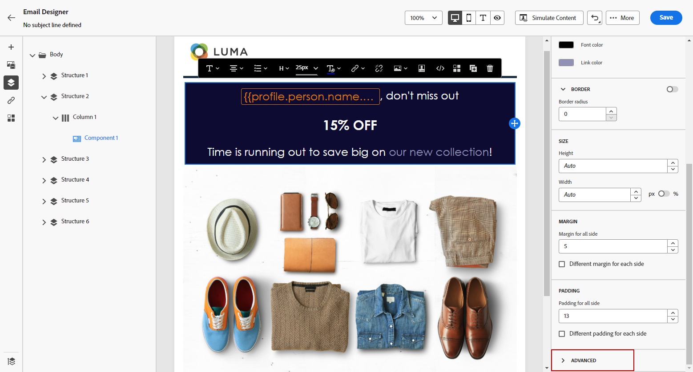

# Adicionar atributos de estilo incorporado {#inline-styling}

Na interface do Designer de email, ao selecionar um elemento e exibir suas configurações no painel lateral, você pode personalizar os atributos em linha e seus valores para esse elemento específico.

1. Selecione um elemento no seu conteúdo.

1. No **[!UICONTROL Estilos]** , procure pelo **[!UICONTROL Estilos em linha]** configurações no **[!UICONTROL Avançado]** menu suspenso.

   

1. Modifique os valores dos atributos existentes ou adicione novos usando o **+** botão. É possível adicionar qualquer atributo e valor que seja compatível com CSS.

   

O estilo é aplicado ao elemento selecionado. Se os elementos derivados não tiverem atributos de estilo específicos definidos, o estilo do elemento principal será herdado.
