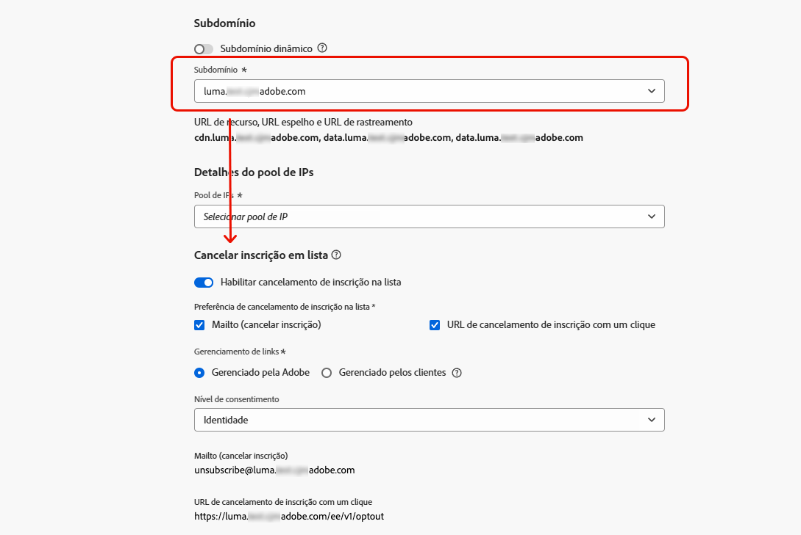
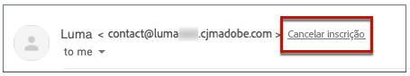
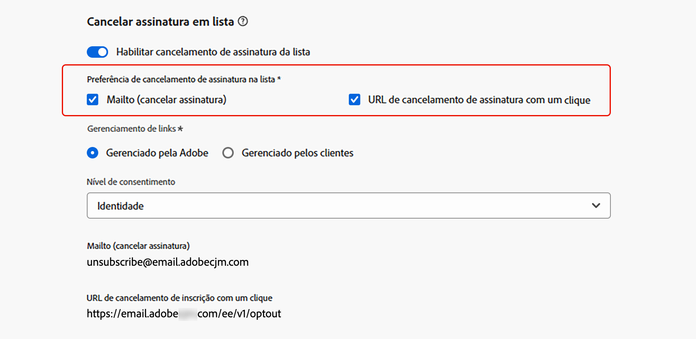
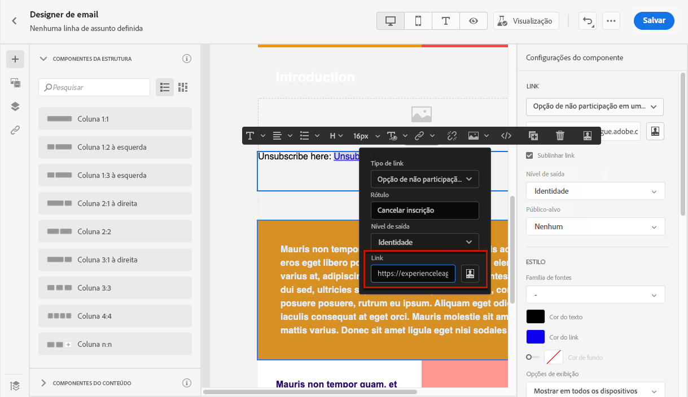
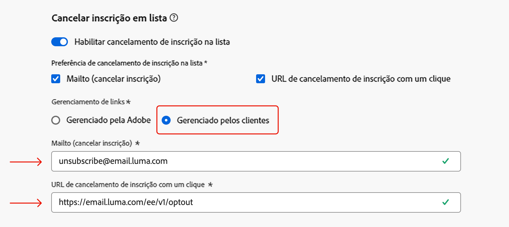

# Cancelar inscrição em lista{#list-unsubscribe}

<!--Do not modify - Legal Review Done -->

No [!DNL Adobe Journey Optimizer], ao configurar uma nova configuração de canal de email, após [selecionar um subdomínio](email-settings.md#ip-pools) da lista, a opção **[!UICONTROL Habilitar List-Unsubscribe]** será exibida. Ela é ativada por padrão.



O URL para cancelar a inscrição na lista com um clique é um link ou botão para cancelar inscrição exibido ao lado das informações do remetente do email e permite que os destinatários excluam instantaneamente suas listas de endereçamento com um único clique.

Por exemplo, o URL de cancelamento de inscrição com um clique exibe um link, como abaixo no Gmail:



>[!IMPORTANT]
>
>Para exibir o URL de cancelamento de inscrição com um clique no cabeçalho do email, o cliente de email dos destinatários deve ser compatível com esse recurso.

Dependendo do cliente de email e das configurações de cancelamento de subscrição do email, clicar no link de cancelamento de subscrição no cabeçalho do email pode ter o seguinte impacto:

* Quando o recurso **Mailto (cancelar assinatura)** está habilitado, a solicitação de cancelamento de assinatura é enviada para o endereço de cancelamento de assinatura padrão com base no subdomínio que você configurou.
* Quando o recurso **Cancelar inscrição da URL** com um clique está habilitado - ou se você inseriu uma URL de cancelamento de inscrição no conteúdo do corpo do email -, o destinatário é recusado diretamente, no nível do canal ou no nível da ID (dependendo de como o consentimento está configurado), quando o destinatário clica na URL de cancelamento de inscrição com um clique (com base no subdomínio que você configurou).

>[!NOTE]
>
>Saiba como gerenciar as configurações de cancelamento de assinatura em [esta seção](#enable-list-unsubscribe) abaixo.

Em ambos os casos, quando um recipient clica no link de recusa, sua solicitação de cancelamento de inscrição é processada adequadamente. O perfil correspondente foi cancelado imediatamente e esta escolha é atualizada no [Experience Platform](https://experienceleague.adobe.com/docs/experience-platform/profile/ui/user-guide.html?lang=pt-BR){target="_blank"}. Saiba mais sobre o processamento de consentimento na [documentação do Experience Platform](https://experienceleague.adobe.com/docs/experience-platform/landing/governance-privacy-security/consent/adobe/overview.html?lang=pt-BR){target="_blank"}.

>[!NOTE]
>
>Ocasionalmente, os eventos de cancelamento de inscrição podem levar mais tempo para refletir no nível do perfil devido ao processamento de dados downstream. Aguarde algum tempo para que o sistema seja atualizado.

## Habilitar cancelamento de inscrição da lista {#enable-list-unsubscribe}

>[!CONTEXTUALHELP]
>id="ajo_admin_preset_unsubscribe"
>title="Adicionar um URL de cancelamento de inscrição aos emails"
>abstract="Habilite essa opção para adicionar automaticamente um URL de cancelamento de inscrição ao cabeçalho do email. Também é possível definir um URL para cancelar a inscrição em uma mensagem inserindo um link para opção de não participação com um clique no conteúdo do email."
>additional-url="https://experienceleague.adobe.com/pt-br/docs/journey-optimizer/using/channels/email/email-opt-out#one-click-opt-out" text="Definir a opção de não participação com um clique no conteúdo do email"

Quando a opção **[!UICONTROL Habilitar List-Unsubscribe]** estiver habilitada, se o cliente de email dos destinatários oferecer suporte, o cabeçalho do email incluirá um email e/ou uma URL por padrão que os destinatários podem usar para cancelar a inscrição na lista de endereçamento.

>[!NOTE]
>
>Se você desativar essa opção, nenhum URL de cancelamento de inscrição com um clique será exibido no cabeçalho do email.

O cabeçalho de cancelamento de inscrição da lista oferece duas opções, que são ativadas por padrão, a menos que você desmarque uma ou ambas:

{width="80%"}

* Um endereço **[!UICONTROL Mailto (cancelar assinatura)]**, que é o endereço de destino para o qual as solicitações de cancelamento de assinatura são encaminhadas para processamento automático. No [!DNL Journey Optimizer], o endereço de email de cancelamento de inscrição é o endereço **[!UICONTROL Mailto (cancelar assinatura)]** padrão exibido na configuração do canal, com base no [subdomínio selecionado](email-settings.md#subdomains). <!--With this method, clicking the Unsubscribe link sends a pre-filled email to the unsubscribe address specified in the email header.-->

* A **[!UICONTROL URL de cancelamento de inscrição]** com um clique, que por padrão é o cabeçalho de cancelamento de inscrição de lista gerado com um clique, com base no [subdomínio selecionado](email-settings.md#subdomains). <!--With this method, clicking the Unsubscribe link directly unsubscribes the user, requiring only a single action to unsubscribe.-->

Você pode selecionar o **[!UICONTROL Nível de consentimento]** na lista suspensa correspondente. Pode ser específico do canal ou da identidade do perfil. Com base nessa configuração, quando um usuário cancela a assinatura usando a URL de cancelamento de inscrição da lista no cabeçalho de um email, o consentimento é atualizado em [!DNL Adobe Journey Optimizer], no nível do canal ou no nível da ID.

## Medidas de proteção e recomendações {#list-unsubscribe-guardrails}

O recurso de URL de cancelamento de inscrição na lista de um clique permite que seus recipients recusem facilmente suas comunicações. No entanto, como nem todos os clientes de email dão suporte a este link no cabeçalho do email, a Adobe recomenda que você também adicione um [link para opção de não participação com um clique](email-opt-out.md#one-click-opt-out) ou um [link para cancelamento de inscrição](email-opt-out.md#add-unsubscribe-link) no corpo do email.

O recurso **[!UICONTROL Mailto (cancelar assinatura)]** e o recurso **[!UICONTROL URL de cancelamento de assinatura]** com um clique são opcionais.

* Se você ativou a opção **[!UICONTROL Habilitar List-Unsubscribe]** nas [configurações de email](email-settings.md), recomendamos que você ative ambos os métodos - **Mailto (cancelar assinatura)** e **URL de Cancelamento de Assinatura com Um Clique**. Nem todos os clientes de email oferecem suporte ao método HTTP. Com o recurso Mailto list-unsubscribe fornecido para que você selecione uma alternativa, a reputação do remetente pode ser mais bem protegida e todos os recipients podem ter acesso para usar a funcionalidade de cancelamento de inscrição.

* Se você não quiser usar o URL de cancelamento de inscrição de um clique gerado padrão, é possível desmarcar o recurso.

   * No cenário em que a opção **[!UICONTROL Habilitar List-Unsubscribe]** está ativada e o recurso **[!UICONTROL Cancelar inscrição da URL]** com um clique está desmarcado, se você adicionar um [link para opção de não participação com um clique](../email/email-opt-out.md#one-click-opt-out) a uma mensagem criada usando essa configuração, o cabeçalho de cancelamento de inscrição da Lista selecionará o link para opção de não participação com um clique inserido no corpo do email e o usará como o valor da URL para cancelamento de inscrição com um clique.

     

   * Se você não adicionar um link de recusa de um clique no conteúdo da mensagem e a **[!UICONTROL URL de cancelamento de inscrição]** padrão com um clique estiver desmarcada nas configurações do canal, nenhuma URL será passada para o cabeçalho do email como parte do cabeçalho de cancelamento de inscrição da Lista.

  >[!NOTE]
  >
  >Saiba mais sobre como gerenciar recursos de cancelamento de inscrição em suas mensagens [nesta seção](../email/email-opt-out.md#unsubscribe-header).

Em [!DNL Journey Optimizer], o consentimento é gerido pelo [Esquema de consentimento](https://experienceleague.adobe.com/docs/experience-platform/xdm/field-groups/profile/consents.html?lang=pt-BR){target="_blank"} da Experience Platform. Por padrão, o valor do campo de consentimento fica vazio e é tratado como consentimento para receber suas comunicações. Durante a integração, é possível modificar este valor padrão para um dos valores possíveis listados [aqui](https://experienceleague.adobe.com/docs/experience-platform/xdm/data-types/consents.html?lang=pt-BR#choice-values){target="_blank"} ou usar [políticas de consentimento](../action/consent.md) para substituir a lógica padrão.

Atualmente, o [!DNL Journey Optimizer] não anexa uma tag específica para cancelar a inscrição de eventos acionados pelo recurso de cancelamento de inscrição de lista. Se você precisar diferenciar os cliques de cancelamento de inscrição da lista de outras ações de cancelamento de inscrição, é necessário implementar a marcação personalizada externamente ou aproveitar uma página de aterrissagem externa para rastreamento.

## Gerenciar dados de cancelamento de inscrição externamente {#custom-managed}

>[!CONTEXTUALHELP]
>id="ajo_email_config_unsubscribe_custom"
>title="Definir como os dados de cancelamento de inscrição são gerenciados"
>abstract="**Adobe managed**: os dados de consentimento são gerenciados por você no sistema Adobe.<br>**Gerenciado pelo cliente**: os dados de consentimento são gerenciados por você em um sistema externo e nenhuma sincronização de dados de consentimento é atualizada no sistema da Adobe, a menos que tenha sido iniciada por você."

>[!CONTEXTUALHELP]
>id="ajo_email_config_unsubscribe_custom_url"
>title="Insira seu próprio URL para cancelar inscrição com um clique"
>abstract="A **URL para Cancelar Inscrição com Um Clique** deve usar o método de solicitação POST."

Se você estiver gerenciando o consentimento fora do Adobe, selecione a opção **[!UICONTROL Gerenciado pelo cliente]** para inserir um endereço de email de cancelamento de inscrição personalizado e sua própria URL de cancelamento de inscrição com um clique.

{width="80%"}

A **[!UICONTROL URL para Cancelar Inscrição com Um Clique]** deve ser uma URL POST.

>[!WARNING]
>
>Se você estiver usando a opção **[!UICONTROL Gerenciada pelo cliente]**, a Adobe não armazenará dados de cancelamento de inscrição ou consentimento. Com a opção **[!UICONTROL Gerenciado pelo cliente]**, as organizações optam por usar um sistema externo e serão responsáveis por gerenciar seus dados de consentimento nesse sistema externo. Não há sincronização automática de dados de consentimento entre o sistema externo e [!DNL Journey Optimizer]. Qualquer sincronização de dados de consentimento, proveniente do sistema externo para atualizar dados de consentimento do usuário em [!DNL Journey Optimizer], deve ser iniciada pela organização como uma transferência de dados para enviar os dados de consentimento de volta para [!DNL Journey Optimizer].

### Anexar atributos personalizados aos seus pontos de extremidade {#custom-attributes}

Com a opção **[!UICONTROL Gerenciado pelo cliente]** selecionada, se você inserir pontos de extremidade personalizados e usá-los em uma campanha ou jornada, o [!DNL Journey Optimizer] anexará alguns parâmetros específicos do perfil padrão ao evento de atualização de consentimento <!--sent to the custom endpoint --> quando os destinatários clicarem no link de cancelamento de inscrição.

Para personalizar ainda mais seus pontos de extremidade<!-- (**[!UICONTROL Mailto (unsubscribe)]** and **[!UICONTROL One-click Unsubscribe URL]**)-->, você pode definir atributos personalizados que também serão anexados ao evento de consentimento.

>[!AVAILABILITY]
>
>Esse recurso está disponível em Disponibilidade limitada. Entre em contato com seu representante da Adobe para obter acesso.
>
>Para a opção **[!UICONTROL Mailto (cancelar assinatura)]**, você precisa usar os novos parâmetros de consulta descritos na seção **Mailto (cancelar assinatura) com atributos personalizados (Disponibilidade Limitada)** [abaixo](#configure-decrypt-api).

Para definir atributos personalizados para seus pontos de extremidade, use a seção **[!UICONTROL parâmetros de rastreamento de URL]**. Todos os parâmetros de rastreamento de URL definidos na seção correspondente serão anexados ao final dos endpoints personalizados, além dos parâmetros padrão. [Saiba como definir o rastreamento personalizado de URL](url-tracking.md)

>[!NOTE]
>
>A ordem dos parâmetros UTM anexados ao URL é aleatória e não pode ser controlada. Se o seu sistema exigir parâmetros em uma ordem específica, você precisará analisá-los e reordená-los.

### Configurar a API de descriptografia {#configure-decrypt-api}

Quando os destinatários clicam em um link personalizado para cancelar a inscrição, os parâmetros anexados ao evento de atualização de consentimento são enviados ao endpoint de maneira criptografada. Assim, o sistema de consentimento externo precisa implementar uma API específica por meio do [Adobe Developer](https://developer.adobe.com){target="_blank"} para descriptografar os parâmetros enviados pelo Adobe.

A chamada do GET para recuperar esses parâmetros depende da opção de cancelamento de inscrição da Lista que você está usando - **[!UICONTROL URL de cancelamento de inscrição com um clique]** ou **[!UICONTROL Mailto (cancelar inscrição)]**.

<!--To configure the API to send back the information to [!DNL Adobe Journey Optimizer] when a recipient has unsubscribed using the List unsubscribe option with custom endpoints, follow the steps below.-->

+++ URL de cancelamento de inscrição com um clique

Com a opção **[!UICONTROL Cancelar inscrição da URL]** com um clique, clicar no link Cancelar inscrição cancela a inscrição diretamente do usuário.

A chamada do GET é a seguinte:

Endpoint: https://platform.adobe.io/journey/imp/consent/decrypt

Parâmetros de consulta:

* **params**: contém a carga criptografada
* **pid**: ID de perfil criptografada

Esses dois parâmetros serão incluídos no evento de atualização de consentimento enviado aos endpoints personalizados.

Requisitos do cabeçalho:

* x-api-key
* x-gw-ims-org-id
* autorização (token de usuário da conta técnica)

Abaixo estão exemplos de parâmetros e a resposta de consentimento:

| Parâmetro de consulta | Carga de exemplo |
|---------|----------|
| pid | {<br>&quot;pid&quot; : &quot;5142733041546020095851529937068211571&quot;,<br>&quot;pns&quot; : &quot;CRMID&quot;,<br>&quot;e&quot; : &quot;john@google.com&quot;,<br>&quot;ens&quot; : &quot;Email&quot;,<br>} |
| params | {<br>&quot;m&quot; : &quot;messageExecutionId&quot;,<br>&quot;ci&quot; : &quot;campaignId&quot;,<br>&quot;jv&quot; : &quot;journeyVersionId&quot;,<br>&quot;ja&quot; : &quot;journeyActionId&quot;,<br>&quot;s&quot; : &quot;sandboxId&quot;,<br>&quot;us&quot; : &quot;unsubscribeScope&quot;<br>} |

Resposta de consentimento:

```
{
    "profileNameSpace": " CRMID ",
    "profileId": "5142733041546020095851529937068211571",
    "emailAddress": "john@google.com",
    "emailNameSpace": "Email",
    "sandboxId": "sandboxId",
    "optOutLevel": "channel",
    "channelType": "email",
    "timestamp": "2024-11-26T14:25:09.316930Z"
    "utm": [
         {
            "utm_source": "AJO",
            "utm_medium": "Email"
        }
    ]
}
```

+++

+++ Mailto (cancelar inscrição)

Com a opção **[!UICONTROL Mailto (cancelar assinatura)]**, clicar no link Cancelar assinatura envia um email preenchido previamente para o endereço de cancelamento de assinatura especificado.

A chamada do GET é a seguinte.

Endpoint: https://platform.adobe.io/journey/imp/consent/decrypt

Parâmetros de consulta:

* **emailParams**: cadeia de caracteres que contém os parâmetros **params** (carga criptografada) e **pid** (ID de perfil criptografada).

Os parâmetros **params** e **pid** serão incluídos no evento de atualização de consentimento enviado aos pontos de extremidade personalizados.

Requisitos do cabeçalho:

* x-api-key
* x-gw-ims-org-id
* autorização (token de usuário da conta técnica)

Abaixo estão exemplos de parâmetros e a resposta de consentimento:

| Parâmetro de consulta | Carga de exemplo |
|---------|----------|
| emailParams | {<br>&quot;p&quot; : &quot;profileId&quot;,<br>&quot;pn&quot; : &quot;profileNamespace&quot;,<br>&quot;en&quot; : &quot;emailNamespace&quot;,<br>&quot;ci&quot; : &quot;campaignId&quot;,<br>&quot;jv&quot; : &quot;journeyVersionId&quot;,<br>&quot;ja&quot; : &quot;journeyActionId&quot;,<br>&quot;si&quot; : &quot;sandboxId&quot;,<br>&quot;us&quot;: &quot;unsubscribeScope&quot;<br>} |

Resposta de consentimento:

```
{
    "profileNameSpace": " CRMID ",
    "profileId": "5142733041546020095851529937068211571",
    "emailAddress": "john@google.com",
    "emailNameSpace": "Email",
    "sandboxId": "sandboxId",
    "optOutLevel": "channel",
    "channelType": "email",
    "timestamp": "2024-11-26T14:25:09.316930Z"
}
```

+++

+++ Mailto (cancelar inscrição) com atributos personalizados (disponibilidade limitada)

Com a opção **[!UICONTROL Mailto (cancelar assinatura)]**, clicar no link Cancelar assinatura envia um email preenchido previamente para o endereço de cancelamento de assinatura especificado.

A partir de outubro de 2025, se estiver usando a opção **[!UICONTROL Gerenciado pelo cliente]** para o ponto de extremidade **[!UICONTROL Mailto (cancelar assinatura)]**, você poderá definir atributos personalizados que serão anexados ao evento de consentimento. Nesse caso, você precisa usar os parâmetros de consulta descritos abaixo.

>[!AVAILABILITY]
>
>Esse recurso está disponível em Disponibilidade limitada. Entre em contato com seu representante da Adobe para obter acesso.

A chamada do GET é a seguinte.

Endpoint: https://platform.adobe.io/journey/imp/consent/decrypt

Parâmetros de consulta:

* **emailParamsSub**: cadeia de caracteres extraída do assunto do email recebido no endereço Mailto.

   * Exemplo: *unsubscribev1.abc*

   * Valor analisado: *v1.abc*

* **emailParamsBody**: cadeia de caracteres extraída do corpo do email (se presente) no formato *unsubscribev1.xyz*.

   * Valor analisado: *v1.xyz*

Exemplo de API: https://platform.adobe.io/journey/imp/consent/decrypt?emailParamsSub=v1.abc&emailParamsBody=v1.xyz

>[!CAUTION]
>
>Se você estava usando a implementação anterior (por exemplo: https://platform.adobe.io/journey/imp/consent/decrypt?emailParams=&lt;v1.xxx>), é necessário usar os novos parâmetros **emailParamsSub** e **emailParamsBody** em vez de **emailParams**. Entre em contato com seu representante da Adobe para obter mais informações.

Os parâmetros **emailParamsSub** e **emailParamsBody** serão incluídos no evento de atualização de consentimento enviado aos pontos de extremidade personalizados.

Requisitos do cabeçalho:

* x-api-key
* x-gw-ims-org-id
* autorização (token de usuário da conta técnica)

Resposta de consentimento:

```
{
    "profileNameSpace": " CRMID ",
    "profileId": "5142733041546020095851529937068211571",
    "emailAddress": "john@google.com",
    "emailNameSpace": "Email",
    "sandboxId": "sandboxId",
    "optOutLevel": "channel",
    "channelType": "email",
    "timestamp": "2024-11-26T14:25:09.316930Z"
    "utm": [
        {
            "utm_source": "AJO",
            "utm_medium": "Email"
        }
    ]
}
```

+++
