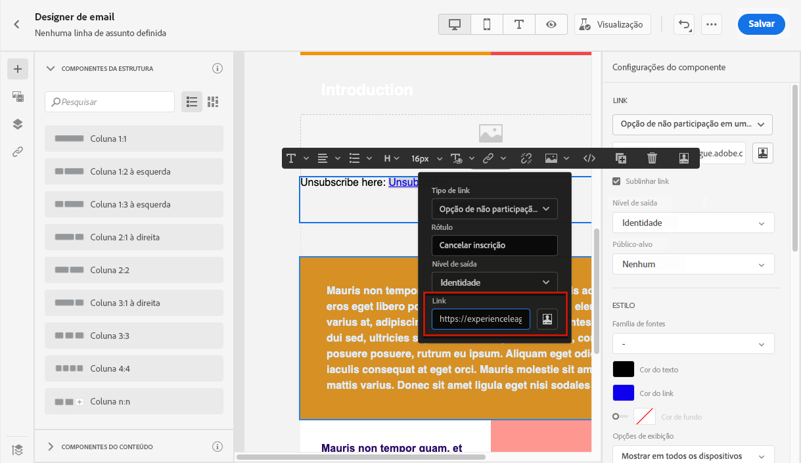

# Cancelar inscrição em lista{#list-unsubscribe}

<!--Do not modify - Legal Review Done -->

Ao definir uma nova configuração de canal de email, após [selecionar um subdomínio](email-settings.md#subdomains-and-ip-pools) na lista, a opção **[!UICONTROL Habilitar List-Unsubscribe]** é exibida.

## Habilitar cancelamento de inscrição da lista {#enable-list-unsubscribe}

Essa opção está habilitada por padrão para incluir um URL para cancelar inscrição com um clique no cabeçalho do email, como:

>[!NOTE]
>
>Se desabilitar essa opção, nenhum URL para cancelar inscrição com um clique será exibido no cabeçalho do email.

O cabeçalho de cancelamento de inscrição da lista oferece duas opções, que são ativadas por padrão, a menos que você desmarque uma ou ambas:

{width="80%"}

* Um endereço **[!UICONTROL Mailto (cancelar inscrição)]**, que é o endereço de destino para o qual as solicitações de cancelamento de inscrição são encaminhadas para processamento automático.

  No [!DNL Journey Optimizer], o endereço de email de cancelamento de inscrição é o endereço **[!UICONTROL Mailto (cancelar assinatura)]** padrão exibido na configuração do canal, com base no [subdomínio selecionado](#subdomains-and-ip-pools). <!--With this method, clicking the Unsubscribe link sends a pre-filled email to the unsubscribe address specified in the email header.-->

* A **[!UICONTROL URL de cancelamento de inscrição]** com um clique, que por padrão é o cabeçalho de cancelamento de inscrição de lista gerado com um clique, com base no subdomínio definido e configurado nas configurações do canal. <!--With this method, clicking the Unsubscribe link directly unsubscribes the user, requiring only a single action to unsubscribe.-->

Você pode selecionar o **[!UICONTROL Nível de consentimento]** na lista suspensa correspondente. Essa configuração pode ser específica para o canal ou para a identidade do perfil. Com base nessa configuração, quando um usuário cancela a assinatura usando a URL de cancelamento de inscrição da lista no cabeçalho de um email, o consentimento é atualizado em [!DNL Adobe Journey Optimizer], no nível do canal ou no nível da ID.

Os recursos **[!UICONTROL Mailto (cancelar inscrição)]** e **[!UICONTROL URL para cancelar inscrição com um clique]** são opcionais.

Se não quiser usar o URL para cancelar inscrição com um clique gerado por padrão, é possível desmarcar o recurso. Se a opção **[!UICONTROL Habilitar cancelamento de assinatura em lista]** estiver ativada, o recurso **[!UICONTROL URL de cancelamento de assinatura com um clique]** estiver desmarcado e você adicionar um [link para opção de não participação com um clique](../email/email-opt-out.md#one-click-opt-out) a uma mensagem criada usando essa configuração, o cabeçalho de cancelamento de assinatura em lista definirá o link de um clique inserido no corpo do email como o URL de cancelamento de assinatura.

>[!NOTE]
>
>Se você não adicionar um link para opção de não participação com um clique no conteúdo da mensagem e o **[!UICONTROL URL para cancelar inscrição com um clique]** padrão estiver desmarcado nas configurações do canal, nenhum URL será associado ao cabeçalho de email para o cancelamento de inscrição de lista.

Saiba mais sobre como gerenciar recursos de cancelamento de inscrição em suas mensagens [nesta seção](../email/email-opt-out.md#unsubscribe-header).

## Gerenciar dados de cancelamento de inscrição externamente {#custom-managed}

>[!CONTEXTUALHELP]
>id="ajo_email_config_unsubscribe_custom"
>title="Definir como os dados de cancelamento de inscrição são gerenciados"
>abstract="**Adobe managed**: os dados de consentimento são gerenciados por você no sistema Adobe. **Gerenciado pelo cliente**: os dados de consentimento são gerenciados por você em um sistema externo e nenhuma sincronização de dados de consentimento é atualizada no sistema da Adobe, a menos que tenha sido iniciada por você."

>[!AVAILABILITY]
>
>Esse recurso foi lançado com disponibilidade limitada (DL) para um pequeno conjunto de clientes.

Se você estiver gerenciando o consentimento fora do Adobe, selecione a opção **[!UICONTROL Gerenciado pelo cliente]** para inserir um endereço de email de cancelamento de inscrição personalizado e sua própria URL de cancelamento de inscrição com um clique.

{width="80%"}

>[!WARNING]
>
>Se você estiver usando a opção **[!UICONTROL Gerenciada pelo cliente]**, a Adobe não armazenará dados de cancelamento de inscrição ou consentimento. Com a opção **[!UICONTROL Gerenciado pelo cliente]**, as organizações optam por usar um sistema externo e serão responsáveis por gerenciar seus dados de consentimento nesse sistema externo. Não há sincronização automática de dados de consentimento entre o sistema externo e [!DNL Journey Optimizer]. Qualquer sincronização de dados de consentimento, proveniente do sistema externo para atualizar dados de consentimento do usuário em [!DNL Journey Optimizer], deve ser iniciada pela organização como uma transferência de dados para enviar os dados de consentimento de volta para [!DNL Journey Optimizer].

### Configurar a API de descriptografia {#configure-decrypt-api}

Com a opção **[!UICONTROL Gerenciado pelo cliente]** selecionada, se você inserir pontos de extremidade personalizados e usá-los em uma campanha ou jornada, o [!DNL Journey Optimizer] anexará alguns parâmetros específicos do perfil padrão ao evento de atualização de consentimento <!--sent to the custom endpoint --> quando os destinatários clicarem no link Cancelar inscrição.

Esses parâmetros são enviados para o endpoint de maneira criptografada. Assim, o sistema de consentimento externo precisa implementar uma API específica por meio do [Adobe Developer](https://developer.adobe.com){target="_blank"} para descriptografar os parâmetros enviados pelo Adobe.

A chamada do GET para recuperar esses parâmetros depende da opção de cancelamento de inscrição da Lista que você está usando - **[!UICONTROL URL de cancelamento de inscrição com um clique]** ou **[!UICONTROL Mailto (cancelar inscrição)]**.

<!--To configure the API to send back the information to [!DNL Adobe Journey Optimizer] when a recipient has unsubscribed using the List unsubscribe option with custom endpoints, follow the steps below.-->

+++ URL de cancelamento de inscrição com um clique

Com a opção **[!UICONTROL Cancelar inscrição da URL]** com um clique, clicar no link Cancelar inscrição cancela a inscrição diretamente do usuário.

A chamada do GET é a seguinte:

Endpoint: https://platform.adobe.io/journey/imp/consent/decrypt

Parâmetros de consulta:

* **params**: contém o conteúdo criptografado
* **pid**: ID de perfil criptografada

Esses dois parâmetros serão incluídos no evento de atualização de consentimento enviado aos endpoints personalizados.

Requisitos do cabeçalho:

* x-api-key
* x-gw-ims-org-id
* autorização (token de usuário da conta técnica)

+++

+++ Mailto (cancelar inscrição)

Com a opção **[!UICONTROL Mailto (cancelar assinatura)]**, clicar no link Cancelar assinatura envia um email preenchido previamente para o endereço de cancelamento de assinatura especificado.

A chamada do GET é a seguinte.

Endpoint: https://platform.adobe.io/journey/imp/consent/decrypt

Parâmetros de consulta:

* **emailParams**: cadeia de caracteres que contém os parâmetros **params** (carga criptografada) e **pid** (ID de perfil criptografada).

Os parâmetros **params** e **pid** serão incluídos no evento de atualização de consentimento enviado aos pontos de extremidade personalizados.

Requisitos do cabeçalho:

* x-api-key
* x-gw-ims-org-id
* autorização (token de usuário da conta técnica)

+++
