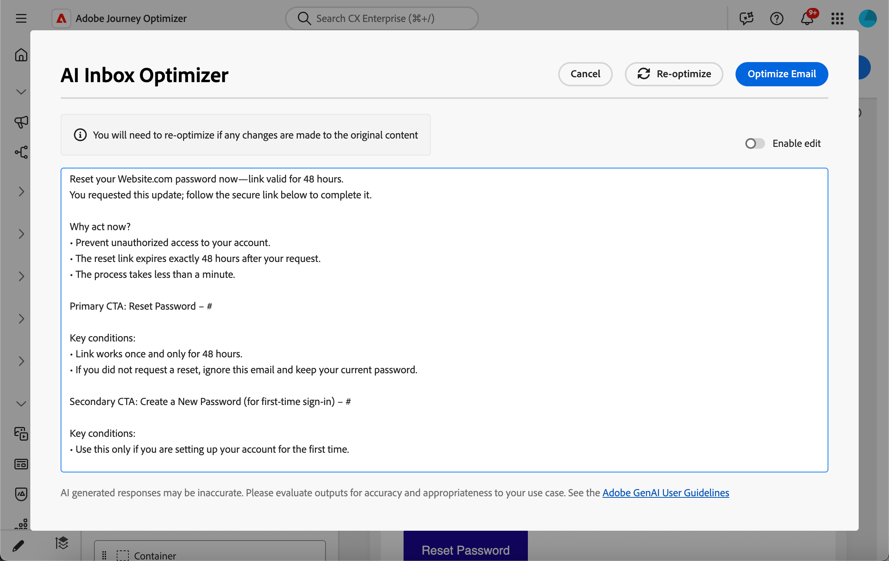

# Otimizar email para caixas de entrada de IA {#email-text-optimizer}

O [!DNL Adobe Journey Optimizer] vem com um recurso de canal de email que ajuda a estruturar uma versão específica de suas mensagens para experiências aprimoradas de caixa de entrada assistida por IA, como [!DNL Apple Intelligence] e [!DNL Google Gemini] no [!DNL Gmail], para que eles possam responder às perguntas e resumir emails com base em seu conteúdo com mais precisão, com melhores resultados.

Você pode usar esse recurso para gerar e refinar uma versão dedicada de suas mensagens, de modo que as experiências da caixa de entrada assistida por IA tenham mais probabilidade de exibir as ofertas, os planos de ação e os detalhes desejados, em vez de texto fino gerado automaticamente ou contexto não relacionado.

<!--
>[!NOTE]
>
>This optimized for AI inboxes text version is not the same as the default or custom plain text version of your messages. [Learn more](text-version-email.md)
-->

## Como funciona {#how-it-works}

As perguntas mais comuns que os destinatários podem fazer na caixa de entrada assistida por IA são *Sobre o que se trata este email?* ou *Quais são estas ofertas?*.

* As respostas fornecidas por esses assistentes de IA podem ser um breve resumo (por exemplo, se a mensagem é promocional, menciona o acesso antecipado e uma venda do VIP e inclui links para categorias de produto). No entanto, eles ainda omitem objetivos com os quais o profissional de marketing se importou, pois os assistentes estão deduzindo de qualquer texto que efetivamente vejam, não necessariamente a história completa que você pretende.

* Além disso, os assistentes podem pesquisar proativamente por descontos ou cupons relacionados à marca e dobrá-los na resposta, para que o usuário não esteja mais olhando apenas para o que a sua mensagem realmente prometeu. Esse comportamento é útil para usuários finais, mas dilui o controle para profissionais de marketing que precisam de respostas para rastrear os termos reais no envio.

Para evitar esses problemas, o [!DNL Journey Optimizer] cria uma versão de texto específica adicional de suas mensagens para que os cupons, intervalos de desconto, planos de ação e outras prioridades apareçam antecipadamente em uma cópia linear clara. Esta versão é diferente da [versão de texto simples](text-version-email.md) padrão ou personalizada de suas mensagens.

O objetivo é usar a IA da caixa de entrada para criar resumos e perguntas e respostas em suas ofertas e ações definidas, em vez de se apoiar em uma parte de texto padrão fina ou em resultados da Web não relacionados.

>[!IMPORTANT]
>
>Os comportamentos exatos do assistente de IA dependem do provedor da caixa de entrada e da versão do modelo. Após o email ser entregue, as respostas e os resumos fornecidos pelos clientes externos de IA podem estar incorretos, incompletos ou misturados com os resultados da Web.
>
>O recurso Otimizar texto de email para caixas de entrada de IA gera apenas uma versão dedicada no Journey Optimizer; não garante como um assistente de terceiros interpretará ou exibirá a mensagem. Leia mais sobre as [limitações e riscos da IA de caixa de entrada de terceiros](#inbox-ai-risks).

## Casos de uso recomendados {#use-cases}

<!--
* **Critical details only in images** — Offers, promo codes, or deadlines shown in banners or graphics are invisible in plain text. Use the optimizer (and manual edits) so the same facts appear as text, improving extraction by AI summaries and text-only clients.
-->

* **Texto denso ou fragmentado** — Quando é difícil verificar o conteúdo do email, a otimização pode produzir uma narrativa linear mais clara com ofertas e links explícitos.

* **Controle de perguntas e respostas da caixa de entrada** — Quando você espera que os destinatários perguntem aos assistentes *sobre o que é o email* ou *quais são as ofertas*, uma versão forte otimizada para IA reduz os resumos parciais e evita a dependência de respostas fornecidas pela Web que não estão vinculadas à sua cópia aprovada.

## Otimizar para experiências na caixa de entrada de IA {#optimize-with-ai}

>[!IMPORTANT]
>
>Antes de usar este recurso, leia os [Riscos e limitações](#inbox-ai-risks) relacionados.
>
>Para acessar este recurso, você deve concordar com um contrato de usuário que exiba a primeira vez que usar a IA gerativa no [!DNL Journey Optimizer]. Para obter mais informações, leia as [Diretrizes de usuário da IA gerativa da Adobe Experience Cloud](https://www.adobe.com/br/legal/licenses-terms/adobe-gen-ai-user-guidelines.html){target="_blank"}.

Para otimizar o conteúdo do seu email para as experiências da caixa de entrada de IA com o [!DNL Journey Optimizer], siga as etapas abaixo.

1. Abra seu email no [Designer de Email](content-from-scratch.md) (de uma campanha, jornada ou modelo, dependendo do seu fluxo de trabalho).

1. Clique no botão **[!UICONTROL Otimizar para Caixa de Entrada de IA]** para gerar uma versão aprimorada que destaque as informações principais para leitura e resumo assistidos por IA.

   {zoomable="yes" width="80%"}

1. Se esta for a primeira vez que você está usando a IA Gerativa em [!DNL Journey Optimizer], você será solicitado a concordar com o contrato de usuário. Para saber mais, confira as [Diretrizes de usuário da IA gerativa da Adobe](https://www.adobe.com/br/legal/licenses-terms/adobe-gen-ai-user-guidelines.html){target="_blank"}.

   {width=50%}

   Clique em **[!UICONTROL Concordar]** para continuar.

1. A versão gerada é exibida na janela **[!UICONTROL Otimizador de caixa de entrada de IA]**.

   {zoomable="yes" width="80%"}

   >[!NOTE]
   >
   >A versão otimizada é diferente das visualizações de texto e HTML do email. Isso não altera o design, o layout ou as imagens.

1. Para editar o conteúdo gerado automaticamente, selecione o botão de alternância **[!UICONTROL Habilitar edição]** e faça alterações manuais conforme necessário.

1. Depois de satisfeito com sua versão, clique no botão **[!UICONTROL Otimizar email]** para confirmar. Você também pode usar o botão **[!UICONTROL Reotimizar]** para gerar uma nova versão.

1. Você será redirecionado para a exibição **[!UICONTROL HTML]** e seu email será otimizado com êxito para as caixas de entrada de IA. Para acessar novamente ou editar a versão otimizada, clique no botão **[!UICONTROL Otimizado para Caixa de Entrada de IA]**.

   {zoomable="yes" width="80%"}

1. A versão otimizada é exibida. Você pode **[!UICONTROL Remover a otimização]** ou clicar em **[!UICONTROL Reotimizar]** para gerar uma nova versão.

   {zoomable="yes" width="80%"}

   >[!NOTE]
   >
   >Se você fizer alterações no conteúdo original do HTML, será necessário otimizar novamente a versão gerada para as caixas de entrada da IA para que ela seja consistente com o novo conteúdo.

## Riscos e limitações da IA da caixa de entrada de terceiros {#inbox-ai-risks}

O recurso Otimizar email para caixas de entrada de IA ajuda você a preparar uma versão do email sobre como os provedores de caixa de correio podem processar os envios do [!DNL Journey Optimizer]. Não abrange os produtos desses fornecedores. Depois que uma mensagem é entregue, todos os recursos de IA em [!DNL Gmail], [!DNL Apple] Email, [!DNL Outlook] ou outros clientes operam sob seus termos, modelos e políticas, não a Adobe.

* **Apresentação imprevisível** — Resumos, notificações e respostas de conversas podem omitir ofertas, preços ou datas incorretos, mesclar conteúdo com resultados da Web não relacionados ou parafrasear de maneiras que não correspondem mais à sua cópia aprovada. Esse comportamento pode mudar quando os fornecedores atualizam os modelos ou a interface do usuário sem aviso prévio.

* **Nenhuma garantia de paridade com o HTML** — Destinatários que dependem de visualizações ou respostas de assistentes podem nunca ver o design, as imagens ou os rodapés legais completos do HTML. O que eles acreditam na mensagem &quot;diz&quot; pode vir apenas de um resumo curto gerado por IA.

* **Uso de privacidade, conformidade e dados** — a IA da Caixa de Entrada pode processar o conteúdo de mensagens na infraestrutura do provedor de acordo com a política de privacidade, retenção e regras regionais desse provedor. As organizações de setores regulamentados devem avaliar se o uso desses recursos pelo recipient afeta suas obrigações, independentemente de como o email foi criado em [!DNL Journey Optimizer].

* **Exposição legal e de marca** — Resumos de IA incorretos ou incompletos ainda podem gerar confusão no cliente ou disputas sobre promoções, termos ou linguagem de recusa. [!DNL Journey Optimizer] não garante que o modelo de terceiros reproduzirá fielmente a versão otimizada do seu email.

* **[!UICONTROL Otimizar para Caixa de Entrada de IA]** em [!DNL Journey Optimizer] — O controle de tempo de criação no Designer de Email é separado dos assistentes da caixa de entrada do usuário final. Sempre revise o texto simples gerado antes de enviar.

## Tópicos relacionados {#related-topics}

* [Introdução ao design de email](get-started-email-design.md)
* Para obter os recursos gerativos do Adobe de forma mais ampla, consulte [Introdução ao Assistente de IA para criar conteúdo](../content-management/gs-generative.md).
