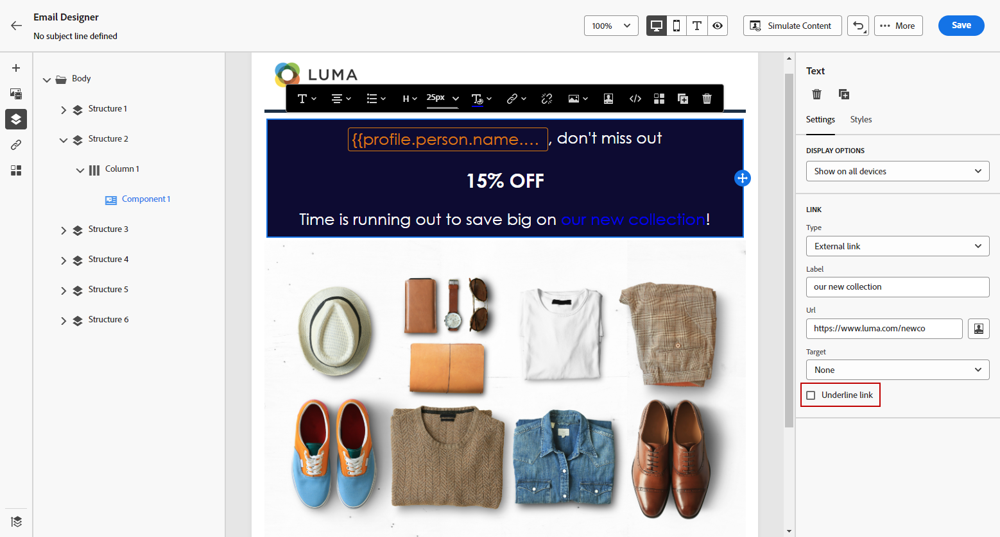

# Adicionar links e rastrear mensagens {#tracking}

Use o [!DNL Journey Optimizer] para adicionar links ao seu conteúdo e rastrear as mensagens enviadas para monitorar o comportamento dos destinatários.

>[!NOTE]
>
>Quando links são incluídos no seu conteúdo, eles expiram **25 meses** após o envio da mensagem, exceto links para uma mirror page, que expira após **90 dias**. Depois que o atraso expirar, os links não estarão mais disponíveis.

## Ativar rastreamento {#enable-tracking}

Você pode habilitar o rastreamento no nível da mensagem de email verificando as opções **[!UICONTROL Aberturas de email]** e/ou **[!UICONTROL Clique no email]** ao criar sua mensagem dentro de uma jornada ou campanha, conforme mostrado nas guias abaixo:

>[!BEGINTABS]

>[!TAB Habilitar rastreamento em uma jornada]

>[!TAB Habilitar o rastreamento em uma campanha]

>[!ENDTABS]

>[!NOTE]
>
>Ambas as opções estão ativadas por padrão.

Quando ativadas, essas opções rastreiam o comportamento dos recipients das suas mensagens:

* A métrica **[!UICONTROL Aberturas de email]** verifica quantas mensagens foram abertas.
* A métrica **[!UICONTROL Clicar no email]** calcula o número de cliques nos links em um email.

## Inserir links {#insert-links}

Quando o [rastreamento é habilitado](#enable-tracking), todos os links incluídos no conteúdo da mensagem são rastreados.

>[!NOTE]
>
>Links de fragmentos usados em um email também são rastreados. [Saiba mais sobre fragmentos](../content-management/fragments.md)

Para inserir links no conteúdo do email, siga as etapas abaixo:

1. Selecione um elemento (texto ou imagem) e clique em **[!UICONTROL Inserir link]** na barra de ferramentas contextual.

   

1. Escolha o tipo de link que deseja criar:

   * Selecione **[!UICONTROL Link externo]** para inserir um link para uma URL externa.

   * Selecione **[!UICONTROL Landing page]** para inserir um link a uma landing page. [Saiba mais](../landing-pages/get-started-lp.md)

   * Selecione **[!UICONTROL Recusa em um clique]** para inserir um link que permita aos usuários cancelar rapidamente a inscrição de suas comunicações sem a necessidade de confirmar a recusa. [Saiba mais](email-opt-out.md#one-click-opt-out).

   * Selecione **[!UICONTROL Consentimento/Assinatura externa]** para inserir um link para aceitar receber comunicações da sua marca.

   * Selecione **[!UICONTROL Opção de não participação/Cancelamento de assinatura externo]** para inserir um link para cancelar a assinatura do recebimento de comunicações da sua marca. Saiba mais sobre o gerenciamento de recusa em [esta seção](email-opt-out.md#opt-out-management).

   * Selecione **[!UICONTROL Mirror page]** para adicionar um link à mirror page do email. [Saiba mais](#mirror-page)

1. Insira o URL desejado no campo correspondente ou selecione uma landing page e defina as configurações e os estilos do link. [Saiba mais](#adjust-links)

   >[!NOTE]
   >
   >Para interpretar URLs, [!DNL Journey Optimizer] está em conformidade com a sintaxe de URI ([padrão RFC 3986](https://datatracker.ietf.org/doc/html/rfc3986){target="_blank"}), que desabilita alguns caracteres internacionais especiais em URLs. Ao tentar enviar a prova ou o email, se você retornar um erro envolvendo um URL adicionado ao seu conteúdo, será possível codificar o URL da sequência de caracteres como uma solução alternativa.

1. Você pode personalizar seus links. [Saiba mais](../personalization/personalization-build-expressions.md)

1. Salve as alterações.

1. Depois que o link for criado, você ainda poderá modificá-lo nos painéis **[!UICONTROL Configurações]** e **[!UICONTROL Estilos]** à direita.

   

>[!NOTE]
>
>As mensagens de email do tipo Marketing devem incluir um [link para opção de não participação](../privacy/opt-out.md#opt-out-management), que não é necessário para mensagens transacionais. A categoria da mensagem (**[!UICONTROL Marketing]** ou **[!UICONTROL Transacional]**) é definida na [configuração de canal](../configuration/channel-surfaces.md#email-type) ao criar a mensagem.

Depois que a mensagem é enviada, o período de retenção de um link é de **25 meses**. Após esse atraso, o link não estará mais disponível.

## Link para uma mirror page {#mirror-page}

A mirror page é uma versão online do email. Adicionar um link para a mirror page é uma prática recomendada de marketing por email. Os usuários podem navegar até a mirror page de um email. Por exemplo, se estiverem enfrentando problemas de renderização ou imagens quebradas ao tentar exibi-la em sua caixa de entrada. Também é recomendável fornecer uma versão online por motivos de acessibilidade ou incentivar o compartilhamento em redes sociais.

A mirror page gerada pelo Adobe Journey Optimizer contém todos os dados de personalização.

Para adicionar um link a uma mirror page no email, [insira um link](#insert-links) e selecione **[!UICONTROL Mirror page]** como o tipo de link.

A mirror page é criada automaticamente. Depois que o email for enviado, quando os destinatários clicarem no link da mirror page, o conteúdo do email será exibido no navegador web padrão.

O período de retenção de uma mirror page é de **90 dias**. Após esse atraso, a mirror page não estará mais disponível.

>[!CAUTION]
>
>* Os links de mirror pages são gerados automaticamente e não podem ser editados. Eles contêm todos os dados personalizados criptografados necessários para renderizar o email original. Como resultado, o uso de atributos personalizados com valores grandes pode gerar URLs de mirror pages longos, o que pode impedir que o link funcione em navegadores da Web com tamanho máximo de URLs.
>
>* Na [prova](../content-management/proofs.md) enviada aos perfis de teste, o link para a mirror page não está ativo. Ela só estará ativa nas mensagens finais.

## Personalizar a aparência e o destino do link {#adjust-links}

É possível fazer ajustes nos links, como sublinhá-los, alterar a cor ou selecionar o destino.  Essas alterações são definidas nos painéis **[!UICONTROL Configurações]** e **[!UICONTROL Estilos]**, na seção direita do editor de conteúdo.

### Target {#link-target}

O atributo **target** é usado para controlar onde uma página vinculada será aberta. Adicionar um atributo de destino em uma tag de âncora pode especificar se o link deve ser aberto em uma nova guia, na mesma guia ou em um quadro diferente.

Para definir o target de um link, siga estas etapas:

1. Em um componente **[!UICONTROL Texto]**, no qual um link é inserido, selecione seu link.

1. Na guia **[!UICONTROL Configurações]**, selecione onde o link será aberto no menu suspenso **[!UICONTROL Destino]**. Os valores possíveis estão listados abaixo:

   * **[!UICONTROL Nenhum]**: abre o link no mesmo quadro em que foi clicado (padrão).
   * **[!UICONTROL Branco]**: abre o link em uma nova janela ou guia.
   * **[!UICONTROL Auto]**: abre o link no mesmo quadro em que foi clicado.
   * **[!UICONTROL Principal]**: abre o link no quadro principal.
   * **[!UICONTROL Superior]**: abre o link no corpo completo da janela.

   

1. Salve as alterações.

### Sublinhar link {#link-underline}

Marque a opção **[!UICONTROL Sublinhar link]** para sublinhar o rótulo do seu link.

### Cor do link {#link-color}

Para alterar a cor do link, clique em **[!UICONTROL Cor do link]** na guia **[!UICONTROL Estilos]**.

## Gerenciar rastreamento {#manage-tracking}

O [Designer de email](content-from-scratch.md) permite gerenciar os URLs rastreados, como editar o tipo de rastreamento de cada link.

1. Clique no ícone **[!UICONTROL Links]** no painel esquerdo para exibir a lista de todas as URLs do seu conteúdo que serão rastreadas.

   Essa lista oferece uma visualização centralizada, permitindo localizar cada URL no conteúdo do email.

1. Para editar um link, clique no ícone de lápis correspondente.

1. Você pode modificar o **[!UICONTROL Tipo de rastreamento]**, se necessário:

   

   Para cada URL rastreado é possível definir o modo de rastreamento utilizando um destes valores:

   * **[!UICONTROL Rastrear]**: ativa o rastreamento nesse URL.
   * **[!UICONTROL Opt out]**: considera-o como um URL de recusa ou cancelamento de assinatura.
   * **[!UICONTROL Mirror page]**: considera-o como um URL de mirror page.
   * **[!UICONTROL Nunca]**: nunca ativa o rastreamento desta URL.

Relatórios sobre aberturas e cliques estão disponíveis no [Live Report](../reports/live-report.md) e no [Customer Journey Analytics Report](../reports/report-gs-cja.md).

## Personalizar rastreamento do URL {#url-tracking}

O [rastreamento de URL](email-settings.md#url-tracking) é gerenciado no nível de configuração e se aplica a todas as URLs incluídas no conteúdo da sua mensagem.

Você também pode personalizar URLs individuais no Designer de email. Para adicionar parâmetros de rastreamento de URL personalizados a um único link em seu conteúdo, siga as etapas abaixo.

1. Selecione um link e clique em **[!UICONTROL Inserir link]** na barra de ferramentas contextual.

1. Selecione o ícone de personalização. Ele só está disponível para estes tipos de links: **Link externo**, **Link de unsubscription** e **Opt-Out**.

   

1. Adicione o parâmetro de rastreamento da URL e selecione o atributo de perfil de sua escolha no [editor de personalização](../personalization/personalization-build-expressions.md).

   

1. Salve as alterações.

1. Repita as etapas acima para cada link ao qual deseja adicionar esse parâmetro de rastreamento.

Agora, quando o email for enviado, esse parâmetro será anexado automaticamente ao final do URL. Em seguida, você pode capturar esse parâmetro nas ferramentas do Web Analytics ou nos relatórios de desempenho.

>[!NOTE]
>
>Para verificar a URL final, você pode [enviar uma prova](../content-management/preview-test.md#send-proofs) e clicar no link no conteúdo do email depois de receber a prova. O URL deve exibir o parâmetro de rastreamento. No exemplo acima, a URL final será: <https://luma.enablementadobe.com/content/luma/us/en.html?utm_contact=profile.userAccount.contactDetails.homePhone.number>
