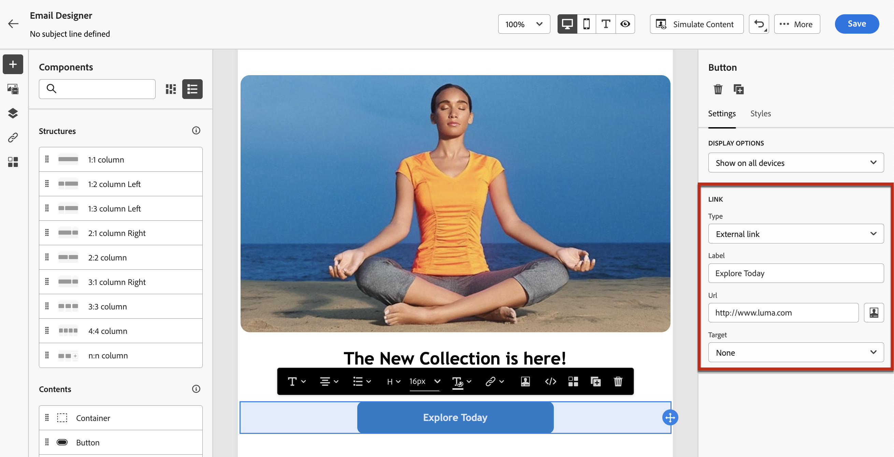

# Adicionar links e rastrear mensagens {#tracking}

Uso [!DNL Journey Optimizer] para adicionar links ao seu conteúdo e rastrear as mensagens enviadas para monitorar o comportamento dos recipients.

## Ativar rastreamento {#enable-tracking}

Você pode ativar o rastreamento no nível da mensagem de email marcando a opção **[!UICONTROL Aberturas de email]** e/ou **[!UICONTROL Clique no email]** opções ao criar sua mensagem dentro de uma jornada ou campanha.

>[!BEGINTABS]

>[!TAB Ativar o rastreamento em uma jornada]

>[!TAB Ativar o rastreamento em uma campanha]

>[!ENDTABS]

>[!NOTE]
>
>Ambas as opções estão ativadas por padrão.

Isso permitirá rastrear o comportamento dos recipients por meio de:

* **[!UICONTROL Aberturas de email]**: Mensagens que foram abertas.
* **[!UICONTROL Clique no email]**: cliques nos links em um email.

## Inserir links {#insert-links}

Ao criar uma mensagem, você pode adicionar links ao seu conteúdo.

>[!NOTE]
>
>Quando [rastreamento ativado](#enable-tracking), todos os links incluídos no conteúdo da mensagem serão rastreados.

Para inserir links no conteúdo do email, siga as etapas abaixo:

1. Selecione um elemento e clique em **[!UICONTROL Inserir link]** na barra de ferramentas contextual.

   

1. Escolha o tipo de link que deseja criar:

   * **[!UICONTROL Link externo]**: insira um link para um URL externo.

   * **[!UICONTROL Landing page]**: insira um link para uma landing page. [Saiba mais](../landing-pages/get-started-lp.md)

   * **[!UICONTROL Opção de não participação em um clique]**: insira um link para permitir que os usuários cancelem rapidamente a inscrição de suas comunicações sem a necessidade de confirmar a recusa. [Saiba mais](email-opt-out.md#one-click-opt-out).

   * **[!UICONTROL Consentimento/Assinatura externa]**: insira um link para aceitar receber comunicações da sua marca.

   * **[!UICONTROL Opção de não participação/Cancelamento de assinatura externo]**: insira um link para cancelar a inscrição do recebimento de comunicações da sua marca. Saiba mais sobre o gerenciamento de recusa [nesta seção](email-opt-out.md#opt-out-management).

   * **[!UICONTROL Mirror page]**: adicione um link para exibir o conteúdo do email em um navegador da Web. [Saiba mais](#mirror-page)

1. Insira o URL desejado no campo correspondente ou selecione uma landing page e defina as configurações e os estilos do link. [Saiba mais](#adjust-links)

   >[!NOTE]
   >
   >Para interpretar URLs, [!DNL Journey Optimizer] está em conformidade com a sintaxe do URI ([Padrão RFC 3986](https://datatracker.ietf.org/doc/html/rfc3986){target="_blank"}), que desativa alguns caracteres internacionais especiais nos URLs. Ao tentar enviar a prova ou o email, se você retornar um erro envolvendo um URL adicionado ao seu conteúdo, será possível codificar o URL da sequência de caracteres como uma solução alternativa.

1. Você pode personalizar seus links. [Saiba mais](../personalization/personalization-syntax.md#perso-urls)

1. Salve as alterações.

1. Depois que o link for criado, você ainda poderá modificá-lo no **[!UICONTROL Configurações]** e **[!UICONTROL Estilos]** painéis à direita.

   

>[!NOTE]
>
>As mensagens de email do tipo Marketing devem incluir uma [link para opção de não participação](../privacy/opt-out.md#opt-out-management), que não é necessário para mensagens transacionais. A categoria da mensagem (**[!UICONTROL Marketing]** ou **[!UICONTROL Transacional]**) é definido na variável [superfície de canal](../configuration/channel-surfaces.md#email-type) ao criar a mensagem.

## Ajustar links {#adjust-links}

É possível fazer ajustes nos links usando o **[!UICONTROL Configurações]** e **[!UICONTROL Estilos]** painéis à direita. É possível sublinhar um link, editar sua cor e selecionar seu público alvo.

1. Em um componente **[!UICONTROL Texto]**, no qual um link é inserido, selecione seu link.

1. No **[!UICONTROL Configurações]** escolha como o público-alvo será redirecionado com a **[!UICONTROL Target]** lista suspensa:

   * **[!UICONTROL Nenhum]**: abre o link no mesmo quadro em que foi clicado (padrão).
   * **[!UICONTROL Branco]**: abre o link em uma nova janela ou guia.
   * **[!UICONTROL Auto]**: abre o link no mesmo quadro em que foi clicado.
   * **[!UICONTROL Principal]**: abre o link no quadro principal.
   * **[!UICONTROL Superior]**: abre o link no corpo completo da janela.

   

1. Marcar **[!UICONTROL Sublinhar link]** para sublinhar o texto do rótulo do seu link.

   

1. Para alterar a cor do link, clique em **[!UICONTROL Cor do link]** na guia **[!UICONTROL Estilos]**.

   

1. Salve as alterações.

## Link para uma mirror page {#mirror-page}

A mirror page é uma página HTML acessível online através de um navegador da Web. Seu conteúdo é idêntico ao conteúdo do seu email.

Para adicionar um link a uma mirror page no seu email, [inserir um link](#insert-links) e selecione **[!UICONTROL Mirror page]** como o tipo de link.

A mirror page é criada automaticamente.

>[!IMPORTANT]
>
>Os links de mirror pages são gerados automaticamente e não podem ser editados. Eles contêm todos os dados personalizados criptografados necessários para renderizar o email original. Como resultado, o uso de atributos personalizados com valores grandes pode gerar URLs de mirror pages longos, o que pode impedir que o link funcione em navegadores da Web com tamanho máximo de URLs.

Depois que o email for enviado, quando os destinatários clicarem no link da mirror page, o conteúdo do email será exibido no navegador web padrão.

>[!NOTE]
>
>No [prova](../content-management/proofs.md) enviado aos perfis de teste, o link para a mirror page não está ativo. Ele só é ativado nas mensagens finais.

O período de retenção de uma mirror page é de 60 dias. Após esse atraso, a mirror page não estará mais disponível.

## Gerenciar rastreamento {#manage-tracking}

O [Designer de email](content-from-scratch.md) permite gerenciar os URLs rastreados, como editar o tipo de rastreamento de cada link.

1. Clique em **[!UICONTROL Links]** ícone no painel esquerdo para exibir a lista de todos os URLs do seu conteúdo que serão rastreados.

   Essa lista oferece uma visualização centralizada, permitindo localizar cada URL no conteúdo do email.

1. Para editar um link, clique no ícone de lápis correspondente.

1. Você pode modificar o **[!UICONTROL Tipo de rastreamento]**, se necessário:

   

   Para cada URL rastreado é possível definir o modo de rastreamento utilizando um destes valores:

   * **[!UICONTROL Rastrear]**: ativa o rastreamento nesse URL.
   * **[!UICONTROL Opt out]**: considera-o como um URL de recusa ou cancelamento de assinatura.
   * **[!UICONTROL Mirror page]**: considera-o como um URL de mirror page.
   * **[!UICONTROL Nunca]**: nunca ativa o rastreamento desse URL.

Relatórios sobre aberturas e cliques estão disponíveis no [Relatório ao vivo](../reports/live-report.md) e no [Relatório global](../reports/global-report.md).

## Personalizar rastreamento do URL {#url-tracking}

Normalmente [Rastreamento de URL](email-settings.md#url-tracking) O é gerenciado no nível da superfície, mas os atributos de perfil não são compatíveis. Atualmente, a única maneira de fazer isso é [personalizar URLs](../personalization/personalization-syntax.md#perso-urls) no designer de email.

Para adicionar parâmetros de rastreamento de URL personalizados aos links, siga as etapas abaixo.

1. Selecione um link e clique em **[!UICONTROL Inserir link]** na barra de ferramentas contextual.

1. Selecione o ícone de personalização. Ela só está disponível para esses tipos de links: **Link externo**, **Link de cancelamento de subscrição** e **Recusar**.

   

1. Adicione o parâmetro de rastreamento de URL e selecione o atributo de perfil de sua escolha no editor de personalização.

   

1. Salve as alterações.

1. Repita as etapas acima para cada link ao qual deseja adicionar esse parâmetro de rastreamento.

Agora, quando o email for enviado, esse parâmetro será anexado automaticamente ao final do URL. Em seguida, você pode capturar esse parâmetro nas ferramentas do Web Analytics ou nos relatórios de desempenho.

>[!NOTE]
>
>Para verificar o URL final, é possível [enviar uma prova](../content-management/preview-test.md#send-proofs) e clique no link no conteúdo do email depois de receber a prova. O URL deve exibir o parâmetro de rastreamento. No exemplo acima, o URL final será: <https://luma.enablementadobe.com/content/luma/us/en.html?utm_contact=profile.userAccount.contactDetails.homePhone.number>
