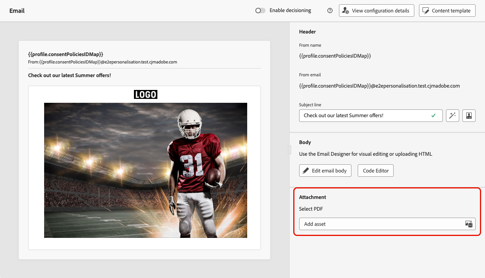
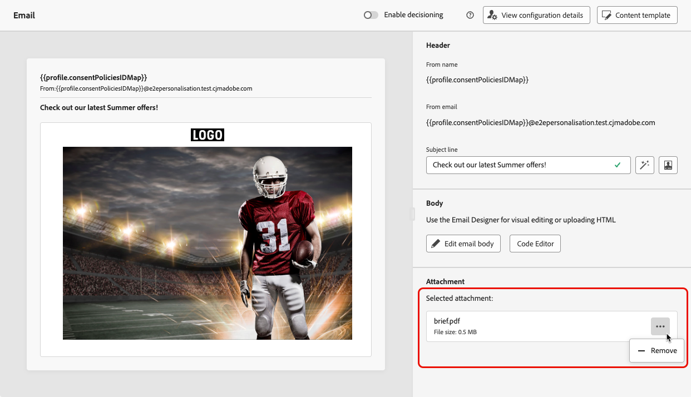

# Anexar um arquivo do PDF a um email {#pdf-attachments}

>[!CONTEXTUALHELP]
>id="ajo_pdf_attachments"
>title="Adicionar um anexo do PDF"
>abstract="Navegue para selecionar um arquivo PDF para anexar ao seu email. Você pode enviar até 6 mensagens com um anexo do PDF por perfil por ano. O tamanho máximo para cada anexo é 5 MB. Para qualquer tamanho ou volume adicional, você pode comprar um complemento de pacote de anexos. Para obter mais informações, entre em contato com o representante da Adobe."

>[!AVAILABILITY]
>
>Este recurso é oferecido com disponibilidade limitada. Entre em contato com o seu representante da Adobe para obter acesso.

Você pode anexar um arquivo PDF estático às mensagens de email enviadas com [!DNL Journey Optimizer].

>[!IMPORTANT]
>
>* É possível enviar até 6 mensagens com um anexo PDF por perfil em um ano.
>
>* O tamanho máximo para cada anexo é 5 MB.
>
>Para qualquer tamanho ou volume adicional, é possível adquirir um complemento de pacote de anexos. Para obter mais informações, entre em contato com o representante da Adobe.

Para anexar um arquivo do PDF a uma mensagem de email, siga as etapas abaixo.

1. Crie um email em uma jornada ou campanha. [Saiba mais](create-email.md)

1. Na guia jornada ou campanha **[!UICONTROL Conteúdo]**, selecione **[!UICONTROL Adicionar ativo]** na seção **[!UICONTROL Anexo]**.

   

1. O repositório do Assets Essentials é exibido.

   >[!NOTE]
   >
   >Ao criar mensagens, você acessa o repositório do Assets Essentials diretamente de dentro da interface da Journey Optimizer. Para saber mais sobre a interface do usuário incorporada [!DNL Assets Essentials], consulte a [documentação do Experience Manager Assets Essentials](https://experienceleague.adobe.com/docs/experience-manager-assets-essentials/help/introduction.html?lang=pt-BR){target="_blank"}.

1. Use o filtro **[!UICONTROL PDF]** na seção **[!UICONTROL Tipo MIME]** para restringir a seleção ao formato de arquivo correto.

   

   >[!NOTE]
   >
   >Somente o formato PDF é permitido para anexos.

1. Selecione o arquivo de sua escolha.

   * Você só pode selecionar um arquivo por vez.
   * O tamanho máximo para cada anexo é 5 MB.

1. Depois de concluído, o nome e o tamanho do arquivo selecionado são exibidos na seção **[!UICONTROL Anexo]**.

   Você pode remover o arquivo selecionado usando o ícone Mais ações ao lado do nome do arquivo.

   

>[!NOTE]
>
>Ao salvar sua mensagem como [modelo de conteúdo](../content-management/create-content-templates.md), o anexo do PDF não é retido com o modelo. Se você criar um novo email a partir do modelo de conteúdo salvo, será necessário reanexar o arquivo.
