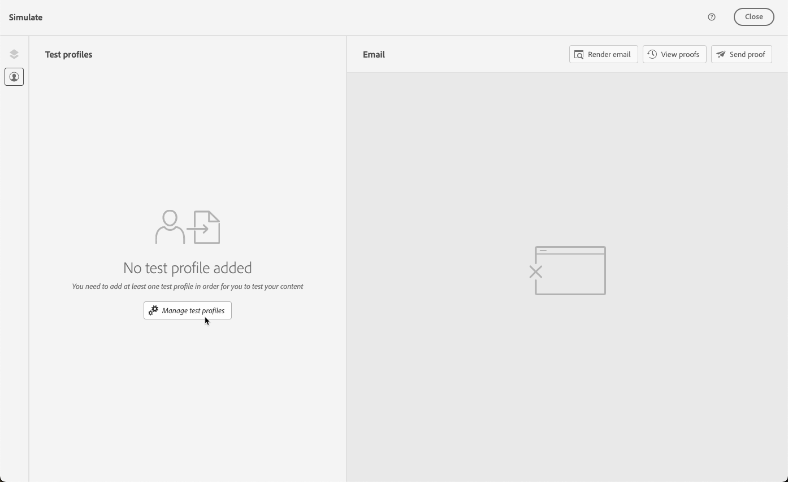

# Visualizar e testar o email {#preview-and-proof}

>[!CONTEXTUALHELP]
>id="ac_preview_testprofiles"
>title="Visualizar e testar suas mensagens"
>abstract="Após definir o conteúdo da mensagem, é possível usar perfis de teste para visualizar e testar o conteúdo."

Depois que o conteúdo de email for definido, você poderá usar perfis de teste para pré-visualizá-lo e testá-lo. Se você inseriu [conteúdo personalizado](../personalization/personalize.md), é possível verificar como esse conteúdo é exibido na mensagem, usando os dados do perfil de teste.

Para detectar possíveis erros no conteúdo do email ou nas configurações de personalização, envie provas para perfis de teste. Uma prova deve ser enviada sempre que uma alteração for feita, para validar o conteúdo mais recente.

>[!CAUTION]
>
>Você precisa ter perfis de teste disponíveis para poder visualizar suas mensagens e enviar provas.
>
>Saiba como criar perfis de teste [nesta página](../audience/creating-test-profiles.md).

Para testar o conteúdo do email, é necessário:

* [Selecionar perfis de teste](#select-test-profiles)
* [Verificar a pré-visualização da mensagem](#preview-your-messages)

Você poderá então [enviar provas](#send-proofs) aos perfis de teste.

Além disso, use a conta do **Litmus** no [!DNL Journey Optimizer] para pré-visualizar instantaneamente a **renderização de email** em clientes de email populares. Em seguida, você pode melhorar seu conteúdo de email e garantir que ele e funcione corretamente em cada caixa de entrada. Saiba como desbloquear visualizações de email Litmus no [nesta seção](#email-rendering).

>[!CAUTION]
>
>Ao visualizar uma mensagem ou enviar provas, somente os dados de personalização do perfil são exibidos. A personalização baseada em dados de contexto, como informações de evento, só pode ser testada no contexto de uma jornada. Saiba como testar a personalização no [este caso de uso](../personalization/personalization-use-case.md).

➡️ [Saiba como visualizar e revisar seu email neste vídeo](#video-preview)

## Selecionar perfis de teste {#select-test-profiles}

Uso [Perfis de teste](../audience/creating-test-profiles.md) para direcionar recipients adicionais que não correspondem aos critérios de direcionamento definidos.

Para selecionar perfis de teste, siga as etapas abaixo:

1. No [Editar conteúdo](create-email.md#define-email-content) ou no Designer de email, clique na guia **[!UICONTROL Simular conteúdo]** botão para acessar a seleção de perfil de teste.

   

1. Selecionar **[!UICONTROL Gerenciar perfis de teste]**.

   

1. Selecione o namespace a ser usado para identificar perfis de teste clicando no **[!UICONTROL Namespace de identidade]** ícone de seleção.

   

   Saiba mais sobre os namespaces de identidade da Adobe Experience Platform [nesta seção](../audience/get-started-identity.md).

   No exemplo abaixo, usaremos o **E-mail** namespace.

1. Use o campo de pesquisa para localizar o namespace, selecione-o e clique em **[!UICONTROL Selecionar]**

   

1. No **[!UICONTROL Valor de identidade]** insira o valor (aqui o endereço de email) para identificar o perfil de teste e clique em **[!UICONTROL Adicionar perfil]**.

   <!---->

1. Se você adicionou personalização à mensagem, adicione outros perfis para testar diferentes variantes da mensagem, dependendo dos dados do perfil. Depois de adicionados, os perfis são listados nos campos selecionados.

   

   Com base nos elementos de personalização da mensagem, essa lista exibe dados para cada perfil de teste nas colunas relacionadas.

### Visualização de email {#preview-email}

Uma vez [perfis de teste](#select-test-profiles) forem selecionadas, você poderá visualizar seu conteúdo de email. Siga as etapas abaixo:

1. No [Editar conteúdo](create-email.md#define-email-content) ou no Designer de email, clique na guia **[!UICONTROL Simular conteúdo]** botão.

1. Selecione um perfil de teste. Você pode verificar os valores disponíveis nas colunas. Use as setas para a direita/esquerda para navegar pelos dados.

   

   >[!NOTE]
   >
   >Para adicionar perfis de teste, selecione **[!UICONTROL Gerenciar perfis de teste]**. [Saiba mais](#select-test-profiles)

1. Clique em **[!UICONTROL Selecionar dados]** ícone acima da lista para adicionar ou remover colunas.

   

   Você pode ver campos de personalização específicos para a mensagem atual no final da lista. Neste exemplo, a cidade do perfil, o nome e o sobrenome. Selecione esses campos e verifique se esses valores estão preenchidos em seus perfis de teste.

1. Na pré-visualização da mensagem, os elementos personalizados são substituídos pelos dados do perfil de teste selecionado.

   Por exemplo, para esta mensagem, o conteúdo do email e o assunto do email são personalizados:

   

1. Selecione outros perfis de teste para visualizar a renderização de email para cada variante da mensagem.

## Enviar provas {#send-proofs}

Uma prova é uma mensagem específica que permite testar uma mensagem antes de enviá-la para o público-alvo principal. Os recipients da prova são responsáveis pela aprovação da mensagem: renderização, conteúdo, configurações de personalização e configuração.

Uma vez [perfis de teste](#select-test-profiles) forem selecionadas, você poderá enviar provas.

1. No **[!UICONTROL Simular]** clique na guia **[!UICONTROL Enviar prova]** botão.

   

1. No **[!UICONTROL Enviar prova]** digite o email do destinatário e clique em **[!UICONTROL Adicionar]** para enviar a prova para você mesmo ou para membros de suas organizações.

   Observe que você pode adicionar até dez recipients para o delivery de prova.

   

1. Em seguida, selecione o **Perfis de teste** que será usado para personalizar o conteúdo da mensagem.

   Cada recipient da prova receberá tantas mensagens quanto o número de perfis de teste selecionados. Por exemplo, se você adicionou cinco emails de recipient e selecionou dez perfis de teste, enviará cinquenta mensagens de prova e cada recipient receberá dez deles.

1. Você pode adicionar um prefixo à linha de assunto da prova, se necessário. Somente caracteres alfanuméricos e caracteres especiais como . - _ ( ) [ ] são permitidos como prefixo da linha de assunto.

1. Clique em **[!UICONTROL Enviar prova]**.

   

1. De volta ao  **[!UICONTROL Simular]** clique na guia  **[!UICONTROL Exibir provas]** botão para verificar o status.

   

É recomendável enviar provas após cada modificação no conteúdo da mensagem.

>[!NOTE]
>
>Na prova enviada, o link para a mirror page não está ativo. Ele só é ativado nas mensagens finais.

## Usar renderização de email {#email-rendering}

Você pode aproveitar seus **Litmus** conta em [!DNL Journey Optimizer] para visualizar instantaneamente seu **renderização de email** em clientes de email populares.

Para acessar os recursos de renderização de email, é necessário:

* Ter uma conta Litmus
* [Selecionar perfis de teste](#select-test-profiles)

Em seguida, siga as etapas abaixo:

1. No [Editar conteúdo](create-email.md#define-email-content) ou no Designer de email, clique na guia **[!UICONTROL Simular conteúdo]** botão.

1. Selecione o **[!UICONTROL Renderizar email]** botão.

   

1. Clique em **Conectar sua conta Litmus** na seção superior direita.

   

1. Insira suas credenciais e faça logon.

   

1. Clique em **Executar teste** botão para gerar visualizações de email.

1. Verifique seu conteúdo de email em clientes populares de desktop, móveis e baseados na Web.

   

>[!CAUTION]
>
>Ao conectar seu **Litmus** conta com [!DNL Journey Optimizer], você concorda que as mensagens de teste são enviadas para o Litmus: uma vez enviadas, esses emails não serão mais gerenciados pelo Adobe. Como consequência, a política de retenção de dados do Litmus se aplica a esses emails, incluindo dados de personalização que podem ser incluídos nessas mensagens de teste.

## Vídeo explicativo {#video-preview}

Saiba como testar a renderização de email nas caixas de entrada, como pré-visualizar emails personalizados em relação a perfis de teste e enviar provas.

>[!VIDEO](https://video.tv.adobe.com/v/334239?quality=12)
