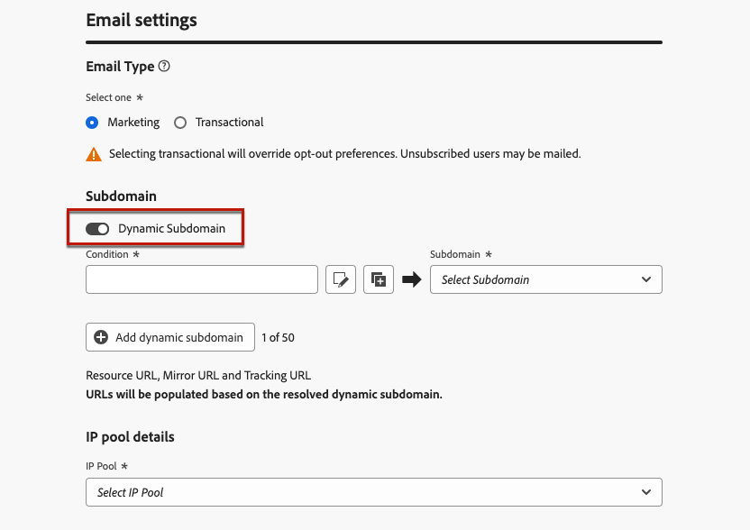
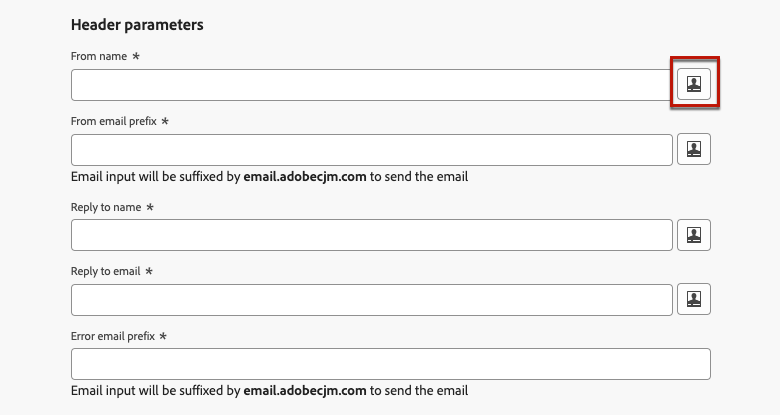

# Personalizar configurações de email {#surface-personalization}

Para aumentar a flexibilidade e o controle sobre suas configurações de email, o [!DNL Journey Optimizer] permite que você defina valores personalizados para subdomínios e cabeçalhos<!--and URL tracking parameters--> ao criar configurações de email.

## Adicionar subdomínios dinâmicos {#dynamic-subdomains}

>[!CONTEXTUALHELP]
>id="ajo_surface_perso_not_available"
>title="Personalização indisponível"
>abstract="Esta configuração foi criada sem nenhum atributo de personalização. Consulte a documentação para saber quais são as etapas a serem seguidas, se a personalização for necessária."

>[!CONTEXTUALHELP]
>id="ajo_surface_dynamic_subdomain"
>title="Habilitar subdomínios dinâmicos"
>abstract="Ao criar uma configuração de email, é possível configurar subdomínios dinâmicos com base nas condições definidas por meio do editor de personalização. Você pode adicionar até 50 subdomínios dinâmicos."

Ao criar uma configuração de email, você pode definir subdomínios dinâmicos com base em condições específicas.

Por exemplo, se você tiver restrições legais para enviar mensagens de um endereço de email dedicado por país, poderá usar subdomínios dinâmicos. Isso permite criar uma única configuração com vários subdomínios de envio correspondentes a diferentes países, em vez de criar várias configurações para cada país. Em seguida, você pode direcionar clientes com base em vários países consolidados em uma única campanha.

Para definir subdomínios dinâmicos em uma configuração de canal de email, siga as etapas abaixo.

1. Antes de criar uma configuração, configure os subdomínios que deseja usar para enviar emails de acordo com seu caso de uso. [Saiba como](../configuration/about-subdomain-delegation.md)

   Por exemplo, digamos que você queira usar subdomínios diferentes para países diferentes: configure um subdomínio específico para os EUA, um específico para o Reino Unido etc.

1. Crie uma configuração de canal. [Saiba como](../configuration/channel-surfaces.md)

1. Selecione o canal de **[!UICONTROL Email]**.

1. Na seção **Subdomínio**, habilite a opção **[!UICONTROL Subdomínio Dinâmico]**.

   

1. Selecione o ícone Editar ao lado do primeiro campo **[!UICONTROL Condição]**.

1. O [editor de personalização](../personalization/personalization-build-expressions.md) se abre. Neste exemplo, defina uma condição como `Country` igual a `US`.

   

1. Selecione o subdomínio que deseja associar a essa condição. [Saiba mais sobre subdomínios](../configuration/about-subdomain-delegation.md)

   >[!NOTE]
   >
   >Determinados subdomínios não estão disponíveis para seleção no momento devido ao [loop de comentários](../reports/deliverability.md#feedback-loops) pendente. Esse processo pode demorar até 10 dias úteis. Após a conclusão, você pode escolher entre todos os subdomínios disponíveis. <!--where FL registration happens? is it when delegating a subdomain and you're awaiting from subdomain validation? or is it on ISP side only?-->

   

   Todos os recipients baseados nos EUA receberão mensagens usando o subdomínio selecionado para esse país, o que significa que todos os URLs envolvidos (como mirror page, URL de rastreamento ou link de cancelamento de inscrição) serão preenchidos com base nesse subdomínio.

1. Defina outros subdomínios dinâmicos conforme desejado. Você pode adicionar até 50 itens.

   

   <!--Select the [IP pool](../configuration/ip-pools.md) to associate with the configuration. [Learn more](email-settings.md#subdomains-and-ip-pools)-->

1. Defina todas as outras [configurações de email](email-settings.md) e [envie](../configuration/channel-surfaces.md#create-channel-surface) sua configuração.

Depois de adicionar um ou mais subdomínios dinâmicos a uma configuração, os seguintes itens serão preenchidos com base no subdomínio dinâmico resolvido para essa configuração:

* Todos os URLs (URL de recurso, URL de mirror page e URL de rastreamento)

* A [URL de cancelamento de inscrição](email-settings.md#list-unsubscribe)

* Os sufixos **Do email** e **Email de erro**

>[!NOTE]
>
>Se você configurar subdomínios dinâmicos e desabilitar a opção **[!UICONTROL Subdomínio dinâmico]**, todos os valores dinâmicos serão removidos. Selecione um subdomínio e envie a configuração para que as alterações entrem em vigor.

## Personalizar o cabeçalho {#personalize-header}

Você também pode usar a personalização para todos os parâmetros de cabeçalho definidos em uma configuração.

Por exemplo, se você tiver várias marcas, poderá criar uma única configuração e usar valores personalizados para seus cabeçalhos de email. Isso permite que você verifique se todos os emails enviados de suas diferentes marcas são endereçados a cada um de seus clientes com os nomes e emails **De** corretos. Da mesma forma, quando os destinatários pressionam o botão **Responder** no software cliente de email, você deseja que os nomes e emails de **Responder para** correspondam à marca correta para o usuário correto.

Para usar variáveis personalizadas para seus parâmetros de cabeçalho de configuração, siga as etapas abaixo.

>[!NOTE]
>
>Você pode personalizar todos os campos de **[!UICONTROL Parâmetros de cabeçalho]**, exceto o campo **[!UICONTROL Prefixo de email de erro]**.

1. Defina os parâmetros do cabeçalho como faria normalmente. [Saiba como](email-settings.md#email-header)

1. Para cada campo, selecione o ícone Editar.

   

1. O [editor de personalização](../personalization/personalization-build-expressions.md) se abre. Defina a condição como desejado e salve as alterações.

   <!--For example, set a condition such as each recipient receives an email from their own brand representative.-->

   >[!NOTE]
   >
   >Você só pode selecionar **[!UICONTROL Atributos do perfil]** e **[!UICONTROL Funções auxiliares]**.

   Por exemplo, você deseja lidar dinamicamente com emails enviados em nome de um gerente de relacionamento, cujos detalhes são armazenados no perfil do cliente, para que cada cliente seja vinculado a um gerente de relacionamento. Em uma [jornada](../building-journeys/journey-gs.md), o cabeçalho do email (nome do remetente, email do remetente, endereço de resposta) pode ser personalizado com os parâmetros do gerenciador de relacionamento, obtidos dos atributos do perfil.

   <!--The examples below use event parameters, which are currently not available.
    
    Let's say you want to handle dynamically emails sent on behalf of a sales assistant, where the sales assistant is retrieved from an event or campaign contextual parameters. For example: In a [journey](../building-journeys/journey-gs.md), when a purchase event is linked to the sales assistant of a specific shop, the email header (sender name, sender email, reply to address) can be personalized with the sales assistant parameters, taken from the event attributes. In an [API-triggered campaign](../campaigns/api-triggered-campaigns.md), initiated externally by a sales assistant, the triggered email can be sent on behalf of the sales assistant and the header personalization values taken from campaign contextual parameters.-->

1. Repita as etapas acima para cada parâmetro ao qual deseja adicionar personalização.

>[!NOTE]
>
>Se você tiver adicionado um ou mais subdomínios dinâmicos à sua configuração, os sufixos **Do email** e **Email de erro** serão preenchidos com base no [subdomínio dinâmico](#dynamic-subdomains) resolvido.

<!--
## Use personalized URL tracking {#personalize-url-tracking}

To use personalized URL tracking prameters, follow the steps below.

1. Select the profile attribute of your choice from the personalization editor.

1. Repeat the steps above for each tracking parameter you want to personalize.

Now when the email is sent out, this parameter will be automatically appended to the end of the URL. You can then capture this parameter in web analytics tools or in performance reports.
-->

## Exibir detalhes da configuração {#view-surface-details}

Ao usar uma configuração com configurações personalizadas em uma campanha ou jornada, você pode exibir os detalhes da configuração diretamente na campanha ou na jornada. Siga as etapas abaixo.

1. Crie um email [campanha](../campaigns/create-campaign.md) ou [jornada](../building-journeys/journey-gs.md).

1. Selecione o botão **[!UICONTROL Editar conteúdo]**.

1. Clique no botão **[!UICONTROL Exibir detalhes da configuração]**.

   

1. A janela **[!UICONTROL Configurações de entrega]** é exibida. Você pode exibir todas as definições de configuração, incluindo os subdomínios dinâmicos e os parâmetros de cabeçalho personalizados.

   >[!NOTE]
   >
   >Todas as informações nesta tela são somente leitura.

1. Selecione **[!UICONTROL Expandir]** para exibir os detalhes dos subdomínios dinâmicos.

   

## Verifique sua configuração {#check-configuration}

Ao usar uma configuração personalizada em uma campanha ou jornada, você pode visualizar seu conteúdo de email usando perfis de teste para verificar possíveis erros com as configurações dinâmicas definidas. Siga as etapas abaixo.

>[!NOTE]
>
>Além dos perfis de teste, o [!DNL Journey optimizer] também permite que você teste diferentes variantes do seu conteúdo visualizando-o e enviando provas usando dados de entrada de exemplo carregados de um arquivo CSV/JSON ou adicionados manualmente. [Saiba como testar seu conteúdo usando dados de entrada de exemplo](../test-approve/simulate-sample-input.md)

Para visualizar seu conteúdo usando perfis de teste, siga estas etapas:

1. Na tela de edição de conteúdo da sua mensagem ou no Designer de Email, clique no botão **[!UICONTROL Simular conteúdo]**. [Saiba mais](../content-management/preview.md)

1. Selecione um [perfil de teste](../content-management/test-profiles.md).

1. Se um erro for exibido, clique no botão **[!UICONTROL Exibir detalhes da configuração]**.

   

1. Verifique os detalhes do erro na tela **[!UICONTROL Configurações de entrega]**.

   

Os possíveis erros podem ser os seguintes:

* O **subdomínio** não foi resolvido para o perfil de teste selecionado. Por exemplo, sua configuração usa vários subdomínios de envio correspondentes a países diferentes, mas o perfil selecionado não tem um valor definido para o atributo `Country`, ou o atributo está definido como `France`, mas esse valor não está associado a nenhum subdomínio nessa configuração.

* O perfil selecionado não tem valores associados para um ou mais **parâmetros de cabeçalho**.

Com qualquer um desses erros, o email não é enviado para o perfil de teste selecionado.

Para evitar esse tipo de erro, verifique se os parâmetros de cabeçalho definidos usam atributos personalizados com valores para a maioria dos perfis. Os valores ausentes podem afetar a capacidade de entrega de email.

>[!NOTE]
>
>Saiba mais sobre a capacidade de entrega em [esta seção](../reports/deliverability.md)
