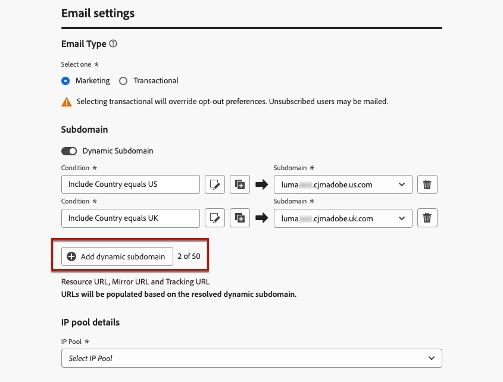

# Configurar subdomínios dinâmicos de email {#surface-personalization}

Para obter mais flexibilidade e controle sobre as configurações de email ao criar superfícies de email, [!DNL Journey Optimizer] O permite definir valores personalizados para subdomínios, cabeçalhos e parâmetros de rastreamento de URL.

## Adicionar subdomínios dinâmicos {#dynamic-subdomains}

>[!CONTEXTUALHELP]
>id="ajo_surface_perso_not_available"
>title="Personalização não disponível"
>abstract="Essa superfície foi criada sem atributos de personalização. Consulte a documentação para conhecer as etapas a serem seguidas se a personalização for necessária."

>[!CONTEXTUALHELP]
>id="ajo_surface_dynamic_subdomain"
>title="Ativar subdomínios dinâmicos"
>abstract="Ao criar uma superfície de email, você pode configurar subdomínios dinâmicos com base nas condições definidas usando o Editor de expressão. Você pode adicionar até 50 subdomínios dinâmicos."

>[!CONTEXTUALHELP]
>id="ajo_surface_dynamic_subdomain_list"
>title="Alguns subdomínios podem estar indisponíveis"
>abstract="Determinados subdomínios não estão disponíveis para seleção no momento devido ao registro pendente do loop de comentários. Esse processo pode levar até 10 dias úteis. Após a conclusão, você pode escolher entre todos os subdomínios disponíveis."

Ao criar uma superfície de email, você pode configurar subdomínios dinâmicos com base em condições específicas.

Por exemplo, se você tiver restrições legais para enviar mensagens de um endereço de email dedicado por país, poderá usar subdomínios dinâmicos. Isso permite criar uma única superfície com vários subdomínios de envio correspondentes a diferentes países, em vez de criar várias superfícies para cada país. Em seguida, você pode direcionar clientes com base em vários países consolidados em uma única campanha.

Para definir subdomínios dinâmicos, siga as etapas abaixo.

1. Crie uma superfície de canal. [Saiba como](../configuration/channel-surfaces.md)

1. Selecione o **[!UICONTROL E-mail]** canal.

1. No **Subdomínio** habilite a opção **[!UICONTROL Subdomínio dinâmico]** opção.

   

1. Selecione o ícone Editar ao lado do primeiro **[!UICONTROL Condição]** campo.

1. A variável [Editor de expressão](../personalization/personalization-build-expressions.md) é aberto. Neste exemplo, defina uma condição como `Country` igual a `US`.

   

1. Selecione o subdomínio que deseja associar a essa condição. [Saiba mais sobre subdomínios](../configuration/about-subdomain-delegation.md)

   >[!NOTE]
   >
   >Determinados subdomínios não estão disponíveis para seleção no momento devido a [loop de comentários](../reports/deliverability.md#feedback-loops) registro. Esse processo pode levar até 10 dias úteis. Após a conclusão, você pode escolher entre todos os subdomínios disponíveis. <!--where FL registration happens? is it when delegating a subdomain and you're awaiting from subdomain validation? or is it on ISP side only?-->

   

   Todos os recipients baseados nos Estados Unidos receberão mensagens usando o subdomínio selecionado para esse país, o que significa que todos os URLs envolvidos (como mirror page, URL de rastreamento ou link de cancelamento de inscrição) serão preenchidos com base nesse subdomínio.

1. Defina outro subdomínio dinâmico como desejado. Você pode adicionar até 50 itens.

   

1. Selecione o [Pool de IPs](../configuration/ip-pools.md) para associar à superfície. [Saiba mais](email-settings.md#subdomains-and-ip-pools)

Depois de adicionar um ou mais subdomínios dinâmicos a uma superfície, os seguintes itens serão preenchidos com base no subdomínio dinâmico resolvido para essa superfície:

* Todos os URLs (URL de recurso, URL de mirror page e URL de rastreamento)

* A variável [cancelar inscrição do URL](email-settings.md#list-unsubscribe)

* A variável **Do email** e **Email de erro** sufixos

## Personalizar seu cabeçalho (#personalize-header)

Você também pode usar a personalização para todos os parâmetros de cabeçalho definidos em uma superfície.

Por exemplo, se você tiver várias marcas, poderá criar uma única superfície e usar valores personalizados para seus cabeçalhos de email. Isso permite garantir que todos os emails enviados de suas diferentes marcas sejam endereçados a cada um de seus clientes com o endereço correto **De** nomes e emails. Da mesma forma, quando seus destinatários atingem o **Responder** no software cliente de email, você deseja que o **Responder para** os nomes e e-mails correspondem à marca correta para o usuário correto.

Para usar variáveis personalizadas para seus parâmetros de cabeçalho de superfície, siga as etapas abaixo.

1. Defina os parâmetros do cabeçalho como faria normalmente. [Saiba como](email-settings.md#email-header)

1. Para cada campo, selecione o ícone Editar.

   

1. A variável [Editor de expressão](../personalization/personalization-build-expressions.md) é aberto. Defina sua condição como desejado e salve as alterações.<!--In this example, set a condition such as -->

   >[!NOTE]
   >
   >Você só pode selecionar **[!UICONTROL Atributos do perfil]** e **[!UICONTROL Funções auxiliares]**.

1. Repita as etapas acima para cada parâmetro ao qual deseja adicionar personalização.

   >[!NOTE]
   >
   >Se você tiver adicionado um ou mais subdomínios dinâmicos à superfície, a variável **Do email** e **Email de erro** os sufixos serão preenchidos com base na variável [subdomínio dinâmico](#dynamic-subdomains).

<!--
## Use personalized URL tracking {#personalize-url-tracking}

To use personalized URL tracking prameters, follow the steps below.

select the profile attribute of your choice from the expression editor.

1. Repeat the steps above for each tracking parameter you want to personalize.

Now when the email is sent out, this parameter will be automatically appended to the end of the URL. You can then capture this parameter in web analytics tools or in performance reports.
-->
