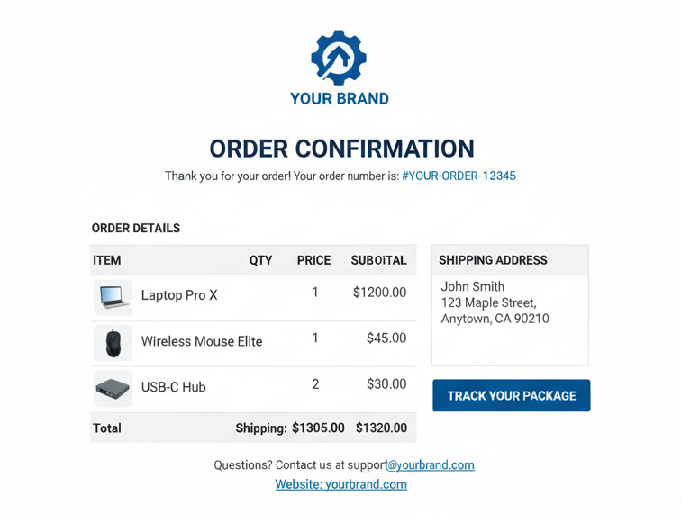

# Gerenciar a versão de texto de um email {#text-version-email}

É recomendável criar uma versão de texto do corpo do email, que é usada quando o conteúdo HTML não pode ser exibido.

De um ponto de vista de segurança, oferecer uma versão de texto simples é importante porque os emails do HTML podem trazer riscos, como scripts mal-intencionados, pixels de rastreamento ou tentativas de phishing que dependem de formatação e links avançados. O texto simples reduz a superfície de ataque e geralmente é preferido por destinatários conscientes de segurança ou sistemas de email corporativos que restringem ou removem o HTML. Fornecer ambas as versões permite que os recipients escolham o formato que atenda aos requisitos de segurança e privacidade.

## Acessar a versão de texto padrão {#plain-text-default}

Por padrão, o Designer de email cria uma versão de **[!UICONTROL texto sem formatação]** do email, que inclui campos de personalização. Essa versão é gerada e sincronizada automaticamente com a versão HTML do seu conteúdo.

Para acessar a versão de texto padrão, selecione o ícone **[!UICONTROL Texto sem formatação]** no seu conteúdo de email.


## Usar uma versão de texto personalizada {#plain-text-custom}

Se preferir usar um conteúdo diferente para a versão de texto sem formatação, siga as etapas abaixo:

1. No seu email, selecione o ícone **[!UICONTROL Texto sem formatação]**.

1. Use a opção **[!UICONTROL Sincronizar com o HTML]** para desabilitar a sincronização. Clique na marca de seleção para confirmar sua escolha.

   

1. Em seguida, você pode editar a versão de texto simples personalizada, conforme desejado.

>[!CAUTION]
>
> * Quando a sincronização está desabilitada, as alterações feitas no modo de exibição **[!UICONTROL Texto sem formatação]** não são refletidas no modo de exibição HTML.
>
> * Se você habilitar novamente a opção **[!UICONTROL Sincronizar com o HTML]** depois de atualizar o conteúdo de texto sem formatação, suas alterações serão perdidas e substituídas pelo conteúdo de texto gerado pela versão do HTML.

## Otimizar a versão do texto para caixas de entrada de IA {#optimize-plain-text-ai}

Você pode ajudar os recursos da caixa de entrada alimentada por IA (como resumos em [!DNL Gmail], [!DNL Outlook] ou [!DNL Apple Mail]) a exibir suas principais ofertas e detalhes usando o botão **[!UICONTROL Otimizar para Caixa de Entrada de IA]**. Essa ação gera uma versão de texto simples aprimorada focada nos assistentes de informação que provavelmente serão lidos na parte de texto da mensagem.

{zoomable="yes" width="80%"}

>[!IMPORTANT]
>
>Ao usar este recurso, a opção **[!UICONTROL Sincronizar com o HTML]** é automaticamente desabilitada.

Para obter uma apresentação completa e cenários recomendados, consulte [Otimizar texto de email para caixas de entrada de IA](../content-management/llm-email-optimizer.md).

## Quando usar versões de texto simples personalizadas {#when-to-use}

Entender quando criar uma versão de texto simples personalizada em vez de usar a sincronização automática ajuda a garantir a entrega e a legibilidade ideais do email.

### Usar texto sem formatação personalizado (desabilitar sincronização) quando:

* **Layouts complexos do HTML** - Seu email do HTML inclui layouts de várias colunas, tabelas ou CSS complexo que não se traduz bem em texto simples.
* **Conteúdo com muitos visuais** - Seu email depende muito das imagens e você deseja fornecer alternativas em texto descritivo para clientes com imagens desabilitadas.
* **Estrutura de mensagens diferente** - Você deseja fornecer uma estrutura de mensagens simplificada ou reorganizada, otimizada para leitores de texto simples.
* **Requisitos de acessibilidade** - Você precisa de formatação de texto simples específica para atender aos padrões de acessibilidade.
* **Clientes de email herdados** - Seu público-alvo inclui usuários em clientes de email mais antigos (por exemplo, Outlook 2003, clientes móveis somente texto) que precisam de conteúdo especialmente formatado.
* **Formatação ASCII** - Você deseja incluir formatação de texto sem formatação específica, como arte ASCII, tabelas ou quebras de linha específicas.

### Usar sincronização automática (padrão) quando:

* **Design simples de HTML** - O email do HTML tem uma estrutura simples e linear que se traduz bem em texto simples.
* **Conteúdo consistente** - Você deseja manter a consistência exata entre o HTML e versões de texto sem formatação.
* **Atualizações frequentes** - Você atualiza regularmente o conteúdo do email e deseja evitar a duplicação manual.
* **O Personalization funciona bem** - Seus campos de personalização funcionam corretamente em ambos os formatos.
* **Restrições de tempo** - Você precisa iniciar emails rapidamente sem personalização adicional de texto sem formatação.

## Exemplos práticos {#practical-examples}

Os exemplos a seguir demonstram cenários do mundo real para ajudá-lo a decidir se usará texto simples personalizado ou sincronização automática. Cada exemplo explica o contexto, a abordagem recomendada e a lógica por trás da decisão.

+++Exemplo 1: informativo de marketing com layout complexo

**Cenário:** informativo de várias colunas com imagens, botões estilizados e seções codificadas por cores.


**Recomendação:** Usar texto simples personalizado (desabilitar sincronização).

**Por que personalizar texto sem formatação:** a versão do HTML usa um layout de grade de três colunas com imagens de banner, botões estilizados e seções codificadas por cores. Esses elementos visuais não são bem traduzidos para texto simples por meio da sincronização automática, resultando em conteúdo desordenado e de difícil leitura. Uma versão de texto simples personalizada permite reestruturar o conteúdo em um formato linear e fácil de digitalizar com cabeçalhos de seção claros e links formatados corretamente.

**Exemplo de texto simples personalizado:**

```
================================================
YOUR BRAND - MONTHLY NEWSLETTER
December 2025
================================================

🌟 FEATURED ARTICLE
"10 Ways to Optimize Your Customer Journeys"
Read more: https://example.com/articles/optimize-journeys

📢 UPCOMING WEBINAR
"Mastering Email Personalization"
December 15, 2025 at 2:00 PM EST
Register: https://example.com/webinar/register

📦 NEW PRODUCTS
- Winter Collection: https://example.com/winter
- Holiday Gift Guide: https://example.com/gifts

================================================
Website: https://example.com
Unsubscribe: https://example.com/unsubscribe
================================================
```

+++

+++Exemplo 2: confirmação de pedido transacional

**Cenário:** confirmação de pedido com dados estruturados (número do pedido, itens, preços, detalhes de envio).



**Recomendação:** Use a sincronização automática.

**Por que a sincronização automática funciona:** as confirmações de pedidos têm uma estrutura simples e linear que traduz naturalmente do HTML para texto simples. As informações fluem logicamente (detalhes do pedido → itens → totais → envio), e campos de personalização como números de pedidos e nomes de clientes funcionam de forma idêntica em ambos os formatos. Os dados tabulares e estruturados convertem-se perfeitamente sem exigir ajustes manuais, economizando tempo e mantendo a clareza.

+++

+++Exemplo 3: convite de evento com mídia avançada

**Cenário:** Convite de evento com imagens de plano de fundo, vídeos inseridos e elementos interativos.


**Recomendação:** Usar texto simples personalizado (desabilitar sincronização).

**Por que usar texto sem formatação personalizado:** a versão do HTML depende de impacto visual: imagens de plano de fundo, incorporações de vídeo e botões de RSVP interativos. A sincronização automática removeria esses elementos, deixando uma versão de texto confusa com referências corrompidas. Uma versão de texto simples personalizada permite fornecer detalhes claros do evento, informações do alto-falante e links diretos de registro em um formato bem organizado que funciona sem elementos visuais.

**Exemplo de texto simples personalizado:**

```
YOU'RE INVITED!
Annual Customer Summit 2025

📅 When: March 15-17, 2025
📍 Where: San Francisco Convention Center
         123 Market Street, San Francisco, CA

KEYNOTE SPEAKERS
- Jane Smith, CEO TechCorp: "The Future of Digital Marketing"
- John Doe, Chief Innovation Officer: "AI and Customer Experience"

REGISTER NOW: https://example.com/summit/register
Early bird discount ends February 1st

Full agenda: https://example.com/summit/agenda
Questions: events@example.com | 1-800-555-0123
```

+++

## Casos de uso comuns {#common-use-cases}

Os casos de uso a seguir demonstram situações em que a criação de uma versão de texto simples personalizada (desabilitando a sincronização) é benéfica. Cada exemplo mostra o desafio apresentado pela versão do HTML e como uma solução de texto simples personalizada o aborda.

+++Caso de uso 1: emails do catálogo de produtos

**Desafio:** o HTML mostra uma grade de produtos com imagens, preços e botões de compra

**Solução de texto sem formatação:** crie uma lista estruturada com nomes de produtos, preços e links diretos claros

```
FEATURED PRODUCTS
=================

1. Premium Leather Wallet
   Price: $89.99
   View product: https://example.com/product/wallet
   
2. Designer Sunglasses
   Price: $129.99
   View product: https://example.com/product/sunglasses
```

+++

+++Caso de uso 2: série de emails de boas-vindas

**Desafio:** email de boas-vindas com o logotipo da empresa e formatação estilizada

**Solução de texto sem formatação:** Use arte ASCII ou formatação de texto para criar hierarquia visual

```
***************************************************
*                                                 *
*     WELCOME TO [BRAND NAME]                    *
*     We're thrilled to have you!                *
*                                                 *
***************************************************
```

+++

+++Caso de uso 3: pesquisa ou solicitação de feedback

**Desafio:** o HTML inclui botões estilizados e elementos de formulário

**Solução de texto sem formatação:** forneça links de texto sem formatação com instruções

```
We'd love your feedback!
------------------------

Please take 2 minutes to complete our survey:
https://example.com/survey/customer-feedback

Your input helps us improve our service.
```

+++

## Perguntas frequentes {#faq}

**Meus campos de personalização funcionarão em texto sem formatação?**\
Sim, campos de personalização como `{{profile.firstName}}` funcionam de forma idêntica no HTML e em versões de texto simples.

**Como testar minha versão de texto sem formatação?**
* Alternar para a exibição **[!UICONTROL Texto sem formatação]** no Designer de email. [Saiba como](#text-version-email)
* Envie emails de teste para clientes de email somente texto, como versões antigas do Pine ou aplicativos básicos de email para dispositivos móveis.

**O que acontece se eu esquecer de criar uma versão de texto sem formatação?**\
O sistema gera automaticamente uma versão de texto simples do HTML, que pode não ser formatada de maneira ideal, mas garantirá o delivery aos clientes somente texto.

**Posso usar personalização diferente no HTML e em texto sem formatação?**\
Sim, depois de desativar a sincronização, você pode personalizar cada versão independentemente, incluindo o uso de diferentes campos de personalização ou conteúdo.

**Quais clientes de email oferecem suporte apenas a texto sem formatação?**\
Poucos clientes modernos são somente texto, mas algumas políticas de email corporativas, ferramentas de acessibilidade e dispositivos móveis mais antigos podem exibir texto simples. Também é um fallback quando a renderização do HTML falha.

**Com que frequência devo atualizar minha versão de texto sem formatação?**\
Atualize-o sempre que fizer alterações significativas no conteúdo do HTML. Pequenos ajustes no HTML podem não exigir atualizações de texto sem formatação se a mensagem principal permanecer a mesma.

**É possível incluir links em emails de texto sem formatação?**\
Sim! Inclua URLs completos (por exemplo, https://example.com/page) e a maioria dos clientes de email os tornará clicáveis automaticamente.

**Devo incluir imagens em texto sem formatação?**\
Não, o texto sem formatação não suporta imagens. Em vez disso, descreva o que a imagem mostra ou forneça um link para visualizá-la online.
