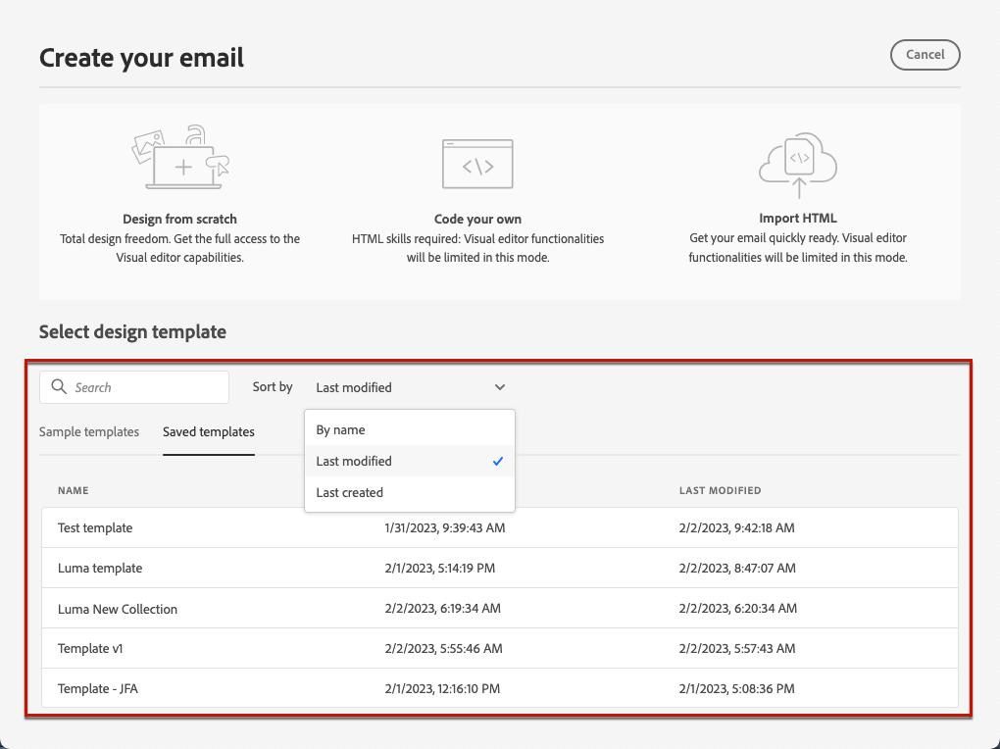

# Usar modelos de email {#email-templates}

>[!CONTEXTUALHELP]
>id="ajo_use_template"
>title="Criar conteúdo a partir de um modelo"
>abstract="Para começar a criar o conteúdo de email, selecione um modelo pronto para uso ou um modelo personalizado existente (criado do zero ou salvo como modelo de um email anterior)."

Na tela **[!UICONTROL Criar seu email]**, use a seção **[!UICONTROL Selecionar modelo de design]** para começar a criar o conteúdo a partir de um modelo.

Você pode escolher entre:

* **Modelos de exemplo**. A interface do [!DNL Journey Optimizer] oferece 20 modelos de email prontos para uso que você pode escolher.

* **Modelos salvos**. Também é possível usar um modelo personalizado que você:

   * Criado do zero usando o menu **[!UICONTROL Modelos de conteúdo]**. [Saiba mais](../content-management/content-templates.md#content-templates)

   * Salvo de um email em uma jornada ou campanha usando a opção **[!UICONTROL Salvar como modelo de conteúdo]**. [Saiba mais](../content-management/content-templates.md#video-templates)

Para começar a criar o conteúdo com um dos modelos de amostra ou salvos, siga as etapas abaixo.

1. [Acesse o Designer de email](get-started-email-design.md) a partir da tela de email **[!UICONTROL Editar conteúdo]**.

1. Na tela **[!UICONTROL Criar seu email]**, a guia **[!UICONTROL Modelos de amostra]** é selecionada por padrão.

1. Para usar um modelo personalizado, vá para a guia **[!UICONTROL Modelos salvos]**.

   

1. A lista de todos os [modelos de conteúdo](../content-management/content-templates.md#content-templates) criados na sandbox atual é exibida. Você pode classificá-las **[!UICONTROL Por nome]**, **[!UICONTROL Última modificação]** e **[!UICONTROL Última criação]**.

   

1. Selecione o template de sua escolha na lista.

1. Depois de selecionado, você pode navegar entre todos os modelos de uma categoria (amostra ou salvo, dependendo da sua seleção) usando as setas para a direita e para a esquerda.

   

1. Clique em **[!UICONTROL Usar este modelo]** na parte superior direita da tela.

1. Edite seu conteúdo conforme desejado usando o Designer de email.
