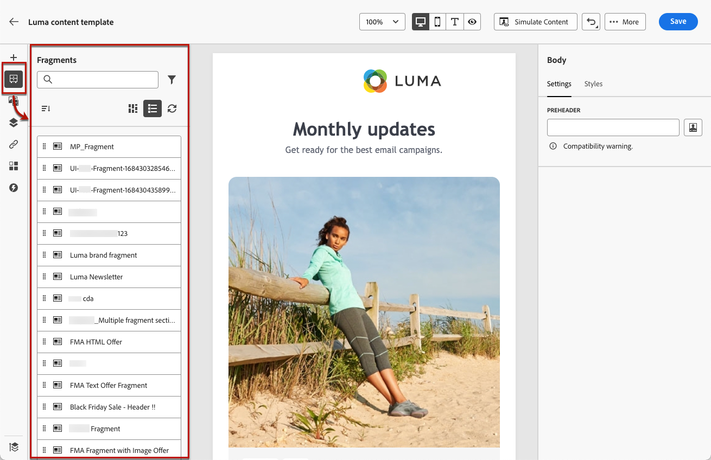
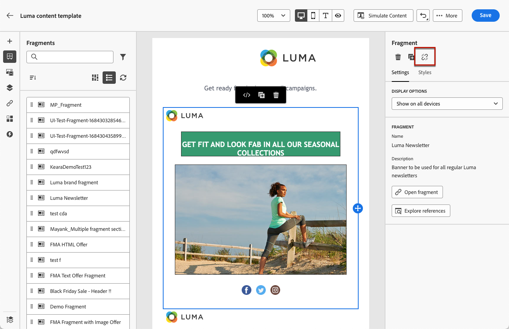

# Adicionar fragmentos visuais aos emails {#use-visual-fragments}

É possível usar um fragmento visual em uma [email](get-started-email-design.md) em uma jornada ou campanha, ou em uma [template de conteúdo](../content-management/content-templates.md).

>[!NOTE]
>
>Saiba como criar e gerenciar fragmentos no [nesta seção](../content-management/fragments.md).

➡️ [Saiba como gerenciar, criar e usar fragmentos neste vídeo](../content-management/fragments.md#video-fragments)

## Usar um fragmento {#use-fragment}

1. Abra qualquer conteúdo de email ou modelo usando o [Email Designer](get-started-email-design.md).

1. Selecione o **[!UICONTROL Fragmentos]** no painel esquerdo.

   

1. A lista de todos os fragmentos visuais criados na sandbox atual é exibida. É possível:

   * Procure um fragmento específico começando digitando seu rótulo.
   * Classifique os fragmentos em ordem crescente ou decrescente.
   * Altere a forma como os fragmentos são exibidos (cartões ou exibição em lista).

   >[!NOTE]
   >
   >Os fragmentos são classificados por data de criação: os fragmentos visuais adicionados recentemente são mostrados primeiro na lista.

1. Você pode pesquisar e atualizar a lista.

   >[!NOTE]
   >
   >Se alguns fragmentos foram modificados ou adicionados enquanto você está editando o conteúdo, a lista será atualizada com as alterações mais recentes.

1. Arraste e solte qualquer fragmento da lista na área em que deseja inseri-lo.

   

1. Como qualquer outro componente, é possível mover o fragmento no conteúdo.

1. Selecione o fragmento para exibir o painel correspondente à direita. Nesse local, você pode excluir o fragmento do seu conteúdo ou duplicá-lo. Também é possível executar essas ações diretamente no menu contextual exibido na parte superior do fragmento.

   

1. No **[!UICONTROL Configurações]** é possível:

   * Escolha os dispositivos nos quais deseja que o fragmento seja exibido.
   * Abra o fragmento em uma nova guia para editá-lo, se necessário. [Saiba mais](../content-management/fragments.md#edit-fragments)
   * Explorar referências. [Saiba mais](../content-management/fragments.md#explore-references)

1. É possível personalizar ainda mais o fragmento usando o **[!UICONTROL Estilos]** guia.

1. Se necessário, é possível quebrar a herança com o fragmento original. [Saiba mais](#break-inheritance)

1. Adicione quantos fragmentos desejar e **[!UICONTROL Salvar]** suas alterações.

## Interromper herança {#break-inheritance}

Ao editar um fragmento visual, as alterações são sincronizadas. Eles são propagados automaticamente para todos **[!UICONTROL Rascunho]** jornadas/campanhas e modelos de conteúdo que contêm esse fragmento.

>[!NOTE]
>
>As alterações não são propagadas para emails usados no **[!UICONTROL Ao vivo]** jornadas ou campanhas.

Quando adicionados a um email ou modelo de conteúdo, os fragmentos são sincronizados por padrão.

No entanto, é possível quebrar a herança do fragmento original. Nesse caso, o conteúdo do fragmento é copiado para o design atual e as alterações não são mais sincronizadas.

Para interromper a herança, siga as etapas abaixo:

1. Selecione o fragmento.

1. Clique no ícone de desbloqueio na barra de ferramentas contextual.

   

1. Esse fragmento se torna um elemento independente que não está mais vinculado ao fragmento original. Edite-o como qualquer outro componente de conteúdo em seu conteúdo. [Saiba mais](content-components.md)
