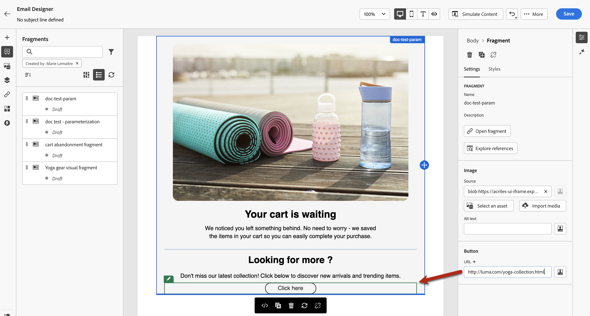

# Adicionar fragmentos visuais a emails {#use-visual-fragments}

>[!BEGINSHADEBOX]

**Nesta página:** saiba como inserir fragmentos visuais reutilizáveis em seus emails, personalizar os campos editáveis e interromper ou manter a herança com o fragmento original.

>[!ENDSHADEBOX]

Um fragmento é um componente reutilizável que pode ser referenciado em um ou mais emails em campanhas, jornadas ou modelos de conteúdo do Journey Optimizer. Essa funcionalidade permite a pré-criação de vários blocos de conteúdo personalizados que podem ser usados por usuários de marketing para reunir rapidamente o conteúdo de email em um processo de design aprimorado. [Saiba como criar e gerenciar fragmentos](../content-management/fragments.md).

➡️ [Saiba como gerenciar, criar e usar fragmentos neste vídeo](../content-management/fragments.md#video-fragments)

## Usar um fragmento {#use-fragment}

Para usar um fragmento em um email, siga as etapas abaixo.

>[!NOTE]
>
>Você pode adicionar até 30 fragmentos em um determinado delivery. Os fragmentos só podem ser aninhados até um nível.

1. Abra qualquer conteúdo de email ou modelo usando a [Designer de email](get-started-email-design.md).

1. Selecione o ícone **[!UICONTROL Fragmentos]** no painel esquerdo.

   

1. A lista de todos os fragmentos visuais criados na sandbox atual é exibida. Eles são classificados por data de criação: os fragmentos visuais adicionados recentemente são mostrados primeiro na lista. É possível:

   * Procure um fragmento específico começando digitando seu rótulo.
   * Classifique os fragmentos em ordem crescente ou decrescente.
   * Altere a forma como os fragmentos são exibidos (cartões ou exibição em lista).
   * Atualize a lista.

   >[!NOTE]
   >
   >Se alguns fragmentos foram modificados ou adicionados enquanto você está editando o conteúdo, a lista será atualizada com as alterações mais recentes.

1. Arraste e solte qualquer fragmento da lista na área em que deseja inseri-lo.

   

   >[!CAUTION]
   >
   >Você pode adicionar qualquer fragmento do **Rascunho** ou do **Live** ao seu conteúdo. No entanto, você não poderá ativar sua jornada ou campanha se um fragmento com o status Rascunho estiver sendo usado nele. Na publicação do jornada ou da campanha, os fragmentos de rascunho mostrarão um erro e você precisará aprová-los para poder publicar.

1. Como qualquer outro componente, é possível mover o fragmento no conteúdo.

1. Selecione o fragmento para exibir o painel correspondente à direita. Nesse local, você pode excluir o fragmento do seu conteúdo ou duplicá-lo. Também é possível executar essas ações diretamente no menu contextual exibido na parte superior do fragmento.

   

1. Na guia **[!UICONTROL Configurações]**, é possível:

   * Escolha os dispositivos nos quais deseja que o fragmento seja exibido.
   * Abra o fragmento em uma nova guia para editá-lo, se necessário. [Saiba mais](../content-management/fragments.md#fragments)
   * Explorar referências. [Saiba mais](../content-management/fragments.md#visual-expression)

1. Você pode personalizar ainda mais o fragmento usando a guia **[!UICONTROL Estilos]**.

1. Se necessário, é possível quebrar a herança com o fragmento original. [Saiba mais](#break-inheritance)

1. Adicione quantos fragmentos desejar e **[!UICONTROL Salve]** suas alterações.

### Limitações ao usar conteúdo dinâmico em fragmentos {#fragment-dynamic-content}

>[!CAUTION]
>
>Ao trabalhar com fragmentos que contêm Conteúdo dinâmico (conteúdo condicional), esteja ciente da seguinte limitação:
>
>**Não há suporte para aninhamento de fragmentos com Conteúdo Dinâmico.** Não é possível colocar um fragmento contendo Conteúdo dinâmico dentro de um fragmento desbloqueado que também contém Conteúdo dinâmico. Essa configuração não suportada pode causar:
>
>* Perda de mapeamentos de conteúdo condicional
>* Avisos sobre o modo de compatibilidade no Email Designer
>* Renderização de email inconsistente
>
>**Abordagem recomendada:** ao usar vários fragmentos com Conteúdo dinâmico no email, adicione cada fragmento diretamente no próprio bloco de estrutura no nível do email. Isso garante a funcionalidade adequada e evita os problemas mencionados acima.

## Práticas recomendadas para fragmentos com conteúdo dinâmico {#fragment-best-practices}

Siga estas práticas recomendadas ao trabalhar com fragmentos visuais e Conteúdo dinâmico (conteúdo condicional):

* **Estruturar o email corretamente**: ao criar emails com fragmentos contendo Conteúdo Dinâmico, adicione cada fragmento em um bloco de estrutura dedicado no nível do email. Evite aninhar fragmentos com o Conteúdo dinâmico dentro de outros fragmentos desbloqueados que também contêm Conteúdo dinâmico.

* **Planejar com antecedência**: antes de adicionar fragmentos ao seu email, identifique quais contêm Conteúdo Dinâmico e planeje seu layout de acordo. Isso ajuda a evitar problemas de configuração e garante uma estrutura limpa desde o início.

* **Crie fragmentos reutilizáveis com cuidado**: ao criar fragmentos que incluirão Conteúdo Dinâmico, considere como eles serão usados. Se um fragmento precisar ser aninhado dentro de outros fragmentos, evite adicionar Conteúdo dinâmico aos fragmentos principal e secundário.

* **Solução de problemas**: se você perder mapeamentos de conteúdo condicional ou avisos de modo de compatibilidade:
   * Verifique sua estrutura de email para obter fragmentos aninhados que contenham Conteúdo dinâmico
   * Reestruturar movendo cada fragmento com Conteúdo dinâmico para seu próprio bloco de estrutura no nível do email
   * Salve e verifique se os mapeamentos de conteúdo condicional foram restaurados corretamente

## Usar variáveis implícitas {#implicit-variables-in-fragments}

As variáveis implícitas aprimoram a funcionalidade existente do fragmento para melhorar a eficiência na reutilização de conteúdo e nos casos de uso de script. Os fragmentos podem usar variáveis de entrada e criar variáveis de saída utilizáveis no conteúdo da campanha e da jornada.

Saiba como usar variáveis implícitas em [esta seção](../personalization/use-expression-fragments.md#implicit-variables).

## Personalizar campos editáveis {#customize-fields}

Se determinadas partes do fragmento selecionado tiverem se tornado editáveis, você poderá substituir o valor padrão depois de adicionar o fragmento ao conteúdo. [Saiba como tornar seus fragmentos personalizáveis](../content-management/customizable-fragments.md)

Para personalizar campos editáveis em um fragmento, siga estas etapas:

1. Adicione o fragmento ao conteúdo.

1. Selecione para abrir o painel de propriedades no lado direito.

   Todos os campos editáveis no fragmento são exibidos na guia **Configurações**, na seção **Fragmento**.

1. Quando você seleciona um campo editável no painel direito, ele é realçado em verde no painel de visualização central, facilitando a identificação do local no conteúdo.

   No exemplo abaixo, a imagem **origem** e o **texto alternativo** podem ser editados, bem como o botão &quot;Clique aqui&quot; **URL**.

   

>[!CAUTION]
>
>Quando o **rótulo** e a **URL** de um componente de botão se tornam editáveis em um fragmento, os relatórios de rastreamento mostram a URL em vez do rótulo do botão. [Saiba mais sobre o rastreamento](../email/message-tracking.md)

## Interromper herança {#break-inheritance}

Ao editar um fragmento visual, as alterações são sincronizadas. Eles são propagados automaticamente para todos os rascunhos ou jornadas/campanhas ativas e modelos de conteúdo que contêm esse fragmento.

Quando adicionados a um email ou modelo de conteúdo, os fragmentos são sincronizados por padrão. No entanto, é possível quebrar a herança do fragmento original. Nesse caso, o conteúdo do fragmento é copiado para o design atual e as alterações não são mais sincronizadas.

Para interromper a herança, siga as etapas abaixo:

1. Selecione o fragmento.

1. Clique no ícone de desbloqueio na barra de ferramentas contextual.

   

1. Esse fragmento se torna um elemento independente que não está mais vinculado ao fragmento original. Edite-o como qualquer outro componente de conteúdo em seu conteúdo. [Saiba mais](content-components.md)

### Fragmentos bloqueados {#locked-fragments}

Se o fragmento tiver sido bloqueado pelo autor, o ícone de desbloqueio ficará esmaecido e não poderá ser usado para interromper a herança.

Os fragmentos bloqueados permanecem sincronizados onde quer que apareçam, impedindo edições locais que poderiam quebrar os padrões da marca ou os requisitos de conformidade.

Saiba como bloquear um fragmento em [esta seção](../content-management/create-fragments.md#lock-visual-fragment).

>[!NOTE]
>
>O autor do fragmento pode alterar a configuração posteriormente para usos futuros redefinindo seu comportamento para **[!UICONTROL Permitir que a herança seja interrompida]** nas configurações do fragmento.

