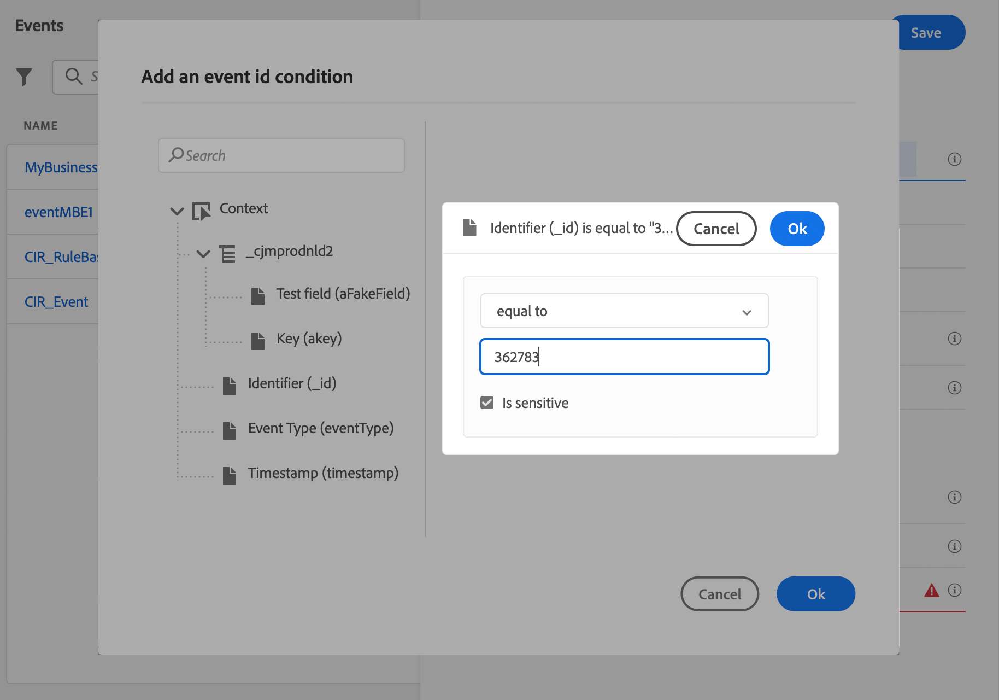
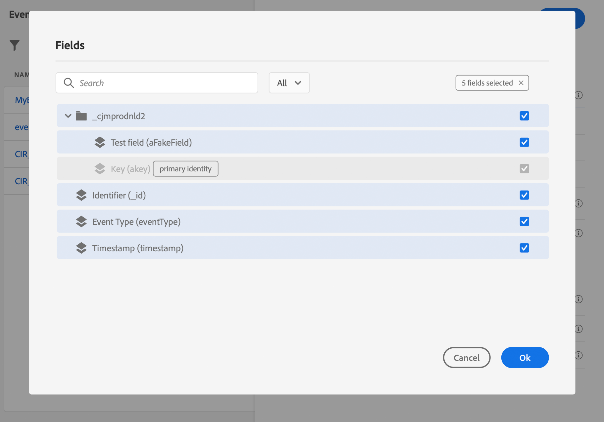

# Configurar um evento comercial {#configure-a-business-event}

>[!CONTEXTUALHELP]
>id="ajo_journey_event_business"
>title="Eventos de negócios"
>abstract="A configuração do evento permite definir as informações que o Journey Optimizer receberá como eventos. É possível usar vários eventos (em etapas diferentes de uma jornada) e várias jornadas podem usar o mesmo evento. Ao contrário de eventos unitários, os eventos de negócios não estão vinculados a um perfil específico. O tipo de ID de evento sempre se baseia em regras."

Ao contrário de eventos unitários, os eventos de negócios não estão vinculados a um perfil específico. O tipo de ID de evento sempre se baseia em regras. Leia mais sobre eventos comerciais em [esta seção](../event/about-events.md).

As jornadas baseadas em segmentos de leitura podem ser acionadas uma única vez, por um programador regularmente ou por um evento de negócios, quando o evento ocorre.

Os eventos comerciais podem ser &quot;um produto está de volta ao estoque&quot;, &quot;o preço das ações de uma empresa atinge um determinado valor&quot;, etc.

>[!NOTE]
>
>Você também pode observar o caso de uso do evento comercial [tutorial](https://experienceleague.adobe.com/docs/journey-optimizer-learn/tutorials/create-journeys/use-case-business-event.html). Observe que o esquema não precisa ser ativado para o perfil.

## Observações importantes {#important-notes}

* Apenas estão disponíveis esquemas de séries cronológicas. Os esquemas Eventos de experiência, Eventos de decisão e Eventos de etapa de Jornada não estão disponíveis.
* O schema de eventos deve conter uma identidade primária não baseada em pessoas. Os seguintes campos devem ser selecionados ao definir o evento: `_id` e `timestamp`
* Os eventos comerciais só podem ser descartados como a primeira etapa de uma jornada.
* Ao soltar um evento comercial como a primeira etapa de uma jornada, o tipo de agendador da jornada será &quot;evento comercial&quot;.
* Somente uma atividade de segmento de leitura pode ser solta após um evento comercial. Ele é adicionado automaticamente como a próxima etapa.
* Para permitir várias execuções de eventos comerciais, ative a opção correspondente na **[!UICONTROL Execution]** das propriedades da jornada.
* Depois que um evento comercial é acionado, haverá um atraso para que o segmento seja exportado de 15 minutos para até uma hora.
* Ao testar um evento comercial, você deve passar os parâmetros do evento e o identificador do perfil de teste que inserirá a jornada em teste. Além disso, ao testar uma jornada baseada em eventos empresariais, você só pode acionar a entrada de perfil único. Consulte [esta seção](../building-journeys/testing-the-journey.md#test-business). No modo de teste, não há modo de &quot;Visualização de código&quot; disponível.
* O que acontece com os indivíduos que estão atualmente na jornada se um novo evento comercial chegar? Ele se comporta da mesma forma que quando os indivíduos ainda estão em uma jornada recorrente quando ocorre uma nova recorrência. Seu caminho está encerrado. Como resultado, os profissionais de marketing devem prestar atenção para evitar a criação de jornadas muito longas se esperarem eventos comerciais frequentes.
* Os eventos comerciais não podem ser usados junto com eventos unitários ou atividades de qualificação de segmento.

## Vários eventos comerciais {#multiple-business-events}

Estas são algumas observações importantes que se aplicam quando vários eventos comerciais são recebidos sucessivamente.

**Qual é o comportamento ao receber um evento comercial enquanto a jornada está sendo processada?**

Os eventos comerciais seguem as regras de reentrada da mesma forma que os eventos unitários. Se uma jornada permitir a reentrada, o próximo evento comercial será processado.

**Quais são as medidas de proteção para evitar sobrecarga de segmentos materializados?**

No caso de eventos de negócios instantâneos, para determinada jornada, os dados enviados pelo primeiro trabalho de evento são reutilizados durante uma janela de tempo de 1 hora. Para jornadas agendadas, não há garantia. Saiba mais sobre os segmentos na [Documentação do Serviço de segmentação do Adobe Experience Platform](https://experienceleague.adobe.com/docs/experience-platform/segmentation/home.html).

## Introdução a eventos comerciais {#gs-business-events}

Estas são as primeiras etapas para configurar um evento comercial:

1. Na seção do menu ADMINISTRATION (ADMINISTRAÇÃO), selecione **[!UICONTROL Configurations]**. No  **[!UICONTROL Events]** seção , clique em **[!UICONTROL Manage]**. A lista dos eventos é exibida.

   

1. Clique em **[!UICONTROL Create Event]** para criar um novo evento. O painel de configuração do evento é aberto no lado direito da tela.

   

1. Insira o nome do evento. Você também pode adicionar uma descrição.

   

   >[!NOTE]
   >
   >Não use espaços ou caracteres especiais. Não use mais de 30 caracteres.

1. No **[!UICONTROL Type]** , escolha **Negócios**.

   

1. O número de jornadas que usam esse evento é exibido no campo **[!UICONTROL Used in]**. Você pode clicar no ícone **[!UICONTROL View journeys]** para exibir a lista de jornadas usando esse evento.

1. Defina os campos schema e payload: é aqui que você seleciona as informações do evento (ou carga útil) que o jornada espera receber. Você usará essas informações posteriormente na jornada. Consulte [esta seção](../event/about-creating-business.md#define-the-payload-fields).

   

   Apenas estão disponíveis esquemas de séries cronológicas. `Experience Events`, `Decision Events` e `Journey Step Events` os schemas não estão disponíveis. O schema de eventos deve conter uma identidade primária não baseada em pessoas. Os seguintes campos devem ser selecionados ao definir o evento: `_id` e `timestamp`

   

1. Clique dentro do **[!UICONTROL Event ID condition]** campo. Use o editor de expressões simples para definir a condição usada pelo sistema para identificar os eventos que acionam sua jornada.

   

   Em nosso exemplo, escrevemos uma condição com base na ID do produto. Isso significa que sempre que o sistema receber um evento que corresponda a essa condição, ele o passará para o jornada.

   >[!NOTE]
   >
   >No editor de expressões simples, nem todos os operadores estão disponíveis, eles dependem do tipo de dados. Por exemplo, para um tipo de string de campo, é possível usar &quot;contains&quot; ou &quot;equal to&quot;.

1. Clique em **[!UICONTROL Save]**.

   

   Agora o evento está configurado e pronto para ser lançado em uma jornada. Etapas de configuração adicionais são necessárias para receber eventos. Saiba mais [nesta página](../event/additional-steps-to-send-events-to-journey.md).

## Definir os campos de carga {#define-the-payload-fields}

A definição de carga permite escolher as informações que o sistema espera receber do evento em sua jornada e a chave para identificar qual pessoa está associada ao evento. A carga é baseada na definição do campo Experience Cloud XDM. Para obter mais informações sobre XDM, consulte [Documentação do Adobe Experience Platform](https://experienceleague.adobe.com/docs/experience-platform/xdm/home.html){target=&quot;_blank&quot;}.

1. Selecione um esquema XDM na lista e clique no botão **[!UICONTROL Fields]** ou no **[!UICONTROL Edit]** ícone .

   

   Todos os campos definidos no schema são exibidos. A lista de campos varia de um schema para outro. Você pode pesquisar um campo específico ou usar os filtros para exibir todos os nós e campos ou somente os campos selecionados. De acordo com a definição do schema, alguns campos podem ser obrigatórios e pré-selecionados. Não é possível desmarcá-los. Todos os campos obrigatórios para o evento ser recebido corretamente pelo jornada são selecionados por padrão.

   

   >[!NOTE]
   >
   > Certifique-se de que os seguintes campos estejam selecionados: `_id` e `timestamp`

1. Selecione os campos que você espera receber do evento. Esses são os campos que o usuário empresarial aproveitará na jornada.

1. Quando terminar de selecionar os campos necessários, clique em **[!UICONTROL Save]** ou pressione **[!UICONTROL Enter]**.

   O número de campos selecionados é exibido em **[!UICONTROL Fields]**.

   

## Visualizar a carga {#preview-the-payload}

Use a pré-visualização de carga para validar a definição de carga útil.

1. Clique no botão **[!UICONTROL View Payload]** ícone para visualizar a carga esperada pelo sistema.

   

   Observe que os campos selecionados são exibidos.

   

1. Verifique a pré-visualização para validar a definição da carga útil.

1. Em seguida, você pode compartilhar a pré-visualização de carga com a pessoa responsável pelo envio do evento. Essa carga útil pode ajudá-los a projetar a configuração de um evento que é enviado para o [!DNL Journey Optimizer]. Consulte [esta página](../event/additional-steps-to-send-events-to-journey.md).
