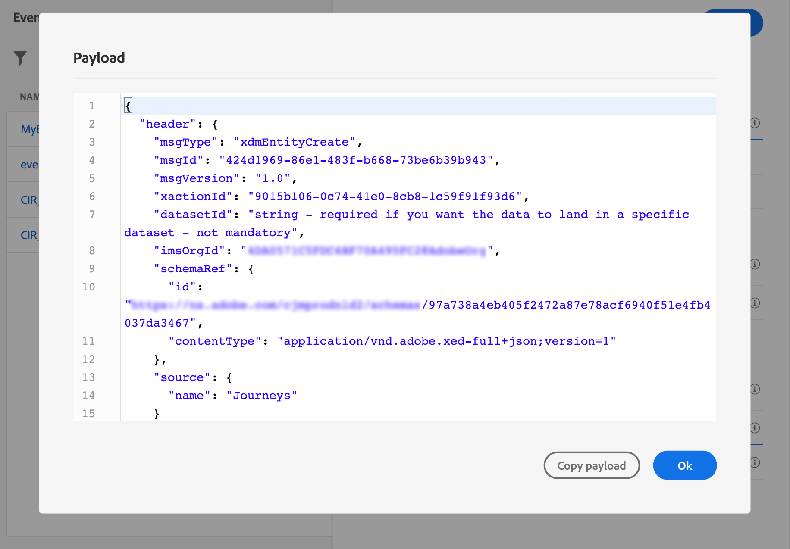

# Configurar um evento comercial {#configure-a-business-event}

>[!CONTEXTUALHELP]
>id="ajo_journey_event_business"
>title="Eventos de negócios"
>abstract="A configuração do evento permite definir as informações que o Journey Optimizer receberá como eventos. Você pode usar vários eventos (em diferentes etapas de uma jornada) e várias jornadas podem usar o mesmo evento. Ao contrário de eventos unitários, os eventos de negócios não estão vinculados a um perfil específico. O tipo de ID de evento sempre se baseia em regras."

Ao contrário de eventos unitários, os eventos de negócios não estão vinculados a um perfil específico. O tipo de ID de evento sempre se baseia em regras. Leia mais sobre eventos comerciais em [nesta seção](../event/about-events.md).

As jornadas de leitura baseadas no público-alvo podem ser acionadas de uma só vez, por um scheduler regularmente ou por um evento comercial, quando o evento ocorrer.

Eventos comerciais podem ser &quot;um produto está de volta no estoque&quot;, &quot;o preço das ações de uma empresa atinge um determinado valor&quot;, etc.

>[!NOTE]
>
>Você também pode assistir ao caso de uso do evento comercial [tutorial](https://experienceleague.adobe.com/docs/journey-optimizer-learn/tutorials/create-journeys/use-case-business-event.html). Observe que o esquema não precisa ser ativado para o perfil.

## Observações importantes {#important-notes}

* Somente esquemas de séries de tempo estão disponíveis. Os esquemas de Eventos de experiência, Eventos de decisão e Eventos de etapa de Jornada não estão disponíveis.
* O esquema de evento deve conter uma identidade primária baseada em pessoas. Os seguintes campos devem ser selecionados ao definir o evento: `_id` e `timestamp`
* Eventos comerciais só podem ser descartados como a primeira etapa de uma jornada.
* Ao soltar um evento comercial como a primeira etapa de uma jornada, o tipo de scheduler da jornada será &quot;evento comercial&quot;.
* Somente uma atividade de leitura de público pode ser descartada após um evento comercial. Ele é adicionado automaticamente como a próxima etapa.
* Para permitir várias execuções de eventos comerciais, ative a opção correspondente no **[!UICONTROL Execução]** seção das propriedades da jornada.
* Depois que um evento comercial é acionado, haverá um atraso para que o público-alvo seja exportado de 15 minutos para até uma hora.
* Ao testar um evento comercial, você precisa passar os parâmetros do evento e o identificador do perfil de teste que inserirá a jornada em teste. Além disso, ao testar uma jornada baseada em evento comercial, você só pode acionar uma única entrada de perfil. Consulte [nesta seção](../building-journeys/testing-the-journey.md#test-business). No modo de teste, não há modo de &quot;Visualização de código&quot; disponível.
* O que acontece com os indivíduos que estão atualmente na jornada se um novo evento comercial chegar? Ela se comporta da mesma forma que quando os indivíduos ainda estão em uma jornada recorrente quando uma nova recorrência acontece. O caminho deles foi finalizado. Como resultado, os profissionais de marketing devem prestar atenção para evitar a criação de jornadas muito longas se esperam eventos comerciais frequentes.
* Os eventos comerciais não podem ser usados junto com eventos unitários ou atividades de qualificação de público-alvo.

## Vários eventos comerciais {#multiple-business-events}

Estas são algumas observações importantes que se aplicam quando vários eventos comerciais são recebidos em sequência.

**Qual é o comportamento ao receber um evento comercial enquanto a jornada está sendo processada?**

Os eventos comerciais seguem as regras de reentrada da mesma forma que para eventos unitários. Se uma jornada permitir a reentrada, o próximo evento comercial será processado.

**Quais são as medidas de proteção para evitar o excesso de públicos materializados?**

No caso de eventos comerciais instantâneos, para determinada jornada, os dados enviados pelo primeiro trabalho de evento são reutilizados durante uma janela de tempo de 1 hora. Para jornadas programadas, não há garantia. Saiba mais sobre públicos-alvo na [Documentação do Serviço de segmentação da Adobe Experience Platform](https://experienceleague.adobe.com/docs/experience-platform/segmentation/home.html?lang=pt-BR).

## Introdução a eventos comerciais {#gs-business-events}

Estas são as primeiras etapas para configurar um evento comercial:

1. Na seção de menu ADMINISTRAÇÃO, selecione **[!UICONTROL Configurações]**. No  **[!UICONTROL Eventos]** clique em **[!UICONTROL Gerenciar]**. A lista de eventos é exibida.

   

1. Clique em **[!UICONTROL Criar evento]** para criar um novo evento. O painel de configuração do evento é aberto no lado direito da tela.

   

1. Insira o nome do evento. Você também pode adicionar uma descrição.

   

   >[!NOTE]
   >
   >Somente caracteres alfanuméricos e sublinhados são permitidos. O comprimento máximo é de 30 caracteres.

1. No **[!UICONTROL Tipo]** escolha **Empresas**.

   

1. O número de jornadas que usam esse evento é exibido no **[!UICONTROL Usado em]** campo. Você pode clicar no link **[!UICONTROL Exibir jornadas]** ícone para exibir a lista de jornadas usando esse evento.

1. Defina os campos schema e payload: é aqui que você seleciona as informações do evento (ou payload) que o jornada espera receber. Você usará essas informações posteriormente na jornada. Consulte [esta seção](../event/about-creating-business.md#define-the-payload-fields).

   

   Somente esquemas de séries de tempo estão disponíveis. `Experience Events`, `Decision Events` e `Journey Step Events` esquemas não estão disponíveis. O esquema de evento deve conter uma identidade primária baseada em pessoas. Os seguintes campos devem ser selecionados ao definir o evento: `_id` e `timestamp`

   

1. Clique dentro do **[!UICONTROL Condição de ID de evento]** campo. Use o editor de expressões simples para definir a condição usada pelo sistema para identificar os eventos que acionam sua jornada.

   

   No nosso exemplo, escrevemos uma condição com base na ID do produto. Isso significa que sempre que o sistema receber um evento que corresponda a essa condição, ele o transmitirá para o jornada.

   >[!NOTE]
   >
   >No editor de expressões simples, nem todos os operadores estão disponíveis, eles dependem do tipo de dados. Por exemplo, para um tipo de sequência de caracteres de campo, é possível usar &quot;contém&quot; ou &quot;igual a&quot;.

1. Clique em **[!UICONTROL Salvar]**.

   

   Agora o evento está configurado e pronto para ser lançado em uma jornada. Etapas de configuração adicionais são necessárias para receber eventos. Saiba mais [nesta página](../event/additional-steps-to-send-events-to-journey.md).

## Definir os campos de carga {#define-the-payload-fields}

A definição de carga útil permite escolher as informações que o sistema espera receber do evento em sua jornada e a chave para identificar qual pessoa está associada ao evento. A carga é baseada na definição do campo XDM do Experience Cloud. Para obter mais informações sobre o XDM, consulte [Documentação do Adobe Experience Platform](https://experienceleague.adobe.com/docs/experience-platform/xdm/home.html?lang=pt-BR){target="_blank"}.

1. Selecione um esquema XDM na lista e clique no botão **[!UICONTROL Campos]** ou no campo **[!UICONTROL Editar]** ícone.

   

   Todos os campos definidos no esquema são exibidos. A lista de campos varia de um esquema para outro. Você pode pesquisar um campo específico ou usar os filtros para exibir todos os nós e campos ou apenas os campos selecionados. De acordo com a definição do esquema, alguns campos podem ser obrigatórios e pré-selecionados. Não é possível desmarcá-los. Todos os campos obrigatórios para o evento ser recebido corretamente pelas jornadas são selecionados por padrão.

   

   >[!NOTE]
   >
   > Verifique se os seguintes campos foram selecionados: `_id` e `timestamp`

1. Selecione os campos que você espera receber do evento. Esses são os campos que o usuário empresarial utilizará na jornada.

1. Quando terminar de selecionar os campos necessários, clique em **[!UICONTROL Salvar]** ou pressione **[!UICONTROL Enter]**.

   O número de campos selecionados aparece em **[!UICONTROL Campos]**.

   

## Visualizar o conteúdo {#preview-the-payload}

Use a pré-visualização de carga para validar a definição de carga útil.

1. Clique em **[!UICONTROL Exibir carga]** ícone para visualizar o conteúdo esperado pelo sistema.

   

   Você pode observar que os campos selecionados são exibidos.

   

1. Verifique a visualização para validar a definição de carga.

1. Em seguida, é possível compartilhar a pré-visualização do conteúdo com a pessoa responsável pelo envio do evento. Essa carga pode ajudá-los a projetar a configuração de um push de evento para [!DNL Journey Optimizer]. Consulte [esta página](../event/additional-steps-to-send-events-to-journey.md).
